Happiness and European Parliament - Adventures in European Social Survey Data
================
Juha Riissanen - <juhariis@gmail.com>
2018-09-13

-   [European Social Survey](#european-social-survey)
-   [ESS Data](#ess-data)
    -   [Raw Data](#raw-data)
    -   [Survey coverage](#survey-coverage)
    -   [Weights](#weights)
-   [Subjective Happiness](#subjective-happiness)
    -   [Pre-processing](#pre-processing)
    -   [How is happiness distributed in Europe](#how-is-happiness-distributed-in-europe)
    -   [Changes of happiness by country and survey](#changes-of-happiness-by-country-and-survey)
    -   [Trends in happiness](#trends-in-happiness)
    -   [Variations](#variations)
    -   [Significance and meaning of changes](#significance-and-meaning-of-changes)
    -   [Trends on standardized scale](#trends-on-standardized-scale)
        -   [Reflect and log transform](#reflect-and-log-transform)
        -   [Scale](#scale)
        -   [Trends of transformed and scaled happiness](#trends-of-transformed-and-scaled-happiness)
    -   [Wrapup and what next](#wrapup-and-what-next)
-   [Happiness and associations](#happiness-and-associations)
    -   [ESS indicators](#ess-indicators)
        -   [Pre-processing](#pre-processing-1)
    -   [Shape of distributions](#shape-of-distributions)
    -   [Weights](#weights-1)
    -   [Missing values](#missing-values)
        -   [Get rid of collinear variables](#get-rid-of-collinear-variables)
        -   [Reshape](#reshape)
    -   [World Bank](#world-bank)
    -   [UNHCR](#unhcr)
    -   [Pct indicators](#pct-indicators)
-   [Explore Extended Data](#explore-extended-data)
    -   [By indicator](#by-indicator)
        -   [happy](#happy)
        -   [health](#health)
        -   [imbgeco](#imbgeco)
        -   [impcntr](#impcntr)
        -   [imueclt](#imueclt)
        -   [imwbcnt](#imwbcnt)
        -   [polintr](#polintr)
        -   [pplhlp](#pplhlp)
        -   [stfeco](#stfeco)
        -   [stfedu](#stfedu)
        -   [stfhlth](#stfhlth)
        -   [trstep](#trstep)
        -   [trstlgl](#trstlgl)
        -   [trstplc](#trstplc)
        -   [trstun](#trstun)
        -   [eisced2](#eisced2)
        -   [stfgov2](#stfgov2)
        -   [euftf2](#euftf2)
        -   [SH.XPD.GHED.GD.ZS](#sh.xpd.ghed.gd.zs)
        -   [NY.GDP.MKTP.KD](#ny.gdp.mktp.kd)
        -   [NY.GDP.MKTP.KD.ZG](#ny.gdp.mktp.kd.zg)
        -   [NY.GDP.PCAP.KD](#ny.gdp.pcap.kd)
        -   [NY.GDP.PCAP.KD.ZG](#ny.gdp.pcap.kd.zg)
        -   [SE.XPD.TOTL.GD.ZS](#se.xpd.totl.gd.zs)
        -   [IT.NET.USER.ZS](#it.net.user.zs)
        -   [SM.POP.TOTL.ZS](#sm.pop.totl.zs)
        -   [SL.TLF.CACT.ZS](#sl.tlf.cact.zs)
        -   [BX.TRF.PWKR.DT.GD.ZS](#bx.trf.pwkr.dt.gd.zs)
        -   [SP.POP.TOTL](#sp.pop.totl)
        -   [SM.POP.REFG](#sm.pop.refg)
        -   [SP.RUR.TOTL.ZS](#sp.rur.totl.zs)
        -   [GC.TAX.TOTL.GD.ZS](#gc.tax.totl.gd.zs)
        -   [SP.URB.TOTL.IN.ZS](#sp.urb.totl.in.zs)
        -   [REFG.PCT](#refg.pct)
        -   [UNHCR.Refugee.PCT](#unhcr.refugee.pct)
        -   [UNHCR.Asylum-.PCT](#unhcr.asylum-.pct)
        -   [UNHCR.Interna.PCT](#unhcr.interna.pct)
        -   [UNHCR.Statele.PCT](#unhcr.statele.pct)
        -   [UNHCR.Other.PCT](#unhcr.other.pct)
    -   [By country](#by-country)
        -   [Austria](#austria)
        -   [Belgium](#belgium)
        -   [Bulgaria](#bulgaria)
        -   [Cyprus](#cyprus)
        -   [Czechia](#czechia)
        -   [Denmark](#denmark)
        -   [Estonia](#estonia)
        -   [Finland](#finland)
        -   [France](#france)
        -   [Germany](#germany)
        -   [Greece](#greece)
        -   [Hungary](#hungary)
        -   [Ireland](#ireland)
        -   [Israel](#israel)
        -   [Italy](#italy)
        -   [Lithuania](#lithuania)
        -   [Netherlands](#netherlands)
        -   [Norway](#norway)
        -   [Poland](#poland)
        -   [Portugal](#portugal)
        -   [Russia](#russia)
        -   [Slovakia](#slovakia)
        -   [Slovenia](#slovenia)
        -   [Spain](#spain)
        -   [Sweden](#sweden)
        -   [Switzerland](#switzerland)
        -   [Ukraine](#ukraine)
        -   [United Kingdom](#united-kingdom)
-   [Linear Modeling](#linear-modeling)
    -   [Assumptions](#assumptions)
    -   [The model](#the-model)
    -   [Scale the data](#scale-the-data)
    -   [Training and testing data](#training-and-testing-data)
-   [Models and observations](#models-and-observations)
    -   [Subjective Happiness](#subjective-happiness-1)
    -   [Helpful People](#helpful-people)
        -   [ESS results](#ess-results)
        -   [Modeling](#modeling)
    -   [Trust in United Nations](#trust-in-united-nations)
        -   [ESS results](#ess-results-1)
        -   [Modeling](#modeling-1)
    -   [Trust in European Parliament](#trust-in-european-parliament)
        -   [EES Results](#ees-results)
        -   [Modeling](#modeling-2)
    -   [Immigrants from poorer countries outside Europe](#immigrants-from-poorer-countries-outside-europe)
        -   [EES Results](#ees-results-1)
        -   [Modeling](#modeling-3)
-   [Clustering the countries](#clustering-the-countries)
    -   [Preprocess](#preprocess)
    -   [PCA](#pca)
    -   [K-means clustering](#k-means-clustering)
    -   [Visualize groups in PCA space](#visualize-groups-in-pca-space)
    -   [Countries split to classes](#countries-split-to-classes)
-   [Summary](#summary)
-   [References](#references)
    -   [ESS](#ess)
    -   [World Bank](#world-bank-1)
    -   [UNHCR](#unhcr-1)
-   [Technical notes](#technical-notes)

------------------------------------------------------------------------

This workbook is used to create content for the blog post on [investigation of European Social Study](https://hidingindata.wordpress.com/2018/06/20/happiness-and-european-parliament-adventures-in-european-social-survey-data/). (HTLM version to show off active content via [Rpubs](http://www.rpubs.com/juhariis/ess) and [Azure](https://juhariis.z16.web.core.windows.net/EuropeanSocialSurvey.html). Since Rpubs seems to have some size limitations, the exploratory graphs on indicators and countries are not included. Current Azure subscription has not these limitations so there we have all content. But loading of the page may take some time..)

------------------------------------------------------------------------

Europe is going through interesting time since turn of the century: Brexit, refugee crisis, rise of populism, economic worries, rising tensions between the West and Russia - and a lot more [Timeline of 21st century](https://en.wikipedia.org/wiki/Timeline_of_the_21st_century)

European Social Study has been collecting data on people in most countries in Europe every two years since 2002. The purpose of this study is look into the recent history of Europe mainlywith the help of ESS data. As additional data we will use World Bank Development indicator set and a data set from UNHCR to provide some reference to ESS indicators.

We started by looking into subjective happiness, how it has changed over time and investigated what factors in ESS data are associated with it by using linear modeling.

From that we continued looking into other indicators which either were significantly associated with subjective happiness or otherwise were seen as interesting and important items for this study

-   how helpful other people are perceived,
-   trust in United Nations,
-   trust in European Parliament,
-   views in immigration from poor areas outside of Europe

Finally, we used Primary Component Analysis and k-means clustering to find best number of country clusters based on their similarity in the selected ESS variables.

Findings

-   subjective happiness
    -   there is a border of subjective happiness levels running across Europe diagonally from South West corner of Portugal to Eastern border of Finland, likely more resulting from cultural biases and values of countries than from genuine differences in "true absolute" happiness
    -   for Poland and Slovenia the change in happiness from 2002 to 2016 and from 2014 to 2016 was statistically significant but not very meaningful (effect size according to Cohen's d was 'small')
    -   changes for other countries had the effect size "neglible" or had no statistical significance
-   trust in European Parliament
    -   Hungary, Greece, Ukraine, have seen trust fluctuating strongly
    -   United Kingdom had statistically significant rise from 2014 to 2016, which could be linked to some second thoughts in the aftermath of the Brexit vote (fieldwork in the UK was conducted after the vote 01.09.16-20.03.17)
-   other findings
    -   poor subjective happiness scores seem to be somewhat correlated with countries with low scores on question willingness of people to help others (no correlation study was done, but visually on maps there seems to be rough correspondence)
    -   overall feedback on further integration of EU seem to have shifted towards "not more"
    -   acceptance of immigration from poor countries outside of Europe is significantly lower in Hungary than most other countries (even though Cyprus and Greece are not that far from it, their latest scores are several years old)
    -   and significantly higher in Sweden that in other countries..
-   participating countries were clustered into two groups using PCA and k-means
    -   Nordic countries + Benelux + Ireland + Swizerland + Austria vs. the rest
    -   the clustering seems justified when comparing individual ESS indicator scores by the groups

Several historic events can be see in the data

-   Greece crisis - the data set ends in 2010 when the support package was agreed, trust in European Parliament plummeted
-   Ukraine - the data does not go into the timeframe of Criomean annexation, but may reflect the ups and downs of the country in the first decade of 2000's
-   United Kingdom - aftermath of the Brexit vote might somehow be reflected in the increased trust on European Parliament
-   Hungary having high expectations in European Parliament before joining EU, trust dropped significantly by end of the survey period
-   Worldwide economic crisis in 2008

Combined data set has several interesting features which may be source of some future blog posts, especially

-   correlating UNHCR and WB data with ESS
-   identifying discussion topics in European Parliament over the changes in some indicators

------------------------------------------------------------------------

European Social Survey
----------------------

As described in the abstract of its eighth round (conducted 2016-2017)

> The European Social Survey (ESS) is an academically-driven multi-country survey, which has been administered in over 30 countries to date. Its three aims are, firstly – to monitor and interpret changing public attitudes and values within Europe and to investigate how they interact with Europe's changing institutions, secondly - to advance and consolidate improved methods of cross-national survey measurement in Europe and beyond, and thirdly - to develop a series of European social indicators, including attitudinal indicators.
>
> In the eighth round, the survey covers 23 countries and employs the most rigorous methodologies. From Round 7 it is funded by the Members, Observers and Guests of ESS European Research Infrastructure Consortium (ESS ERIC) who represent national governments. Participating countries directly fund the central coordination costs of the ESS ERIC, as well the costs of fieldwork and national coordination in their own country.
>
> The survey involves strict random probability sampling, a minimum target response rate of 70% and rigorous translation protocols. The hour-long face-to-face interview includes questions on a variety of core topics repeated from previous rounds of the survey and also two modules developed for Round 8 covering Public Attitudes to Climate Change, Energy Security, and Energy Preferences and Welfare Attitudes in a Changing Europe (the latter is a partial repeat of a module from Round 4).

In total there are over 500 indicators. However, all of them are not collected in all surveys, countries or in each interview.

Use of dataset is free for use as stated in ESS codebook

> The data are available without restrictions, for not-for-profit purposes

Starting point for this investigation is the question on subjective happiness

> Taking all things together, how happy would you say you are?

resulting in the indicator `happy` with range from zero (Extremely unhappy) to ten (Extremely happy).

------------------------------------------------------------------------

**Setup**

``` r
# load key libraries
library(ggplot2)
library(dplyr)
library(tidyr)
library(reshape2)
library(car)
library(Hmisc)
library(corrplot)
library(countrycode)
library(ggrepel)
library(GGally)
library(ggiraph)       # Interactive plot versions for ggplot2
library(viridis)       # red-green colour blind compatible palettes


# must set false for github_markup 
plot_wo_widget <- params$html_wo_widget

source("ess_subs.r")

my_data_folder = "C:\\Users\\Juha\\Documents\\MyData\\"

# reference p-value for statistics

p_val = 0.05
```

ESS Data
--------

Main dataset used in this investigation covers the period 2002-2016. It was created merging a 2002-2014 dataset created with [ESS Cumulative Data Wizard](http://www.europeansocialsurvey.org/downloadwizard/) and a [separately downloaded 2016 set](http://nesstar.ess.nsd.uib.no/webview/) since the latter was not in the wizard at the time.

### Raw Data

Reading and merging ESS survey data from the two downloaded sets and keeping only those indicators which are in both.

``` r
dataset = GetData(data_folder = my_data_folder, use_rds = TRUE)
dim(dataset)
```

    ## [1] 376258    228

``` r
names(dataset)
```

    ##   [1] "name"       "essround"   "edition"    "idno"       "cntry"     
    ##   [6] "ppltrst"    "pplfair"    "pplhlp"     "polintr"    "trstprl"   
    ##  [11] "trstlgl"    "trstplc"    "trstplt"    "trstprt"    "trstep"    
    ##  [16] "trstun"     "vote"       "contplt"    "wrkprty"    "wrkorg"    
    ##  [21] "badge"      "sgnptit"    "pbldmn"     "bctprd"     "clsprty"   
    ##  [26] "prtdgcl"    "lrscale"    "stflife"    "stfeco"     "stfgov"    
    ##  [31] "stfdem"     "stfedu"     "stfhlth"    "gincdif"    "mnrgtjb"   
    ##  [36] "freehms"    "euftf"      "imsmetn"    "imdfetn"    "impcntr"   
    ##  [41] "imbgeco"    "imueclt"    "imwbcnt"    "happy"      "sclmeet"   
    ##  [46] "sclact"     "crmvct"     "aesfdrk"    "health"     "hlthhmp"   
    ##  [51] "rlgblg"     "rlgdnm"     "rlgblge"    "rlgdnme"    "rlgdgr"    
    ##  [56] "rlgatnd"    "pray"       "dscrgrp"    "dscrrce"    "dscrntn"   
    ##  [61] "dscrrlg"    "dscrlng"    "dscretn"    "dscrage"    "dscrgnd"   
    ##  [66] "dscrsex"    "dscrdsb"    "dscroth"    "dscrdk"     "dscrref"   
    ##  [71] "dscrnap"    "dscrna"     "ctzcntr"    "ctzshipc"   "brncntr"   
    ##  [76] "cntbrthc"   "livecnta"   "lnghom1"    "lnghom2"    "blgetmg"   
    ##  [81] "facntr"     "fbrncntb"   "mocntr"     "mbrncntb"   "gvrfgap"   
    ##  [86] "hhmmb"      "gndr"       "gndr2"      "gndr3"      "gndr4"     
    ##  [91] "gndr5"      "gndr6"      "gndr7"      "gndr8"      "gndr9"     
    ##  [96] "gndr10"     "gndr11"     "gndr12"     "agea"       "yrbrn"     
    ## [101] "yrbrn2"     "yrbrn3"     "yrbrn4"     "yrbrn5"     "yrbrn6"    
    ## [106] "yrbrn7"     "yrbrn8"     "yrbrn9"     "yrbrn10"    "yrbrn11"   
    ## [111] "yrbrn12"    "rshipa2"    "rshipa3"    "rshipa4"    "rshipa5"   
    ## [116] "rshipa6"    "rshipa7"    "rshipa8"    "rshipa9"    "rshipa10"  
    ## [121] "rshipa11"   "rshipa12"   "rshpsts"    "lvgptnea"   "dvrcdeva"  
    ## [126] "marsts"     "maritalb"   "chldhm"     "chldhhe"    "domicil"   
    ## [131] "edulvlb"    "eisced"     "eduyrs"     "pdwrk"      "edctn"     
    ## [136] "uempla"     "uempli"     "dsbld"      "rtrd"       "cmsrv"     
    ## [141] "hswrk"      "dngoth"     "dngref"     "dngdk"      "dngna"     
    ## [146] "mainact"    "mnactic"    "crpdwk"     "pdjobev"    "pdjobyr"   
    ## [151] "emplrel"    "emplno"     "wrkctra"    "estsz"      "jbspv"     
    ## [156] "njbspv"     "wkdcorga"   "iorgact"    "wkhct"      "wkhtot"    
    ## [161] "nacer2"     "tporgwk"    "isco08"     "wrkac6m"    "uemp3m"    
    ## [166] "uemp12m"    "uemp5yr"    "mbtru"      "hincsrca"   "hinctnta"  
    ## [171] "hincfel"    "edulvlpb"   "eiscedp"    "pdwrkp"     "edctnp"    
    ## [176] "uemplap"    "uemplip"    "dsbldp"     "rtrdp"      "cmsrvp"    
    ## [181] "hswrkp"     "dngothp"    "dngdkp"     "dngnapp"    "dngrefp"   
    ## [186] "dngnap"     "mnactp"     "crpdwkp"    "isco08p"    "emprelp"   
    ## [191] "wkhtotp"    "edulvlfb"   "eiscedf"    "emprf14"    "occf14b"   
    ## [196] "edulvlmb"   "eiscedm"    "emprm14"    "occm14b"    "atncrse"   
    ## [201] "ipcrtiv"    "imprich"    "ipeqopt"    "ipshabt"    "impsafe"   
    ## [206] "impdiff"    "ipfrule"    "ipudrst"    "ipmodst"    "ipgdtim"   
    ## [211] "impfree"    "iphlppl"    "ipsuces"    "ipstrgv"    "ipadvnt"   
    ## [216] "ipbhprp"    "iprspot"    "iplylfr"    "impenv"     "imptrad"   
    ## [221] "impfun"     "regunit"    "intewde"    "dweight"    "pspwght"   
    ## [226] "pweight"    "ess_year"   "cntry_name"

So, the dataset contains at this point over 376 000 rows and almost 230 columns. Variable details available in ESS codebook.

### Survey coverage

We know from ESS portal already that all countries have not been in all surveys

``` r
# survey coverage
ds_participations <- dataset %>% 
  group_by(cntry_name, ess_year) %>%
  summarise(n=n()) %>%
  mutate(n_ave = mean(n, na.rm = TRUE),
         first_year = min(ess_year),
         last_year = max(ess_year),
         n_surveys = n()) %>% 
  spread(ess_year, n)

# On geographic map
p <- CreateEuroMap(dsin = ds_participations %>% ungroup(), 
                   ind_name = "n_surveys",
                   txt_title = "Participation in surveys",
                   txt_subtitle = "Number of surveys a country has participated in",
                   txt_caption = "ESS surveys 2002-2016")
MyPrintInteractive(p, plot_wo_widget)
```

    ## PhantomJS not found. You can install it with webshot::install_phantomjs(). If it is installed, please make sure the phantomjs executable can be found via the PATH variable.

<!--html_preserve-->

<script type="application/json" data-for="htmlwidget-15113682276a656d7271">{"x":{"url":"EuropeanSocialSurvey_files/figure-markdown_github//widgets/widget_unnamed-chunk-3.html","options":{"xdomain":"*","allowfullscreen":false,"lazyload":false}},"evals":[],"jsHooks":[]}</script>
<!--/html_preserve-->
So, there is a band of countries starting from Finland in the north eastern corner of Europe, stretching all the way to Spain and Portugal in the far south western corner, which have been in all or nearly all surveys.

``` r
p <- ggplot(data=ds_participations, 
            aes(x=reorder(cntry_name, n_surveys))) +
  geom_bar_interactive(stat="identity", fill="grey", aes(y=n_surveys, tooltip=paste0(cntry_name, '\n', n_surveys))) +
  labs(
    title="Participation in surveys",
    subtitle="Number of surveys a country has participated in",
    caption="ESS surveys 2002-2016") + 
  xlab("") + ylab("")+
  theme(plot.title = element_text(hjust = 0),
        plot.subtitle = element_text(hjust = 0)) + 
  theme(axis.text.x = element_text(angle = 90, hjust = 1, vjust=0.5))

MyPrintInteractive(p, plot_wo_widget)
```

<!--html_preserve-->

<script type="application/json" data-for="htmlwidget-3dc28159d26bef7d7cd9">{"x":{"url":"EuropeanSocialSurvey_files/figure-markdown_github//widgets/widget_unnamed-chunk-4.html","options":{"xdomain":"*","allowfullscreen":false,"lazyload":false}},"evals":[],"jsHooks":[]}</script>
<!--/html_preserve-->
``` r
# creating a caption for table so that it can be referenced in the text later on
# ref https://datascienceplus.com/r-markdown-how-to-number-and-reference-tables/

tab.1_cap <- table_nums(name = "tab_1", 
             caption = "Summary of countries participating the survey, including count of responses each year")
```

Tab. 1: Summary of countries participating the survey, including count of responses each year

``` r
knitr::kable(ds_participations,
             digits = 0,
             col.names = gsub("_", " ", colnames(ds_participations)))
```

| cntry name     |  n ave|  first year|  last year|  n surveys|  2002|  2004|  2006|  2008|  2010|  2012|  2014|  2016|
|:---------------|------:|-----------:|----------:|----------:|-----:|-----:|-----:|-----:|-----:|-----:|-----:|-----:|
| Austria        |   2145|        2002|       2016|          5|  2257|  2256|  2405|    NA|    NA|    NA|  1795|  2010|
| Belgium        |   1793|        2002|       2016|          8|  1899|  1778|  1798|  1760|  1704|  1869|  1769|  1766|
| Bulgaria       |   2081|        2006|       2012|          4|    NA|    NA|  1400|  2230|  2434|  2260|    NA|    NA|
| Croatia        |   1566|        2008|       2010|          2|    NA|    NA|    NA|  1484|  1649|    NA|    NA|    NA|
| Cyprus         |   1102|        2006|       2012|          4|    NA|    NA|   995|  1215|  1083|  1116|    NA|    NA|
| Czechia        |   2174|        2002|       2016|          7|  1360|  3026|    NA|  2018|  2386|  2009|  2148|  2269|
| Denmark        |   1548|        2002|       2014|          7|  1506|  1487|  1505|  1610|  1576|  1650|  1502|    NA|
| Estonia        |   1916|        2004|       2016|          7|    NA|  1989|  1517|  1661|  1793|  2380|  2051|  2019|
| Finland        |   2025|        2002|       2016|          8|  2000|  2022|  1896|  2195|  1878|  2197|  2087|  1925|
| France         |   1881|        2002|       2016|          8|  1503|  1806|  1986|  2073|  1728|  1968|  1917|  2070|
| Germany        |   2918|        2002|       2016|          8|  2919|  2870|  2916|  2751|  3031|  2958|  3045|  2852|
| Greece         |   2440|        2002|       2010|          4|  2566|  2406|    NA|  2072|  2715|    NA|    NA|    NA|
| Hungary        |   1642|        2002|       2016|          8|  1685|  1498|  1518|  1544|  1561|  2014|  1698|  1614|
| Iceland        |    737|        2004|       2016|          3|    NA|   579|    NA|    NA|    NA|   752|    NA|   880|
| Ireland        |   2281|        2002|       2016|          8|  2046|  2286|  1800|  1764|  2576|  2628|  2390|  2757|
| Israel         |   2485|        2002|       2016|          6|  2499|    NA|    NA|  2490|  2294|  2508|  2562|  2557|
| Italy          |   1580|        2002|       2016|          4|  1207|  1529|    NA|    NA|    NA|   960|    NA|  2626|
| Lithuania      |   2040|        2010|       2016|          4|    NA|    NA|    NA|    NA|  1677|  2109|  2250|  2122|
| Luxembourg     |   1594|        2002|       2004|          2|  1552|  1635|    NA|    NA|    NA|    NA|    NA|    NA|
| Netherlands    |   1898|        2002|       2016|          8|  2364|  1881|  1889|  1778|  1829|  1845|  1919|  1681|
| Norway         |   1656|        2002|       2016|          8|  2036|  1760|  1750|  1549|  1548|  1624|  1436|  1545|
| Poland         |   1766|        2002|       2016|          8|  2110|  1716|  1721|  1619|  1751|  1898|  1615|  1694|
| Portugal       |   1874|        2002|       2016|          8|  1511|  2052|  2222|  2367|  2150|  2151|  1265|  1270|
| Russia         |   2492|        2006|       2016|          5|    NA|    NA|  2437|  2512|  2595|  2484|    NA|  2430|
| Slovakia       |   1758|        2004|       2012|          5|    NA|  1512|  1766|  1810|  1856|  1847|    NA|    NA|
| Slovenia       |   1364|        2002|       2016|          8|  1519|  1442|  1476|  1286|  1403|  1257|  1224|  1307|
| Spain          |   1938|        2002|       2016|          8|  1729|  1663|  1876|  2576|  1885|  1889|  1925|  1958|
| Sweden         |   1799|        2002|       2016|          8|  1999|  1948|  1927|  1830|  1497|  1847|  1791|  1551|
| Switzerland    |   1732|        2002|       2016|          8|  2040|  2141|  1804|  1819|  1506|  1493|  1532|  1525|
| Turkey         |   2136|        2004|       2008|          2|    NA|  1856|    NA|  2416|    NA|    NA|    NA|    NA|
| Ukraine        |   1997|        2004|       2012|          5|    NA|  2031|  2002|  1845|  1931|  2178|    NA|    NA|
| United Kingdom |   2203|        2002|       2016|          8|  2052|  1897|  2394|  2352|  2422|  2286|  2264|  1959|

### Weights

Data has to be weighted for analysis as pointed out in ESS material

> Note In general, you must weight tables before quoting percentages from them. To apply weights, select the Weight icon and choose one or more weight variables to use. The Design weights (DWEIGHT) adjust for different selection probabilities, while the Post-stratification weights (PSPWGHT) adjust for sampling error and non-response bias as well as different selection probabilities. Either DWEIGHT or PSPWGHT must always be used. In addition, the Population size weights (PWEIGHT) should be applied if you are looking at aggregates or averages for two or more countries combined. Please see the guide Weighting European Social Survey Data for fuller details about how to use the weights.

We will use `pspwght` post stratification weighting which attempts to take into account varying response rates in different population groups.

The weights do vary quite a bit, from almost zero all the way up to close to seven, meaning that a response can essentially vote on behalf of almost seven persons and another practically none, as illustrated in the following graph.

``` r
p <- ggplot(data = dataset, aes(pspwght)) +
  geom_histogram(bins = 200, fill = 'gray') +
  geom_vline(
    xintercept = quantile(dataset$pspwght),
    linetype = "dashed",
    color = "black") +
  annotate(
    "label",
    label = names(quantile(dataset$pspwght)),
    x = quantile(dataset$pspwght),
    y = 19000,           # fixed by experimentation
    size = 2) +
  labs(
    title = "Weighting of survey data",
    subtitle = "Distribution of 'pspwght' across all surveys, highlighting quantiles",
    caption = "ESS surveys 2002-2016") +
  theme(plot.title = element_text(hjust = 0),
        plot.subtitle = element_text(hjust = 0)) +
  xlab("") + ylab("")
print(p)
```


------------------------------------------------------------------------

Subjective Happiness
--------------------

First indicator we are interested in is subjective happiness, `happy` and will consider other indicators later on

Questions

-   how has subjective happiness evolved over the time
-   are there significant changes differences between countries

### Pre-processing

Checking data

``` r
summary(dataset$happy)
```

    ##    Min. 1st Qu.  Median    Mean 3rd Qu.    Max. 
    ##   0.000   6.000   8.000   7.754   9.000  99.000

Some pre-processing needed since valid range is 0-10.

In ESS data - as described in their codebook - missing responses, refusal to answer, etc are encoded using numbers outside of the normal range of an indicator. And these vary depending on indicator.

So, for `happy` we will filter out responses with higher than 10 score since they are not relevant for this study

-   77 - Refusal
-   88 - Don't know
-   99 - No answer

We replace the higher than 10 values for happy with NA

``` r
dataset$happy[dataset$happy > 10] <- NA

# creating new dataset for by country and by survey average of happy 
# by excluding missing data and calculating weighted means
ds_happy_ave <- dataset %>% 
  filter(!is.na(happy)) %>%
  group_by(ess_year, cntry_name) %>% 
  summarise(var_ave = Hmisc::wtd.mean(happy, pspwght),
            n=sum(pspwght))
```

Making a diagnostic plot to verify that the weighted scores land into the expected range of `happy`.

``` r
# get skewness of the distribution 
happy_skew <- moments::skewness(ds_happy_ave$var_ave)

ggplot(data=ds_happy_ave, aes(var_ave)) +
  geom_histogram(bins = 15, fill='gray') +
  geom_vline(xintercept = quantile(ds_happy_ave$var_ave), linetype="dashed", color="black") +
  annotate("label", label=names(quantile(ds_happy_ave$var_ave)), 
           x=quantile(ds_happy_ave$var_ave), y=2, size=2) +
  labs(
    title="Subjective happiness",
    subtitle="Weighted by survey/country scores",
    caption="ESS surveys 2002-2016") +
  theme(plot.title = element_text(hjust = 0),
        plot.subtitle = element_text(hjust = 0)) +
  xlab("") + ylab("")
```

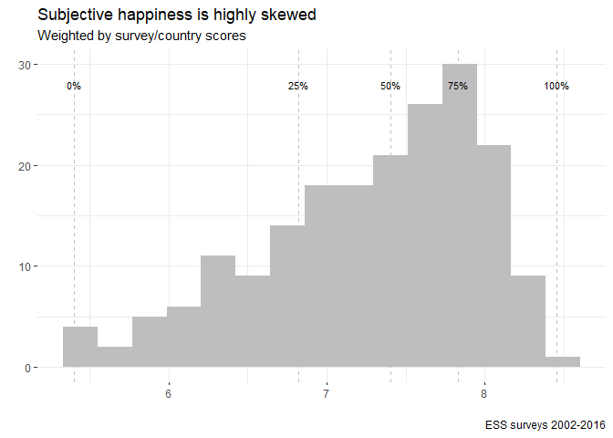

``` r
summary(ds_happy_ave$var_ave)
```

    ##    Min. 1st Qu.  Median    Mean 3rd Qu.    Max. 
    ##   5.405   6.820   7.403   7.277   7.828   8.455

And that indeed is the case, producing a clearly left skewed distribution (-0.648).

Some countries have been in all surveys and some in only two. So there are no big conclusions to be drawn at this stage.

### How is happiness distributed in Europe

Next we investigate the average scores by country on geographic map to see if there are any patterns.

``` r
ds_happy_avgsum <- MakeAverageSummary(ds = ds_happy_ave, value_term = "var_ave")

p <- CreateEuroMap(dsin = ds_happy_avgsum %>%
                     filter(cntry_name != "Mean"), 
                   ind_name = "var_ave",
                   txt_title = "Subjective happiness 2002-2016",
                   txt_subtitle = "Average score of 'happy', scale 0-10",
                   txt_caption = "ESS surveys 2002-2016")
MyPrintInteractive(p, TRUE) 
```

<!--html_preserve-->

<script type="application/json" data-for="htmlwidget-d4f214e30a9f89ddb5a6">{"x":{"html":"<?xml version=\"1.0\" encoding=\"UTF-8\"?>\n<svg xmlns=\"http://www.w3.org/2000/svg\" xmlns:xlink=\"http://www.w3.org/1999/xlink\" id=\"svg_3\" viewBox=\"0 0 432.00 360.00\">\n  <g>\n    <defs>\n      <clipPath id=\"cl3_0\">\n        <rect x=\"0.00\" y=\"360.00\" width=\"0.00\" height=\"72.00\"/>\n      <\/clipPath>\n    <\/defs>\n    <rect x=\"0.00\" y=\"0.00\" width=\"432.00\" height=\"360.00\" id=\"1\" clip-path=\"url(#cl3_0)\" fill=\"#FFFFFF\" fill-opacity=\"1\" stroke-width=\"0.75\" stroke=\"#FFFFFF\" stroke-opacity=\"1\" stroke-linejoin=\"round\" stroke-linecap=\"round\"/>\n    <defs>\n      <clipPath id=\"cl3_1\">\n        <rect x=\"0.00\" y=\"0.00\" width=\"432.00\" height=\"360.00\"/>\n      <\/clipPath>\n    <\/defs>\n    <defs>\n      <clipPath id=\"cl3_2\">\n        <rect x=\"32.75\" y=\"81.34\" width=\"318.90\" height=\"226.98\"/>\n      <\/clipPath>\n    <\/defs>\n    <polyline points=\"32.75,279.24 351.66,279.24\" id=\"2\" clip-path=\"url(#cl3_2)\" fill=\"none\" stroke-width=\"0.320094\" stroke=\"#CCCCCC\" stroke-opacity=\"1\" stroke-linejoin=\"round\" stroke-linecap=\"butt\"/>\n    <polyline points=\"32.75,232.35 351.66,232.35\" id=\"3\" clip-path=\"url(#cl3_2)\" fill=\"none\" stroke-width=\"0.320094\" stroke=\"#CCCCCC\" stroke-opacity=\"1\" stroke-linejoin=\"round\" stroke-linecap=\"butt\"/>\n    <polyline points=\"32.75,185.45 351.66,185.45\" id=\"4\" clip-path=\"url(#cl3_2)\" fill=\"none\" stroke-width=\"0.320094\" stroke=\"#CCCCCC\" stroke-opacity=\"1\" stroke-linejoin=\"round\" stroke-linecap=\"butt\"/>\n    <polyline points=\"32.75,138.55 351.66,138.55\" id=\"5\" clip-path=\"url(#cl3_2)\" fill=\"none\" stroke-width=\"0.320094\" stroke=\"#CCCCCC\" stroke-opacity=\"1\" stroke-linejoin=\"round\" stroke-linecap=\"butt\"/>\n    <polyline points=\"32.75,91.66 351.66,91.66\" id=\"6\" clip-path=\"url(#cl3_2)\" fill=\"none\" stroke-width=\"0.320094\" stroke=\"#CCCCCC\" stroke-opacity=\"1\" stroke-linejoin=\"round\" stroke-linecap=\"butt\"/>\n    <polyline points=\"53.84,308.32 53.84,81.34\" id=\"7\" clip-path=\"url(#cl3_2)\" fill=\"none\" stroke-width=\"0.320094\" stroke=\"#CCCCCC\" stroke-opacity=\"1\" stroke-linejoin=\"round\" stroke-linecap=\"butt\"/>\n    <polyline points=\"119.73,308.32 119.73,81.34\" id=\"8\" clip-path=\"url(#cl3_2)\" fill=\"none\" stroke-width=\"0.320094\" stroke=\"#CCCCCC\" stroke-opacity=\"1\" stroke-linejoin=\"round\" stroke-linecap=\"butt\"/>\n    <polyline points=\"185.62,308.32 185.62,81.34\" id=\"9\" clip-path=\"url(#cl3_2)\" fill=\"none\" stroke-width=\"0.320094\" stroke=\"#CCCCCC\" stroke-opacity=\"1\" stroke-linejoin=\"round\" stroke-linecap=\"butt\"/>\n    <polyline points=\"251.50,308.32 251.50,81.34\" id=\"10\" clip-path=\"url(#cl3_2)\" fill=\"none\" stroke-width=\"0.320094\" stroke=\"#CCCCCC\" stroke-opacity=\"1\" stroke-linejoin=\"round\" stroke-linecap=\"butt\"/>\n    <polyline points=\"317.39,308.32 317.39,81.34\" id=\"11\" clip-path=\"url(#cl3_2)\" fill=\"none\" stroke-width=\"0.320094\" stroke=\"#CCCCCC\" stroke-opacity=\"1\" stroke-linejoin=\"round\" stroke-linecap=\"butt\"/>\n    <polyline points=\"32.75,302.69 351.66,302.69\" id=\"12\" clip-path=\"url(#cl3_2)\" fill=\"none\" stroke-width=\"0.426791\" stroke=\"#CCCCCC\" stroke-opacity=\"1\" stroke-linejoin=\"round\" stroke-linecap=\"butt\"/>\n    <polyline points=\"32.75,255.79 351.66,255.79\" id=\"13\" clip-path=\"url(#cl3_2)\" fill=\"none\" stroke-width=\"0.426791\" stroke=\"#CCCCCC\" stroke-opacity=\"1\" stroke-linejoin=\"round\" stroke-linecap=\"butt\"/>\n    <polyline points=\"32.75,208.90 351.66,208.90\" id=\"14\" clip-path=\"url(#cl3_2)\" fill=\"none\" stroke-width=\"0.426791\" stroke=\"#CCCCCC\" stroke-opacity=\"1\" stroke-linejoin=\"round\" stroke-linecap=\"butt\"/>\n    <polyline points=\"32.75,162.00 351.66,162.00\" id=\"15\" clip-path=\"url(#cl3_2)\" fill=\"none\" stroke-width=\"0.426791\" stroke=\"#CCCCCC\" stroke-opacity=\"1\" stroke-linejoin=\"round\" stroke-linecap=\"butt\"/>\n    <polyline points=\"32.75,115.11 351.66,115.11\" id=\"16\" clip-path=\"url(#cl3_2)\" fill=\"none\" stroke-width=\"0.426791\" stroke=\"#CCCCCC\" stroke-opacity=\"1\" stroke-linejoin=\"round\" stroke-linecap=\"butt\"/>\n    <polyline points=\"86.78,308.32 86.78,81.34\" id=\"17\" clip-path=\"url(#cl3_2)\" fill=\"none\" stroke-width=\"0.426791\" stroke=\"#CCCCCC\" stroke-opacity=\"1\" stroke-linejoin=\"round\" stroke-linecap=\"butt\"/>\n    <polyline points=\"152.67,308.32 152.67,81.34\" id=\"18\" clip-path=\"url(#cl3_2)\" fill=\"none\" stroke-width=\"0.426791\" stroke=\"#CCCCCC\" stroke-opacity=\"1\" stroke-linejoin=\"round\" stroke-linecap=\"butt\"/>\n    <polyline points=\"218.56,308.32 218.56,81.34\" id=\"19\" clip-path=\"url(#cl3_2)\" fill=\"none\" stroke-width=\"0.426791\" stroke=\"#CCCCCC\" stroke-opacity=\"1\" stroke-linejoin=\"round\" stroke-linecap=\"butt\"/>\n    <polyline points=\"284.45,308.32 284.45,81.34\" id=\"20\" clip-path=\"url(#cl3_2)\" fill=\"none\" stroke-width=\"0.426791\" stroke=\"#CCCCCC\" stroke-opacity=\"1\" stroke-linejoin=\"round\" stroke-linecap=\"butt\"/>\n    <polyline points=\"350.34,308.32 350.34,81.34\" id=\"21\" clip-path=\"url(#cl3_2)\" fill=\"none\" stroke-width=\"0.426791\" stroke=\"#CCCCCC\" stroke-opacity=\"1\" stroke-linejoin=\"round\" stroke-linecap=\"butt\"/>\n    <polygon points=\"207.79,200.59 207.31,202.54 204.27,202.53 205.27,203.57 203.32,206.63 202.24,207.43 197.43,207.51 194.59,208.56 190.07,208.14 182.35,206.77 181.33,205.09 175.84,205.81 175.08,206.71 171.87,205.96 169.11,205.76 166.79,204.83 167.81,203.68 167.73,202.82 169.40,202.60 171.94,204.00 172.89,202.75 177.63,203.06 181.59,202.28 184.16,202.47 185.74,203.48 186.33,202.68 185.89,199.56 187.88,198.99 189.97,196.82 193.78,198.41 196.92,196.50 198.81,196.17 202.84,197.66 205.35,197.43 207.77,198.34 207.32,198.94 207.79,200.59\" id=\"22\" clip-path=\"url(#cl3_2)\" fill=\"#29AF7F\" fill-opacity=\"1\" stroke-width=\"1.06698\" stroke=\"#BEBEBE\" stroke-opacity=\"1\" stroke-linejoin=\"round\" stroke-linecap=\"round\"/>\n    <polygon points=\"242.40,155.26 242.59,152.55 241.03,153.16 238.06,151.59 237.42,148.98 242.72,147.62 248.03,146.84 252.80,147.47 257.19,147.20 258.00,147.97 255.45,150.68 257.58,154.90 255.94,156.41 252.24,156.50 248.12,154.89 246.09,154.37 242.40,155.26\" id=\"23\" clip-path=\"url(#cl3_2)\" fill=\"#218E8D\" fill-opacity=\"1\" stroke-width=\"1.06698\" stroke=\"#BEBEBE\" stroke-opacity=\"1\" stroke-linejoin=\"round\" stroke-linecap=\"round\"/>\n    <polygon points=\"242.40,155.26 242.59,152.55 241.03,153.16 238.06,151.59 237.42,148.98 242.72,147.62 248.03,146.84 252.80,147.47 257.19,147.20 258.00,147.97 255.45,150.68 257.58,154.90 255.94,156.41 252.24,156.50 248.12,154.89 246.09,154.37 242.40,155.26\" id=\"24\" clip-path=\"url(#cl3_2)\" fill=\"#1F958B\" fill-opacity=\"1\" stroke-width=\"1.06698\" stroke=\"#BEBEBE\" stroke-opacity=\"1\" stroke-linejoin=\"round\" stroke-linecap=\"round\"/>\n    <polygon points=\"242.40,155.26 242.59,152.55 241.03,153.16 238.06,151.59 237.42,148.98 242.72,147.62 248.03,146.84 252.80,147.47 257.19,147.20 258.00,147.97 255.45,150.68 257.58,154.90 255.94,156.41 252.24,156.50 248.12,154.89 246.09,154.37 242.40,155.26\" id=\"25\" clip-path=\"url(#cl3_2)\" fill=\"#27AD81\" fill-opacity=\"1\" stroke-width=\"1.06698\" stroke=\"#BEBEBE\" stroke-opacity=\"1\" stroke-linejoin=\"round\" stroke-linecap=\"round\"/>\n    <polygon points=\"249.14,104.76 249.51,107.80 255.39,110.46 253.25,113.86 258.76,118.65 257.44,122.52 261.72,125.66 261.01,128.61 267.63,131.39 266.86,133.73 263.92,136.48 256.57,142.54 249.06,143.12 241.92,144.95 235.12,146.02 232.46,143.59 228.31,142.15 228.96,137.71 226.78,133.69 228.50,131.08 231.78,128.25 239.79,123.30 242.10,122.32 241.40,120.47 236.10,118.51 234.68,116.83 233.73,110.13 228.28,107.26 223.85,105.19 225.69,104.04 229.41,106.27 233.58,105.99 237.20,106.96 239.91,104.97 240.80,101.78 245.19,100.16 249.59,101.70 249.14,104.76\" id=\"26\" clip-path=\"url(#cl3_2)\" fill=\"#A2DA37\" fill-opacity=\"1\" stroke-width=\"1.06698\" stroke=\"#BEBEBE\" stroke-opacity=\"1\" stroke-linejoin=\"round\" stroke-linecap=\"round\"/>\n    <polygon points=\"249.14,104.76 249.51,107.80 255.39,110.46 253.25,113.86 258.76,118.65 257.44,122.52 261.72,125.66 261.01,128.61 267.63,131.39 266.86,133.73 263.92,136.48 256.57,142.54 249.06,143.12 241.92,144.95 235.12,146.02 232.46,143.59 228.31,142.15 228.96,137.71 226.78,133.69 228.50,131.08 231.78,128.25 239.79,123.30 242.10,122.32 241.40,120.47 236.10,118.51 234.68,116.83 233.73,110.13 228.28,107.26 223.85,105.19 225.69,104.04 229.41,106.27 233.58,105.99 237.20,106.96 239.91,104.97 240.80,101.78 245.19,100.16 249.59,101.70 249.14,104.76\" id=\"27\" clip-path=\"url(#cl3_2)\" fill=\"#A1DA38\" fill-opacity=\"1\" stroke-width=\"1.06698\" stroke=\"#BEBEBE\" stroke-opacity=\"1\" stroke-linejoin=\"round\" stroke-linecap=\"round\"/>\n    <polygon points=\"249.14,104.76 249.51,107.80 255.39,110.46 253.25,113.86 258.76,118.65 257.44,122.52 261.72,125.66 261.01,128.61 267.63,131.39 266.86,133.73 263.92,136.48 256.57,142.54 249.06,143.12 241.92,144.95 235.12,146.02 232.46,143.59 228.31,142.15 228.96,137.71 226.78,133.69 228.50,131.08 231.78,128.25 239.79,123.30 242.10,122.32 241.40,120.47 236.10,118.51 234.68,116.83 233.73,110.13 228.28,107.26 223.85,105.19 225.69,104.04 229.41,106.27 233.58,105.99 237.20,106.96 239.91,104.97 240.80,101.78 245.19,100.16 249.59,101.70 249.14,104.76\" id=\"28\" clip-path=\"url(#cl3_2)\" fill=\"#A7DB35\" fill-opacity=\"1\" stroke-width=\"1.06698\" stroke=\"#BEBEBE\" stroke-opacity=\"1\" stroke-linejoin=\"round\" stroke-linecap=\"round\"/>\n    <polygon points=\"249.14,104.76 249.51,107.80 255.39,110.46 253.25,113.86 258.76,118.65 257.44,122.52 261.72,125.66 261.01,128.61 267.63,131.39 266.86,133.73 263.92,136.48 256.57,142.54 249.06,143.12 241.92,144.95 235.12,146.02 232.46,143.59 228.31,142.15 228.96,137.71 226.78,133.69 228.50,131.08 231.78,128.25 239.79,123.30 242.10,122.32 241.40,120.47 236.10,118.51 234.68,116.83 233.73,110.13 228.28,107.26 223.85,105.19 225.69,104.04 229.41,106.27 233.58,105.99 237.20,106.96 239.91,104.97 240.80,101.78 245.19,100.16 249.59,101.70 249.14,104.76\" id=\"29\" clip-path=\"url(#cl3_2)\" fill=\"#99D83D\" fill-opacity=\"1\" stroke-width=\"1.06698\" stroke=\"#BEBEBE\" stroke-opacity=\"1\" stroke-linejoin=\"round\" stroke-linecap=\"round\"/>\n    <polygon points=\"249.14,104.76 249.51,107.80 255.39,110.46 253.25,113.86 258.76,118.65 257.44,122.52 261.72,125.66 261.01,128.61 267.63,131.39 266.86,133.73 263.92,136.48 256.57,142.54 249.06,143.12 241.92,144.95 235.12,146.02 232.46,143.59 228.31,142.15 228.96,137.71 226.78,133.69 228.50,131.08 231.78,128.25 239.79,123.30 242.10,122.32 241.40,120.47 236.10,118.51 234.68,116.83 233.73,110.13 228.28,107.26 223.85,105.19 225.69,104.04 229.41,106.27 233.58,105.99 237.20,106.96 239.91,104.97 240.80,101.78 245.19,100.16 249.59,101.70 249.14,104.76\" id=\"30\" clip-path=\"url(#cl3_2)\" fill=\"#9DD93B\" fill-opacity=\"1\" stroke-width=\"1.06698\" stroke=\"#BEBEBE\" stroke-opacity=\"1\" stroke-linejoin=\"round\" stroke-linecap=\"round\"/>\n    <polygon points=\"249.14,104.76 249.51,107.80 255.39,110.46 253.25,113.86 258.76,118.65 257.44,122.52 261.72,125.66 261.01,128.61 267.63,131.39 266.86,133.73 263.92,136.48 256.57,142.54 249.06,143.12 241.92,144.95 235.12,146.02 232.46,143.59 228.31,142.15 228.96,137.71 226.78,133.69 228.50,131.08 231.78,128.25 239.79,123.30 242.10,122.32 241.40,120.47 236.10,118.51 234.68,116.83 233.73,110.13 228.28,107.26 223.85,105.19 225.69,104.04 229.41,106.27 233.58,105.99 237.20,106.96 239.91,104.97 240.80,101.78 245.19,100.16 249.59,101.70 249.14,104.76\" id=\"31\" clip-path=\"url(#cl3_2)\" fill=\"#91D743\" fill-opacity=\"1\" stroke-width=\"1.06698\" stroke=\"#BEBEBE\" stroke-opacity=\"1\" stroke-linejoin=\"round\" stroke-linecap=\"round\"/>\n    <polygon points=\"207.79,200.59 207.31,202.54 204.27,202.53 205.27,203.57 203.32,206.63 202.24,207.43 197.43,207.51 194.59,208.56 190.07,208.14 182.35,206.77 181.33,205.09 175.84,205.81 175.08,206.71 171.87,205.96 169.11,205.76 166.79,204.83 167.81,203.68 167.73,202.82 169.40,202.60 171.94,204.00 172.89,202.75 177.63,203.06 181.59,202.28 184.16,202.47 185.74,203.48 186.33,202.68 185.89,199.56 187.88,198.99 189.97,196.82 193.78,198.41 196.92,196.50 198.81,196.17 202.84,197.66 205.35,197.43 207.77,198.34 207.32,198.94 207.79,200.59\" id=\"32\" clip-path=\"url(#cl3_2)\" fill=\"#50C46A\" fill-opacity=\"1\" stroke-width=\"1.06698\" stroke=\"#BEBEBE\" stroke-opacity=\"1\" stroke-linejoin=\"round\" stroke-linecap=\"round\"/>\n    <polygon points=\"249.14,104.76 249.51,107.80 255.39,110.46 253.25,113.86 258.76,118.65 257.44,122.52 261.72,125.66 261.01,128.61 267.63,131.39 266.86,133.73 263.92,136.48 256.57,142.54 249.06,143.12 241.92,144.95 235.12,146.02 232.46,143.59 228.31,142.15 228.96,137.71 226.78,133.69 228.50,131.08 231.78,128.25 239.79,123.30 242.10,122.32 241.40,120.47 236.10,118.51 234.68,116.83 233.73,110.13 228.28,107.26 223.85,105.19 225.69,104.04 229.41,106.27 233.58,105.99 237.20,106.96 239.91,104.97 240.80,101.78 245.19,100.16 249.59,101.70 249.14,104.76\" id=\"33\" clip-path=\"url(#cl3_2)\" fill=\"#AEDC30\" fill-opacity=\"1\" stroke-width=\"1.06698\" stroke=\"#BEBEBE\" stroke-opacity=\"1\" stroke-linejoin=\"round\" stroke-linecap=\"round\"/>\n    <polygon points=\"249.14,104.76 249.51,107.80 255.39,110.46 253.25,113.86 258.76,118.65 257.44,122.52 261.72,125.66 261.01,128.61 267.63,131.39 266.86,133.73 263.92,136.48 256.57,142.54 249.06,143.12 241.92,144.95 235.12,146.02 232.46,143.59 228.31,142.15 228.96,137.71 226.78,133.69 228.50,131.08 231.78,128.25 239.79,123.30 242.10,122.32 241.40,120.47 236.10,118.51 234.68,116.83 233.73,110.13 228.28,107.26 223.85,105.19 225.69,104.04 229.41,106.27 233.58,105.99 237.20,106.96 239.91,104.97 240.80,101.78 245.19,100.16 249.59,101.70 249.14,104.76\" id=\"34\" clip-path=\"url(#cl3_2)\" fill=\"#A2DA37\" fill-opacity=\"1\" stroke-width=\"1.06698\" stroke=\"#BEBEBE\" stroke-opacity=\"1\" stroke-linejoin=\"round\" stroke-linecap=\"round\"/>\n    <polygon points=\"249.14,104.76 249.51,107.80 255.39,110.46 253.25,113.86 258.76,118.65 257.44,122.52 261.72,125.66 261.01,128.61 267.63,131.39 266.86,133.73 263.92,136.48 256.57,142.54 249.06,143.12 241.92,144.95 235.12,146.02 232.46,143.59 228.31,142.15 228.96,137.71 226.78,133.69 228.50,131.08 231.78,128.25 239.79,123.30 242.10,122.32 241.40,120.47 236.10,118.51 234.68,116.83 233.73,110.13 228.28,107.26 223.85,105.19 225.69,104.04 229.41,106.27 233.58,105.99 237.20,106.96 239.91,104.97 240.80,101.78 245.19,100.16 249.59,101.70 249.14,104.76\" id=\"35\" clip-path=\"url(#cl3_2)\" fill=\"#B6DE2B\" fill-opacity=\"1\" stroke-width=\"1.06698\" stroke=\"#BEBEBE\" stroke-opacity=\"1\" stroke-linejoin=\"round\" stroke-linecap=\"round\"/>\n    <polygon points=\"139.21,188.14 142.17,190.53 144.91,190.27 148.89,192.62 149.95,193.07 151.48,193.03 153.66,194.36 161.04,195.49 157.72,198.66 156.37,202.04 154.73,202.81 152.37,202.29 152.28,203.51 147.75,206.06 147.20,208.23 149.97,207.57 151.42,209.74 150.92,211.09 152.20,212.95 149.98,214.36 150.71,218.14 153.65,218.85 152.63,220.93 146.96,223.52 135.99,221.83 127.35,223.09 125.99,226.00 119.19,226.36 113.36,223.87 111.00,224.83 101.22,222.10 99.58,220.08 103.40,217.31 107.58,207.71 103.79,202.34 100.79,199.67 93.51,197.30 94.43,193.77 101.52,193.19 109.73,194.96 110.11,189.47 114.18,191.80 127.37,188.77 130.15,184.97 134.85,184.24 135.07,185.94 137.40,186.13 139.21,188.14\" id=\"36\" clip-path=\"url(#cl3_2)\" fill=\"#25AC82\" fill-opacity=\"1\" stroke-width=\"1.06698\" stroke=\"#BEBEBE\" stroke-opacity=\"1\" stroke-linejoin=\"round\" stroke-linecap=\"round\"/>\n    <polygon points=\"163.64,228.74 161.18,232.46 158.67,231.40 157.82,228.09 159.27,226.31 163.26,224.54 163.64,228.74\" id=\"37\" clip-path=\"url(#cl3_2)\" fill=\"#25AC82\" fill-opacity=\"1\" stroke-width=\"1.06698\" stroke=\"#BEBEBE\" stroke-opacity=\"1\" stroke-linejoin=\"round\" stroke-linecap=\"round\"/>\n    <polygon points=\"139.21,188.14 142.17,190.53 144.91,190.27 148.89,192.62 149.95,193.07 151.48,193.03 153.66,194.36 161.04,195.49 157.72,198.66 156.37,202.04 154.73,202.81 152.37,202.29 152.28,203.51 147.75,206.06 147.20,208.23 149.97,207.57 151.42,209.74 150.92,211.09 152.20,212.95 149.98,214.36 150.71,218.14 153.65,218.85 152.63,220.93 146.96,223.52 135.99,221.83 127.35,223.09 125.99,226.00 119.19,226.36 113.36,223.87 111.00,224.83 101.22,222.10 99.58,220.08 103.40,217.31 107.58,207.71 103.79,202.34 100.79,199.67 93.51,197.30 94.43,193.77 101.52,193.19 109.73,194.96 110.11,189.47 114.18,191.80 127.37,188.77 130.15,184.97 134.85,184.24 135.07,185.94 137.40,186.13 139.21,188.14\" id=\"38\" clip-path=\"url(#cl3_2)\" fill=\"#32B67A\" fill-opacity=\"1\" stroke-width=\"1.06698\" stroke=\"#BEBEBE\" stroke-opacity=\"1\" stroke-linejoin=\"round\" stroke-linecap=\"round\"/>\n    <polygon points=\"163.64,228.74 161.18,232.46 158.67,231.40 157.82,228.09 159.27,226.31 163.26,224.54 163.64,228.74\" id=\"39\" clip-path=\"url(#cl3_2)\" fill=\"#32B67A\" fill-opacity=\"1\" stroke-width=\"1.06698\" stroke=\"#BEBEBE\" stroke-opacity=\"1\" stroke-linejoin=\"round\" stroke-linecap=\"round\"/>\n    <polygon points=\"139.21,188.14 142.17,190.53 144.91,190.27 148.89,192.62 149.95,193.07 151.48,193.03 153.66,194.36 161.04,195.49 157.72,198.66 156.37,202.04 154.73,202.81 152.37,202.29 152.28,203.51 147.75,206.06 147.20,208.23 149.97,207.57 151.42,209.74 150.92,211.09 152.20,212.95 149.98,214.36 150.71,218.14 153.65,218.85 152.63,220.93 146.96,223.52 135.99,221.83 127.35,223.09 125.99,226.00 119.19,226.36 113.36,223.87 111.00,224.83 101.22,222.10 99.58,220.08 103.40,217.31 107.58,207.71 103.79,202.34 100.79,199.67 93.51,197.30 94.43,193.77 101.52,193.19 109.73,194.96 110.11,189.47 114.18,191.80 127.37,188.77 130.15,184.97 134.85,184.24 135.07,185.94 137.40,186.13 139.21,188.14\" id=\"40\" clip-path=\"url(#cl3_2)\" fill=\"#2AB07F\" fill-opacity=\"1\" stroke-width=\"1.06698\" stroke=\"#BEBEBE\" stroke-opacity=\"1\" stroke-linejoin=\"round\" stroke-linecap=\"round\"/>\n    <polygon points=\"163.64,228.74 161.18,232.46 158.67,231.40 157.82,228.09 159.27,226.31 163.26,224.54 163.64,228.74\" id=\"41\" clip-path=\"url(#cl3_2)\" fill=\"#2AB07F\" fill-opacity=\"1\" stroke-width=\"1.06698\" stroke=\"#BEBEBE\" stroke-opacity=\"1\" stroke-linejoin=\"round\" stroke-linecap=\"round\"/>\n    <polygon points=\"139.21,188.14 142.17,190.53 144.91,190.27 148.89,192.62 149.95,193.07 151.48,193.03 153.66,194.36 161.04,195.49 157.72,198.66 156.37,202.04 154.73,202.81 152.37,202.29 152.28,203.51 147.75,206.06 147.20,208.23 149.97,207.57 151.42,209.74 150.92,211.09 152.20,212.95 149.98,214.36 150.71,218.14 153.65,218.85 152.63,220.93 146.96,223.52 135.99,221.83 127.35,223.09 125.99,226.00 119.19,226.36 113.36,223.87 111.00,224.83 101.22,222.10 99.58,220.08 103.40,217.31 107.58,207.71 103.79,202.34 100.79,199.67 93.51,197.30 94.43,193.77 101.52,193.19 109.73,194.96 110.11,189.47 114.18,191.80 127.37,188.77 130.15,184.97 134.85,184.24 135.07,185.94 137.40,186.13 139.21,188.14\" id=\"42\" clip-path=\"url(#cl3_2)\" fill=\"#22A785\" fill-opacity=\"1\" stroke-width=\"1.06698\" stroke=\"#BEBEBE\" stroke-opacity=\"1\" stroke-linejoin=\"round\" stroke-linecap=\"round\"/>\n    <polygon points=\"163.64,228.74 161.18,232.46 158.67,231.40 157.82,228.09 159.27,226.31 163.26,224.54 163.64,228.74\" id=\"43\" clip-path=\"url(#cl3_2)\" fill=\"#22A785\" fill-opacity=\"1\" stroke-width=\"1.06698\" stroke=\"#BEBEBE\" stroke-opacity=\"1\" stroke-linejoin=\"round\" stroke-linecap=\"round\"/>\n    <polygon points=\"139.21,188.14 142.17,190.53 144.91,190.27 148.89,192.62 149.95,193.07 151.48,193.03 153.66,194.36 161.04,195.49 157.72,198.66 156.37,202.04 154.73,202.81 152.37,202.29 152.28,203.51 147.75,206.06 147.20,208.23 149.97,207.57 151.42,209.74 150.92,211.09 152.20,212.95 149.98,214.36 150.71,218.14 153.65,218.85 152.63,220.93 146.96,223.52 135.99,221.83 127.35,223.09 125.99,226.00 119.19,226.36 113.36,223.87 111.00,224.83 101.22,222.10 99.58,220.08 103.40,217.31 107.58,207.71 103.79,202.34 100.79,199.67 93.51,197.30 94.43,193.77 101.52,193.19 109.73,194.96 110.11,189.47 114.18,191.80 127.37,188.77 130.15,184.97 134.85,184.24 135.07,185.94 137.40,186.13 139.21,188.14\" id=\"44\" clip-path=\"url(#cl3_2)\" fill=\"#21A585\" fill-opacity=\"1\" stroke-width=\"1.06698\" stroke=\"#BEBEBE\" stroke-opacity=\"1\" stroke-linejoin=\"round\" stroke-linecap=\"round\"/>\n    <polygon points=\"163.64,228.74 161.18,232.46 158.67,231.40 157.82,228.09 159.27,226.31 163.26,224.54 163.64,228.74\" id=\"45\" clip-path=\"url(#cl3_2)\" fill=\"#21A585\" fill-opacity=\"1\" stroke-width=\"1.06698\" stroke=\"#BEBEBE\" stroke-opacity=\"1\" stroke-linejoin=\"round\" stroke-linecap=\"round\"/>\n    <polygon points=\"139.21,188.14 142.17,190.53 144.91,190.27 148.89,192.62 149.95,193.07 151.48,193.03 153.66,194.36 161.04,195.49 157.72,198.66 156.37,202.04 154.73,202.81 152.37,202.29 152.28,203.51 147.75,206.06 147.20,208.23 149.97,207.57 151.42,209.74 150.92,211.09 152.20,212.95 149.98,214.36 150.71,218.14 153.65,218.85 152.63,220.93 146.96,223.52 135.99,221.83 127.35,223.09 125.99,226.00 119.19,226.36 113.36,223.87 111.00,224.83 101.22,222.10 99.58,220.08 103.40,217.31 107.58,207.71 103.79,202.34 100.79,199.67 93.51,197.30 94.43,193.77 101.52,193.19 109.73,194.96 110.11,189.47 114.18,191.80 127.37,188.77 130.15,184.97 134.85,184.24 135.07,185.94 137.40,186.13 139.21,188.14\" id=\"46\" clip-path=\"url(#cl3_2)\" fill=\"#1F9E89\" fill-opacity=\"1\" stroke-width=\"1.06698\" stroke=\"#BEBEBE\" stroke-opacity=\"1\" stroke-linejoin=\"round\" stroke-linecap=\"round\"/>\n    <polygon points=\"163.64,228.74 161.18,232.46 158.67,231.40 157.82,228.09 159.27,226.31 163.26,224.54 163.64,228.74\" id=\"47\" clip-path=\"url(#cl3_2)\" fill=\"#1F9E89\" fill-opacity=\"1\" stroke-width=\"1.06698\" stroke=\"#BEBEBE\" stroke-opacity=\"1\" stroke-linejoin=\"round\" stroke-linecap=\"round\"/>\n    <polygon points=\"139.21,188.14 142.17,190.53 144.91,190.27 148.89,192.62 149.95,193.07 151.48,193.03 153.66,194.36 161.04,195.49 157.72,198.66 156.37,202.04 154.73,202.81 152.37,202.29 152.28,203.51 147.75,206.06 147.20,208.23 149.97,207.57 151.42,209.74 150.92,211.09 152.20,212.95 149.98,214.36 150.71,218.14 153.65,218.85 152.63,220.93 146.96,223.52 135.99,221.83 127.35,223.09 125.99,226.00 119.19,226.36 113.36,223.87 111.00,224.83 101.22,222.10 99.58,220.08 103.40,217.31 107.58,207.71 103.79,202.34 100.79,199.67 93.51,197.30 94.43,193.77 101.52,193.19 109.73,194.96 110.11,189.47 114.18,191.80 127.37,188.77 130.15,184.97 134.85,184.24 135.07,185.94 137.40,186.13 139.21,188.14\" id=\"48\" clip-path=\"url(#cl3_2)\" fill=\"#25AB82\" fill-opacity=\"1\" stroke-width=\"1.06698\" stroke=\"#BEBEBE\" stroke-opacity=\"1\" stroke-linejoin=\"round\" stroke-linecap=\"round\"/>\n    <polygon points=\"163.64,228.74 161.18,232.46 158.67,231.40 157.82,228.09 159.27,226.31 163.26,224.54 163.64,228.74\" id=\"49\" clip-path=\"url(#cl3_2)\" fill=\"#25AB82\" fill-opacity=\"1\" stroke-width=\"1.06698\" stroke=\"#BEBEBE\" stroke-opacity=\"1\" stroke-linejoin=\"round\" stroke-linecap=\"round\"/>\n    <polygon points=\"139.21,188.14 142.17,190.53 144.91,190.27 148.89,192.62 149.95,193.07 151.48,193.03 153.66,194.36 161.04,195.49 157.72,198.66 156.37,202.04 154.73,202.81 152.37,202.29 152.28,203.51 147.75,206.06 147.20,208.23 149.97,207.57 151.42,209.74 150.92,211.09 152.20,212.95 149.98,214.36 150.71,218.14 153.65,218.85 152.63,220.93 146.96,223.52 135.99,221.83 127.35,223.09 125.99,226.00 119.19,226.36 113.36,223.87 111.00,224.83 101.22,222.10 99.58,220.08 103.40,217.31 107.58,207.71 103.79,202.34 100.79,199.67 93.51,197.30 94.43,193.77 101.52,193.19 109.73,194.96 110.11,189.47 114.18,191.80 127.37,188.77 130.15,184.97 134.85,184.24 135.07,185.94 137.40,186.13 139.21,188.14\" id=\"50\" clip-path=\"url(#cl3_2)\" fill=\"#2BB17E\" fill-opacity=\"1\" stroke-width=\"1.06698\" stroke=\"#BEBEBE\" stroke-opacity=\"1\" stroke-linejoin=\"round\" stroke-linecap=\"round\"/>\n    <polygon points=\"163.64,228.74 161.18,232.46 158.67,231.40 157.82,228.09 159.27,226.31 163.26,224.54 163.64,228.74\" id=\"51\" clip-path=\"url(#cl3_2)\" fill=\"#2BB17E\" fill-opacity=\"1\" stroke-width=\"1.06698\" stroke=\"#BEBEBE\" stroke-opacity=\"1\" stroke-linejoin=\"round\" stroke-linecap=\"round\"/>\n    <polygon points=\"139.21,188.14 142.17,190.53 144.91,190.27 148.89,192.62 149.95,193.07 151.48,193.03 153.66,194.36 161.04,195.49 157.72,198.66 156.37,202.04 154.73,202.81 152.37,202.29 152.28,203.51 147.75,206.06 147.20,208.23 149.97,207.57 151.42,209.74 150.92,211.09 152.20,212.95 149.98,214.36 150.71,218.14 153.65,218.85 152.63,220.93 146.96,223.52 135.99,221.83 127.35,223.09 125.99,226.00 119.19,226.36 113.36,223.87 111.00,224.83 101.22,222.10 99.58,220.08 103.40,217.31 107.58,207.71 103.79,202.34 100.79,199.67 93.51,197.30 94.43,193.77 101.52,193.19 109.73,194.96 110.11,189.47 114.18,191.80 127.37,188.77 130.15,184.97 134.85,184.24 135.07,185.94 137.40,186.13 139.21,188.14\" id=\"52\" clip-path=\"url(#cl3_2)\" fill=\"#30B47C\" fill-opacity=\"1\" stroke-width=\"1.06698\" stroke=\"#BEBEBE\" stroke-opacity=\"1\" stroke-linejoin=\"round\" stroke-linecap=\"round\"/>\n    <polygon points=\"163.64,228.74 161.18,232.46 158.67,231.40 157.82,228.09 159.27,226.31 163.26,224.54 163.64,228.74\" id=\"53\" clip-path=\"url(#cl3_2)\" fill=\"#30B47C\" fill-opacity=\"1\" stroke-width=\"1.06698\" stroke=\"#BEBEBE\" stroke-opacity=\"1\" stroke-linejoin=\"round\" stroke-linecap=\"round\"/>\n    <polygon points=\"123.18,147.92 116.10,152.48 120.82,152.21 125.56,152.60 122.69,156.24 116.75,160.06 121.28,160.70 121.42,161.21 123.16,166.95 126.05,167.91 126.92,173.40 127.60,175.33 133.17,176.55 131.56,179.52 128.57,180.76 129.73,183.30 124.38,185.53 117.68,185.09 108.64,185.86 106.68,184.77 102.45,186.76 98.04,185.90 93.73,187.45 91.49,186.30 100.99,181.87 105.84,181.17 105.80,181.16 98.50,179.81 97.99,177.83 103.71,176.76 102.24,174.03 104.58,171.04 111.42,171.99 111.43,171.99 113.32,169.33 111.51,166.24 111.47,166.17 106.27,164.91 105.80,163.57 108.49,161.64 107.65,160.24 104.10,162.22 106.17,157.75 105.21,155.22 109.38,150.63 114.71,147.23 117.88,147.89 123.18,147.92\" id=\"54\" clip-path=\"url(#cl3_2)\" fill=\"#42BE71\" fill-opacity=\"1\" stroke-width=\"1.06698\" stroke=\"#BEBEBE\" stroke-opacity=\"1\" stroke-linejoin=\"round\" stroke-linecap=\"round\"/>\n    <polygon points=\"101.96,165.70 97.86,168.69 94.85,167.43 91.96,167.24 94.26,164.83 94.69,162.26 98.58,162.41 101.96,165.70\" id=\"55\" clip-path=\"url(#cl3_2)\" fill=\"#42BE71\" fill-opacity=\"1\" stroke-width=\"1.06698\" stroke=\"#BEBEBE\" stroke-opacity=\"1\" stroke-linejoin=\"round\" stroke-linecap=\"round\"/>\n    <polygon points=\"123.18,147.92 116.10,152.48 120.82,152.21 125.56,152.60 122.69,156.24 116.75,160.06 121.28,160.70 121.42,161.21 123.16,166.95 126.05,167.91 126.92,173.40 127.60,175.33 133.17,176.55 131.56,179.52 128.57,180.76 129.73,183.30 124.38,185.53 117.68,185.09 108.64,185.86 106.68,184.77 102.45,186.76 98.04,185.90 93.73,187.45 91.49,186.30 100.99,181.87 105.84,181.17 105.80,181.16 98.50,179.81 97.99,177.83 103.71,176.76 102.24,174.03 104.58,171.04 111.42,171.99 111.43,171.99 113.32,169.33 111.51,166.24 111.47,166.17 106.27,164.91 105.80,163.57 108.49,161.64 107.65,160.24 104.10,162.22 106.17,157.75 105.21,155.22 109.38,150.63 114.71,147.23 117.88,147.89 123.18,147.92\" id=\"56\" clip-path=\"url(#cl3_2)\" fill=\"#4DC36B\" fill-opacity=\"1\" stroke-width=\"1.06698\" stroke=\"#BEBEBE\" stroke-opacity=\"1\" stroke-linejoin=\"round\" stroke-linecap=\"round\"/>\n    <polygon points=\"101.96,165.70 97.86,168.69 94.85,167.43 91.96,167.24 94.26,164.83 94.69,162.26 98.58,162.41 101.96,165.70\" id=\"57\" clip-path=\"url(#cl3_2)\" fill=\"#4DC36B\" fill-opacity=\"1\" stroke-width=\"1.06698\" stroke=\"#BEBEBE\" stroke-opacity=\"1\" stroke-linejoin=\"round\" stroke-linecap=\"round\"/>\n    <polygon points=\"123.18,147.92 116.10,152.48 120.82,152.21 125.56,152.60 122.69,156.24 116.75,160.06 121.28,160.70 121.42,161.21 123.16,166.95 126.05,167.91 126.92,173.40 127.60,175.33 133.17,176.55 131.56,179.52 128.57,180.76 129.73,183.30 124.38,185.53 117.68,185.09 108.64,185.86 106.68,184.77 102.45,186.76 98.04,185.90 93.73,187.45 91.49,186.30 100.99,181.87 105.84,181.17 105.80,181.16 98.50,179.81 97.99,177.83 103.71,176.76 102.24,174.03 104.58,171.04 111.42,171.99 111.43,171.99 113.32,169.33 111.51,166.24 111.47,166.17 106.27,164.91 105.80,163.57 108.49,161.64 107.65,160.24 104.10,162.22 106.17,157.75 105.21,155.22 109.38,150.63 114.71,147.23 117.88,147.89 123.18,147.92\" id=\"58\" clip-path=\"url(#cl3_2)\" fill=\"#37B878\" fill-opacity=\"1\" stroke-width=\"1.06698\" stroke=\"#BEBEBE\" stroke-opacity=\"1\" stroke-linejoin=\"round\" stroke-linecap=\"round\"/>\n    <polygon points=\"101.96,165.70 97.86,168.69 94.85,167.43 91.96,167.24 94.26,164.83 94.69,162.26 98.58,162.41 101.96,165.70\" id=\"59\" clip-path=\"url(#cl3_2)\" fill=\"#37B878\" fill-opacity=\"1\" stroke-width=\"1.06698\" stroke=\"#BEBEBE\" stroke-opacity=\"1\" stroke-linejoin=\"round\" stroke-linecap=\"round\"/>\n    <polygon points=\"123.18,147.92 116.10,152.48 120.82,152.21 125.56,152.60 122.69,156.24 116.75,160.06 121.28,160.70 121.42,161.21 123.16,166.95 126.05,167.91 126.92,173.40 127.60,175.33 133.17,176.55 131.56,179.52 128.57,180.76 129.73,183.30 124.38,185.53 117.68,185.09 108.64,185.86 106.68,184.77 102.45,186.76 98.04,185.90 93.73,187.45 91.49,186.30 100.99,181.87 105.84,181.17 105.80,181.16 98.50,179.81 97.99,177.83 103.71,176.76 102.24,174.03 104.58,171.04 111.42,171.99 111.43,171.99 113.32,169.33 111.51,166.24 111.47,166.17 106.27,164.91 105.80,163.57 108.49,161.64 107.65,160.24 104.10,162.22 106.17,157.75 105.21,155.22 109.38,150.63 114.71,147.23 117.88,147.89 123.18,147.92\" id=\"60\" clip-path=\"url(#cl3_2)\" fill=\"#40BD72\" fill-opacity=\"1\" stroke-width=\"1.06698\" stroke=\"#BEBEBE\" stroke-opacity=\"1\" stroke-linejoin=\"round\" stroke-linecap=\"round\"/>\n    <polygon points=\"101.96,165.70 97.86,168.69 94.85,167.43 91.96,167.24 94.26,164.83 94.69,162.26 98.58,162.41 101.96,165.70\" id=\"61\" clip-path=\"url(#cl3_2)\" fill=\"#40BD72\" fill-opacity=\"1\" stroke-width=\"1.06698\" stroke=\"#BEBEBE\" stroke-opacity=\"1\" stroke-linejoin=\"round\" stroke-linecap=\"round\"/>\n    <polygon points=\"123.18,147.92 116.10,152.48 120.82,152.21 125.56,152.60 122.69,156.24 116.75,160.06 121.28,160.70 121.42,161.21 123.16,166.95 126.05,167.91 126.92,173.40 127.60,175.33 133.17,176.55 131.56,179.52 128.57,180.76 129.73,183.30 124.38,185.53 117.68,185.09 108.64,185.86 106.68,184.77 102.45,186.76 98.04,185.90 93.73,187.45 91.49,186.30 100.99,181.87 105.84,181.17 105.80,181.16 98.50,179.81 97.99,177.83 103.71,176.76 102.24,174.03 104.58,171.04 111.42,171.99 111.43,171.99 113.32,169.33 111.51,166.24 111.47,166.17 106.27,164.91 105.80,163.57 108.49,161.64 107.65,160.24 104.10,162.22 106.17,157.75 105.21,155.22 109.38,150.63 114.71,147.23 117.88,147.89 123.18,147.92\" id=\"62\" clip-path=\"url(#cl3_2)\" fill=\"#42BE71\" fill-opacity=\"1\" stroke-width=\"1.06698\" stroke=\"#BEBEBE\" stroke-opacity=\"1\" stroke-linejoin=\"round\" stroke-linecap=\"round\"/>\n    <polygon points=\"101.96,165.70 97.86,168.69 94.85,167.43 91.96,167.24 94.26,164.83 94.69,162.26 98.58,162.41 101.96,165.70\" id=\"63\" clip-path=\"url(#cl3_2)\" fill=\"#42BE71\" fill-opacity=\"1\" stroke-width=\"1.06698\" stroke=\"#BEBEBE\" stroke-opacity=\"1\" stroke-linejoin=\"round\" stroke-linecap=\"round\"/>\n    <polygon points=\"123.18,147.92 116.10,152.48 120.82,152.21 125.56,152.60 122.69,156.24 116.75,160.06 121.28,160.70 121.42,161.21 123.16,166.95 126.05,167.91 126.92,173.40 127.60,175.33 133.17,176.55 131.56,179.52 128.57,180.76 129.73,183.30 124.38,185.53 117.68,185.09 108.64,185.86 106.68,184.77 102.45,186.76 98.04,185.90 93.73,187.45 91.49,186.30 100.99,181.87 105.84,181.17 105.80,181.16 98.50,179.81 97.99,177.83 103.71,176.76 102.24,174.03 104.58,171.04 111.42,171.99 111.43,171.99 113.32,169.33 111.51,166.24 111.47,166.17 106.27,164.91 105.80,163.57 108.49,161.64 107.65,160.24 104.10,162.22 106.17,157.75 105.21,155.22 109.38,150.63 114.71,147.23 117.88,147.89 123.18,147.92\" id=\"64\" clip-path=\"url(#cl3_2)\" fill=\"#2EB37C\" fill-opacity=\"1\" stroke-width=\"1.06698\" stroke=\"#BEBEBE\" stroke-opacity=\"1\" stroke-linejoin=\"round\" stroke-linecap=\"round\"/>\n    <polygon points=\"101.96,165.70 97.86,168.69 94.85,167.43 91.96,167.24 94.26,164.83 94.69,162.26 98.58,162.41 101.96,165.70\" id=\"65\" clip-path=\"url(#cl3_2)\" fill=\"#2EB37C\" fill-opacity=\"1\" stroke-width=\"1.06698\" stroke=\"#BEBEBE\" stroke-opacity=\"1\" stroke-linejoin=\"round\" stroke-linecap=\"round\"/>\n    <polygon points=\"123.18,147.92 116.10,152.48 120.82,152.21 125.56,152.60 122.69,156.24 116.75,160.06 121.28,160.70 121.42,161.21 123.16,166.95 126.05,167.91 126.92,173.40 127.60,175.33 133.17,176.55 131.56,179.52 128.57,180.76 129.73,183.30 124.38,185.53 117.68,185.09 108.64,185.86 106.68,184.77 102.45,186.76 98.04,185.90 93.73,187.45 91.49,186.30 100.99,181.87 105.84,181.17 105.80,181.16 98.50,179.81 97.99,177.83 103.71,176.76 102.24,174.03 104.58,171.04 111.42,171.99 111.43,171.99 113.32,169.33 111.51,166.24 111.47,166.17 106.27,164.91 105.80,163.57 108.49,161.64 107.65,160.24 104.10,162.22 106.17,157.75 105.21,155.22 109.38,150.63 114.71,147.23 117.88,147.89 123.18,147.92\" id=\"66\" clip-path=\"url(#cl3_2)\" fill=\"#42BE71\" fill-opacity=\"1\" stroke-width=\"1.06698\" stroke=\"#BEBEBE\" stroke-opacity=\"1\" stroke-linejoin=\"round\" stroke-linecap=\"round\"/>\n    <polygon points=\"101.96,165.70 97.86,168.69 94.85,167.43 91.96,167.24 94.26,164.83 94.69,162.26 98.58,162.41 101.96,165.70\" id=\"67\" clip-path=\"url(#cl3_2)\" fill=\"#42BE71\" fill-opacity=\"1\" stroke-width=\"1.06698\" stroke=\"#BEBEBE\" stroke-opacity=\"1\" stroke-linejoin=\"round\" stroke-linecap=\"round\"/>\n    <polygon points=\"123.18,147.92 116.10,152.48 120.82,152.21 125.56,152.60 122.69,156.24 116.75,160.06 121.28,160.70 121.42,161.21 123.16,166.95 126.05,167.91 126.92,173.40 127.60,175.33 133.17,176.55 131.56,179.52 128.57,180.76 129.73,183.30 124.38,185.53 117.68,185.09 108.64,185.86 106.68,184.77 102.45,186.76 98.04,185.90 93.73,187.45 91.49,186.30 100.99,181.87 105.84,181.17 105.80,181.16 98.50,179.81 97.99,177.83 103.71,176.76 102.24,174.03 104.58,171.04 111.42,171.99 111.43,171.99 113.32,169.33 111.51,166.24 111.47,166.17 106.27,164.91 105.80,163.57 108.49,161.64 107.65,160.24 104.10,162.22 106.17,157.75 105.21,155.22 109.38,150.63 114.71,147.23 117.88,147.89 123.18,147.92\" id=\"68\" clip-path=\"url(#cl3_2)\" fill=\"#4AC16D\" fill-opacity=\"1\" stroke-width=\"1.06698\" stroke=\"#BEBEBE\" stroke-opacity=\"1\" stroke-linejoin=\"round\" stroke-linecap=\"round\"/>\n    <polygon points=\"101.96,165.70 97.86,168.69 94.85,167.43 91.96,167.24 94.26,164.83 94.69,162.26 98.58,162.41 101.96,165.70\" id=\"69\" clip-path=\"url(#cl3_2)\" fill=\"#4AC16D\" fill-opacity=\"1\" stroke-width=\"1.06698\" stroke=\"#BEBEBE\" stroke-opacity=\"1\" stroke-linejoin=\"round\" stroke-linecap=\"round\"/>\n    <polygon points=\"123.18,147.92 116.10,152.48 120.82,152.21 125.56,152.60 122.69,156.24 116.75,160.06 121.28,160.70 121.42,161.21 123.16,166.95 126.05,167.91 126.92,173.40 127.60,175.33 133.17,176.55 131.56,179.52 128.57,180.76 129.73,183.30 124.38,185.53 117.68,185.09 108.64,185.86 106.68,184.77 102.45,186.76 98.04,185.90 93.73,187.45 91.49,186.30 100.99,181.87 105.84,181.17 105.80,181.16 98.50,179.81 97.99,177.83 103.71,176.76 102.24,174.03 104.58,171.04 111.42,171.99 111.43,171.99 113.32,169.33 111.51,166.24 111.47,166.17 106.27,164.91 105.80,163.57 108.49,161.64 107.65,160.24 104.10,162.22 106.17,157.75 105.21,155.22 109.38,150.63 114.71,147.23 117.88,147.89 123.18,147.92\" id=\"70\" clip-path=\"url(#cl3_2)\" fill=\"#55C667\" fill-opacity=\"1\" stroke-width=\"1.06698\" stroke=\"#BEBEBE\" stroke-opacity=\"1\" stroke-linejoin=\"round\" stroke-linecap=\"round\"/>\n    <polygon points=\"101.96,165.70 97.86,168.69 94.85,167.43 91.96,167.24 94.26,164.83 94.69,162.26 98.58,162.41 101.96,165.70\" id=\"71\" clip-path=\"url(#cl3_2)\" fill=\"#55C667\" fill-opacity=\"1\" stroke-width=\"1.06698\" stroke=\"#BEBEBE\" stroke-opacity=\"1\" stroke-linejoin=\"round\" stroke-linecap=\"round\"/>\n    <polygon points=\"263.31,231.82 261.82,234.91 260.47,235.48 256.85,235.40 253.73,234.98 246.65,236.34 250.97,239.04 247.99,239.87 244.66,239.91 241.36,237.42 240.30,238.51 241.79,241.42 244.93,243.69 242.71,244.79 246.22,247.02 249.33,248.42 249.60,251.20 243.86,249.95 245.81,252.44 241.93,253.00 244.49,257.34 240.37,257.43 235.19,255.31 232.76,251.38 231.59,248.11 229.16,245.86 226.00,243.07 225.57,241.68 228.31,239.29 228.63,237.70 230.55,236.99 230.63,235.70 234.49,235.25 236.70,234.17 239.91,234.24 240.83,233.38 241.94,233.21 246.31,233.31 250.92,231.91 255.20,233.56 260.51,233.01 260.32,230.58 263.31,231.82\" id=\"72\" clip-path=\"url(#cl3_2)\" fill=\"#2D718E\" fill-opacity=\"1\" stroke-width=\"1.06698\" stroke=\"#BEBEBE\" stroke-opacity=\"1\" stroke-linejoin=\"round\" stroke-linecap=\"round\"/>\n    <polygon points=\"248.09,260.86 251.62,262.49 256.48,262.16 261.18,262.45 261.10,263.32 264.47,262.67 263.81,264.15 254.77,264.68 254.78,263.86 247.05,262.97 248.09,260.86\" id=\"73\" clip-path=\"url(#cl3_2)\" fill=\"#2D718E\" fill-opacity=\"1\" stroke-width=\"1.06698\" stroke=\"#BEBEBE\" stroke-opacity=\"1\" stroke-linejoin=\"round\" stroke-linecap=\"round\"/>\n    <polygon points=\"263.31,231.82 261.82,234.91 260.47,235.48 256.85,235.40 253.73,234.98 246.65,236.34 250.97,239.04 247.99,239.87 244.66,239.91 241.36,237.42 240.30,238.51 241.79,241.42 244.93,243.69 242.71,244.79 246.22,247.02 249.33,248.42 249.60,251.20 243.86,249.95 245.81,252.44 241.93,253.00 244.49,257.34 240.37,257.43 235.19,255.31 232.76,251.38 231.59,248.11 229.16,245.86 226.00,243.07 225.57,241.68 228.31,239.29 228.63,237.70 230.55,236.99 230.63,235.70 234.49,235.25 236.70,234.17 239.91,234.24 240.83,233.38 241.94,233.21 246.31,233.31 250.92,231.91 255.20,233.56 260.51,233.01 260.32,230.58 263.31,231.82\" id=\"74\" clip-path=\"url(#cl3_2)\" fill=\"#2A768E\" fill-opacity=\"1\" stroke-width=\"1.06698\" stroke=\"#BEBEBE\" stroke-opacity=\"1\" stroke-linejoin=\"round\" stroke-linecap=\"round\"/>\n    <polygon points=\"248.09,260.86 251.62,262.49 256.48,262.16 261.18,262.45 261.10,263.32 264.47,262.67 263.81,264.15 254.77,264.68 254.78,263.86 247.05,262.97 248.09,260.86\" id=\"75\" clip-path=\"url(#cl3_2)\" fill=\"#2A768E\" fill-opacity=\"1\" stroke-width=\"1.06698\" stroke=\"#BEBEBE\" stroke-opacity=\"1\" stroke-linejoin=\"round\" stroke-linecap=\"round\"/>\n    <polygon points=\"139.15,183.51 142.72,184.05 147.65,183.28 150.30,185.47 152.82,186.68 151.48,189.85 150.09,189.98 148.89,192.62 144.91,190.27 142.17,190.53 139.21,188.14 137.40,186.13 135.07,185.94 134.85,184.24 139.15,183.51\" id=\"76\" clip-path=\"url(#cl3_2)\" fill=\"#5EC962\" fill-opacity=\"1\" stroke-width=\"1.06698\" stroke=\"#BEBEBE\" stroke-opacity=\"1\" stroke-linejoin=\"round\" stroke-linecap=\"round\"/>\n    <polygon points=\"263.31,231.82 261.82,234.91 260.47,235.48 256.85,235.40 253.73,234.98 246.65,236.34 250.97,239.04 247.99,239.87 244.66,239.91 241.36,237.42 240.30,238.51 241.79,241.42 244.93,243.69 242.71,244.79 246.22,247.02 249.33,248.42 249.60,251.20 243.86,249.95 245.81,252.44 241.93,253.00 244.49,257.34 240.37,257.43 235.19,255.31 232.76,251.38 231.59,248.11 229.16,245.86 226.00,243.07 225.57,241.68 228.31,239.29 228.63,237.70 230.55,236.99 230.63,235.70 234.49,235.25 236.70,234.17 239.91,234.24 240.83,233.38 241.94,233.21 246.31,233.31 250.92,231.91 255.20,233.56 260.51,233.01 260.32,230.58 263.31,231.82\" id=\"77\" clip-path=\"url(#cl3_2)\" fill=\"#23888E\" fill-opacity=\"1\" stroke-width=\"1.06698\" stroke=\"#BEBEBE\" stroke-opacity=\"1\" stroke-linejoin=\"round\" stroke-linecap=\"round\"/>\n    <polygon points=\"248.09,260.86 251.62,262.49 256.48,262.16 261.18,262.45 261.10,263.32 264.47,262.67 263.81,264.15 254.77,264.68 254.78,263.86 247.05,262.97 248.09,260.86\" id=\"78\" clip-path=\"url(#cl3_2)\" fill=\"#23888E\" fill-opacity=\"1\" stroke-width=\"1.06698\" stroke=\"#BEBEBE\" stroke-opacity=\"1\" stroke-linejoin=\"round\" stroke-linecap=\"round\"/>\n    <polygon points=\"263.31,231.82 261.82,234.91 260.47,235.48 256.85,235.40 253.73,234.98 246.65,236.34 250.97,239.04 247.99,239.87 244.66,239.91 241.36,237.42 240.30,238.51 241.79,241.42 244.93,243.69 242.71,244.79 246.22,247.02 249.33,248.42 249.60,251.20 243.86,249.95 245.81,252.44 241.93,253.00 244.49,257.34 240.37,257.43 235.19,255.31 232.76,251.38 231.59,248.11 229.16,245.86 226.00,243.07 225.57,241.68 228.31,239.29 228.63,237.70 230.55,236.99 230.63,235.70 234.49,235.25 236.70,234.17 239.91,234.24 240.83,233.38 241.94,233.21 246.31,233.31 250.92,231.91 255.20,233.56 260.51,233.01 260.32,230.58 263.31,231.82\" id=\"79\" clip-path=\"url(#cl3_2)\" fill=\"#277E8E\" fill-opacity=\"1\" stroke-width=\"1.06698\" stroke=\"#BEBEBE\" stroke-opacity=\"1\" stroke-linejoin=\"round\" stroke-linecap=\"round\"/>\n    <polygon points=\"248.09,260.86 251.62,262.49 256.48,262.16 261.18,262.45 261.10,263.32 264.47,262.67 263.81,264.15 254.77,264.68 254.78,263.86 247.05,262.97 248.09,260.86\" id=\"80\" clip-path=\"url(#cl3_2)\" fill=\"#277E8E\" fill-opacity=\"1\" stroke-width=\"1.06698\" stroke=\"#BEBEBE\" stroke-opacity=\"1\" stroke-linejoin=\"round\" stroke-linecap=\"round\"/>\n    <polygon points=\"263.31,231.82 261.82,234.91 260.47,235.48 256.85,235.40 253.73,234.98 246.65,236.34 250.97,239.04 247.99,239.87 244.66,239.91 241.36,237.42 240.30,238.51 241.79,241.42 244.93,243.69 242.71,244.79 246.22,247.02 249.33,248.42 249.60,251.20 243.86,249.95 245.81,252.44 241.93,253.00 244.49,257.34 240.37,257.43 235.19,255.31 232.76,251.38 231.59,248.11 229.16,245.86 226.00,243.07 225.57,241.68 228.31,239.29 228.63,237.70 230.55,236.99 230.63,235.70 234.49,235.25 236.70,234.17 239.91,234.24 240.83,233.38 241.94,233.21 246.31,233.31 250.92,231.91 255.20,233.56 260.51,233.01 260.32,230.58 263.31,231.82\" id=\"81\" clip-path=\"url(#cl3_2)\" fill=\"#424186\" fill-opacity=\"1\" stroke-width=\"1.06698\" stroke=\"#BEBEBE\" stroke-opacity=\"1\" stroke-linejoin=\"round\" stroke-linecap=\"round\"/>\n    <polygon points=\"248.09,260.86 251.62,262.49 256.48,262.16 261.18,262.45 261.10,263.32 264.47,262.67 263.81,264.15 254.77,264.68 254.78,263.86 247.05,262.97 248.09,260.86\" id=\"82\" clip-path=\"url(#cl3_2)\" fill=\"#424186\" fill-opacity=\"1\" stroke-width=\"1.06698\" stroke=\"#BEBEBE\" stroke-opacity=\"1\" stroke-linejoin=\"round\" stroke-linecap=\"round\"/>\n    <polygon points=\"217.70,211.21 219.05,213.07 220.84,214.44 218.68,216.25 216.14,215.18 212.25,215.24 207.45,214.43 204.83,214.52 203.57,215.51 201.61,214.39 200.33,216.38 202.99,218.65 204.16,220.16 206.72,221.98 208.87,223.06 211.00,225.09 216.10,226.94 215.45,227.76 210.03,225.95 206.73,224.19 201.53,222.72 196.92,219.12 198.09,218.77 195.63,216.72 195.63,215.09 192.08,214.29 190.20,216.35 188.67,214.71 188.94,213.05 189.15,212.97 193.02,213.18 194.10,212.39 195.94,213.19 198.13,213.31 198.19,211.96 200.15,211.49 200.79,209.56 205.24,208.31 206.97,208.92 211.05,210.99 215.62,211.92 217.70,211.21\" id=\"83\" clip-path=\"url(#cl3_2)\" fill=\"#24878E\" fill-opacity=\"1\" stroke-width=\"1.06698\" stroke=\"#BEBEBE\" stroke-opacity=\"1\" stroke-linejoin=\"round\" stroke-linecap=\"round\"/>\n    <polygon points=\"217.70,211.21 219.05,213.07 220.84,214.44 218.68,216.25 216.14,215.18 212.25,215.24 207.45,214.43 204.83,214.52 203.57,215.51 201.61,214.39 200.33,216.38 202.99,218.65 204.16,220.16 206.72,221.98 208.87,223.06 211.00,225.09 216.10,226.94 215.45,227.76 210.03,225.95 206.73,224.19 201.53,222.72 196.92,219.12 198.09,218.77 195.63,216.72 195.63,215.09 192.08,214.29 190.20,216.35 188.67,214.71 188.94,213.05 189.15,212.97 193.02,213.18 194.10,212.39 195.94,213.19 198.13,213.31 198.19,211.96 200.15,211.49 200.79,209.56 205.24,208.31 206.97,208.92 211.05,210.99 215.62,211.92 217.70,211.21\" id=\"84\" clip-path=\"url(#cl3_2)\" fill=\"#228D8D\" fill-opacity=\"1\" stroke-width=\"1.06698\" stroke=\"#BEBEBE\" stroke-opacity=\"1\" stroke-linejoin=\"round\" stroke-linecap=\"round\"/>\n    <polygon points=\"217.70,211.21 219.05,213.07 220.84,214.44 218.68,216.25 216.14,215.18 212.25,215.24 207.45,214.43 204.83,214.52 203.57,215.51 201.61,214.39 200.33,216.38 202.99,218.65 204.16,220.16 206.72,221.98 208.87,223.06 211.00,225.09 216.10,226.94 215.45,227.76 210.03,225.95 206.73,224.19 201.53,222.72 196.92,219.12 198.09,218.77 195.63,216.72 195.63,215.09 192.08,214.29 190.20,216.35 188.67,214.71 188.94,213.05 189.15,212.97 193.02,213.18 194.10,212.39 195.94,213.19 198.13,213.31 198.19,211.96 200.15,211.49 200.79,209.56 205.24,208.31 206.97,208.92 211.05,210.99 215.62,211.92 217.70,211.21\" id=\"85\" clip-path=\"url(#cl3_2)\" fill=\"#26828E\" fill-opacity=\"1\" stroke-width=\"1.06698\" stroke=\"#BEBEBE\" stroke-opacity=\"1\" stroke-linejoin=\"round\" stroke-linecap=\"round\"/>\n    <polygon points=\"203.32,206.63 205.27,203.57 204.27,202.53 207.31,202.54 207.79,200.59 210.49,201.83 212.47,202.35 217.01,201.78 217.45,200.82 219.58,200.68 222.19,199.94 222.77,200.24 225.28,199.64 226.51,198.52 228.25,198.22 234.03,199.63 235.14,199.13 238.19,200.40 238.65,201.67 235.41,202.70 233.00,205.96 229.81,209.23 225.40,210.15 221.94,209.95 217.70,211.21 215.62,211.92 211.05,210.99 206.97,208.92 205.24,208.31 204.24,206.69 203.32,206.63\" id=\"86\" clip-path=\"url(#cl3_2)\" fill=\"#33638D\" fill-opacity=\"1\" stroke-width=\"1.06698\" stroke=\"#BEBEBE\" stroke-opacity=\"1\" stroke-linejoin=\"round\" stroke-linecap=\"round\"/>\n    <polygon points=\"203.32,206.63 205.27,203.57 204.27,202.53 207.31,202.54 207.79,200.59 210.49,201.83 212.47,202.35 217.01,201.78 217.45,200.82 219.58,200.68 222.19,199.94 222.77,200.24 225.28,199.64 226.51,198.52 228.25,198.22 234.03,199.63 235.14,199.13 238.19,200.40 238.65,201.67 235.41,202.70 233.00,205.96 229.81,209.23 225.40,210.15 221.94,209.95 217.70,211.21 215.62,211.92 211.05,210.99 206.97,208.92 205.24,208.31 204.24,206.69 203.32,206.63\" id=\"87\" clip-path=\"url(#cl3_2)\" fill=\"#34608D\" fill-opacity=\"1\" stroke-width=\"1.06698\" stroke=\"#BEBEBE\" stroke-opacity=\"1\" stroke-linejoin=\"round\" stroke-linecap=\"round\"/>\n    <polygon points=\"203.32,206.63 205.27,203.57 204.27,202.53 207.31,202.54 207.79,200.59 210.49,201.83 212.47,202.35 217.01,201.78 217.45,200.82 219.58,200.68 222.19,199.94 222.77,200.24 225.28,199.64 226.51,198.52 228.25,198.22 234.03,199.63 235.14,199.13 238.19,200.40 238.65,201.67 235.41,202.70 233.00,205.96 229.81,209.23 225.40,210.15 221.94,209.95 217.70,211.21 215.62,211.92 211.05,210.99 206.97,208.92 205.24,208.31 204.24,206.69 203.32,206.63\" id=\"88\" clip-path=\"url(#cl3_2)\" fill=\"#31688E\" fill-opacity=\"1\" stroke-width=\"1.06698\" stroke=\"#BEBEBE\" stroke-opacity=\"1\" stroke-linejoin=\"round\" stroke-linecap=\"round\"/>\n    <polygon points=\"203.32,206.63 205.27,203.57 204.27,202.53 207.31,202.54 207.79,200.59 210.49,201.83 212.47,202.35 217.01,201.78 217.45,200.82 219.58,200.68 222.19,199.94 222.77,200.24 225.28,199.64 226.51,198.52 228.25,198.22 234.03,199.63 235.14,199.13 238.19,200.40 238.65,201.67 235.41,202.70 233.00,205.96 229.81,209.23 225.40,210.15 221.94,209.95 217.70,211.21 215.62,211.92 211.05,210.99 206.97,208.92 205.24,208.31 204.24,206.69 203.32,206.63\" id=\"89\" clip-path=\"url(#cl3_2)\" fill=\"#31678E\" fill-opacity=\"1\" stroke-width=\"1.06698\" stroke=\"#BEBEBE\" stroke-opacity=\"1\" stroke-linejoin=\"round\" stroke-linecap=\"round\"/>\n    <polygon points=\"139.15,183.51 142.72,184.05 147.65,183.28 150.30,185.47 152.82,186.68 151.48,189.85 150.09,189.98 148.89,192.62 144.91,190.27 142.17,190.53 139.21,188.14 137.40,186.13 135.07,185.94 134.85,184.24 139.15,183.51\" id=\"90\" clip-path=\"url(#cl3_2)\" fill=\"#5DC863\" fill-opacity=\"1\" stroke-width=\"1.06698\" stroke=\"#BEBEBE\" stroke-opacity=\"1\" stroke-linejoin=\"round\" stroke-linecap=\"round\"/>\n    <polygon points=\"203.32,206.63 205.27,203.57 204.27,202.53 207.31,202.54 207.79,200.59 210.49,201.83 212.47,202.35 217.01,201.78 217.45,200.82 219.58,200.68 222.19,199.94 222.77,200.24 225.28,199.64 226.51,198.52 228.25,198.22 234.03,199.63 235.14,199.13 238.19,200.40 238.65,201.67 235.41,202.70 233.00,205.96 229.81,209.23 225.40,210.15 221.94,209.95 217.70,211.21 215.62,211.92 211.05,210.99 206.97,208.92 205.24,208.31 204.24,206.69 203.32,206.63\" id=\"91\" clip-path=\"url(#cl3_2)\" fill=\"#453882\" fill-opacity=\"1\" stroke-width=\"1.06698\" stroke=\"#BEBEBE\" stroke-opacity=\"1\" stroke-linejoin=\"round\" stroke-linecap=\"round\"/>\n    <polygon points=\"203.32,206.63 205.27,203.57 204.27,202.53 207.31,202.54 207.79,200.59 210.49,201.83 212.47,202.35 217.01,201.78 217.45,200.82 219.58,200.68 222.19,199.94 222.77,200.24 225.28,199.64 226.51,198.52 228.25,198.22 234.03,199.63 235.14,199.13 238.19,200.40 238.65,201.67 235.41,202.70 233.00,205.96 229.81,209.23 225.40,210.15 221.94,209.95 217.70,211.21 215.62,211.92 211.05,210.99 206.97,208.92 205.24,208.31 204.24,206.69 203.32,206.63\" id=\"92\" clip-path=\"url(#cl3_2)\" fill=\"#30698E\" fill-opacity=\"1\" stroke-width=\"1.06698\" stroke=\"#BEBEBE\" stroke-opacity=\"1\" stroke-linejoin=\"round\" stroke-linecap=\"round\"/>\n    <polygon points=\"203.32,206.63 205.27,203.57 204.27,202.53 207.31,202.54 207.79,200.59 210.49,201.83 212.47,202.35 217.01,201.78 217.45,200.82 219.58,200.68 222.19,199.94 222.77,200.24 225.28,199.64 226.51,198.52 228.25,198.22 234.03,199.63 235.14,199.13 238.19,200.40 238.65,201.67 235.41,202.70 233.00,205.96 229.81,209.23 225.40,210.15 221.94,209.95 217.70,211.21 215.62,211.92 211.05,210.99 206.97,208.92 205.24,208.31 204.24,206.69 203.32,206.63\" id=\"93\" clip-path=\"url(#cl3_2)\" fill=\"#3D4D8A\" fill-opacity=\"1\" stroke-width=\"1.06698\" stroke=\"#BEBEBE\" stroke-opacity=\"1\" stroke-linejoin=\"round\" stroke-linecap=\"round\"/>\n    <polygon points=\"203.32,206.63 205.27,203.57 204.27,202.53 207.31,202.54 207.79,200.59 210.49,201.83 212.47,202.35 217.01,201.78 217.45,200.82 219.58,200.68 222.19,199.94 222.77,200.24 225.28,199.64 226.51,198.52 228.25,198.22 234.03,199.63 235.14,199.13 238.19,200.40 238.65,201.67 235.41,202.70 233.00,205.96 229.81,209.23 225.40,210.15 221.94,209.95 217.70,211.21 215.62,211.92 211.05,210.99 206.97,208.92 205.24,208.31 204.24,206.69 203.32,206.63\" id=\"94\" clip-path=\"url(#cl3_2)\" fill=\"#32658E\" fill-opacity=\"1\" stroke-width=\"1.06698\" stroke=\"#BEBEBE\" stroke-opacity=\"1\" stroke-linejoin=\"round\" stroke-linecap=\"round\"/>\n    <polygon points=\"203.32,206.63 205.27,203.57 204.27,202.53 207.31,202.54 207.79,200.59 210.49,201.83 212.47,202.35 217.01,201.78 217.45,200.82 219.58,200.68 222.19,199.94 222.77,200.24 225.28,199.64 226.51,198.52 228.25,198.22 234.03,199.63 235.14,199.13 238.19,200.40 238.65,201.67 235.41,202.70 233.00,205.96 229.81,209.23 225.40,210.15 221.94,209.95 217.70,211.21 215.62,211.92 211.05,210.99 206.97,208.92 205.24,208.31 204.24,206.69 203.32,206.63\" id=\"95\" clip-path=\"url(#cl3_2)\" fill=\"#218E8D\" fill-opacity=\"1\" stroke-width=\"1.06698\" stroke=\"#BEBEBE\" stroke-opacity=\"1\" stroke-linejoin=\"round\" stroke-linecap=\"round\"/>\n    <polygon points=\"97.86,168.69 96.95,172.09 91.27,175.98 81.33,178.03 74.93,176.69 81.49,172.14 81.76,167.15 90.06,164.11 94.69,162.26 94.26,164.83 91.96,167.24 94.85,167.43 97.86,168.69\" id=\"96\" clip-path=\"url(#cl3_2)\" fill=\"#40BD72\" fill-opacity=\"1\" stroke-width=\"1.06698\" stroke=\"#BEBEBE\" stroke-opacity=\"1\" stroke-linejoin=\"round\" stroke-linecap=\"round\"/>\n    <polygon points=\"97.86,168.69 96.95,172.09 91.27,175.98 81.33,178.03 74.93,176.69 81.49,172.14 81.76,167.15 90.06,164.11 94.69,162.26 94.26,164.83 91.96,167.24 94.85,167.43 97.86,168.69\" id=\"97\" clip-path=\"url(#cl3_2)\" fill=\"#7DD24F\" fill-opacity=\"1\" stroke-width=\"1.06698\" stroke=\"#BEBEBE\" stroke-opacity=\"1\" stroke-linejoin=\"round\" stroke-linecap=\"round\"/>\n    <polygon points=\"97.86,168.69 96.95,172.09 91.27,175.98 81.33,178.03 74.93,176.69 81.49,172.14 81.76,167.15 90.06,164.11 94.69,162.26 94.26,164.83 91.96,167.24 94.85,167.43 97.86,168.69\" id=\"98\" clip-path=\"url(#cl3_2)\" fill=\"#8CD646\" fill-opacity=\"1\" stroke-width=\"1.06698\" stroke=\"#BEBEBE\" stroke-opacity=\"1\" stroke-linejoin=\"round\" stroke-linecap=\"round\"/>\n    <polygon points=\"139.15,183.51 142.72,184.05 147.65,183.28 150.30,185.47 152.82,186.68 151.48,189.85 150.09,189.98 148.89,192.62 144.91,190.27 142.17,190.53 139.21,188.14 137.40,186.13 135.07,185.94 134.85,184.24 139.15,183.51\" id=\"99\" clip-path=\"url(#cl3_2)\" fill=\"#66CC5D\" fill-opacity=\"1\" stroke-width=\"1.06698\" stroke=\"#BEBEBE\" stroke-opacity=\"1\" stroke-linejoin=\"round\" stroke-linecap=\"round\"/>\n    <polygon points=\"97.86,168.69 96.95,172.09 91.27,175.98 81.33,178.03 74.93,176.69 81.49,172.14 81.76,167.15 90.06,164.11 94.69,162.26 94.26,164.83 91.96,167.24 94.85,167.43 97.86,168.69\" id=\"100\" clip-path=\"url(#cl3_2)\" fill=\"#6ACD5B\" fill-opacity=\"1\" stroke-width=\"1.06698\" stroke=\"#BEBEBE\" stroke-opacity=\"1\" stroke-linejoin=\"round\" stroke-linecap=\"round\"/>\n    <polygon points=\"97.86,168.69 96.95,172.09 91.27,175.98 81.33,178.03 74.93,176.69 81.49,172.14 81.76,167.15 90.06,164.11 94.69,162.26 94.26,164.83 91.96,167.24 94.85,167.43 97.86,168.69\" id=\"101\" clip-path=\"url(#cl3_2)\" fill=\"#3FBC73\" fill-opacity=\"1\" stroke-width=\"1.06698\" stroke=\"#BEBEBE\" stroke-opacity=\"1\" stroke-linejoin=\"round\" stroke-linecap=\"round\"/>\n    <polygon points=\"97.86,168.69 96.95,172.09 91.27,175.98 81.33,178.03 74.93,176.69 81.49,172.14 81.76,167.15 90.06,164.11 94.69,162.26 94.26,164.83 91.96,167.24 94.85,167.43 97.86,168.69\" id=\"102\" clip-path=\"url(#cl3_2)\" fill=\"#1F988B\" fill-opacity=\"1\" stroke-width=\"1.06698\" stroke=\"#BEBEBE\" stroke-opacity=\"1\" stroke-linejoin=\"round\" stroke-linecap=\"round\"/>\n    <polygon points=\"97.86,168.69 96.95,172.09 91.27,175.98 81.33,178.03 74.93,176.69 81.49,172.14 81.76,167.15 90.06,164.11 94.69,162.26 94.26,164.83 91.96,167.24 94.85,167.43 97.86,168.69\" id=\"103\" clip-path=\"url(#cl3_2)\" fill=\"#1FA187\" fill-opacity=\"1\" stroke-width=\"1.06698\" stroke=\"#BEBEBE\" stroke-opacity=\"1\" stroke-linejoin=\"round\" stroke-linecap=\"round\"/>\n    <polygon points=\"97.86,168.69 96.95,172.09 91.27,175.98 81.33,178.03 74.93,176.69 81.49,172.14 81.76,167.15 90.06,164.11 94.69,162.26 94.26,164.83 91.96,167.24 94.85,167.43 97.86,168.69\" id=\"104\" clip-path=\"url(#cl3_2)\" fill=\"#29AF7F\" fill-opacity=\"1\" stroke-width=\"1.06698\" stroke=\"#BEBEBE\" stroke-opacity=\"1\" stroke-linejoin=\"round\" stroke-linecap=\"round\"/>\n    <polygon points=\"97.86,168.69 96.95,172.09 91.27,175.98 81.33,178.03 74.93,176.69 81.49,172.14 81.76,167.15 90.06,164.11 94.69,162.26 94.26,164.83 91.96,167.24 94.85,167.43 97.86,168.69\" id=\"105\" clip-path=\"url(#cl3_2)\" fill=\"#45BF70\" fill-opacity=\"1\" stroke-width=\"1.06698\" stroke=\"#BEBEBE\" stroke-opacity=\"1\" stroke-linejoin=\"round\" stroke-linecap=\"round\"/>\n    <polygon points=\"104.72,108.66 101.41,111.30 102.48,114.78 95.17,117.42 82.60,118.85 78.90,119.15 75.08,117.75 67.30,114.68 72.57,113.41 68.01,109.97 74.48,110.26 75.75,109.00 70.46,106.70 75.75,104.41 81.00,104.72 82.55,108.49 89.73,107.06 92.41,108.94 99.79,107.54 104.72,108.66\" id=\"106\" clip-path=\"url(#cl3_2)\" fill=\"#D2E21B\" fill-opacity=\"1\" stroke-width=\"1.06698\" stroke=\"#BEBEBE\" stroke-opacity=\"1\" stroke-linejoin=\"round\" stroke-linecap=\"round\"/>\n    <polygon points=\"104.72,108.66 101.41,111.30 102.48,114.78 95.17,117.42 82.60,118.85 78.90,119.15 75.08,117.75 67.30,114.68 72.57,113.41 68.01,109.97 74.48,110.26 75.75,109.00 70.46,106.70 75.75,104.41 81.00,104.72 82.55,108.49 89.73,107.06 92.41,108.94 99.79,107.54 104.72,108.66\" id=\"107\" clip-path=\"url(#cl3_2)\" fill=\"#FDE725\" fill-opacity=\"1\" stroke-width=\"1.06698\" stroke=\"#BEBEBE\" stroke-opacity=\"1\" stroke-linejoin=\"round\" stroke-linecap=\"round\"/>\n    <polygon points=\"139.15,183.51 142.72,184.05 147.65,183.28 150.30,185.47 152.82,186.68 151.48,189.85 150.09,189.98 148.89,192.62 144.91,190.27 142.17,190.53 139.21,188.14 137.40,186.13 135.07,185.94 134.85,184.24 139.15,183.51\" id=\"108\" clip-path=\"url(#cl3_2)\" fill=\"#4FC46A\" fill-opacity=\"1\" stroke-width=\"1.06698\" stroke=\"#BEBEBE\" stroke-opacity=\"1\" stroke-linejoin=\"round\" stroke-linecap=\"round\"/>\n    <polygon points=\"104.72,108.66 101.41,111.30 102.48,114.78 95.17,117.42 82.60,118.85 78.90,119.15 75.08,117.75 67.30,114.68 72.57,113.41 68.01,109.97 74.48,110.26 75.75,109.00 70.46,106.70 75.75,104.41 81.00,104.72 82.55,108.49 89.73,107.06 92.41,108.94 99.79,107.54 104.72,108.66\" id=\"109\" clip-path=\"url(#cl3_2)\" fill=\"#C6E021\" fill-opacity=\"1\" stroke-width=\"1.06698\" stroke=\"#BEBEBE\" stroke-opacity=\"1\" stroke-linejoin=\"round\" stroke-linecap=\"round\"/>\n    <polygon points=\"104.72,108.66 101.41,111.30 102.48,114.78 95.17,117.42 82.60,118.85 78.90,119.15 75.08,117.75 67.30,114.68 72.57,113.41 68.01,109.97 74.48,110.26 75.75,109.00 70.46,106.70 75.75,104.41 81.00,104.72 82.55,108.49 89.73,107.06 92.41,108.94 99.79,107.54 104.72,108.66\" id=\"110\" clip-path=\"url(#cl3_2)\" fill=\"#B1DD2E\" fill-opacity=\"1\" stroke-width=\"1.06698\" stroke=\"#BEBEBE\" stroke-opacity=\"1\" stroke-linejoin=\"round\" stroke-linecap=\"round\"/>\n    <polygon points=\"325.83,274.24 325.01,275.86 322.58,275.24 321.83,278.63 323.54,279.15 322.02,279.89 321.96,281.22 324.87,280.45 325.36,282.41 323.45,290.58 317.81,282.02 319.41,280.30 318.93,280.03 320.23,277.63 320.86,273.80 321.55,272.50 321.71,272.44 323.83,272.39 324.25,271.49 325.94,271.37 326.42,273.42 325.70,274.21 325.83,274.24\" id=\"111\" clip-path=\"url(#cl3_2)\" fill=\"#55C667\" fill-opacity=\"1\" stroke-width=\"1.06698\" stroke=\"#BEBEBE\" stroke-opacity=\"1\" stroke-linejoin=\"round\" stroke-linecap=\"round\"/>\n    <polygon points=\"325.83,274.24 325.01,275.86 322.58,275.24 321.83,278.63 323.54,279.15 322.02,279.89 321.96,281.22 324.87,280.45 325.36,282.41 323.45,290.58 317.81,282.02 319.41,280.30 318.93,280.03 320.23,277.63 320.86,273.80 321.55,272.50 321.71,272.44 323.83,272.39 324.25,271.49 325.94,271.37 326.42,273.42 325.70,274.21 325.83,274.24\" id=\"112\" clip-path=\"url(#cl3_2)\" fill=\"#28AE80\" fill-opacity=\"1\" stroke-width=\"1.06698\" stroke=\"#BEBEBE\" stroke-opacity=\"1\" stroke-linejoin=\"round\" stroke-linecap=\"round\"/>\n    <polygon points=\"325.83,274.24 325.01,275.86 322.58,275.24 321.83,278.63 323.54,279.15 322.02,279.89 321.96,281.22 324.87,280.45 325.36,282.41 323.45,290.58 317.81,282.02 319.41,280.30 318.93,280.03 320.23,277.63 320.86,273.80 321.55,272.50 321.71,272.44 323.83,272.39 324.25,271.49 325.94,271.37 326.42,273.42 325.70,274.21 325.83,274.24\" id=\"113\" clip-path=\"url(#cl3_2)\" fill=\"#50C46A\" fill-opacity=\"1\" stroke-width=\"1.06698\" stroke=\"#BEBEBE\" stroke-opacity=\"1\" stroke-linejoin=\"round\" stroke-linecap=\"round\"/>\n    <polygon points=\"325.83,274.24 325.01,275.86 322.58,275.24 321.83,278.63 323.54,279.15 322.02,279.89 321.96,281.22 324.87,280.45 325.36,282.41 323.45,290.58 317.81,282.02 319.41,280.30 318.93,280.03 320.23,277.63 320.86,273.80 321.55,272.50 321.71,272.44 323.83,272.39 324.25,271.49 325.94,271.37 326.42,273.42 325.70,274.21 325.83,274.24\" id=\"114\" clip-path=\"url(#cl3_2)\" fill=\"#56C667\" fill-opacity=\"1\" stroke-width=\"1.06698\" stroke=\"#BEBEBE\" stroke-opacity=\"1\" stroke-linejoin=\"round\" stroke-linecap=\"round\"/>\n    <polygon points=\"325.83,274.24 325.01,275.86 322.58,275.24 321.83,278.63 323.54,279.15 322.02,279.89 321.96,281.22 324.87,280.45 325.36,282.41 323.45,290.58 317.81,282.02 319.41,280.30 318.93,280.03 320.23,277.63 320.86,273.80 321.55,272.50 321.71,272.44 323.83,272.39 324.25,271.49 325.94,271.37 326.42,273.42 325.70,274.21 325.83,274.24\" id=\"115\" clip-path=\"url(#cl3_2)\" fill=\"#73D056\" fill-opacity=\"1\" stroke-width=\"1.06698\" stroke=\"#BEBEBE\" stroke-opacity=\"1\" stroke-linejoin=\"round\" stroke-linecap=\"round\"/>\n    <polygon points=\"325.83,274.24 325.01,275.86 322.58,275.24 321.83,278.63 323.54,279.15 322.02,279.89 321.96,281.22 324.87,280.45 325.36,282.41 323.45,290.58 317.81,282.02 319.41,280.30 318.93,280.03 320.23,277.63 320.86,273.80 321.55,272.50 321.71,272.44 323.83,272.39 324.25,271.49 325.94,271.37 326.42,273.42 325.70,274.21 325.83,274.24\" id=\"116\" clip-path=\"url(#cl3_2)\" fill=\"#4DC26C\" fill-opacity=\"1\" stroke-width=\"1.06698\" stroke=\"#BEBEBE\" stroke-opacity=\"1\" stroke-linejoin=\"round\" stroke-linecap=\"round\"/>\n    <polygon points=\"325.83,274.24 325.01,275.86 322.58,275.24 321.83,278.63 323.54,279.15 322.02,279.89 321.96,281.22 324.87,280.45 325.36,282.41 323.45,290.58 317.81,282.02 319.41,280.30 318.93,280.03 320.23,277.63 320.86,273.80 321.55,272.50 321.71,272.44 323.83,272.39 324.25,271.49 325.94,271.37 326.42,273.42 325.70,274.21 325.83,274.24\" id=\"117\" clip-path=\"url(#cl3_2)\" fill=\"#85D54A\" fill-opacity=\"1\" stroke-width=\"1.06698\" stroke=\"#BEBEBE\" stroke-opacity=\"1\" stroke-linejoin=\"round\" stroke-linecap=\"round\"/>\n    <polygon points=\"182.35,206.77 190.07,208.14 189.27,210.49 190.43,212.55 186.06,211.79 181.36,213.42 181.41,215.82 180.58,217.18 182.18,219.67 187.30,222.18 189.87,226.23 196.09,230.21 200.67,230.22 202.05,231.30 200.36,232.26 205.57,234.06 209.88,235.55 214.94,238.11 215.55,239.02 214.41,240.77 211.12,238.48 205.96,237.66 203.34,240.81 207.63,242.65 206.85,245.20 204.31,245.48 200.91,249.68 198.34,250.04 198.43,248.54 199.79,245.91 201.15,244.87 198.91,242.01 197.20,239.53 194.75,238.90 193.11,236.77 189.36,235.84 186.94,233.85 182.61,233.48 178.23,231.21 173.24,227.94 169.65,225.07 168.51,220.24 165.76,219.61 161.41,217.90 158.70,218.49 155.05,220.64 152.63,220.93 153.65,218.85 150.71,218.14 149.98,214.36 152.20,212.95 150.92,211.09 151.42,209.74 153.59,210.85 156.29,210.70 159.67,209.16 160.49,209.94 163.14,209.86 164.65,207.96 168.62,208.66 171.16,207.91 171.87,205.96 175.08,206.71 175.84,205.81 181.33,205.09 182.35,206.77\" id=\"118\" clip-path=\"url(#cl3_2)\" fill=\"#26818E\" fill-opacity=\"1\" stroke-width=\"1.06698\" stroke=\"#BEBEBE\" stroke-opacity=\"1\" stroke-linejoin=\"round\" stroke-linecap=\"round\"/>\n    <polygon points=\"197.41,248.45 195.02,252.31 195.87,253.84 194.45,256.37 189.82,254.47 186.71,253.91 178.31,251.29 179.38,248.77 186.49,249.31 192.76,248.84 197.41,248.45\" id=\"119\" clip-path=\"url(#cl3_2)\" fill=\"#26818E\" fill-opacity=\"1\" stroke-width=\"1.06698\" stroke=\"#BEBEBE\" stroke-opacity=\"1\" stroke-linejoin=\"round\" stroke-linecap=\"round\"/>\n    <polygon points=\"160.95,233.28 164.02,236.83 162.35,243.30 159.66,242.93 156.98,244.52 154.88,243.17 155.51,237.24 154.59,234.41 157.79,234.73 160.95,233.28\" id=\"120\" clip-path=\"url(#cl3_2)\" fill=\"#26818E\" fill-opacity=\"1\" stroke-width=\"1.06698\" stroke=\"#BEBEBE\" stroke-opacity=\"1\" stroke-linejoin=\"round\" stroke-linecap=\"round\"/>\n    <polygon points=\"139.15,183.51 142.72,184.05 147.65,183.28 150.30,185.47 152.82,186.68 151.48,189.85 150.09,189.98 148.89,192.62 144.91,190.27 142.17,190.53 139.21,188.14 137.40,186.13 135.07,185.94 134.85,184.24 139.15,183.51\" id=\"121\" clip-path=\"url(#cl3_2)\" fill=\"#4DC36B\" fill-opacity=\"1\" stroke-width=\"1.06698\" stroke=\"#BEBEBE\" stroke-opacity=\"1\" stroke-linejoin=\"round\" stroke-linecap=\"round\"/>\n    <polygon points=\"182.35,206.77 190.07,208.14 189.27,210.49 190.43,212.55 186.06,211.79 181.36,213.42 181.41,215.82 180.58,217.18 182.18,219.67 187.30,222.18 189.87,226.23 196.09,230.21 200.67,230.22 202.05,231.30 200.36,232.26 205.57,234.06 209.88,235.55 214.94,238.11 215.55,239.02 214.41,240.77 211.12,238.48 205.96,237.66 203.34,240.81 207.63,242.65 206.85,245.20 204.31,245.48 200.91,249.68 198.34,250.04 198.43,248.54 199.79,245.91 201.15,244.87 198.91,242.01 197.20,239.53 194.75,238.90 193.11,236.77 189.36,235.84 186.94,233.85 182.61,233.48 178.23,231.21 173.24,227.94 169.65,225.07 168.51,220.24 165.76,219.61 161.41,217.90 158.70,218.49 155.05,220.64 152.63,220.93 153.65,218.85 150.71,218.14 149.98,214.36 152.20,212.95 150.92,211.09 151.42,209.74 153.59,210.85 156.29,210.70 159.67,209.16 160.49,209.94 163.14,209.86 164.65,207.96 168.62,208.66 171.16,207.91 171.87,205.96 175.08,206.71 175.84,205.81 181.33,205.09 182.35,206.77\" id=\"122\" clip-path=\"url(#cl3_2)\" fill=\"#2C728E\" fill-opacity=\"1\" stroke-width=\"1.06698\" stroke=\"#BEBEBE\" stroke-opacity=\"1\" stroke-linejoin=\"round\" stroke-linecap=\"round\"/>\n    <polygon points=\"197.41,248.45 195.02,252.31 195.87,253.84 194.45,256.37 189.82,254.47 186.71,253.91 178.31,251.29 179.38,248.77 186.49,249.31 192.76,248.84 197.41,248.45\" id=\"123\" clip-path=\"url(#cl3_2)\" fill=\"#2C728E\" fill-opacity=\"1\" stroke-width=\"1.06698\" stroke=\"#BEBEBE\" stroke-opacity=\"1\" stroke-linejoin=\"round\" stroke-linecap=\"round\"/>\n    <polygon points=\"160.95,233.28 164.02,236.83 162.35,243.30 159.66,242.93 156.98,244.52 154.88,243.17 155.51,237.24 154.59,234.41 157.79,234.73 160.95,233.28\" id=\"124\" clip-path=\"url(#cl3_2)\" fill=\"#2C728E\" fill-opacity=\"1\" stroke-width=\"1.06698\" stroke=\"#BEBEBE\" stroke-opacity=\"1\" stroke-linejoin=\"round\" stroke-linecap=\"round\"/>\n    <polygon points=\"182.35,206.77 190.07,208.14 189.27,210.49 190.43,212.55 186.06,211.79 181.36,213.42 181.41,215.82 180.58,217.18 182.18,219.67 187.30,222.18 189.87,226.23 196.09,230.21 200.67,230.22 202.05,231.30 200.36,232.26 205.57,234.06 209.88,235.55 214.94,238.11 215.55,239.02 214.41,240.77 211.12,238.48 205.96,237.66 203.34,240.81 207.63,242.65 206.85,245.20 204.31,245.48 200.91,249.68 198.34,250.04 198.43,248.54 199.79,245.91 201.15,244.87 198.91,242.01 197.20,239.53 194.75,238.90 193.11,236.77 189.36,235.84 186.94,233.85 182.61,233.48 178.23,231.21 173.24,227.94 169.65,225.07 168.51,220.24 165.76,219.61 161.41,217.90 158.70,218.49 155.05,220.64 152.63,220.93 153.65,218.85 150.71,218.14 149.98,214.36 152.20,212.95 150.92,211.09 151.42,209.74 153.59,210.85 156.29,210.70 159.67,209.16 160.49,209.94 163.14,209.86 164.65,207.96 168.62,208.66 171.16,207.91 171.87,205.96 175.08,206.71 175.84,205.81 181.33,205.09 182.35,206.77\" id=\"125\" clip-path=\"url(#cl3_2)\" fill=\"#39568C\" fill-opacity=\"1\" stroke-width=\"1.06698\" stroke=\"#BEBEBE\" stroke-opacity=\"1\" stroke-linejoin=\"round\" stroke-linecap=\"round\"/>\n    <polygon points=\"197.41,248.45 195.02,252.31 195.87,253.84 194.45,256.37 189.82,254.47 186.71,253.91 178.31,251.29 179.38,248.77 186.49,249.31 192.76,248.84 197.41,248.45\" id=\"126\" clip-path=\"url(#cl3_2)\" fill=\"#39568C\" fill-opacity=\"1\" stroke-width=\"1.06698\" stroke=\"#BEBEBE\" stroke-opacity=\"1\" stroke-linejoin=\"round\" stroke-linecap=\"round\"/>\n    <polygon points=\"160.95,233.28 164.02,236.83 162.35,243.30 159.66,242.93 156.98,244.52 154.88,243.17 155.51,237.24 154.59,234.41 157.79,234.73 160.95,233.28\" id=\"127\" clip-path=\"url(#cl3_2)\" fill=\"#39568C\" fill-opacity=\"1\" stroke-width=\"1.06698\" stroke=\"#BEBEBE\" stroke-opacity=\"1\" stroke-linejoin=\"round\" stroke-linecap=\"round\"/>\n    <polygon points=\"182.35,206.77 190.07,208.14 189.27,210.49 190.43,212.55 186.06,211.79 181.36,213.42 181.41,215.82 180.58,217.18 182.18,219.67 187.30,222.18 189.87,226.23 196.09,230.21 200.67,230.22 202.05,231.30 200.36,232.26 205.57,234.06 209.88,235.55 214.94,238.11 215.55,239.02 214.41,240.77 211.12,238.48 205.96,237.66 203.34,240.81 207.63,242.65 206.85,245.20 204.31,245.48 200.91,249.68 198.34,250.04 198.43,248.54 199.79,245.91 201.15,244.87 198.91,242.01 197.20,239.53 194.75,238.90 193.11,236.77 189.36,235.84 186.94,233.85 182.61,233.48 178.23,231.21 173.24,227.94 169.65,225.07 168.51,220.24 165.76,219.61 161.41,217.90 158.70,218.49 155.05,220.64 152.63,220.93 153.65,218.85 150.71,218.14 149.98,214.36 152.20,212.95 150.92,211.09 151.42,209.74 153.59,210.85 156.29,210.70 159.67,209.16 160.49,209.94 163.14,209.86 164.65,207.96 168.62,208.66 171.16,207.91 171.87,205.96 175.08,206.71 175.84,205.81 181.33,205.09 182.35,206.77\" id=\"128\" clip-path=\"url(#cl3_2)\" fill=\"#1F9A8A\" fill-opacity=\"1\" stroke-width=\"1.06698\" stroke=\"#BEBEBE\" stroke-opacity=\"1\" stroke-linejoin=\"round\" stroke-linecap=\"round\"/>\n    <polygon points=\"197.41,248.45 195.02,252.31 195.87,253.84 194.45,256.37 189.82,254.47 186.71,253.91 178.31,251.29 179.38,248.77 186.49,249.31 192.76,248.84 197.41,248.45\" id=\"129\" clip-path=\"url(#cl3_2)\" fill=\"#1F9A8A\" fill-opacity=\"1\" stroke-width=\"1.06698\" stroke=\"#BEBEBE\" stroke-opacity=\"1\" stroke-linejoin=\"round\" stroke-linecap=\"round\"/>\n    <polygon points=\"160.95,233.28 164.02,236.83 162.35,243.30 159.66,242.93 156.98,244.52 154.88,243.17 155.51,237.24 154.59,234.41 157.79,234.73 160.95,233.28\" id=\"130\" clip-path=\"url(#cl3_2)\" fill=\"#1F9A8A\" fill-opacity=\"1\" stroke-width=\"1.06698\" stroke=\"#BEBEBE\" stroke-opacity=\"1\" stroke-linejoin=\"round\" stroke-linecap=\"round\"/>\n    <polygon points=\"182.35,206.77 190.07,208.14 189.27,210.49 190.43,212.55 186.06,211.79 181.36,213.42 181.41,215.82 180.58,217.18 182.18,219.67 187.30,222.18 189.87,226.23 196.09,230.21 200.67,230.22 202.05,231.30 200.36,232.26 205.57,234.06 209.88,235.55 214.94,238.11 215.55,239.02 214.41,240.77 211.12,238.48 205.96,237.66 203.34,240.81 207.63,242.65 206.85,245.20 204.31,245.48 200.91,249.68 198.34,250.04 198.43,248.54 199.79,245.91 201.15,244.87 198.91,242.01 197.20,239.53 194.75,238.90 193.11,236.77 189.36,235.84 186.94,233.85 182.61,233.48 178.23,231.21 173.24,227.94 169.65,225.07 168.51,220.24 165.76,219.61 161.41,217.90 158.70,218.49 155.05,220.64 152.63,220.93 153.65,218.85 150.71,218.14 149.98,214.36 152.20,212.95 150.92,211.09 151.42,209.74 153.59,210.85 156.29,210.70 159.67,209.16 160.49,209.94 163.14,209.86 164.65,207.96 168.62,208.66 171.16,207.91 171.87,205.96 175.08,206.71 175.84,205.81 181.33,205.09 182.35,206.77\" id=\"131\" clip-path=\"url(#cl3_2)\" fill=\"#1F9E89\" fill-opacity=\"1\" stroke-width=\"1.06698\" stroke=\"#BEBEBE\" stroke-opacity=\"1\" stroke-linejoin=\"round\" stroke-linecap=\"round\"/>\n    <polygon points=\"197.41,248.45 195.02,252.31 195.87,253.84 194.45,256.37 189.82,254.47 186.71,253.91 178.31,251.29 179.38,248.77 186.49,249.31 192.76,248.84 197.41,248.45\" id=\"132\" clip-path=\"url(#cl3_2)\" fill=\"#1F9E89\" fill-opacity=\"1\" stroke-width=\"1.06698\" stroke=\"#BEBEBE\" stroke-opacity=\"1\" stroke-linejoin=\"round\" stroke-linecap=\"round\"/>\n    <polygon points=\"160.95,233.28 164.02,236.83 162.35,243.30 159.66,242.93 156.98,244.52 154.88,243.17 155.51,237.24 154.59,234.41 157.79,234.73 160.95,233.28\" id=\"133\" clip-path=\"url(#cl3_2)\" fill=\"#1F9E89\" fill-opacity=\"1\" stroke-width=\"1.06698\" stroke=\"#BEBEBE\" stroke-opacity=\"1\" stroke-linejoin=\"round\" stroke-linecap=\"round\"/>\n    <polygon points=\"325.01,275.86 325.83,274.24 333.29,276.01 335.14,280.03 334.98,288.40 333.74,290.28 331.19,291.92 323.78,291.31 323.45,290.58 325.36,282.41 324.87,280.45 325.56,278.94 325.01,275.86\" id=\"134\" clip-path=\"url(#cl3_2)\" fill=\"#EEEEEE\" fill-opacity=\"1\" stroke-width=\"1.06698\" stroke=\"#BEBEBE\" stroke-opacity=\"1\" stroke-linejoin=\"round\" stroke-linecap=\"round\"/>\n    <polygon points=\"139.15,183.51 142.72,184.05 147.65,183.28 150.30,185.47 152.82,186.68 151.48,189.85 150.09,189.98 148.89,192.62 144.91,190.27 142.17,190.53 139.21,188.14 137.40,186.13 135.07,185.94 134.85,184.24 139.15,183.51\" id=\"135\" clip-path=\"url(#cl3_2)\" fill=\"#74D055\" fill-opacity=\"1\" stroke-width=\"1.06698\" stroke=\"#BEBEBE\" stroke-opacity=\"1\" stroke-linejoin=\"round\" stroke-linecap=\"round\"/>\n    <polygon points=\"228.95,229.82 228.71,230.82 227.97,230.78 227.53,229.02 226.13,228.53 224.87,227.23 225.93,226.14 227.31,225.78 228.07,224.17 229.09,223.90 229.93,224.58 231.02,224.87 231.80,225.64 232.76,225.86 233.92,226.76 234.74,226.72 234.14,227.91 233.46,228.49 233.67,228.86 232.37,229.05 228.95,229.82\" id=\"136\" clip-path=\"url(#cl3_2)\" fill=\"#EEEEEE\" fill-opacity=\"1\" stroke-width=\"1.06698\" stroke=\"#BEBEBE\" stroke-opacity=\"1\" stroke-linejoin=\"round\" stroke-linecap=\"round\"/>\n    <polygon points=\"325.94,271.37 324.25,271.49 323.83,272.39 321.71,272.44 323.20,268.28 325.63,264.65 325.71,264.48 328.57,264.63 330.00,266.56 326.95,268.57 325.94,271.37\" id=\"137\" clip-path=\"url(#cl3_2)\" fill=\"#EEEEEE\" fill-opacity=\"1\" stroke-width=\"1.06698\" stroke=\"#BEBEBE\" stroke-opacity=\"1\" stroke-linejoin=\"round\" stroke-linecap=\"round\"/>\n    <polygon points=\"158.11,294.24 157.96,291.89 156.25,287.41 159.55,286.30 160.31,284.18 159.82,282.09 164.44,280.23 166.58,278.65 169.84,277.26 170.52,273.42 177.92,275.24 180.64,274.84 185.96,275.73 194.40,278.03 197.27,282.49 203.09,283.49 212.26,285.62 219.23,288.11 222.43,286.81 225.54,284.50 223.99,280.67 225.99,278.23 230.60,275.88 235.01,275.18 243.75,276.15 246.05,278.37 248.46,278.37 250.56,279.21 257.02,279.73 258.71,281.37 256.51,283.80 257.65,285.93 256.15,289.05 258.36,293.08\" id=\"138\" clip-path=\"url(#cl3_2)\" fill=\"#EEEEEE\" fill-opacity=\"1\" stroke-width=\"1.06698\" stroke=\"#BEBEBE\" stroke-opacity=\"1\" stroke-linejoin=\"round\" stroke-linecap=\"round\"/>\n    <polygon points=\"236.61,171.34 236.14,170.16 236.55,168.88 234.39,168.17 229.38,167.40 228.20,163.53 233.43,162.07 241.21,162.26 245.69,161.73 246.46,162.67 248.96,162.92 253.77,165.05 254.54,167.11 250.88,168.68 250.13,171.33 245.10,173.18 240.41,173.22 239.12,171.80 236.61,171.34\" id=\"139\" clip-path=\"url(#cl3_2)\" fill=\"#31668E\" fill-opacity=\"1\" stroke-width=\"1.06698\" stroke=\"#BEBEBE\" stroke-opacity=\"1\" stroke-linejoin=\"round\" stroke-linecap=\"round\"/>\n    <polygon points=\"139.15,183.51 142.72,184.05 147.65,183.28 150.30,185.47 152.82,186.68 151.48,189.85 150.09,189.98 148.89,192.62 144.91,190.27 142.17,190.53 139.21,188.14 137.40,186.13 135.07,185.94 134.85,184.24 139.15,183.51\" id=\"140\" clip-path=\"url(#cl3_2)\" fill=\"#57C666\" fill-opacity=\"1\" stroke-width=\"1.06698\" stroke=\"#BEBEBE\" stroke-opacity=\"1\" stroke-linejoin=\"round\" stroke-linecap=\"round\"/>\n    <polygon points=\"236.61,171.34 236.14,170.16 236.55,168.88 234.39,168.17 229.38,167.40 228.20,163.53 233.43,162.07 241.21,162.26 245.69,161.73 246.46,162.67 248.96,162.92 253.77,165.05 254.54,167.11 250.88,168.68 250.13,171.33 245.10,173.18 240.41,173.22 239.12,171.80 236.61,171.34\" id=\"141\" clip-path=\"url(#cl3_2)\" fill=\"#3A548C\" fill-opacity=\"1\" stroke-width=\"1.06698\" stroke=\"#BEBEBE\" stroke-opacity=\"1\" stroke-linejoin=\"round\" stroke-linecap=\"round\"/>\n    <polygon points=\"236.61,171.34 236.14,170.16 236.55,168.88 234.39,168.17 229.38,167.40 228.20,163.53 233.43,162.07 241.21,162.26 245.69,161.73 246.46,162.67 248.96,162.92 253.77,165.05 254.54,167.11 250.88,168.68 250.13,171.33 245.10,173.18 240.41,173.22 239.12,171.80 236.61,171.34\" id=\"142\" clip-path=\"url(#cl3_2)\" fill=\"#2E6E8E\" fill-opacity=\"1\" stroke-width=\"1.06698\" stroke=\"#BEBEBE\" stroke-opacity=\"1\" stroke-linejoin=\"round\" stroke-linecap=\"round\"/>\n    <polygon points=\"236.61,171.34 236.14,170.16 236.55,168.88 234.39,168.17 229.38,167.40 228.20,163.53 233.43,162.07 241.21,162.26 245.69,161.73 246.46,162.67 248.96,162.92 253.77,165.05 254.54,167.11 250.88,168.68 250.13,171.33 245.10,173.18 240.41,173.22 239.12,171.80 236.61,171.34\" id=\"143\" clip-path=\"url(#cl3_2)\" fill=\"#2F6C8E\" fill-opacity=\"1\" stroke-width=\"1.06698\" stroke=\"#BEBEBE\" stroke-opacity=\"1\" stroke-linejoin=\"round\" stroke-linecap=\"round\"/>\n    <polygon points=\"236.61,171.34 236.14,170.16 236.55,168.88 234.39,168.17 229.38,167.40 228.20,163.53 233.43,162.07 241.21,162.26 245.69,161.73 246.46,162.67 248.96,162.92 253.77,165.05 254.54,167.11 250.88,168.68 250.13,171.33 245.10,173.18 240.41,173.22 239.12,171.80 236.61,171.34\" id=\"144\" clip-path=\"url(#cl3_2)\" fill=\"#31678E\" fill-opacity=\"1\" stroke-width=\"1.06698\" stroke=\"#BEBEBE\" stroke-opacity=\"1\" stroke-linejoin=\"round\" stroke-linecap=\"round\"/>\n    <polygon points=\"151.48,189.85 152.25,190.96 151.48,193.03 149.95,193.07 148.89,192.62 150.09,189.98 151.48,189.85\" id=\"145\" clip-path=\"url(#cl3_2)\" fill=\"#79D152\" fill-opacity=\"1\" stroke-width=\"1.06698\" stroke=\"#BEBEBE\" stroke-opacity=\"1\" stroke-linejoin=\"round\" stroke-linecap=\"round\"/>\n    <polygon points=\"151.48,189.85 152.25,190.96 151.48,193.03 149.95,193.07 148.89,192.62 150.09,189.98 151.48,189.85\" id=\"146\" clip-path=\"url(#cl3_2)\" fill=\"#8BD646\" fill-opacity=\"1\" stroke-width=\"1.06698\" stroke=\"#BEBEBE\" stroke-opacity=\"1\" stroke-linejoin=\"round\" stroke-linecap=\"round\"/>\n    <polygon points=\"151.48,189.85 152.25,190.96 151.48,193.03 149.95,193.07 148.89,192.62 150.09,189.98 151.48,189.85\" id=\"147\" clip-path=\"url(#cl3_2)\" fill=\"#68CD5B\" fill-opacity=\"1\" stroke-width=\"1.06698\" stroke=\"#BEBEBE\" stroke-opacity=\"1\" stroke-linejoin=\"round\" stroke-linecap=\"round\"/>\n    <polygon points=\"228.20,163.53 228.20,160.07 230.29,157.17 234.42,155.56 238.30,158.94 241.94,158.79 242.40,155.26 246.09,154.37 248.12,154.89 252.24,156.50 255.94,156.41 258.31,157.40 259.13,159.61 261.13,162.28 256.48,164.20 253.77,165.05 248.96,162.92 246.46,162.67 245.69,161.73 241.21,162.26 233.43,162.07 228.20,163.53\" id=\"148\" clip-path=\"url(#cl3_2)\" fill=\"#EEEEEE\" fill-opacity=\"1\" stroke-width=\"1.06698\" stroke=\"#BEBEBE\" stroke-opacity=\"1\" stroke-linejoin=\"round\" stroke-linecap=\"round\"/>\n    <polygon points=\"68.64,257.05 71.70,259.36 77.61,259.30 83.68,260.69 86.34,260.87 87.87,264.18 87.50,267.25 88.44,272.66 89.86,273.80 88.27,275.71 79.79,276.24 76.49,278.00 72.72,278.29 71.55,282.04 63.61,283.75 60.55,286.20 54.97,287.35 48.39,287.85 50.49,266.65 55.68,264.80 61.33,259.78 64.18,256.79 68.64,257.05\" id=\"149\" clip-path=\"url(#cl3_2)\" fill=\"#EEEEEE\" fill-opacity=\"1\" stroke-width=\"1.06698\" stroke=\"#BEBEBE\" stroke-opacity=\"1\" stroke-linejoin=\"round\" stroke-linecap=\"round\"/>\n    <polygon points=\"259.47,199.73 260.65,199.00 264.12,198.45 268.28,199.83 270.51,199.95 273.15,201.17 273.04,202.80 275.15,203.52 276.29,205.50 278.41,206.67 278.16,207.39 279.26,207.85 277.88,208.25 274.62,208.20 273.97,207.55 272.89,207.96 273.42,208.81 272.16,210.38 271.46,212.05 270.14,212.61 268.82,210.44 269.09,208.38 268.59,206.28 265.03,203.51 263.02,201.53 261.16,200.16 259.47,199.73\" id=\"150\" clip-path=\"url(#cl3_2)\" fill=\"#EEEEEE\" fill-opacity=\"1\" stroke-width=\"1.06698\" stroke=\"#BEBEBE\" stroke-opacity=\"1\" stroke-linejoin=\"round\" stroke-linecap=\"round\"/>\n    <polygon points=\"139.15,183.51 142.72,184.05 147.65,183.28 150.30,185.47 152.82,186.68 151.48,189.85 150.09,189.98 148.89,192.62 144.91,190.27 142.17,190.53 139.21,188.14 137.40,186.13 135.07,185.94 134.85,184.24 139.15,183.51\" id=\"151\" clip-path=\"url(#cl3_2)\" fill=\"#66CC5D\" fill-opacity=\"1\" stroke-width=\"1.06698\" stroke=\"#BEBEBE\" stroke-opacity=\"1\" stroke-linejoin=\"round\" stroke-linecap=\"round\"/>\n    <polygon points=\"227.97,230.78 228.71,230.82 228.95,229.82 232.37,229.05 233.67,228.86 235.64,228.56 238.34,228.46 241.34,229.99 241.94,233.21 240.83,233.38 239.91,234.24 236.70,234.17 234.49,235.25 230.63,235.70 228.14,234.53 227.26,232.44 227.97,230.78\" id=\"152\" clip-path=\"url(#cl3_2)\" fill=\"#EEEEEE\" fill-opacity=\"1\" stroke-width=\"1.06698\" stroke=\"#BEBEBE\" stroke-opacity=\"1\" stroke-linejoin=\"round\" stroke-linecap=\"round\"/>\n    <polygon points=\"223.31,227.66 222.93,226.75 220.43,229.14 220.83,230.69 219.60,230.31 217.96,228.73 215.45,227.76 216.10,226.94 216.96,224.27 218.83,223.15 219.90,222.70 221.43,223.53 222.28,224.20 224.18,224.72 226.40,225.72 225.93,226.14 224.87,227.23 223.31,227.66\" id=\"153\" clip-path=\"url(#cl3_2)\" fill=\"#EEEEEE\" fill-opacity=\"1\" stroke-width=\"1.06698\" stroke=\"#BEBEBE\" stroke-opacity=\"1\" stroke-linejoin=\"round\" stroke-linecap=\"round\"/>\n    <polygon points=\"139.15,183.51 142.72,184.05 147.65,183.28 150.30,185.47 152.82,186.68 151.48,189.85 150.09,189.98 148.89,192.62 144.91,190.27 142.17,190.53 139.21,188.14 137.40,186.13 135.07,185.94 134.85,184.24 139.15,183.51\" id=\"154\" clip-path=\"url(#cl3_2)\" fill=\"#63CB5F\" fill-opacity=\"1\" stroke-width=\"1.06698\" stroke=\"#BEBEBE\" stroke-opacity=\"1\" stroke-linejoin=\"round\" stroke-linecap=\"round\"/>\n    <polygon points=\"155.58,173.97 159.58,174.26 160.11,175.87 157.87,180.11 156.19,181.83 153.19,181.72 152.82,186.68 150.30,185.47 147.65,183.28 142.72,184.05 139.15,183.51 142.11,182.34 148.41,175.64 155.58,173.97\" id=\"155\" clip-path=\"url(#cl3_2)\" fill=\"#7CD250\" fill-opacity=\"1\" stroke-width=\"1.06698\" stroke=\"#BEBEBE\" stroke-opacity=\"1\" stroke-linejoin=\"round\" stroke-linecap=\"round\"/>\n    <polygon points=\"155.58,173.97 159.58,174.26 160.11,175.87 157.87,180.11 156.19,181.83 153.19,181.72 152.82,186.68 150.30,185.47 147.65,183.28 142.72,184.05 139.15,183.51 142.11,182.34 148.41,175.64 155.58,173.97\" id=\"156\" clip-path=\"url(#cl3_2)\" fill=\"#7AD151\" fill-opacity=\"1\" stroke-width=\"1.06698\" stroke=\"#BEBEBE\" stroke-opacity=\"1\" stroke-linejoin=\"round\" stroke-linecap=\"round\"/>\n    <polygon points=\"155.58,173.97 159.58,174.26 160.11,175.87 157.87,180.11 156.19,181.83 153.19,181.72 152.82,186.68 150.30,185.47 147.65,183.28 142.72,184.05 139.15,183.51 142.11,182.34 148.41,175.64 155.58,173.97\" id=\"157\" clip-path=\"url(#cl3_2)\" fill=\"#71CF57\" fill-opacity=\"1\" stroke-width=\"1.06698\" stroke=\"#BEBEBE\" stroke-opacity=\"1\" stroke-linejoin=\"round\" stroke-linecap=\"round\"/>\n    <polygon points=\"155.58,173.97 159.58,174.26 160.11,175.87 157.87,180.11 156.19,181.83 153.19,181.72 152.82,186.68 150.30,185.47 147.65,183.28 142.72,184.05 139.15,183.51 142.11,182.34 148.41,175.64 155.58,173.97\" id=\"158\" clip-path=\"url(#cl3_2)\" fill=\"#62CB5F\" fill-opacity=\"1\" stroke-width=\"1.06698\" stroke=\"#BEBEBE\" stroke-opacity=\"1\" stroke-linejoin=\"round\" stroke-linecap=\"round\"/>\n    <polygon points=\"155.58,173.97 159.58,174.26 160.11,175.87 157.87,180.11 156.19,181.83 153.19,181.72 152.82,186.68 150.30,185.47 147.65,183.28 142.72,184.05 139.15,183.51 142.11,182.34 148.41,175.64 155.58,173.97\" id=\"159\" clip-path=\"url(#cl3_2)\" fill=\"#75D054\" fill-opacity=\"1\" stroke-width=\"1.06698\" stroke=\"#BEBEBE\" stroke-opacity=\"1\" stroke-linejoin=\"round\" stroke-linecap=\"round\"/>\n    <polygon points=\"155.58,173.97 159.58,174.26 160.11,175.87 157.87,180.11 156.19,181.83 153.19,181.72 152.82,186.68 150.30,185.47 147.65,183.28 142.72,184.05 139.15,183.51 142.11,182.34 148.41,175.64 155.58,173.97\" id=\"160\" clip-path=\"url(#cl3_2)\" fill=\"#7FD34E\" fill-opacity=\"1\" stroke-width=\"1.06698\" stroke=\"#BEBEBE\" stroke-opacity=\"1\" stroke-linejoin=\"round\" stroke-linecap=\"round\"/>\n    <polygon points=\"155.58,173.97 159.58,174.26 160.11,175.87 157.87,180.11 156.19,181.83 153.19,181.72 152.82,186.68 150.30,185.47 147.65,183.28 142.72,184.05 139.15,183.51 142.11,182.34 148.41,175.64 155.58,173.97\" id=\"161\" clip-path=\"url(#cl3_2)\" fill=\"#98D83E\" fill-opacity=\"1\" stroke-width=\"1.06698\" stroke=\"#BEBEBE\" stroke-opacity=\"1\" stroke-linejoin=\"round\" stroke-linecap=\"round\"/>\n    <polygon points=\"155.58,173.97 159.58,174.26 160.11,175.87 157.87,180.11 156.19,181.83 153.19,181.72 152.82,186.68 150.30,185.47 147.65,183.28 142.72,184.05 139.15,183.51 142.11,182.34 148.41,175.64 155.58,173.97\" id=\"162\" clip-path=\"url(#cl3_2)\" fill=\"#7ED34F\" fill-opacity=\"1\" stroke-width=\"1.06698\" stroke=\"#BEBEBE\" stroke-opacity=\"1\" stroke-linejoin=\"round\" stroke-linecap=\"round\"/>\n    <polygon points=\"155.58,173.97 159.58,174.26 160.11,175.87 157.87,180.11 156.19,181.83 153.19,181.72 152.82,186.68 150.30,185.47 147.65,183.28 142.72,184.05 139.15,183.51 142.11,182.34 148.41,175.64 155.58,173.97\" id=\"163\" clip-path=\"url(#cl3_2)\" fill=\"#8DD645\" fill-opacity=\"1\" stroke-width=\"1.06698\" stroke=\"#BEBEBE\" stroke-opacity=\"1\" stroke-linejoin=\"round\" stroke-linecap=\"round\"/>\n    <polygon points=\"245.29,95.77 255.49,98.43 252.04,99.77 256.31,102.28 251.58,104.26 249.14,104.76 249.59,101.70 245.19,100.16 240.80,101.78 239.91,104.97 237.20,106.96 233.58,105.99 229.41,106.27 225.69,104.04 223.85,105.19 221.88,105.38 221.49,108.22 215.34,107.53 214.39,109.94 211.20,109.90 208.75,112.96 204.82,117.75 198.43,123.83 199.57,125.37 198.02,127.09 194.28,126.93 191.07,131.03 190.27,136.96 192.50,139.30 190.29,144.57 186.24,147.58 183.86,150.15 181.51,147.27 171.79,152.24 165.66,153.08 160.28,150.49 160.27,145.54 162.43,135.10 167.03,132.41 178.36,129.14 186.94,124.85 194.85,118.92 204.43,110.69 210.27,107.51 219.18,102.16 225.84,100.24 230.86,100.40 234.89,96.77 240.28,96.81 245.29,95.77\" id=\"164\" clip-path=\"url(#cl3_2)\" fill=\"#99D83D\" fill-opacity=\"1\" stroke-width=\"1.06698\" stroke=\"#BEBEBE\" stroke-opacity=\"1\" stroke-linejoin=\"round\" stroke-linecap=\"round\"/>\n    <polygon points=\"245.29,95.77 255.49,98.43 252.04,99.77 256.31,102.28 251.58,104.26 249.14,104.76 249.59,101.70 245.19,100.16 240.80,101.78 239.91,104.97 237.20,106.96 233.58,105.99 229.41,106.27 225.69,104.04 223.85,105.19 221.88,105.38 221.49,108.22 215.34,107.53 214.39,109.94 211.20,109.90 208.75,112.96 204.82,117.75 198.43,123.83 199.57,125.37 198.02,127.09 194.28,126.93 191.07,131.03 190.27,136.96 192.50,139.30 190.29,144.57 186.24,147.58 183.86,150.15 181.51,147.27 171.79,152.24 165.66,153.08 160.28,150.49 160.27,145.54 162.43,135.10 167.03,132.41 178.36,129.14 186.94,124.85 194.85,118.92 204.43,110.69 210.27,107.51 219.18,102.16 225.84,100.24 230.86,100.40 234.89,96.77 240.28,96.81 245.29,95.77\" id=\"165\" clip-path=\"url(#cl3_2)\" fill=\"#86D549\" fill-opacity=\"1\" stroke-width=\"1.06698\" stroke=\"#BEBEBE\" stroke-opacity=\"1\" stroke-linejoin=\"round\" stroke-linecap=\"round\"/>\n    <polygon points=\"245.29,95.77 255.49,98.43 252.04,99.77 256.31,102.28 251.58,104.26 249.14,104.76 249.59,101.70 245.19,100.16 240.80,101.78 239.91,104.97 237.20,106.96 233.58,105.99 229.41,106.27 225.69,104.04 223.85,105.19 221.88,105.38 221.49,108.22 215.34,107.53 214.39,109.94 211.20,109.90 208.75,112.96 204.82,117.75 198.43,123.83 199.57,125.37 198.02,127.09 194.28,126.93 191.07,131.03 190.27,136.96 192.50,139.30 190.29,144.57 186.24,147.58 183.86,150.15 181.51,147.27 171.79,152.24 165.66,153.08 160.28,150.49 160.27,145.54 162.43,135.10 167.03,132.41 178.36,129.14 186.94,124.85 194.85,118.92 204.43,110.69 210.27,107.51 219.18,102.16 225.84,100.24 230.86,100.40 234.89,96.77 240.28,96.81 245.29,95.77\" id=\"166\" clip-path=\"url(#cl3_2)\" fill=\"#85D44A\" fill-opacity=\"1\" stroke-width=\"1.06698\" stroke=\"#BEBEBE\" stroke-opacity=\"1\" stroke-linejoin=\"round\" stroke-linecap=\"round\"/>\n    <polygon points=\"245.29,95.77 255.49,98.43 252.04,99.77 256.31,102.28 251.58,104.26 249.14,104.76 249.59,101.70 245.19,100.16 240.80,101.78 239.91,104.97 237.20,106.96 233.58,105.99 229.41,106.27 225.69,104.04 223.85,105.19 221.88,105.38 221.49,108.22 215.34,107.53 214.39,109.94 211.20,109.90 208.75,112.96 204.82,117.75 198.43,123.83 199.57,125.37 198.02,127.09 194.28,126.93 191.07,131.03 190.27,136.96 192.50,139.30 190.29,144.57 186.24,147.58 183.86,150.15 181.51,147.27 171.79,152.24 165.66,153.08 160.28,150.49 160.27,145.54 162.43,135.10 167.03,132.41 178.36,129.14 186.94,124.85 194.85,118.92 204.43,110.69 210.27,107.51 219.18,102.16 225.84,100.24 230.86,100.40 234.89,96.77 240.28,96.81 245.29,95.77\" id=\"167\" clip-path=\"url(#cl3_2)\" fill=\"#8ED645\" fill-opacity=\"1\" stroke-width=\"1.06698\" stroke=\"#BEBEBE\" stroke-opacity=\"1\" stroke-linejoin=\"round\" stroke-linecap=\"round\"/>\n    <polygon points=\"245.29,95.77 255.49,98.43 252.04,99.77 256.31,102.28 251.58,104.26 249.14,104.76 249.59,101.70 245.19,100.16 240.80,101.78 239.91,104.97 237.20,106.96 233.58,105.99 229.41,106.27 225.69,104.04 223.85,105.19 221.88,105.38 221.49,108.22 215.34,107.53 214.39,109.94 211.20,109.90 208.75,112.96 204.82,117.75 198.43,123.83 199.57,125.37 198.02,127.09 194.28,126.93 191.07,131.03 190.27,136.96 192.50,139.30 190.29,144.57 186.24,147.58 183.86,150.15 181.51,147.27 171.79,152.24 165.66,153.08 160.28,150.49 160.27,145.54 162.43,135.10 167.03,132.41 178.36,129.14 186.94,124.85 194.85,118.92 204.43,110.69 210.27,107.51 219.18,102.16 225.84,100.24 230.86,100.40 234.89,96.77 240.28,96.81 245.29,95.77\" id=\"168\" clip-path=\"url(#cl3_2)\" fill=\"#98D83E\" fill-opacity=\"1\" stroke-width=\"1.06698\" stroke=\"#BEBEBE\" stroke-opacity=\"1\" stroke-linejoin=\"round\" stroke-linecap=\"round\"/>\n    <polygon points=\"245.29,95.77 255.49,98.43 252.04,99.77 256.31,102.28 251.58,104.26 249.14,104.76 249.59,101.70 245.19,100.16 240.80,101.78 239.91,104.97 237.20,106.96 233.58,105.99 229.41,106.27 225.69,104.04 223.85,105.19 221.88,105.38 221.49,108.22 215.34,107.53 214.39,109.94 211.20,109.90 208.75,112.96 204.82,117.75 198.43,123.83 199.57,125.37 198.02,127.09 194.28,126.93 191.07,131.03 190.27,136.96 192.50,139.30 190.29,144.57 186.24,147.58 183.86,150.15 181.51,147.27 171.79,152.24 165.66,153.08 160.28,150.49 160.27,145.54 162.43,135.10 167.03,132.41 178.36,129.14 186.94,124.85 194.85,118.92 204.43,110.69 210.27,107.51 219.18,102.16 225.84,100.24 230.86,100.40 234.89,96.77 240.28,96.81 245.29,95.77\" id=\"169\" clip-path=\"url(#cl3_2)\" fill=\"#9ED93A\" fill-opacity=\"1\" stroke-width=\"1.06698\" stroke=\"#BEBEBE\" stroke-opacity=\"1\" stroke-linejoin=\"round\" stroke-linecap=\"round\"/>\n    <polygon points=\"245.29,95.77 255.49,98.43 252.04,99.77 256.31,102.28 251.58,104.26 249.14,104.76 249.59,101.70 245.19,100.16 240.80,101.78 239.91,104.97 237.20,106.96 233.58,105.99 229.41,106.27 225.69,104.04 223.85,105.19 221.88,105.38 221.49,108.22 215.34,107.53 214.39,109.94 211.20,109.90 208.75,112.96 204.82,117.75 198.43,123.83 199.57,125.37 198.02,127.09 194.28,126.93 191.07,131.03 190.27,136.96 192.50,139.30 190.29,144.57 186.24,147.58 183.86,150.15 181.51,147.27 171.79,152.24 165.66,153.08 160.28,150.49 160.27,145.54 162.43,135.10 167.03,132.41 178.36,129.14 186.94,124.85 194.85,118.92 204.43,110.69 210.27,107.51 219.18,102.16 225.84,100.24 230.86,100.40 234.89,96.77 240.28,96.81 245.29,95.77\" id=\"170\" clip-path=\"url(#cl3_2)\" fill=\"#BCDF27\" fill-opacity=\"1\" stroke-width=\"1.06698\" stroke=\"#BEBEBE\" stroke-opacity=\"1\" stroke-linejoin=\"round\" stroke-linecap=\"round\"/>\n    <polygon points=\"245.29,95.77 255.49,98.43 252.04,99.77 256.31,102.28 251.58,104.26 249.14,104.76 249.59,101.70 245.19,100.16 240.80,101.78 239.91,104.97 237.20,106.96 233.58,105.99 229.41,106.27 225.69,104.04 223.85,105.19 221.88,105.38 221.49,108.22 215.34,107.53 214.39,109.94 211.20,109.90 208.75,112.96 204.82,117.75 198.43,123.83 199.57,125.37 198.02,127.09 194.28,126.93 191.07,131.03 190.27,136.96 192.50,139.30 190.29,144.57 186.24,147.58 183.86,150.15 181.51,147.27 171.79,152.24 165.66,153.08 160.28,150.49 160.27,145.54 162.43,135.10 167.03,132.41 178.36,129.14 186.94,124.85 194.85,118.92 204.43,110.69 210.27,107.51 219.18,102.16 225.84,100.24 230.86,100.40 234.89,96.77 240.28,96.81 245.29,95.77\" id=\"171\" clip-path=\"url(#cl3_2)\" fill=\"#91D742\" fill-opacity=\"1\" stroke-width=\"1.06698\" stroke=\"#BEBEBE\" stroke-opacity=\"1\" stroke-linejoin=\"round\" stroke-linecap=\"round\"/>\n    <polygon points=\"245.29,95.77 255.49,98.43 252.04,99.77 256.31,102.28 251.58,104.26 249.14,104.76 249.59,101.70 245.19,100.16 240.80,101.78 239.91,104.97 237.20,106.96 233.58,105.99 229.41,106.27 225.69,104.04 223.85,105.19 221.88,105.38 221.49,108.22 215.34,107.53 214.39,109.94 211.20,109.90 208.75,112.96 204.82,117.75 198.43,123.83 199.57,125.37 198.02,127.09 194.28,126.93 191.07,131.03 190.27,136.96 192.50,139.30 190.29,144.57 186.24,147.58 183.86,150.15 181.51,147.27 171.79,152.24 165.66,153.08 160.28,150.49 160.27,145.54 162.43,135.10 167.03,132.41 178.36,129.14 186.94,124.85 194.85,118.92 204.43,110.69 210.27,107.51 219.18,102.16 225.84,100.24 230.86,100.40 234.89,96.77 240.28,96.81 245.29,95.77\" id=\"172\" clip-path=\"url(#cl3_2)\" fill=\"#AEDC30\" fill-opacity=\"1\" stroke-width=\"1.06698\" stroke=\"#BEBEBE\" stroke-opacity=\"1\" stroke-linejoin=\"round\" stroke-linecap=\"round\"/>\n    <polygon points=\"198.27,186.38 196.43,183.36 196.95,181.74 195.93,179.22 194.29,177.53 195.78,176.30 194.87,173.92 198.31,172.60 205.98,170.53 212.07,169.00 216.82,169.80 217.17,170.93 221.81,170.98 227.76,171.49 236.61,171.34 239.12,171.80 240.41,173.22 240.81,175.28 242.34,177.03 242.49,178.89 239.59,179.89 241.32,182.04 241.60,184.13 244.54,188.20 244.11,189.53 241.59,190.12 237.14,194.10 238.64,196.22 237.47,195.96 232.35,194.18 228.59,194.87 226.09,194.40 223.00,195.42 220.33,193.75 218.17,194.39 217.87,194.10 215.48,191.77 211.61,191.48 211.15,190.00 207.62,189.45 206.80,190.66 204.03,189.67 204.42,188.37 200.59,187.93 198.27,186.38\" id=\"173\" clip-path=\"url(#cl3_2)\" fill=\"#1E9C89\" fill-opacity=\"1\" stroke-width=\"1.06698\" stroke=\"#BEBEBE\" stroke-opacity=\"1\" stroke-linejoin=\"round\" stroke-linecap=\"round\"/>\n    <polygon points=\"198.27,186.38 196.43,183.36 196.95,181.74 195.93,179.22 194.29,177.53 195.78,176.30 194.87,173.92 198.31,172.60 205.98,170.53 212.07,169.00 216.82,169.80 217.17,170.93 221.81,170.98 227.76,171.49 236.61,171.34 239.12,171.80 240.41,173.22 240.81,175.28 242.34,177.03 242.49,178.89 239.59,179.89 241.32,182.04 241.60,184.13 244.54,188.20 244.11,189.53 241.59,190.12 237.14,194.10 238.64,196.22 237.47,195.96 232.35,194.18 228.59,194.87 226.09,194.40 223.00,195.42 220.33,193.75 218.17,194.39 217.87,194.10 215.48,191.77 211.61,191.48 211.15,190.00 207.62,189.45 206.80,190.66 204.03,189.67 204.42,188.37 200.59,187.93 198.27,186.38\" id=\"174\" clip-path=\"url(#cl3_2)\" fill=\"#31688E\" fill-opacity=\"1\" stroke-width=\"1.06698\" stroke=\"#BEBEBE\" stroke-opacity=\"1\" stroke-linejoin=\"round\" stroke-linecap=\"round\"/>\n    <polygon points=\"198.27,186.38 196.43,183.36 196.95,181.74 195.93,179.22 194.29,177.53 195.78,176.30 194.87,173.92 198.31,172.60 205.98,170.53 212.07,169.00 216.82,169.80 217.17,170.93 221.81,170.98 227.76,171.49 236.61,171.34 239.12,171.80 240.41,173.22 240.81,175.28 242.34,177.03 242.49,178.89 239.59,179.89 241.32,182.04 241.60,184.13 244.54,188.20 244.11,189.53 241.59,190.12 237.14,194.10 238.64,196.22 237.47,195.96 232.35,194.18 228.59,194.87 226.09,194.40 223.00,195.42 220.33,193.75 218.17,194.39 217.87,194.10 215.48,191.77 211.61,191.48 211.15,190.00 207.62,189.45 206.80,190.66 204.03,189.67 204.42,188.37 200.59,187.93 198.27,186.38\" id=\"175\" clip-path=\"url(#cl3_2)\" fill=\"#277F8E\" fill-opacity=\"1\" stroke-width=\"1.06698\" stroke=\"#BEBEBE\" stroke-opacity=\"1\" stroke-linejoin=\"round\" stroke-linecap=\"round\"/>\n    <polygon points=\"198.27,186.38 196.43,183.36 196.95,181.74 195.93,179.22 194.29,177.53 195.78,176.30 194.87,173.92 198.31,172.60 205.98,170.53 212.07,169.00 216.82,169.80 217.17,170.93 221.81,170.98 227.76,171.49 236.61,171.34 239.12,171.80 240.41,173.22 240.81,175.28 242.34,177.03 242.49,178.89 239.59,179.89 241.32,182.04 241.60,184.13 244.54,188.20 244.11,189.53 241.59,190.12 237.14,194.10 238.64,196.22 237.47,195.96 232.35,194.18 228.59,194.87 226.09,194.40 223.00,195.42 220.33,193.75 218.17,194.39 217.87,194.10 215.48,191.77 211.61,191.48 211.15,190.00 207.62,189.45 206.80,190.66 204.03,189.67 204.42,188.37 200.59,187.93 198.27,186.38\" id=\"176\" clip-path=\"url(#cl3_2)\" fill=\"#20928C\" fill-opacity=\"1\" stroke-width=\"1.06698\" stroke=\"#BEBEBE\" stroke-opacity=\"1\" stroke-linejoin=\"round\" stroke-linecap=\"round\"/>\n    <polygon points=\"198.27,186.38 196.43,183.36 196.95,181.74 195.93,179.22 194.29,177.53 195.78,176.30 194.87,173.92 198.31,172.60 205.98,170.53 212.07,169.00 216.82,169.80 217.17,170.93 221.81,170.98 227.76,171.49 236.61,171.34 239.12,171.80 240.41,173.22 240.81,175.28 242.34,177.03 242.49,178.89 239.59,179.89 241.32,182.04 241.60,184.13 244.54,188.20 244.11,189.53 241.59,190.12 237.14,194.10 238.64,196.22 237.47,195.96 232.35,194.18 228.59,194.87 226.09,194.40 223.00,195.42 220.33,193.75 218.17,194.39 217.87,194.10 215.48,191.77 211.61,191.48 211.15,190.00 207.62,189.45 206.80,190.66 204.03,189.67 204.42,188.37 200.59,187.93 198.27,186.38\" id=\"177\" clip-path=\"url(#cl3_2)\" fill=\"#1FA188\" fill-opacity=\"1\" stroke-width=\"1.06698\" stroke=\"#BEBEBE\" stroke-opacity=\"1\" stroke-linejoin=\"round\" stroke-linecap=\"round\"/>\n    <polygon points=\"198.27,186.38 196.43,183.36 196.95,181.74 195.93,179.22 194.29,177.53 195.78,176.30 194.87,173.92 198.31,172.60 205.98,170.53 212.07,169.00 216.82,169.80 217.17,170.93 221.81,170.98 227.76,171.49 236.61,171.34 239.12,171.80 240.41,173.22 240.81,175.28 242.34,177.03 242.49,178.89 239.59,179.89 241.32,182.04 241.60,184.13 244.54,188.20 244.11,189.53 241.59,190.12 237.14,194.10 238.64,196.22 237.47,195.96 232.35,194.18 228.59,194.87 226.09,194.40 223.00,195.42 220.33,193.75 218.17,194.39 217.87,194.10 215.48,191.77 211.61,191.48 211.15,190.00 207.62,189.45 206.80,190.66 204.03,189.67 204.42,188.37 200.59,187.93 198.27,186.38\" id=\"178\" clip-path=\"url(#cl3_2)\" fill=\"#25AC82\" fill-opacity=\"1\" stroke-width=\"1.06698\" stroke=\"#BEBEBE\" stroke-opacity=\"1\" stroke-linejoin=\"round\" stroke-linecap=\"round\"/>\n    <polygon points=\"198.27,186.38 196.43,183.36 196.95,181.74 195.93,179.22 194.29,177.53 195.78,176.30 194.87,173.92 198.31,172.60 205.98,170.53 212.07,169.00 216.82,169.80 217.17,170.93 221.81,170.98 227.76,171.49 236.61,171.34 239.12,171.80 240.41,173.22 240.81,175.28 242.34,177.03 242.49,178.89 239.59,179.89 241.32,182.04 241.60,184.13 244.54,188.20 244.11,189.53 241.59,190.12 237.14,194.10 238.64,196.22 237.47,195.96 232.35,194.18 228.59,194.87 226.09,194.40 223.00,195.42 220.33,193.75 218.17,194.39 217.87,194.10 215.48,191.77 211.61,191.48 211.15,190.00 207.62,189.45 206.80,190.66 204.03,189.67 204.42,188.37 200.59,187.93 198.27,186.38\" id=\"179\" clip-path=\"url(#cl3_2)\" fill=\"#29AF7F\" fill-opacity=\"1\" stroke-width=\"1.06698\" stroke=\"#BEBEBE\" stroke-opacity=\"1\" stroke-linejoin=\"round\" stroke-linecap=\"round\"/>\n    <polygon points=\"198.27,186.38 196.43,183.36 196.95,181.74 195.93,179.22 194.29,177.53 195.78,176.30 194.87,173.92 198.31,172.60 205.98,170.53 212.07,169.00 216.82,169.80 217.17,170.93 221.81,170.98 227.76,171.49 236.61,171.34 239.12,171.80 240.41,173.22 240.81,175.28 242.34,177.03 242.49,178.89 239.59,179.89 241.32,182.04 241.60,184.13 244.54,188.20 244.11,189.53 241.59,190.12 237.14,194.10 238.64,196.22 237.47,195.96 232.35,194.18 228.59,194.87 226.09,194.40 223.00,195.42 220.33,193.75 218.17,194.39 217.87,194.10 215.48,191.77 211.61,191.48 211.15,190.00 207.62,189.45 206.80,190.66 204.03,189.67 204.42,188.37 200.59,187.93 198.27,186.38\" id=\"180\" clip-path=\"url(#cl3_2)\" fill=\"#25AB82\" fill-opacity=\"1\" stroke-width=\"1.06698\" stroke=\"#BEBEBE\" stroke-opacity=\"1\" stroke-linejoin=\"round\" stroke-linecap=\"round\"/>\n    <polygon points=\"198.27,186.38 196.43,183.36 196.95,181.74 195.93,179.22 194.29,177.53 195.78,176.30 194.87,173.92 198.31,172.60 205.98,170.53 212.07,169.00 216.82,169.80 217.17,170.93 221.81,170.98 227.76,171.49 236.61,171.34 239.12,171.80 240.41,173.22 240.81,175.28 242.34,177.03 242.49,178.89 239.59,179.89 241.32,182.04 241.60,184.13 244.54,188.20 244.11,189.53 241.59,190.12 237.14,194.10 238.64,196.22 237.47,195.96 232.35,194.18 228.59,194.87 226.09,194.40 223.00,195.42 220.33,193.75 218.17,194.39 217.87,194.10 215.48,191.77 211.61,191.48 211.15,190.00 207.62,189.45 206.80,190.66 204.03,189.67 204.42,188.37 200.59,187.93 198.27,186.38\" id=\"181\" clip-path=\"url(#cl3_2)\" fill=\"#3ABA76\" fill-opacity=\"1\" stroke-width=\"1.06698\" stroke=\"#BEBEBE\" stroke-opacity=\"1\" stroke-linejoin=\"round\" stroke-linecap=\"round\"/>\n    <polygon points=\"56.83,225.14 59.37,224.03 61.94,223.47 62.39,225.99 65.72,226.21 66.92,225.65 70.14,226.04 70.81,228.61 67.69,229.78 66.21,233.64 65.01,234.31 63.94,236.64 61.29,236.89 62.55,240.02 59.80,243.20 61.32,244.81 60.05,246.12 57.21,247.87 57.15,249.56 54.32,250.72 51.42,249.82 48.16,250.19 50.45,246.31 51.01,243.19 48.56,242.56 47.87,240.57 49.58,237.33 52.58,235.68 53.76,233.69 56.11,230.79 56.82,228.68 56.40,226.82 56.83,225.14\" id=\"182\" clip-path=\"url(#cl3_2)\" fill=\"#23888E\" fill-opacity=\"1\" stroke-width=\"1.06698\" stroke=\"#BEBEBE\" stroke-opacity=\"1\" stroke-linejoin=\"round\" stroke-linecap=\"round\"/>\n    <polygon points=\"56.83,225.14 59.37,224.03 61.94,223.47 62.39,225.99 65.72,226.21 66.92,225.65 70.14,226.04 70.81,228.61 67.69,229.78 66.21,233.64 65.01,234.31 63.94,236.64 61.29,236.89 62.55,240.02 59.80,243.20 61.32,244.81 60.05,246.12 57.21,247.87 57.15,249.56 54.32,250.72 51.42,249.82 48.16,250.19 50.45,246.31 51.01,243.19 48.56,242.56 47.87,240.57 49.58,237.33 52.58,235.68 53.76,233.69 56.11,230.79 56.82,228.68 56.40,226.82 56.83,225.14\" id=\"183\" clip-path=\"url(#cl3_2)\" fill=\"#20928C\" fill-opacity=\"1\" stroke-width=\"1.06698\" stroke=\"#BEBEBE\" stroke-opacity=\"1\" stroke-linejoin=\"round\" stroke-linecap=\"round\"/>\n    <polygon points=\"56.83,225.14 59.37,224.03 61.94,223.47 62.39,225.99 65.72,226.21 66.92,225.65 70.14,226.04 70.81,228.61 67.69,229.78 66.21,233.64 65.01,234.31 63.94,236.64 61.29,236.89 62.55,240.02 59.80,243.20 61.32,244.81 60.05,246.12 57.21,247.87 57.15,249.56 54.32,250.72 51.42,249.82 48.16,250.19 50.45,246.31 51.01,243.19 48.56,242.56 47.87,240.57 49.58,237.33 52.58,235.68 53.76,233.69 56.11,230.79 56.82,228.68 56.40,226.82 56.83,225.14\" id=\"184\" clip-path=\"url(#cl3_2)\" fill=\"#2B758E\" fill-opacity=\"1\" stroke-width=\"1.06698\" stroke=\"#BEBEBE\" stroke-opacity=\"1\" stroke-linejoin=\"round\" stroke-linecap=\"round\"/>\n    <polygon points=\"56.83,225.14 59.37,224.03 61.94,223.47 62.39,225.99 65.72,226.21 66.92,225.65 70.14,226.04 70.81,228.61 67.69,229.78 66.21,233.64 65.01,234.31 63.94,236.64 61.29,236.89 62.55,240.02 59.80,243.20 61.32,244.81 60.05,246.12 57.21,247.87 57.15,249.56 54.32,250.72 51.42,249.82 48.16,250.19 50.45,246.31 51.01,243.19 48.56,242.56 47.87,240.57 49.58,237.33 52.58,235.68 53.76,233.69 56.11,230.79 56.82,228.68 56.40,226.82 56.83,225.14\" id=\"185\" clip-path=\"url(#cl3_2)\" fill=\"#29798E\" fill-opacity=\"1\" stroke-width=\"1.06698\" stroke=\"#BEBEBE\" stroke-opacity=\"1\" stroke-linejoin=\"round\" stroke-linecap=\"round\"/>\n    <polygon points=\"56.83,225.14 59.37,224.03 61.94,223.47 62.39,225.99 65.72,226.21 66.92,225.65 70.14,226.04 70.81,228.61 67.69,229.78 66.21,233.64 65.01,234.31 63.94,236.64 61.29,236.89 62.55,240.02 59.80,243.20 61.32,244.81 60.05,246.12 57.21,247.87 57.15,249.56 54.32,250.72 51.42,249.82 48.16,250.19 50.45,246.31 51.01,243.19 48.56,242.56 47.87,240.57 49.58,237.33 52.58,235.68 53.76,233.69 56.11,230.79 56.82,228.68 56.40,226.82 56.83,225.14\" id=\"186\" clip-path=\"url(#cl3_2)\" fill=\"#27808E\" fill-opacity=\"1\" stroke-width=\"1.06698\" stroke=\"#BEBEBE\" stroke-opacity=\"1\" stroke-linejoin=\"round\" stroke-linecap=\"round\"/>\n    <polygon points=\"239.43,219.17 241.18,221.14 243.37,220.76 247.81,221.47 256.22,221.60 258.91,220.32 265.46,219.06 269.83,220.73 273.25,221.16 270.57,223.24 268.94,226.76 271.18,229.49 266.09,228.94 260.32,230.58 260.51,233.01 255.20,233.56 250.92,231.91 246.31,233.31 241.94,233.21 241.34,229.99 238.34,228.46 239.26,227.76 238.60,227.19 239.49,225.64 241.60,224.10 238.69,222.04 238.08,220.28 239.43,219.17\" id=\"187\" clip-path=\"url(#cl3_2)\" fill=\"#481668\" fill-opacity=\"1\" stroke-width=\"1.06698\" stroke=\"#BEBEBE\" stroke-opacity=\"1\" stroke-linejoin=\"round\" stroke-linecap=\"round\"/>\n    <polygon points=\"56.83,225.14 59.37,224.03 61.94,223.47 62.39,225.99 65.72,226.21 66.92,225.65 70.14,226.04 70.81,228.61 67.69,229.78 66.21,233.64 65.01,234.31 63.94,236.64 61.29,236.89 62.55,240.02 59.80,243.20 61.32,244.81 60.05,246.12 57.21,247.87 57.15,249.56 54.32,250.72 51.42,249.82 48.16,250.19 50.45,246.31 51.01,243.19 48.56,242.56 47.87,240.57 49.58,237.33 52.58,235.68 53.76,233.69 56.11,230.79 56.82,228.68 56.40,226.82 56.83,225.14\" id=\"188\" clip-path=\"url(#cl3_2)\" fill=\"#24878E\" fill-opacity=\"1\" stroke-width=\"1.06698\" stroke=\"#BEBEBE\" stroke-opacity=\"1\" stroke-linejoin=\"round\" stroke-linecap=\"round\"/>\n    <polygon points=\"56.83,225.14 59.37,224.03 61.94,223.47 62.39,225.99 65.72,226.21 66.92,225.65 70.14,226.04 70.81,228.61 67.69,229.78 66.21,233.64 65.01,234.31 63.94,236.64 61.29,236.89 62.55,240.02 59.80,243.20 61.32,244.81 60.05,246.12 57.21,247.87 57.15,249.56 54.32,250.72 51.42,249.82 48.16,250.19 50.45,246.31 51.01,243.19 48.56,242.56 47.87,240.57 49.58,237.33 52.58,235.68 53.76,233.69 56.11,230.79 56.82,228.68 56.40,226.82 56.83,225.14\" id=\"189\" clip-path=\"url(#cl3_2)\" fill=\"#2E6F8E\" fill-opacity=\"1\" stroke-width=\"1.06698\" stroke=\"#BEBEBE\" stroke-opacity=\"1\" stroke-linejoin=\"round\" stroke-linecap=\"round\"/>\n    <polygon points=\"56.83,225.14 59.37,224.03 61.94,223.47 62.39,225.99 65.72,226.21 66.92,225.65 70.14,226.04 70.81,228.61 67.69,229.78 66.21,233.64 65.01,234.31 63.94,236.64 61.29,236.89 62.55,240.02 59.80,243.20 61.32,244.81 60.05,246.12 57.21,247.87 57.15,249.56 54.32,250.72 51.42,249.82 48.16,250.19 50.45,246.31 51.01,243.19 48.56,242.56 47.87,240.57 49.58,237.33 52.58,235.68 53.76,233.69 56.11,230.79 56.82,228.68 56.40,226.82 56.83,225.14\" id=\"190\" clip-path=\"url(#cl3_2)\" fill=\"#20938C\" fill-opacity=\"1\" stroke-width=\"1.06698\" stroke=\"#BEBEBE\" stroke-opacity=\"1\" stroke-linejoin=\"round\" stroke-linecap=\"round\"/>\n    <polygon points=\"56.83,225.14 59.37,224.03 61.94,223.47 62.39,225.99 65.72,226.21 66.92,225.65 70.14,226.04 70.81,228.61 67.69,229.78 66.21,233.64 65.01,234.31 63.94,236.64 61.29,236.89 62.55,240.02 59.80,243.20 61.32,244.81 60.05,246.12 57.21,247.87 57.15,249.56 54.32,250.72 51.42,249.82 48.16,250.19 50.45,246.31 51.01,243.19 48.56,242.56 47.87,240.57 49.58,237.33 52.58,235.68 53.76,233.69 56.11,230.79 56.82,228.68 56.40,226.82 56.83,225.14\" id=\"191\" clip-path=\"url(#cl3_2)\" fill=\"#35B779\" fill-opacity=\"1\" stroke-width=\"1.06698\" stroke=\"#BEBEBE\" stroke-opacity=\"1\" stroke-linejoin=\"round\" stroke-linecap=\"round\"/>\n    <polygon points=\"325.01,275.86 325.56,278.94 324.87,280.45 321.96,281.22 322.02,279.89 323.54,279.15 321.83,278.63 322.58,275.24 325.01,275.86\" id=\"192\" clip-path=\"url(#cl3_2)\" fill=\"#EEEEEE\" fill-opacity=\"1\" stroke-width=\"1.06698\" stroke=\"#BEBEBE\" stroke-opacity=\"1\" stroke-linejoin=\"round\" stroke-linecap=\"round\"/>\n    <polygon points=\"238.65,201.67 240.90,200.62 244.27,201.11 247.71,201.08 250.33,202.21 252.09,201.44 256.01,200.91 257.21,199.77 259.47,199.73 261.16,200.16 263.02,201.53 265.03,203.51 268.59,206.28 269.09,208.38 268.82,210.44 270.14,212.61 272.76,213.44 275.25,212.59 277.91,213.35 278.25,214.59 275.71,215.70 273.94,215.29 273.25,221.16 269.83,220.73 265.46,219.06 258.91,220.32 256.22,221.60 247.81,221.47 243.37,220.76 241.18,221.14 239.43,219.17 238.34,218.34 239.60,217.51 238.18,216.92 236.46,218.02 233.10,216.64 232.58,214.66 229.13,213.55 228.46,212.02 225.40,210.15 229.81,209.23 233.00,205.96 235.41,202.70 238.65,201.67\" id=\"193\" clip-path=\"url(#cl3_2)\" fill=\"#EEEEEE\" fill-opacity=\"1\" stroke-width=\"1.06698\" stroke=\"#BEBEBE\" stroke-opacity=\"1\" stroke-linejoin=\"round\" stroke-linecap=\"round\"/>\n    <polygon points=\"329.59,216.26 322.71,214.74 317.11,212.13 320.89,211.16 324.16,206.90 320.54,205.15 327.79,202.76 327.29,201.72 322.77,202.75 322.24,200.61 324.51,199.12 329.48,198.48 329.72,196.83 327.61,194.27 328.77,191.64 328.18,190.25 320.09,189.16 317.13,189.38 313.23,187.34 309.58,188.30 302.60,186.97 302.43,186.03 300.01,184.07 295.94,184.04 295.10,182.59 296.07,181.58 292.12,179.07 287.12,179.75 285.56,179.58 284.58,180.70 282.68,180.58 280.72,177.63 279.18,176.12 280.01,175.65 283.99,175.65 285.61,174.55 283.87,173.36 280.41,172.68 280.48,171.83 278.31,171.06 274.57,168.14 275.27,166.85 274.27,164.69 269.46,163.76 267.15,164.40 266.24,163.28 261.13,162.28 259.13,159.61 258.31,157.40 255.94,156.41 257.58,154.90 255.45,150.68 258.00,147.97 257.19,147.20 261.45,144.53 256.57,142.54 263.92,136.48 266.86,133.73 267.63,131.39 261.01,128.61 261.72,125.66 257.44,122.52 258.76,118.65 253.25,113.86 255.39,110.46 249.51,107.80 249.14,104.76 251.58,104.26 256.31,102.28 258.91,100.62 265.02,102.89 273.99,103.31 288.63,107.12 292.36,108.92 294.36,111.76 291.99,114.38 287.04,116.01 270.15,113.80 267.86,114.51 274.83,117.35 275.93,119.36 278.07,123.82 283.40,124.85 286.82,125.79 286.29,123.62 283.21,121.89 284.70,120.07 294.78,122.11 297.21,120.78 293.03,117.79 298.45,112.81 301.69,112.75 305.85,113.92 305.71,110.76 301.19,108.50 300.92,105.78 296.74,103.40 306.36,103.75 310.02,105.91 306.45,106.92 308.26,109.29 311.93,110.45 316.19,108.90 314.73,106.09 319.40,103.19 326.20,98.01 328.57,97.84 328.32,100.84 332.41,100.66 332.98,98.89\" id=\"194\" clip-path=\"url(#cl3_2)\" fill=\"#3A538B\" fill-opacity=\"1\" stroke-width=\"1.06698\" stroke=\"#BEBEBE\" stroke-opacity=\"1\" stroke-linejoin=\"round\" stroke-linecap=\"round\"/>\n    <polygon points=\"236.61,171.34 227.76,171.49 221.81,170.98 222.87,168.94 229.38,167.40 234.39,168.17 236.55,168.88 236.14,170.16 236.61,171.34\" id=\"195\" clip-path=\"url(#cl3_2)\" fill=\"#3A538B\" fill-opacity=\"1\" stroke-width=\"1.06698\" stroke=\"#BEBEBE\" stroke-opacity=\"1\" stroke-linejoin=\"round\" stroke-linecap=\"round\"/>\n    <polygon points=\"329.59,216.26 322.71,214.74 317.11,212.13 320.89,211.16 324.16,206.90 320.54,205.15 327.79,202.76 327.29,201.72 322.77,202.75 322.24,200.61 324.51,199.12 329.48,198.48 329.72,196.83 327.61,194.27 328.77,191.64 328.18,190.25 320.09,189.16 317.13,189.38 313.23,187.34 309.58,188.30 302.60,186.97 302.43,186.03 300.01,184.07 295.94,184.04 295.10,182.59 296.07,181.58 292.12,179.07 287.12,179.75 285.56,179.58 284.58,180.70 282.68,180.58 280.72,177.63 279.18,176.12 280.01,175.65 283.99,175.65 285.61,174.55 283.87,173.36 280.41,172.68 280.48,171.83 278.31,171.06 274.57,168.14 275.27,166.85 274.27,164.69 269.46,163.76 267.15,164.40 266.24,163.28 261.13,162.28 259.13,159.61 258.31,157.40 255.94,156.41 257.58,154.90 255.45,150.68 258.00,147.97 257.19,147.20 261.45,144.53 256.57,142.54 263.92,136.48 266.86,133.73 267.63,131.39 261.01,128.61 261.72,125.66 257.44,122.52 258.76,118.65 253.25,113.86 255.39,110.46 249.51,107.80 249.14,104.76 251.58,104.26 256.31,102.28 258.91,100.62 265.02,102.89 273.99,103.31 288.63,107.12 292.36,108.92 294.36,111.76 291.99,114.38 287.04,116.01 270.15,113.80 267.86,114.51 274.83,117.35 275.93,119.36 278.07,123.82 283.40,124.85 286.82,125.79 286.29,123.62 283.21,121.89 284.70,120.07 294.78,122.11 297.21,120.78 293.03,117.79 298.45,112.81 301.69,112.75 305.85,113.92 305.71,110.76 301.19,108.50 300.92,105.78 296.74,103.40 306.36,103.75 310.02,105.91 306.45,106.92 308.26,109.29 311.93,110.45 316.19,108.90 314.73,106.09 319.40,103.19 326.20,98.01 328.57,97.84 328.32,100.84 332.41,100.66 332.98,98.89\" id=\"196\" clip-path=\"url(#cl3_2)\" fill=\"#404688\" fill-opacity=\"1\" stroke-width=\"1.06698\" stroke=\"#BEBEBE\" stroke-opacity=\"1\" stroke-linejoin=\"round\" stroke-linecap=\"round\"/>\n    <polygon points=\"236.61,171.34 227.76,171.49 221.81,170.98 222.87,168.94 229.38,167.40 234.39,168.17 236.55,168.88 236.14,170.16 236.61,171.34\" id=\"197\" clip-path=\"url(#cl3_2)\" fill=\"#404688\" fill-opacity=\"1\" stroke-width=\"1.06698\" stroke=\"#BEBEBE\" stroke-opacity=\"1\" stroke-linejoin=\"round\" stroke-linecap=\"round\"/>\n    <polygon points=\"329.59,216.26 322.71,214.74 317.11,212.13 320.89,211.16 324.16,206.90 320.54,205.15 327.79,202.76 327.29,201.72 322.77,202.75 322.24,200.61 324.51,199.12 329.48,198.48 329.72,196.83 327.61,194.27 328.77,191.64 328.18,190.25 320.09,189.16 317.13,189.38 313.23,187.34 309.58,188.30 302.60,186.97 302.43,186.03 300.01,184.07 295.94,184.04 295.10,182.59 296.07,181.58 292.12,179.07 287.12,179.75 285.56,179.58 284.58,180.70 282.68,180.58 280.72,177.63 279.18,176.12 280.01,175.65 283.99,175.65 285.61,174.55 283.87,173.36 280.41,172.68 280.48,171.83 278.31,171.06 274.57,168.14 275.27,166.85 274.27,164.69 269.46,163.76 267.15,164.40 266.24,163.28 261.13,162.28 259.13,159.61 258.31,157.40 255.94,156.41 257.58,154.90 255.45,150.68 258.00,147.97 257.19,147.20 261.45,144.53 256.57,142.54 263.92,136.48 266.86,133.73 267.63,131.39 261.01,128.61 261.72,125.66 257.44,122.52 258.76,118.65 253.25,113.86 255.39,110.46 249.51,107.80 249.14,104.76 251.58,104.26 256.31,102.28 258.91,100.62 265.02,102.89 273.99,103.31 288.63,107.12 292.36,108.92 294.36,111.76 291.99,114.38 287.04,116.01 270.15,113.80 267.86,114.51 274.83,117.35 275.93,119.36 278.07,123.82 283.40,124.85 286.82,125.79 286.29,123.62 283.21,121.89 284.70,120.07 294.78,122.11 297.21,120.78 293.03,117.79 298.45,112.81 301.69,112.75 305.85,113.92 305.71,110.76 301.19,108.50 300.92,105.78 296.74,103.40 306.36,103.75 310.02,105.91 306.45,106.92 308.26,109.29 311.93,110.45 316.19,108.90 314.73,106.09 319.40,103.19 326.20,98.01 328.57,97.84 328.32,100.84 332.41,100.66 332.98,98.89\" id=\"198\" clip-path=\"url(#cl3_2)\" fill=\"#39558C\" fill-opacity=\"1\" stroke-width=\"1.06698\" stroke=\"#BEBEBE\" stroke-opacity=\"1\" stroke-linejoin=\"round\" stroke-linecap=\"round\"/>\n    <polygon points=\"236.61,171.34 227.76,171.49 221.81,170.98 222.87,168.94 229.38,167.40 234.39,168.17 236.55,168.88 236.14,170.16 236.61,171.34\" id=\"199\" clip-path=\"url(#cl3_2)\" fill=\"#39558C\" fill-opacity=\"1\" stroke-width=\"1.06698\" stroke=\"#BEBEBE\" stroke-opacity=\"1\" stroke-linejoin=\"round\" stroke-linecap=\"round\"/>\n    <polygon points=\"239.43,219.17 241.18,221.14 243.37,220.76 247.81,221.47 256.22,221.60 258.91,220.32 265.46,219.06 269.83,220.73 273.25,221.16 270.57,223.24 268.94,226.76 271.18,229.49 266.09,228.94 260.32,230.58 260.51,233.01 255.20,233.56 250.92,231.91 246.31,233.31 241.94,233.21 241.34,229.99 238.34,228.46 239.26,227.76 238.60,227.19 239.49,225.64 241.60,224.10 238.69,222.04 238.08,220.28 239.43,219.17\" id=\"200\" clip-path=\"url(#cl3_2)\" fill=\"#440154\" fill-opacity=\"1\" stroke-width=\"1.06698\" stroke=\"#BEBEBE\" stroke-opacity=\"1\" stroke-linejoin=\"round\" stroke-linecap=\"round\"/>\n    <polygon points=\"329.59,216.26 322.71,214.74 317.11,212.13 320.89,211.16 324.16,206.90 320.54,205.15 327.79,202.76 327.29,201.72 322.77,202.75 322.24,200.61 324.51,199.12 329.48,198.48 329.72,196.83 327.61,194.27 328.77,191.64 328.18,190.25 320.09,189.16 317.13,189.38 313.23,187.34 309.58,188.30 302.60,186.97 302.43,186.03 300.01,184.07 295.94,184.04 295.10,182.59 296.07,181.58 292.12,179.07 287.12,179.75 285.56,179.58 284.58,180.70 282.68,180.58 280.72,177.63 279.18,176.12 280.01,175.65 283.99,175.65 285.61,174.55 283.87,173.36 280.41,172.68 280.48,171.83 278.31,171.06 274.57,168.14 275.27,166.85 274.27,164.69 269.46,163.76 267.15,164.40 266.24,163.28 261.13,162.28 259.13,159.61 258.31,157.40 255.94,156.41 257.58,154.90 255.45,150.68 258.00,147.97 257.19,147.20 261.45,144.53 256.57,142.54 263.92,136.48 266.86,133.73 267.63,131.39 261.01,128.61 261.72,125.66 257.44,122.52 258.76,118.65 253.25,113.86 255.39,110.46 249.51,107.80 249.14,104.76 251.58,104.26 256.31,102.28 258.91,100.62 265.02,102.89 273.99,103.31 288.63,107.12 292.36,108.92 294.36,111.76 291.99,114.38 287.04,116.01 270.15,113.80 267.86,114.51 274.83,117.35 275.93,119.36 278.07,123.82 283.40,124.85 286.82,125.79 286.29,123.62 283.21,121.89 284.70,120.07 294.78,122.11 297.21,120.78 293.03,117.79 298.45,112.81 301.69,112.75 305.85,113.92 305.71,110.76 301.19,108.50 300.92,105.78 296.74,103.40 306.36,103.75 310.02,105.91 306.45,106.92 308.26,109.29 311.93,110.45 316.19,108.90 314.73,106.09 319.40,103.19 326.20,98.01 328.57,97.84 328.32,100.84 332.41,100.66 332.98,98.89\" id=\"201\" clip-path=\"url(#cl3_2)\" fill=\"#365C8D\" fill-opacity=\"1\" stroke-width=\"1.06698\" stroke=\"#BEBEBE\" stroke-opacity=\"1\" stroke-linejoin=\"round\" stroke-linecap=\"round\"/>\n    <polygon points=\"236.61,171.34 227.76,171.49 221.81,170.98 222.87,168.94 229.38,167.40 234.39,168.17 236.55,168.88 236.14,170.16 236.61,171.34\" id=\"202\" clip-path=\"url(#cl3_2)\" fill=\"#365C8D\" fill-opacity=\"1\" stroke-width=\"1.06698\" stroke=\"#BEBEBE\" stroke-opacity=\"1\" stroke-linejoin=\"round\" stroke-linecap=\"round\"/>\n    <polygon points=\"329.59,216.26 322.71,214.74 317.11,212.13 320.89,211.16 324.16,206.90 320.54,205.15 327.79,202.76 327.29,201.72 322.77,202.75 322.24,200.61 324.51,199.12 329.48,198.48 329.72,196.83 327.61,194.27 328.77,191.64 328.18,190.25 320.09,189.16 317.13,189.38 313.23,187.34 309.58,188.30 302.60,186.97 302.43,186.03 300.01,184.07 295.94,184.04 295.10,182.59 296.07,181.58 292.12,179.07 287.12,179.75 285.56,179.58 284.58,180.70 282.68,180.58 280.72,177.63 279.18,176.12 280.01,175.65 283.99,175.65 285.61,174.55 283.87,173.36 280.41,172.68 280.48,171.83 278.31,171.06 274.57,168.14 275.27,166.85 274.27,164.69 269.46,163.76 267.15,164.40 266.24,163.28 261.13,162.28 259.13,159.61 258.31,157.40 255.94,156.41 257.58,154.90 255.45,150.68 258.00,147.97 257.19,147.20 261.45,144.53 256.57,142.54 263.92,136.48 266.86,133.73 267.63,131.39 261.01,128.61 261.72,125.66 257.44,122.52 258.76,118.65 253.25,113.86 255.39,110.46 249.51,107.80 249.14,104.76 251.58,104.26 256.31,102.28 258.91,100.62 265.02,102.89 273.99,103.31 288.63,107.12 292.36,108.92 294.36,111.76 291.99,114.38 287.04,116.01 270.15,113.80 267.86,114.51 274.83,117.35 275.93,119.36 278.07,123.82 283.40,124.85 286.82,125.79 286.29,123.62 283.21,121.89 284.70,120.07 294.78,122.11 297.21,120.78 293.03,117.79 298.45,112.81 301.69,112.75 305.85,113.92 305.71,110.76 301.19,108.50 300.92,105.78 296.74,103.40 306.36,103.75 310.02,105.91 306.45,106.92 308.26,109.29 311.93,110.45 316.19,108.90 314.73,106.09 319.40,103.19 326.20,98.01 328.57,97.84 328.32,100.84 332.41,100.66 332.98,98.89\" id=\"203\" clip-path=\"url(#cl3_2)\" fill=\"#3A548C\" fill-opacity=\"1\" stroke-width=\"1.06698\" stroke=\"#BEBEBE\" stroke-opacity=\"1\" stroke-linejoin=\"round\" stroke-linecap=\"round\"/>\n    <polygon points=\"236.61,171.34 227.76,171.49 221.81,170.98 222.87,168.94 229.38,167.40 234.39,168.17 236.55,168.88 236.14,170.16 236.61,171.34\" id=\"204\" clip-path=\"url(#cl3_2)\" fill=\"#3A548C\" fill-opacity=\"1\" stroke-width=\"1.06698\" stroke=\"#BEBEBE\" stroke-opacity=\"1\" stroke-linejoin=\"round\" stroke-linecap=\"round\"/>\n    <polygon points=\"329.59,216.26 322.71,214.74 317.11,212.13 320.89,211.16 324.16,206.90 320.54,205.15 327.79,202.76 327.29,201.72 322.77,202.75 322.24,200.61 324.51,199.12 329.48,198.48 329.72,196.83 327.61,194.27 328.77,191.64 328.18,190.25 320.09,189.16 317.13,189.38 313.23,187.34 309.58,188.30 302.60,186.97 302.43,186.03 300.01,184.07 295.94,184.04 295.10,182.59 296.07,181.58 292.12,179.07 287.12,179.75 285.56,179.58 284.58,180.70 282.68,180.58 280.72,177.63 279.18,176.12 280.01,175.65 283.99,175.65 285.61,174.55 283.87,173.36 280.41,172.68 280.48,171.83 278.31,171.06 274.57,168.14 275.27,166.85 274.27,164.69 269.46,163.76 267.15,164.40 266.24,163.28 261.13,162.28 259.13,159.61 258.31,157.40 255.94,156.41 257.58,154.90 255.45,150.68 258.00,147.97 257.19,147.20 261.45,144.53 256.57,142.54 263.92,136.48 266.86,133.73 267.63,131.39 261.01,128.61 261.72,125.66 257.44,122.52 258.76,118.65 253.25,113.86 255.39,110.46 249.51,107.80 249.14,104.76 251.58,104.26 256.31,102.28 258.91,100.62 265.02,102.89 273.99,103.31 288.63,107.12 292.36,108.92 294.36,111.76 291.99,114.38 287.04,116.01 270.15,113.80 267.86,114.51 274.83,117.35 275.93,119.36 278.07,123.82 283.40,124.85 286.82,125.79 286.29,123.62 283.21,121.89 284.70,120.07 294.78,122.11 297.21,120.78 293.03,117.79 298.45,112.81 301.69,112.75 305.85,113.92 305.71,110.76 301.19,108.50 300.92,105.78 296.74,103.40 306.36,103.75 310.02,105.91 306.45,106.92 308.26,109.29 311.93,110.45 316.19,108.90 314.73,106.09 319.40,103.19 326.20,98.01 328.57,97.84 328.32,100.84 332.41,100.66 332.98,98.89\" id=\"205\" clip-path=\"url(#cl3_2)\" fill=\"#3B528B\" fill-opacity=\"1\" stroke-width=\"1.06698\" stroke=\"#BEBEBE\" stroke-opacity=\"1\" stroke-linejoin=\"round\" stroke-linecap=\"round\"/>\n    <polygon points=\"236.61,171.34 227.76,171.49 221.81,170.98 222.87,168.94 229.38,167.40 234.39,168.17 236.55,168.88 236.14,170.16 236.61,171.34\" id=\"206\" clip-path=\"url(#cl3_2)\" fill=\"#3B528B\" fill-opacity=\"1\" stroke-width=\"1.06698\" stroke=\"#BEBEBE\" stroke-opacity=\"1\" stroke-linejoin=\"round\" stroke-linecap=\"round\"/>\n    <polygon points=\"325.93,297.84 322.65,297.95 323.26,295.14 323.29,293.35 323.78,291.31 331.19,291.92 333.74,290.28 334.98,288.40 335.14,280.03\" id=\"207\" clip-path=\"url(#cl3_2)\" fill=\"#EEEEEE\" fill-opacity=\"1\" stroke-width=\"1.06698\" stroke=\"#BEBEBE\" stroke-opacity=\"1\" stroke-linejoin=\"round\" stroke-linecap=\"round\"/>\n    <polygon points=\"239.43,219.17 241.18,221.14 243.37,220.76 247.81,221.47 256.22,221.60 258.91,220.32 265.46,219.06 269.83,220.73 273.25,221.16 270.57,223.24 268.94,226.76 271.18,229.49 266.09,228.94 260.32,230.58 260.51,233.01 255.20,233.56 250.92,231.91 246.31,233.31 241.94,233.21 241.34,229.99 238.34,228.46 239.26,227.76 238.60,227.19 239.49,225.64 241.60,224.10 238.69,222.04 238.08,220.28 239.43,219.17\" id=\"208\" clip-path=\"url(#cl3_2)\" fill=\"#471365\" fill-opacity=\"1\" stroke-width=\"1.06698\" stroke=\"#BEBEBE\" stroke-opacity=\"1\" stroke-linejoin=\"round\" stroke-linecap=\"round\"/>\n    <polygon points=\"229.13,213.55 232.58,214.66 233.10,216.64 236.46,218.02 238.18,216.92 239.60,217.51 238.34,218.34 239.43,219.17 238.08,220.28 238.69,222.04 241.60,224.10 239.49,225.64 238.60,227.19 239.26,227.76 238.34,228.46 235.64,228.56 233.67,228.86 233.46,228.49 234.14,227.91 234.74,226.72 233.92,226.76 232.76,225.86 231.80,225.64 231.02,224.87 229.93,224.58 229.09,223.90 228.07,224.17 227.31,225.78 225.93,226.14 226.40,225.72 224.18,224.72 222.28,224.20 221.43,223.53 219.90,222.70 221.25,222.49 222.07,220.21 219.32,218.36 220.72,216.24 218.68,216.25 220.84,214.44 219.05,213.07 217.70,211.21 221.94,209.95 225.40,210.15 228.46,212.02 229.13,213.55\" id=\"209\" clip-path=\"url(#cl3_2)\" fill=\"#EEEEEE\" fill-opacity=\"1\" stroke-width=\"1.06698\" stroke=\"#BEBEBE\" stroke-opacity=\"1\" stroke-linejoin=\"round\" stroke-linecap=\"round\"/>\n    <polygon points=\"217.87,194.10 218.17,194.39 220.33,193.75 223.00,195.42 226.09,194.40 228.59,194.87 232.35,194.18 237.47,195.96 236.07,197.21 235.14,199.13 234.03,199.63 228.25,198.22 226.51,198.52 225.28,199.64 222.77,200.24 222.19,199.94 219.58,200.68 217.45,200.82 217.01,201.78 212.47,202.35 210.49,201.83 207.79,200.59 207.32,198.94 207.77,198.34 208.56,197.30 210.91,197.39 212.73,196.91 212.89,196.47 213.90,196.24 214.27,195.16 215.48,194.96 216.30,194.11 217.87,194.10\" id=\"210\" clip-path=\"url(#cl3_2)\" fill=\"#2A788E\" fill-opacity=\"1\" stroke-width=\"1.06698\" stroke=\"#BEBEBE\" stroke-opacity=\"1\" stroke-linejoin=\"round\" stroke-linecap=\"round\"/>\n    <polygon points=\"217.87,194.10 218.17,194.39 220.33,193.75 223.00,195.42 226.09,194.40 228.59,194.87 232.35,194.18 237.47,195.96 236.07,197.21 235.14,199.13 234.03,199.63 228.25,198.22 226.51,198.52 225.28,199.64 222.77,200.24 222.19,199.94 219.58,200.68 217.45,200.82 217.01,201.78 212.47,202.35 210.49,201.83 207.79,200.59 207.32,198.94 207.77,198.34 208.56,197.30 210.91,197.39 212.73,196.91 212.89,196.47 213.90,196.24 214.27,195.16 215.48,194.96 216.30,194.11 217.87,194.10\" id=\"211\" clip-path=\"url(#cl3_2)\" fill=\"#375A8C\" fill-opacity=\"1\" stroke-width=\"1.06698\" stroke=\"#BEBEBE\" stroke-opacity=\"1\" stroke-linejoin=\"round\" stroke-linecap=\"round\"/>\n    <polygon points=\"217.87,194.10 218.17,194.39 220.33,193.75 223.00,195.42 226.09,194.40 228.59,194.87 232.35,194.18 237.47,195.96 236.07,197.21 235.14,199.13 234.03,199.63 228.25,198.22 226.51,198.52 225.28,199.64 222.77,200.24 222.19,199.94 219.58,200.68 217.45,200.82 217.01,201.78 212.47,202.35 210.49,201.83 207.79,200.59 207.32,198.94 207.77,198.34 208.56,197.30 210.91,197.39 212.73,196.91 212.89,196.47 213.90,196.24 214.27,195.16 215.48,194.96 216.30,194.11 217.87,194.10\" id=\"212\" clip-path=\"url(#cl3_2)\" fill=\"#2D708E\" fill-opacity=\"1\" stroke-width=\"1.06698\" stroke=\"#BEBEBE\" stroke-opacity=\"1\" stroke-linejoin=\"round\" stroke-linecap=\"round\"/>\n    <polygon points=\"217.87,194.10 218.17,194.39 220.33,193.75 223.00,195.42 226.09,194.40 228.59,194.87 232.35,194.18 237.47,195.96 236.07,197.21 235.14,199.13 234.03,199.63 228.25,198.22 226.51,198.52 225.28,199.64 222.77,200.24 222.19,199.94 219.58,200.68 217.45,200.82 217.01,201.78 212.47,202.35 210.49,201.83 207.79,200.59 207.32,198.94 207.77,198.34 208.56,197.30 210.91,197.39 212.73,196.91 212.89,196.47 213.90,196.24 214.27,195.16 215.48,194.96 216.30,194.11 217.87,194.10\" id=\"213\" clip-path=\"url(#cl3_2)\" fill=\"#26828E\" fill-opacity=\"1\" stroke-width=\"1.06698\" stroke=\"#BEBEBE\" stroke-opacity=\"1\" stroke-linejoin=\"round\" stroke-linecap=\"round\"/>\n    <polygon points=\"217.87,194.10 218.17,194.39 220.33,193.75 223.00,195.42 226.09,194.40 228.59,194.87 232.35,194.18 237.47,195.96 236.07,197.21 235.14,199.13 234.03,199.63 228.25,198.22 226.51,198.52 225.28,199.64 222.77,200.24 222.19,199.94 219.58,200.68 217.45,200.82 217.01,201.78 212.47,202.35 210.49,201.83 207.79,200.59 207.32,198.94 207.77,198.34 208.56,197.30 210.91,197.39 212.73,196.91 212.89,196.47 213.90,196.24 214.27,195.16 215.48,194.96 216.30,194.11 217.87,194.10\" id=\"214\" clip-path=\"url(#cl3_2)\" fill=\"#24878E\" fill-opacity=\"1\" stroke-width=\"1.06698\" stroke=\"#BEBEBE\" stroke-opacity=\"1\" stroke-linejoin=\"round\" stroke-linecap=\"round\"/>\n    <polygon points=\"217.87,194.10 218.17,194.39 220.33,193.75 223.00,195.42 226.09,194.40 228.59,194.87 232.35,194.18 237.47,195.96 236.07,197.21 235.14,199.13 234.03,199.63 228.25,198.22 226.51,198.52 225.28,199.64 222.77,200.24 222.19,199.94 219.58,200.68 217.45,200.82 217.01,201.78 212.47,202.35 210.49,201.83 207.79,200.59 207.32,198.94 207.77,198.34 208.56,197.30 210.91,197.39 212.73,196.91 212.89,196.47 213.90,196.24 214.27,195.16 215.48,194.96 216.30,194.11 217.87,194.10\" id=\"215\" clip-path=\"url(#cl3_2)\" fill=\"#25858E\" fill-opacity=\"1\" stroke-width=\"1.06698\" stroke=\"#BEBEBE\" stroke-opacity=\"1\" stroke-linejoin=\"round\" stroke-linecap=\"round\"/>\n    <polygon points=\"190.07,208.14 194.59,208.56 197.43,207.51 202.24,207.43 203.32,206.63 204.24,206.69 205.24,208.31 200.79,209.56 200.15,211.49 198.19,211.96 198.13,213.31 195.94,213.19 194.10,212.39 193.02,213.18 189.15,212.97 190.43,212.55 189.27,210.49 190.07,208.14\" id=\"216\" clip-path=\"url(#cl3_2)\" fill=\"#22A785\" fill-opacity=\"1\" stroke-width=\"1.06698\" stroke=\"#BEBEBE\" stroke-opacity=\"1\" stroke-linejoin=\"round\" stroke-linecap=\"round\"/>\n    <polygon points=\"239.43,219.17 241.18,221.14 243.37,220.76 247.81,221.47 256.22,221.60 258.91,220.32 265.46,219.06 269.83,220.73 273.25,221.16 270.57,223.24 268.94,226.76 271.18,229.49 266.09,228.94 260.32,230.58 260.51,233.01 255.20,233.56 250.92,231.91 246.31,233.31 241.94,233.21 241.34,229.99 238.34,228.46 239.26,227.76 238.60,227.19 239.49,225.64 241.60,224.10 238.69,222.04 238.08,220.28 239.43,219.17\" id=\"217\" clip-path=\"url(#cl3_2)\" fill=\"#472D7B\" fill-opacity=\"1\" stroke-width=\"1.06698\" stroke=\"#BEBEBE\" stroke-opacity=\"1\" stroke-linejoin=\"round\" stroke-linecap=\"round\"/>\n    <polygon points=\"190.07,208.14 194.59,208.56 197.43,207.51 202.24,207.43 203.32,206.63 204.24,206.69 205.24,208.31 200.79,209.56 200.15,211.49 198.19,211.96 198.13,213.31 195.94,213.19 194.10,212.39 193.02,213.18 189.15,212.97 190.43,212.55 189.27,210.49 190.07,208.14\" id=\"218\" clip-path=\"url(#cl3_2)\" fill=\"#218E8D\" fill-opacity=\"1\" stroke-width=\"1.06698\" stroke=\"#BEBEBE\" stroke-opacity=\"1\" stroke-linejoin=\"round\" stroke-linecap=\"round\"/>\n    <polygon points=\"190.07,208.14 194.59,208.56 197.43,207.51 202.24,207.43 203.32,206.63 204.24,206.69 205.24,208.31 200.79,209.56 200.15,211.49 198.19,211.96 198.13,213.31 195.94,213.19 194.10,212.39 193.02,213.18 189.15,212.97 190.43,212.55 189.27,210.49 190.07,208.14\" id=\"219\" clip-path=\"url(#cl3_2)\" fill=\"#21A685\" fill-opacity=\"1\" stroke-width=\"1.06698\" stroke=\"#BEBEBE\" stroke-opacity=\"1\" stroke-linejoin=\"round\" stroke-linecap=\"round\"/>\n    <polygon points=\"190.07,208.14 194.59,208.56 197.43,207.51 202.24,207.43 203.32,206.63 204.24,206.69 205.24,208.31 200.79,209.56 200.15,211.49 198.19,211.96 198.13,213.31 195.94,213.19 194.10,212.39 193.02,213.18 189.15,212.97 190.43,212.55 189.27,210.49 190.07,208.14\" id=\"220\" clip-path=\"url(#cl3_2)\" fill=\"#23A983\" fill-opacity=\"1\" stroke-width=\"1.06698\" stroke=\"#BEBEBE\" stroke-opacity=\"1\" stroke-linejoin=\"round\" stroke-linecap=\"round\"/>\n    <polygon points=\"190.07,208.14 194.59,208.56 197.43,207.51 202.24,207.43 203.32,206.63 204.24,206.69 205.24,208.31 200.79,209.56 200.15,211.49 198.19,211.96 198.13,213.31 195.94,213.19 194.10,212.39 193.02,213.18 189.15,212.97 190.43,212.55 189.27,210.49 190.07,208.14\" id=\"221\" clip-path=\"url(#cl3_2)\" fill=\"#23A983\" fill-opacity=\"1\" stroke-width=\"1.06698\" stroke=\"#BEBEBE\" stroke-opacity=\"1\" stroke-linejoin=\"round\" stroke-linecap=\"round\"/>\n    <polygon points=\"190.07,208.14 194.59,208.56 197.43,207.51 202.24,207.43 203.32,206.63 204.24,206.69 205.24,208.31 200.79,209.56 200.15,211.49 198.19,211.96 198.13,213.31 195.94,213.19 194.10,212.39 193.02,213.18 189.15,212.97 190.43,212.55 189.27,210.49 190.07,208.14\" id=\"222\" clip-path=\"url(#cl3_2)\" fill=\"#26AD81\" fill-opacity=\"1\" stroke-width=\"1.06698\" stroke=\"#BEBEBE\" stroke-opacity=\"1\" stroke-linejoin=\"round\" stroke-linecap=\"round\"/>\n    <polygon points=\"190.07,208.14 194.59,208.56 197.43,207.51 202.24,207.43 203.32,206.63 204.24,206.69 205.24,208.31 200.79,209.56 200.15,211.49 198.19,211.96 198.13,213.31 195.94,213.19 194.10,212.39 193.02,213.18 189.15,212.97 190.43,212.55 189.27,210.49 190.07,208.14\" id=\"223\" clip-path=\"url(#cl3_2)\" fill=\"#25AB82\" fill-opacity=\"1\" stroke-width=\"1.06698\" stroke=\"#BEBEBE\" stroke-opacity=\"1\" stroke-linejoin=\"round\" stroke-linecap=\"round\"/>\n    <polygon points=\"190.07,208.14 194.59,208.56 197.43,207.51 202.24,207.43 203.32,206.63 204.24,206.69 205.24,208.31 200.79,209.56 200.15,211.49 198.19,211.96 198.13,213.31 195.94,213.19 194.10,212.39 193.02,213.18 189.15,212.97 190.43,212.55 189.27,210.49 190.07,208.14\" id=\"224\" clip-path=\"url(#cl3_2)\" fill=\"#1F9F88\" fill-opacity=\"1\" stroke-width=\"1.06698\" stroke=\"#BEBEBE\" stroke-opacity=\"1\" stroke-linejoin=\"round\" stroke-linecap=\"round\"/>\n    <polygon points=\"190.07,208.14 194.59,208.56 197.43,207.51 202.24,207.43 203.32,206.63 204.24,206.69 205.24,208.31 200.79,209.56 200.15,211.49 198.19,211.96 198.13,213.31 195.94,213.19 194.10,212.39 193.02,213.18 189.15,212.97 190.43,212.55 189.27,210.49 190.07,208.14\" id=\"225\" clip-path=\"url(#cl3_2)\" fill=\"#3ABA76\" fill-opacity=\"1\" stroke-width=\"1.06698\" stroke=\"#BEBEBE\" stroke-opacity=\"1\" stroke-linejoin=\"round\" stroke-linecap=\"round\"/>\n    <polygon points=\"230.08,119.85 226.77,122.96 227.52,125.65 221.62,129.25 214.08,133.08 210.91,139.37 213.74,142.55 217.73,145.07 213.70,150.17 209.12,151.21 207.01,158.87 204.14,163.15 198.55,162.64 195.55,166.26 190.07,166.37 189.17,161.98 186.12,156.69 183.86,150.15 186.24,147.58 190.29,144.57 192.50,139.30 190.27,136.96 191.07,131.03 194.28,126.93 198.02,127.09 199.57,125.37 198.43,123.83 204.82,117.75 208.75,112.96 211.20,109.90 214.39,109.94 215.34,107.53 221.49,108.22 221.88,105.38 223.85,105.19 228.28,107.26 233.73,110.13 234.68,116.83 236.10,118.51 230.08,119.85\" id=\"226\" clip-path=\"url(#cl3_2)\" fill=\"#7DD250\" fill-opacity=\"1\" stroke-width=\"1.06698\" stroke=\"#BEBEBE\" stroke-opacity=\"1\" stroke-linejoin=\"round\" stroke-linecap=\"round\"/>\n    <polygon points=\"230.08,119.85 226.77,122.96 227.52,125.65 221.62,129.25 214.08,133.08 210.91,139.37 213.74,142.55 217.73,145.07 213.70,150.17 209.12,151.21 207.01,158.87 204.14,163.15 198.55,162.64 195.55,166.26 190.07,166.37 189.17,161.98 186.12,156.69 183.86,150.15 186.24,147.58 190.29,144.57 192.50,139.30 190.27,136.96 191.07,131.03 194.28,126.93 198.02,127.09 199.57,125.37 198.43,123.83 204.82,117.75 208.75,112.96 211.20,109.90 214.39,109.94 215.34,107.53 221.49,108.22 221.88,105.38 223.85,105.19 228.28,107.26 233.73,110.13 234.68,116.83 236.10,118.51 230.08,119.85\" id=\"227\" clip-path=\"url(#cl3_2)\" fill=\"#80D34E\" fill-opacity=\"1\" stroke-width=\"1.06698\" stroke=\"#BEBEBE\" stroke-opacity=\"1\" stroke-linejoin=\"round\" stroke-linecap=\"round\"/>\n    <polygon points=\"227.97,230.78 227.26,232.44 228.14,234.53 230.63,235.70 230.55,236.99 228.63,237.70 228.31,239.29 225.57,241.68 224.54,241.34 224.41,240.26 221.08,238.62 220.55,236.30 221.03,232.97 221.82,231.45 220.83,230.69 220.43,229.14 222.93,226.75 223.31,227.66 224.87,227.23 226.13,228.53 227.53,229.02 227.97,230.78\" id=\"228\" clip-path=\"url(#cl3_2)\" fill=\"#EEEEEE\" fill-opacity=\"1\" stroke-width=\"1.06698\" stroke=\"#BEBEBE\" stroke-opacity=\"1\" stroke-linejoin=\"round\" stroke-linecap=\"round\"/>\n    <polygon points=\"239.43,219.17 241.18,221.14 243.37,220.76 247.81,221.47 256.22,221.60 258.91,220.32 265.46,219.06 269.83,220.73 273.25,221.16 270.57,223.24 268.94,226.76 271.18,229.49 266.09,228.94 260.32,230.58 260.51,233.01 255.20,233.56 250.92,231.91 246.31,233.31 241.94,233.21 241.34,229.99 238.34,228.46 239.26,227.76 238.60,227.19 239.49,225.64 241.60,224.10 238.69,222.04 238.08,220.28 239.43,219.17\" id=\"229\" clip-path=\"url(#cl3_2)\" fill=\"#471365\" fill-opacity=\"1\" stroke-width=\"1.06698\" stroke=\"#BEBEBE\" stroke-opacity=\"1\" stroke-linejoin=\"round\" stroke-linecap=\"round\"/>\n    <polygon points=\"230.08,119.85 226.77,122.96 227.52,125.65 221.62,129.25 214.08,133.08 210.91,139.37 213.74,142.55 217.73,145.07 213.70,150.17 209.12,151.21 207.01,158.87 204.14,163.15 198.55,162.64 195.55,166.26 190.07,166.37 189.17,161.98 186.12,156.69 183.86,150.15 186.24,147.58 190.29,144.57 192.50,139.30 190.27,136.96 191.07,131.03 194.28,126.93 198.02,127.09 199.57,125.37 198.43,123.83 204.82,117.75 208.75,112.96 211.20,109.90 214.39,109.94 215.34,107.53 221.49,108.22 221.88,105.38 223.85,105.19 228.28,107.26 233.73,110.13 234.68,116.83 236.10,118.51 230.08,119.85\" id=\"230\" clip-path=\"url(#cl3_2)\" fill=\"#78D152\" fill-opacity=\"1\" stroke-width=\"1.06698\" stroke=\"#BEBEBE\" stroke-opacity=\"1\" stroke-linejoin=\"round\" stroke-linecap=\"round\"/>\n    <polygon points=\"230.08,119.85 226.77,122.96 227.52,125.65 221.62,129.25 214.08,133.08 210.91,139.37 213.74,142.55 217.73,145.07 213.70,150.17 209.12,151.21 207.01,158.87 204.14,163.15 198.55,162.64 195.55,166.26 190.07,166.37 189.17,161.98 186.12,156.69 183.86,150.15 186.24,147.58 190.29,144.57 192.50,139.30 190.27,136.96 191.07,131.03 194.28,126.93 198.02,127.09 199.57,125.37 198.43,123.83 204.82,117.75 208.75,112.96 211.20,109.90 214.39,109.94 215.34,107.53 221.49,108.22 221.88,105.38 223.85,105.19 228.28,107.26 233.73,110.13 234.68,116.83 236.10,118.51 230.08,119.85\" id=\"231\" clip-path=\"url(#cl3_2)\" fill=\"#81D34D\" fill-opacity=\"1\" stroke-width=\"1.06698\" stroke=\"#BEBEBE\" stroke-opacity=\"1\" stroke-linejoin=\"round\" stroke-linecap=\"round\"/>\n    <polygon points=\"230.08,119.85 226.77,122.96 227.52,125.65 221.62,129.25 214.08,133.08 210.91,139.37 213.74,142.55 217.73,145.07 213.70,150.17 209.12,151.21 207.01,158.87 204.14,163.15 198.55,162.64 195.55,166.26 190.07,166.37 189.17,161.98 186.12,156.69 183.86,150.15 186.24,147.58 190.29,144.57 192.50,139.30 190.27,136.96 191.07,131.03 194.28,126.93 198.02,127.09 199.57,125.37 198.43,123.83 204.82,117.75 208.75,112.96 211.20,109.90 214.39,109.94 215.34,107.53 221.49,108.22 221.88,105.38 223.85,105.19 228.28,107.26 233.73,110.13 234.68,116.83 236.10,118.51 230.08,119.85\" id=\"232\" clip-path=\"url(#cl3_2)\" fill=\"#76D054\" fill-opacity=\"1\" stroke-width=\"1.06698\" stroke=\"#BEBEBE\" stroke-opacity=\"1\" stroke-linejoin=\"round\" stroke-linecap=\"round\"/>\n    <polygon points=\"230.08,119.85 226.77,122.96 227.52,125.65 221.62,129.25 214.08,133.08 210.91,139.37 213.74,142.55 217.73,145.07 213.70,150.17 209.12,151.21 207.01,158.87 204.14,163.15 198.55,162.64 195.55,166.26 190.07,166.37 189.17,161.98 186.12,156.69 183.86,150.15 186.24,147.58 190.29,144.57 192.50,139.30 190.27,136.96 191.07,131.03 194.28,126.93 198.02,127.09 199.57,125.37 198.43,123.83 204.82,117.75 208.75,112.96 211.20,109.90 214.39,109.94 215.34,107.53 221.49,108.22 221.88,105.38 223.85,105.19 228.28,107.26 233.73,110.13 234.68,116.83 236.10,118.51 230.08,119.85\" id=\"233\" clip-path=\"url(#cl3_2)\" fill=\"#87D549\" fill-opacity=\"1\" stroke-width=\"1.06698\" stroke=\"#BEBEBE\" stroke-opacity=\"1\" stroke-linejoin=\"round\" stroke-linecap=\"round\"/>\n    <polygon points=\"230.08,119.85 226.77,122.96 227.52,125.65 221.62,129.25 214.08,133.08 210.91,139.37 213.74,142.55 217.73,145.07 213.70,150.17 209.12,151.21 207.01,158.87 204.14,163.15 198.55,162.64 195.55,166.26 190.07,166.37 189.17,161.98 186.12,156.69 183.86,150.15 186.24,147.58 190.29,144.57 192.50,139.30 190.27,136.96 191.07,131.03 194.28,126.93 198.02,127.09 199.57,125.37 198.43,123.83 204.82,117.75 208.75,112.96 211.20,109.90 214.39,109.94 215.34,107.53 221.49,108.22 221.88,105.38 223.85,105.19 228.28,107.26 233.73,110.13 234.68,116.83 236.10,118.51 230.08,119.85\" id=\"234\" clip-path=\"url(#cl3_2)\" fill=\"#71CF57\" fill-opacity=\"1\" stroke-width=\"1.06698\" stroke=\"#BEBEBE\" stroke-opacity=\"1\" stroke-linejoin=\"round\" stroke-linecap=\"round\"/>\n    <polygon points=\"230.08,119.85 226.77,122.96 227.52,125.65 221.62,129.25 214.08,133.08 210.91,139.37 213.74,142.55 217.73,145.07 213.70,150.17 209.12,151.21 207.01,158.87 204.14,163.15 198.55,162.64 195.55,166.26 190.07,166.37 189.17,161.98 186.12,156.69 183.86,150.15 186.24,147.58 190.29,144.57 192.50,139.30 190.27,136.96 191.07,131.03 194.28,126.93 198.02,127.09 199.57,125.37 198.43,123.83 204.82,117.75 208.75,112.96 211.20,109.90 214.39,109.94 215.34,107.53 221.49,108.22 221.88,105.38 223.85,105.19 228.28,107.26 233.73,110.13 234.68,116.83 236.10,118.51 230.08,119.85\" id=\"235\" clip-path=\"url(#cl3_2)\" fill=\"#85D44A\" fill-opacity=\"1\" stroke-width=\"1.06698\" stroke=\"#BEBEBE\" stroke-opacity=\"1\" stroke-linejoin=\"round\" stroke-linecap=\"round\"/>\n    <polygon points=\"230.08,119.85 226.77,122.96 227.52,125.65 221.62,129.25 214.08,133.08 210.91,139.37 213.74,142.55 217.73,145.07 213.70,150.17 209.12,151.21 207.01,158.87 204.14,163.15 198.55,162.64 195.55,166.26 190.07,166.37 189.17,161.98 186.12,156.69 183.86,150.15 186.24,147.58 190.29,144.57 192.50,139.30 190.27,136.96 191.07,131.03 194.28,126.93 198.02,127.09 199.57,125.37 198.43,123.83 204.82,117.75 208.75,112.96 211.20,109.90 214.39,109.94 215.34,107.53 221.49,108.22 221.88,105.38 223.85,105.19 228.28,107.26 233.73,110.13 234.68,116.83 236.10,118.51 230.08,119.85\" id=\"236\" clip-path=\"url(#cl3_2)\" fill=\"#7BD151\" fill-opacity=\"1\" stroke-width=\"1.06698\" stroke=\"#BEBEBE\" stroke-opacity=\"1\" stroke-linejoin=\"round\" stroke-linecap=\"round\"/>\n    <polygon points=\"333.29,276.01 325.83,274.24 325.70,274.21 326.42,273.42 325.94,271.37 326.95,268.57 330.00,266.56 328.57,264.63 325.71,264.48 324.36,260.67 325.45,258.56 326.87,257.41 328.27,256.26 327.99,253.47 330.20,254.36 336.58,252.71\" id=\"237\" clip-path=\"url(#cl3_2)\" fill=\"#EEEEEE\" fill-opacity=\"1\" stroke-width=\"1.06698\" stroke=\"#BEBEBE\" stroke-opacity=\"1\" stroke-linejoin=\"round\" stroke-linecap=\"round\"/>\n    <polygon points=\"218.68,216.25 220.72,216.24 219.32,218.36 222.07,220.21 221.25,222.49 219.90,222.70 218.83,223.15 216.96,224.27 216.10,226.94 211.00,225.09 208.87,223.06 206.72,221.98 204.16,220.16 202.99,218.65 200.33,216.38 201.61,214.39 203.57,215.51 204.83,214.52 207.45,214.43 212.25,215.24 216.14,215.18 218.68,216.25\" id=\"238\" clip-path=\"url(#cl3_2)\" fill=\"#EEEEEE\" fill-opacity=\"1\" stroke-width=\"1.06698\" stroke=\"#BEBEBE\" stroke-opacity=\"1\" stroke-linejoin=\"round\" stroke-linecap=\"round\"/>\n    <polygon points=\"156.25,287.41 154.41,278.35 150.67,276.25 150.75,275.04 145.90,271.96 145.83,268.18 150.08,265.48 152.08,261.41 151.72,256.66 153.32,254.14 160.26,252.29 164.49,252.96 164.03,255.46 169.46,253.73 169.80,254.69 166.46,257.06 166.18,259.35 168.21,260.62 166.97,264.91 162.56,267.34 163.49,270.08 166.77,270.21 168.16,272.61 170.52,273.42 169.84,277.26 166.58,278.65 164.44,280.23 159.82,282.09 160.31,284.18 159.55,286.30 156.25,287.41\" id=\"239\" clip-path=\"url(#cl3_2)\" fill=\"#EEEEEE\" fill-opacity=\"1\" stroke-width=\"1.06698\" stroke=\"#BEBEBE\" stroke-opacity=\"1\" stroke-linejoin=\"round\" stroke-linecap=\"round\"/>\n    <polygon points=\"323.64,231.11 332.46,232.63 336.58,252.71 330.20,254.36 327.99,253.47 328.27,256.26 326.87,257.41 325.45,258.56 322.71,256.38 324.64,254.43 321.00,254.99 315.64,254.02 311.97,257.01 302.70,257.85 297.27,255.32 290.60,255.32 289.48,257.41 285.28,258.10 278.95,255.58 272.22,255.80 268.05,250.95 263.31,248.29 265.87,244.41 261.81,242.13 267.93,237.33 277.04,236.94 278.99,233.17 290.28,233.52 296.71,230.14 303.17,228.53 312.70,228.07 323.64,231.11\" id=\"240\" clip-path=\"url(#cl3_2)\" fill=\"#3D4E8A\" fill-opacity=\"1\" stroke-width=\"1.06698\" stroke=\"#BEBEBE\" stroke-opacity=\"1\" stroke-linejoin=\"round\" stroke-linecap=\"round\"/>\n    <polygon points=\"267.26,236.02 262.59,238.74 260.49,236.49 260.47,235.48 261.82,234.91 263.31,231.82 260.32,230.58 266.09,228.94 271.18,229.49 272.12,231.35 277.45,232.81 276.56,234.04 269.60,234.46 267.26,236.02\" id=\"241\" clip-path=\"url(#cl3_2)\" fill=\"#3D4E8A\" fill-opacity=\"1\" stroke-width=\"1.06698\" stroke=\"#BEBEBE\" stroke-opacity=\"1\" stroke-linejoin=\"round\" stroke-linecap=\"round\"/>\n    <polygon points=\"323.64,231.11 332.46,232.63 336.58,252.71 330.20,254.36 327.99,253.47 328.27,256.26 326.87,257.41 325.45,258.56 322.71,256.38 324.64,254.43 321.00,254.99 315.64,254.02 311.97,257.01 302.70,257.85 297.27,255.32 290.60,255.32 289.48,257.41 285.28,258.10 278.95,255.58 272.22,255.80 268.05,250.95 263.31,248.29 265.87,244.41 261.81,242.13 267.93,237.33 277.04,236.94 278.99,233.17 290.28,233.52 296.71,230.14 303.17,228.53 312.70,228.07 323.64,231.11\" id=\"242\" clip-path=\"url(#cl3_2)\" fill=\"#277F8E\" fill-opacity=\"1\" stroke-width=\"1.06698\" stroke=\"#BEBEBE\" stroke-opacity=\"1\" stroke-linejoin=\"round\" stroke-linecap=\"round\"/>\n    <polygon points=\"267.26,236.02 262.59,238.74 260.49,236.49 260.47,235.48 261.82,234.91 263.31,231.82 260.32,230.58 266.09,228.94 271.18,229.49 272.12,231.35 277.45,232.81 276.56,234.04 269.60,234.46 267.26,236.02\" id=\"243\" clip-path=\"url(#cl3_2)\" fill=\"#277F8E\" fill-opacity=\"1\" stroke-width=\"1.06698\" stroke=\"#BEBEBE\" stroke-opacity=\"1\" stroke-linejoin=\"round\" stroke-linecap=\"round\"/>\n    <polygon points=\"323.64,231.11 332.46,232.63 336.58,252.71 330.20,254.36 327.99,253.47 328.27,256.26 326.87,257.41 325.45,258.56 322.71,256.38 324.64,254.43 321.00,254.99 315.64,254.02 311.97,257.01 302.70,257.85 297.27,255.32 290.60,255.32 289.48,257.41 285.28,258.10 278.95,255.58 272.22,255.80 268.05,250.95 263.31,248.29 265.87,244.41 261.81,242.13 267.93,237.33 277.04,236.94 278.99,233.17 290.28,233.52 296.71,230.14 303.17,228.53 312.70,228.07 323.64,231.11\" id=\"244\" clip-path=\"url(#cl3_2)\" fill=\"#471164\" fill-opacity=\"1\" stroke-width=\"1.06698\" stroke=\"#BEBEBE\" stroke-opacity=\"1\" stroke-linejoin=\"round\" stroke-linecap=\"round\"/>\n    <polygon points=\"267.26,236.02 262.59,238.74 260.49,236.49 260.47,235.48 261.82,234.91 263.31,231.82 260.32,230.58 266.09,228.94 271.18,229.49 272.12,231.35 277.45,232.81 276.56,234.04 269.60,234.46 267.26,236.02\" id=\"245\" clip-path=\"url(#cl3_2)\" fill=\"#471164\" fill-opacity=\"1\" stroke-width=\"1.06698\" stroke=\"#BEBEBE\" stroke-opacity=\"1\" stroke-linejoin=\"round\" stroke-linecap=\"round\"/>\n    <polygon points=\"240.41,173.22 245.10,173.18 250.13,171.33 250.88,168.68 254.54,167.11 253.77,165.05 256.48,164.20 261.13,162.28 266.24,163.28 267.15,164.40 269.46,163.76 274.27,164.69 275.27,166.85 274.57,168.14 278.31,171.06 280.48,171.83 280.41,172.68 283.87,173.36 285.61,174.55 283.99,175.65 280.01,175.65 279.18,176.12 280.72,177.63 282.68,180.58 278.47,181.02 277.16,182.11 277.36,184.49 275.26,184.10 270.74,184.47 269.21,183.41 267.47,184.29 265.45,183.66 261.45,183.67 255.66,182.68 250.53,182.42 246.64,182.59 244.00,183.91 241.60,184.13 241.32,182.04 239.59,179.89 242.49,178.89 242.34,177.03 240.81,175.28 240.41,173.22\" id=\"246\" clip-path=\"url(#cl3_2)\" fill=\"#EEEEEE\" fill-opacity=\"1\" stroke-width=\"1.06698\" stroke=\"#BEBEBE\" stroke-opacity=\"1\" stroke-linejoin=\"round\" stroke-linecap=\"round\"/>\n    <polygon points=\"282.68,180.58 284.58,180.70 285.56,179.58 287.12,179.75 292.12,179.07 296.07,181.58 295.10,182.59 295.94,184.04 300.01,184.07 302.43,186.03 302.60,186.97 309.58,188.30 313.23,187.34 317.13,189.38 320.09,189.16 328.18,190.25 328.77,191.64 327.61,194.27 329.72,196.83 329.48,198.48 324.51,199.12 322.24,200.61 322.77,202.75 318.63,203.36 315.53,205.10 310.55,205.59 306.37,207.59 307.48,210.57 310.48,211.62 316.01,211.08 315.42,212.85 309.59,213.96 302.72,217.06 299.38,216.20 300.08,213.88 293.70,212.69 294.48,211.73 299.38,209.93 297.53,208.89 288.75,207.98 288.00,206.21 283.07,206.96 281.55,209.67 277.91,213.35 275.25,212.59 272.76,213.44 270.14,212.61 271.46,212.05 272.16,210.38 273.42,208.81 272.89,207.96 273.97,207.55 274.62,208.20 277.88,208.25 279.26,207.85 278.16,207.39 278.41,206.67 276.29,205.50 275.15,203.52 273.04,202.80 273.15,201.17 270.51,199.95 268.28,199.83 264.12,198.45 260.65,199.00 259.47,199.73 257.21,199.77 256.01,200.91 252.09,201.44 250.33,202.21 247.71,201.08 244.27,201.11 240.90,200.62 238.65,201.67 238.19,200.40 235.14,199.13 236.07,197.21 237.47,195.96 238.64,196.22 237.14,194.10 241.59,190.12 244.11,189.53 244.54,188.20 241.60,184.13 244.00,183.91 246.64,182.59 250.53,182.42 255.66,182.68 261.45,183.67 265.45,183.66 267.47,184.29 269.21,183.41 270.74,184.47 275.26,184.10 277.36,184.49 277.16,182.11 278.47,181.02 282.68,180.58\" id=\"247\" clip-path=\"url(#cl3_2)\" fill=\"#46337F\" fill-opacity=\"1\" stroke-width=\"1.06698\" stroke=\"#BEBEBE\" stroke-opacity=\"1\" stroke-linejoin=\"round\" stroke-linecap=\"round\"/>\n    <polygon points=\"282.68,180.58 284.58,180.70 285.56,179.58 287.12,179.75 292.12,179.07 296.07,181.58 295.10,182.59 295.94,184.04 300.01,184.07 302.43,186.03 302.60,186.97 309.58,188.30 313.23,187.34 317.13,189.38 320.09,189.16 328.18,190.25 328.77,191.64 327.61,194.27 329.72,196.83 329.48,198.48 324.51,199.12 322.24,200.61 322.77,202.75 318.63,203.36 315.53,205.10 310.55,205.59 306.37,207.59 307.48,210.57 310.48,211.62 316.01,211.08 315.42,212.85 309.59,213.96 302.72,217.06 299.38,216.20 300.08,213.88 293.70,212.69 294.48,211.73 299.38,209.93 297.53,208.89 288.75,207.98 288.00,206.21 283.07,206.96 281.55,209.67 277.91,213.35 275.25,212.59 272.76,213.44 270.14,212.61 271.46,212.05 272.16,210.38 273.42,208.81 272.89,207.96 273.97,207.55 274.62,208.20 277.88,208.25 279.26,207.85 278.16,207.39 278.41,206.67 276.29,205.50 275.15,203.52 273.04,202.80 273.15,201.17 270.51,199.95 268.28,199.83 264.12,198.45 260.65,199.00 259.47,199.73 257.21,199.77 256.01,200.91 252.09,201.44 250.33,202.21 247.71,201.08 244.27,201.11 240.90,200.62 238.65,201.67 238.19,200.40 235.14,199.13 236.07,197.21 237.47,195.96 238.64,196.22 237.14,194.10 241.59,190.12 244.11,189.53 244.54,188.20 241.60,184.13 244.00,183.91 246.64,182.59 250.53,182.42 255.66,182.68 261.45,183.67 265.45,183.66 267.47,184.29 269.21,183.41 270.74,184.47 275.26,184.10 277.36,184.49 277.16,182.11 278.47,181.02 282.68,180.58\" id=\"248\" clip-path=\"url(#cl3_2)\" fill=\"#482072\" fill-opacity=\"1\" stroke-width=\"1.06698\" stroke=\"#BEBEBE\" stroke-opacity=\"1\" stroke-linejoin=\"round\" stroke-linecap=\"round\"/>\n    <polygon points=\"282.68,180.58 284.58,180.70 285.56,179.58 287.12,179.75 292.12,179.07 296.07,181.58 295.10,182.59 295.94,184.04 300.01,184.07 302.43,186.03 302.60,186.97 309.58,188.30 313.23,187.34 317.13,189.38 320.09,189.16 328.18,190.25 328.77,191.64 327.61,194.27 329.72,196.83 329.48,198.48 324.51,199.12 322.24,200.61 322.77,202.75 318.63,203.36 315.53,205.10 310.55,205.59 306.37,207.59 307.48,210.57 310.48,211.62 316.01,211.08 315.42,212.85 309.59,213.96 302.72,217.06 299.38,216.20 300.08,213.88 293.70,212.69 294.48,211.73 299.38,209.93 297.53,208.89 288.75,207.98 288.00,206.21 283.07,206.96 281.55,209.67 277.91,213.35 275.25,212.59 272.76,213.44 270.14,212.61 271.46,212.05 272.16,210.38 273.42,208.81 272.89,207.96 273.97,207.55 274.62,208.20 277.88,208.25 279.26,207.85 278.16,207.39 278.41,206.67 276.29,205.50 275.15,203.52 273.04,202.80 273.15,201.17 270.51,199.95 268.28,199.83 264.12,198.45 260.65,199.00 259.47,199.73 257.21,199.77 256.01,200.91 252.09,201.44 250.33,202.21 247.71,201.08 244.27,201.11 240.90,200.62 238.65,201.67 238.19,200.40 235.14,199.13 236.07,197.21 237.47,195.96 238.64,196.22 237.14,194.10 241.59,190.12 244.11,189.53 244.54,188.20 241.60,184.13 244.00,183.91 246.64,182.59 250.53,182.42 255.66,182.68 261.45,183.67 265.45,183.66 267.47,184.29 269.21,183.41 270.74,184.47 275.26,184.10 277.36,184.49 277.16,182.11 278.47,181.02 282.68,180.58\" id=\"249\" clip-path=\"url(#cl3_2)\" fill=\"#46307E\" fill-opacity=\"1\" stroke-width=\"1.06698\" stroke=\"#BEBEBE\" stroke-opacity=\"1\" stroke-linejoin=\"round\" stroke-linecap=\"round\"/>\n    <polygon points=\"282.68,180.58 284.58,180.70 285.56,179.58 287.12,179.75 292.12,179.07 296.07,181.58 295.10,182.59 295.94,184.04 300.01,184.07 302.43,186.03 302.60,186.97 309.58,188.30 313.23,187.34 317.13,189.38 320.09,189.16 328.18,190.25 328.77,191.64 327.61,194.27 329.72,196.83 329.48,198.48 324.51,199.12 322.24,200.61 322.77,202.75 318.63,203.36 315.53,205.10 310.55,205.59 306.37,207.59 307.48,210.57 310.48,211.62 316.01,211.08 315.42,212.85 309.59,213.96 302.72,217.06 299.38,216.20 300.08,213.88 293.70,212.69 294.48,211.73 299.38,209.93 297.53,208.89 288.75,207.98 288.00,206.21 283.07,206.96 281.55,209.67 277.91,213.35 275.25,212.59 272.76,213.44 270.14,212.61 271.46,212.05 272.16,210.38 273.42,208.81 272.89,207.96 273.97,207.55 274.62,208.20 277.88,208.25 279.26,207.85 278.16,207.39 278.41,206.67 276.29,205.50 275.15,203.52 273.04,202.80 273.15,201.17 270.51,199.95 268.28,199.83 264.12,198.45 260.65,199.00 259.47,199.73 257.21,199.77 256.01,200.91 252.09,201.44 250.33,202.21 247.71,201.08 244.27,201.11 240.90,200.62 238.65,201.67 238.19,200.40 235.14,199.13 236.07,197.21 237.47,195.96 238.64,196.22 237.14,194.10 241.59,190.12 244.11,189.53 244.54,188.20 241.60,184.13 244.00,183.91 246.64,182.59 250.53,182.42 255.66,182.68 261.45,183.67 265.45,183.66 267.47,184.29 269.21,183.41 270.74,184.47 275.26,184.10 277.36,184.49 277.16,182.11 278.47,181.02 282.68,180.58\" id=\"250\" clip-path=\"url(#cl3_2)\" fill=\"#481D6F\" fill-opacity=\"1\" stroke-width=\"1.06698\" stroke=\"#BEBEBE\" stroke-opacity=\"1\" stroke-linejoin=\"round\" stroke-linecap=\"round\"/>\n    <polygon points=\"282.68,180.58 284.58,180.70 285.56,179.58 287.12,179.75 292.12,179.07 296.07,181.58 295.10,182.59 295.94,184.04 300.01,184.07 302.43,186.03 302.60,186.97 309.58,188.30 313.23,187.34 317.13,189.38 320.09,189.16 328.18,190.25 328.77,191.64 327.61,194.27 329.72,196.83 329.48,198.48 324.51,199.12 322.24,200.61 322.77,202.75 318.63,203.36 315.53,205.10 310.55,205.59 306.37,207.59 307.48,210.57 310.48,211.62 316.01,211.08 315.42,212.85 309.59,213.96 302.72,217.06 299.38,216.20 300.08,213.88 293.70,212.69 294.48,211.73 299.38,209.93 297.53,208.89 288.75,207.98 288.00,206.21 283.07,206.96 281.55,209.67 277.91,213.35 275.25,212.59 272.76,213.44 270.14,212.61 271.46,212.05 272.16,210.38 273.42,208.81 272.89,207.96 273.97,207.55 274.62,208.20 277.88,208.25 279.26,207.85 278.16,207.39 278.41,206.67 276.29,205.50 275.15,203.52 273.04,202.80 273.15,201.17 270.51,199.95 268.28,199.83 264.12,198.45 260.65,199.00 259.47,199.73 257.21,199.77 256.01,200.91 252.09,201.44 250.33,202.21 247.71,201.08 244.27,201.11 240.90,200.62 238.65,201.67 238.19,200.40 235.14,199.13 236.07,197.21 237.47,195.96 238.64,196.22 237.14,194.10 241.59,190.12 244.11,189.53 244.54,188.20 241.60,184.13 244.00,183.91 246.64,182.59 250.53,182.42 255.66,182.68 261.45,183.67 265.45,183.66 267.47,184.29 269.21,183.41 270.74,184.47 275.26,184.10 277.36,184.49 277.16,182.11 278.47,181.02 282.68,180.58\" id=\"251\" clip-path=\"url(#cl3_2)\" fill=\"#443983\" fill-opacity=\"1\" stroke-width=\"1.06698\" stroke=\"#BEBEBE\" stroke-opacity=\"1\" stroke-linejoin=\"round\" stroke-linecap=\"round\"/>\n    <polygon points=\"282.68,180.58 284.58,180.70 285.56,179.58 287.12,179.75 292.12,179.07 296.07,181.58 295.10,182.59 295.94,184.04 300.01,184.07 302.43,186.03 302.60,186.97 309.58,188.30 313.23,187.34 317.13,189.38 320.09,189.16 328.18,190.25 328.77,191.64 327.61,194.27 329.72,196.83 329.48,198.48 324.51,199.12 322.24,200.61 322.77,202.75 318.63,203.36 315.53,205.10 310.55,205.59 306.37,207.59 307.48,210.57 310.48,211.62 316.01,211.08 315.42,212.85 309.59,213.96 302.72,217.06 299.38,216.20 300.08,213.88 293.70,212.69 294.48,211.73 299.38,209.93 297.53,208.89 288.75,207.98 288.00,206.21 283.07,206.96 281.55,209.67 277.91,213.35 275.25,212.59 272.76,213.44 270.14,212.61 271.46,212.05 272.16,210.38 273.42,208.81 272.89,207.96 273.97,207.55 274.62,208.20 277.88,208.25 279.26,207.85 278.16,207.39 278.41,206.67 276.29,205.50 275.15,203.52 273.04,202.80 273.15,201.17 270.51,199.95 268.28,199.83 264.12,198.45 260.65,199.00 259.47,199.73 257.21,199.77 256.01,200.91 252.09,201.44 250.33,202.21 247.71,201.08 244.27,201.11 240.90,200.62 238.65,201.67 238.19,200.40 235.14,199.13 236.07,197.21 237.47,195.96 238.64,196.22 237.14,194.10 241.59,190.12 244.11,189.53 244.54,188.20 241.60,184.13 244.00,183.91 246.64,182.59 250.53,182.42 255.66,182.68 261.45,183.67 265.45,183.66 267.47,184.29 269.21,183.41 270.74,184.47 275.26,184.10 277.36,184.49 277.16,182.11 278.47,181.02 282.68,180.58\" id=\"252\" clip-path=\"url(#cl3_2)\" fill=\"#3A548C\" fill-opacity=\"1\" stroke-width=\"1.06698\" stroke=\"#BEBEBE\" stroke-opacity=\"1\" stroke-linejoin=\"round\" stroke-linecap=\"round\"/>\n    <polygon points=\"167.73,202.82 167.81,203.68 166.79,204.83 169.11,205.76 171.87,205.96 171.16,207.91 168.62,208.66 164.65,207.96 163.14,209.86 160.49,209.94 159.67,209.16 156.29,210.70 153.59,210.85 151.42,209.74 149.97,207.57 147.20,208.23 147.75,206.06 152.28,203.51 152.37,202.29 154.73,202.81 156.37,202.04 160.93,202.21 162.22,201.21 167.73,202.82\" id=\"253\" clip-path=\"url(#cl3_2)\" fill=\"#ACDC31\" fill-opacity=\"1\" stroke-width=\"1.06698\" stroke=\"#BEBEBE\" stroke-opacity=\"1\" stroke-linejoin=\"round\" stroke-linecap=\"round\"/>\n    <polygon points=\"167.73,202.82 167.81,203.68 166.79,204.83 169.11,205.76 171.87,205.96 171.16,207.91 168.62,208.66 164.65,207.96 163.14,209.86 160.49,209.94 159.67,209.16 156.29,210.70 153.59,210.85 151.42,209.74 149.97,207.57 147.20,208.23 147.75,206.06 152.28,203.51 152.37,202.29 154.73,202.81 156.37,202.04 160.93,202.21 162.22,201.21 167.73,202.82\" id=\"254\" clip-path=\"url(#cl3_2)\" fill=\"#A4DB36\" fill-opacity=\"1\" stroke-width=\"1.06698\" stroke=\"#BEBEBE\" stroke-opacity=\"1\" stroke-linejoin=\"round\" stroke-linecap=\"round\"/>\n    <polygon points=\"167.73,202.82 167.81,203.68 166.79,204.83 169.11,205.76 171.87,205.96 171.16,207.91 168.62,208.66 164.65,207.96 163.14,209.86 160.49,209.94 159.67,209.16 156.29,210.70 153.59,210.85 151.42,209.74 149.97,207.57 147.20,208.23 147.75,206.06 152.28,203.51 152.37,202.29 154.73,202.81 156.37,202.04 160.93,202.21 162.22,201.21 167.73,202.82\" id=\"255\" clip-path=\"url(#cl3_2)\" fill=\"#B1DD2E\" fill-opacity=\"1\" stroke-width=\"1.06698\" stroke=\"#BEBEBE\" stroke-opacity=\"1\" stroke-linejoin=\"round\" stroke-linecap=\"round\"/>\n    <polygon points=\"167.73,202.82 167.81,203.68 166.79,204.83 169.11,205.76 171.87,205.96 171.16,207.91 168.62,208.66 164.65,207.96 163.14,209.86 160.49,209.94 159.67,209.16 156.29,210.70 153.59,210.85 151.42,209.74 149.97,207.57 147.20,208.23 147.75,206.06 152.28,203.51 152.37,202.29 154.73,202.81 156.37,202.04 160.93,202.21 162.22,201.21 167.73,202.82\" id=\"256\" clip-path=\"url(#cl3_2)\" fill=\"#B4DE2C\" fill-opacity=\"1\" stroke-width=\"1.06698\" stroke=\"#BEBEBE\" stroke-opacity=\"1\" stroke-linejoin=\"round\" stroke-linecap=\"round\"/>\n    <polygon points=\"167.73,202.82 167.81,203.68 166.79,204.83 169.11,205.76 171.87,205.96 171.16,207.91 168.62,208.66 164.65,207.96 163.14,209.86 160.49,209.94 159.67,209.16 156.29,210.70 153.59,210.85 151.42,209.74 149.97,207.57 147.20,208.23 147.75,206.06 152.28,203.51 152.37,202.29 154.73,202.81 156.37,202.04 160.93,202.21 162.22,201.21 167.73,202.82\" id=\"257\" clip-path=\"url(#cl3_2)\" fill=\"#9AD93D\" fill-opacity=\"1\" stroke-width=\"1.06698\" stroke=\"#BEBEBE\" stroke-opacity=\"1\" stroke-linejoin=\"round\" stroke-linecap=\"round\"/>\n    <polygon points=\"167.73,202.82 167.81,203.68 166.79,204.83 169.11,205.76 171.87,205.96 171.16,207.91 168.62,208.66 164.65,207.96 163.14,209.86 160.49,209.94 159.67,209.16 156.29,210.70 153.59,210.85 151.42,209.74 149.97,207.57 147.20,208.23 147.75,206.06 152.28,203.51 152.37,202.29 154.73,202.81 156.37,202.04 160.93,202.21 162.22,201.21 167.73,202.82\" id=\"258\" clip-path=\"url(#cl3_2)\" fill=\"#A8DB34\" fill-opacity=\"1\" stroke-width=\"1.06698\" stroke=\"#BEBEBE\" stroke-opacity=\"1\" stroke-linejoin=\"round\" stroke-linecap=\"round\"/>\n    <polygon points=\"167.73,202.82 167.81,203.68 166.79,204.83 169.11,205.76 171.87,205.96 171.16,207.91 168.62,208.66 164.65,207.96 163.14,209.86 160.49,209.94 159.67,209.16 156.29,210.70 153.59,210.85 151.42,209.74 149.97,207.57 147.20,208.23 147.75,206.06 152.28,203.51 152.37,202.29 154.73,202.81 156.37,202.04 160.93,202.21 162.22,201.21 167.73,202.82\" id=\"259\" clip-path=\"url(#cl3_2)\" fill=\"#AADC32\" fill-opacity=\"1\" stroke-width=\"1.06698\" stroke=\"#BEBEBE\" stroke-opacity=\"1\" stroke-linejoin=\"round\" stroke-linecap=\"round\"/>\n    <polygon points=\"167.73,202.82 167.81,203.68 166.79,204.83 169.11,205.76 171.87,205.96 171.16,207.91 168.62,208.66 164.65,207.96 163.14,209.86 160.49,209.94 159.67,209.16 156.29,210.70 153.59,210.85 151.42,209.74 149.97,207.57 147.20,208.23 147.75,206.06 152.28,203.51 152.37,202.29 154.73,202.81 156.37,202.04 160.93,202.21 162.22,201.21 167.73,202.82\" id=\"260\" clip-path=\"url(#cl3_2)\" fill=\"#AEDC30\" fill-opacity=\"1\" stroke-width=\"1.06698\" stroke=\"#BEBEBE\" stroke-opacity=\"1\" stroke-linejoin=\"round\" stroke-linecap=\"round\"/>\n    <polygon points=\"167.73,202.82 167.81,203.68 166.79,204.83 169.11,205.76 171.87,205.96 171.16,207.91 168.62,208.66 164.65,207.96 163.14,209.86 160.49,209.94 159.67,209.16 156.29,210.70 153.59,210.85 151.42,209.74 149.97,207.57 147.20,208.23 147.75,206.06 152.28,203.51 152.37,202.29 154.73,202.81 156.37,202.04 160.93,202.21 162.22,201.21 167.73,202.82\" id=\"261\" clip-path=\"url(#cl3_2)\" fill=\"#C0DF25\" fill-opacity=\"1\" stroke-width=\"1.06698\" stroke=\"#BEBEBE\" stroke-opacity=\"1\" stroke-linejoin=\"round\" stroke-linecap=\"round\"/>\n    <polygon points=\"304.88,262.63 305.32,262.59 306.02,261.36 310.51,261.30 315.88,259.64 312.08,261.89 312.70,262.81 312.00,262.66 310.87,263.07 309.92,262.99 309.64,263.19 309.43,262.69 308.93,262.40 307.72,262.38 306.10,262.85 304.88,262.63\" id=\"262\" clip-path=\"url(#cl3_2)\" fill=\"#EEEEEE\" fill-opacity=\"1\" stroke-width=\"1.06698\" stroke=\"#BEBEBE\" stroke-opacity=\"1\" stroke-linejoin=\"round\" stroke-linecap=\"round\"/>\n    <polygon points=\"312.70,262.81 312.96,263.21 306.90,265.42 303.73,264.85 301.94,262.89 304.88,262.63 306.10,262.85 307.72,262.38 308.93,262.40 309.43,262.69 309.64,263.19 309.92,262.99 310.87,263.07 312.00,262.66 312.70,262.81\" id=\"263\" clip-path=\"url(#cl3_2)\" fill=\"#38B977\" fill-opacity=\"1\" stroke-width=\"1.06698\" stroke=\"#BEBEBE\" stroke-opacity=\"1\" stroke-linejoin=\"round\" stroke-linecap=\"round\"/>\n    <polygon points=\"312.70,262.81 312.96,263.21 306.90,265.42 303.73,264.85 301.94,262.89 304.88,262.63 306.10,262.85 307.72,262.38 308.93,262.40 309.43,262.69 309.64,263.19 309.92,262.99 310.87,263.07 312.00,262.66 312.70,262.81\" id=\"264\" clip-path=\"url(#cl3_2)\" fill=\"#65CB5E\" fill-opacity=\"1\" stroke-width=\"1.06698\" stroke=\"#BEBEBE\" stroke-opacity=\"1\" stroke-linejoin=\"round\" stroke-linecap=\"round\"/>\n    <polygon points=\"312.70,262.81 312.96,263.21 306.90,265.42 303.73,264.85 301.94,262.89 304.88,262.63 306.10,262.85 307.72,262.38 308.93,262.40 309.43,262.69 309.64,263.19 309.92,262.99 310.87,263.07 312.00,262.66 312.70,262.81\" id=\"265\" clip-path=\"url(#cl3_2)\" fill=\"#3FBC73\" fill-opacity=\"1\" stroke-width=\"1.06698\" stroke=\"#BEBEBE\" stroke-opacity=\"1\" stroke-linejoin=\"round\" stroke-linecap=\"round\"/>\n    <polygon points=\"312.70,262.81 312.96,263.21 306.90,265.42 303.73,264.85 301.94,262.89 304.88,262.63 306.10,262.85 307.72,262.38 308.93,262.40 309.43,262.69 309.64,263.19 309.92,262.99 310.87,263.07 312.00,262.66 312.70,262.81\" id=\"266\" clip-path=\"url(#cl3_2)\" fill=\"#28AE80\" fill-opacity=\"1\" stroke-width=\"1.06698\" stroke=\"#BEBEBE\" stroke-opacity=\"1\" stroke-linejoin=\"round\" stroke-linecap=\"round\"/>\n    <polygon points=\"312.70,262.81 312.96,263.21 306.90,265.42 303.73,264.85 301.94,262.89 304.88,262.63 306.10,262.85 307.72,262.38 308.93,262.40 309.43,262.69 309.64,263.19 309.92,262.99 310.87,263.07 312.00,262.66 312.70,262.81\" id=\"267\" clip-path=\"url(#cl3_2)\" fill=\"#25AB82\" fill-opacity=\"1\" stroke-width=\"1.06698\" stroke=\"#BEBEBE\" stroke-opacity=\"1\" stroke-linejoin=\"round\" stroke-linecap=\"round\"/>\n    <polygon points=\"207.77,198.34 205.35,197.43 202.84,197.66 198.81,196.17 196.92,196.50 193.78,198.41 189.97,196.82 187.19,194.74 184.64,193.55 184.33,191.54 183.59,190.12 187.47,189.16 189.51,188.02 193.28,187.16 194.65,186.29 195.95,186.85 198.27,186.38 200.59,187.93 204.42,188.37 204.03,189.67 206.80,190.66 207.62,189.45 211.15,190.00 211.61,191.48 215.48,191.77 217.87,194.10 216.30,194.11 215.48,194.96 214.27,195.16 213.90,196.24 212.89,196.47 212.73,196.91 210.91,197.39 208.56,197.30 207.77,198.34\" id=\"268\" clip-path=\"url(#cl3_2)\" fill=\"#228B8D\" fill-opacity=\"1\" stroke-width=\"1.06698\" stroke=\"#BEBEBE\" stroke-opacity=\"1\" stroke-linejoin=\"round\" stroke-linecap=\"round\"/>\n    <polygon points=\"207.77,198.34 205.35,197.43 202.84,197.66 198.81,196.17 196.92,196.50 193.78,198.41 189.97,196.82 187.19,194.74 184.64,193.55 184.33,191.54 183.59,190.12 187.47,189.16 189.51,188.02 193.28,187.16 194.65,186.29 195.95,186.85 198.27,186.38 200.59,187.93 204.42,188.37 204.03,189.67 206.80,190.66 207.62,189.45 211.15,190.00 211.61,191.48 215.48,191.77 217.87,194.10 216.30,194.11 215.48,194.96 214.27,195.16 213.90,196.24 212.89,196.47 212.73,196.91 210.91,197.39 208.56,197.30 207.77,198.34\" id=\"269\" clip-path=\"url(#cl3_2)\" fill=\"#1F948C\" fill-opacity=\"1\" stroke-width=\"1.06698\" stroke=\"#BEBEBE\" stroke-opacity=\"1\" stroke-linejoin=\"round\" stroke-linecap=\"round\"/>\n    <polygon points=\"207.77,198.34 205.35,197.43 202.84,197.66 198.81,196.17 196.92,196.50 193.78,198.41 189.97,196.82 187.19,194.74 184.64,193.55 184.33,191.54 183.59,190.12 187.47,189.16 189.51,188.02 193.28,187.16 194.65,186.29 195.95,186.85 198.27,186.38 200.59,187.93 204.42,188.37 204.03,189.67 206.80,190.66 207.62,189.45 211.15,190.00 211.61,191.48 215.48,191.77 217.87,194.10 216.30,194.11 215.48,194.96 214.27,195.16 213.90,196.24 212.89,196.47 212.73,196.91 210.91,197.39 208.56,197.30 207.77,198.34\" id=\"270\" clip-path=\"url(#cl3_2)\" fill=\"#21918C\" fill-opacity=\"1\" stroke-width=\"1.06698\" stroke=\"#BEBEBE\" stroke-opacity=\"1\" stroke-linejoin=\"round\" stroke-linecap=\"round\"/>\n    <polygon points=\"207.79,200.59 207.31,202.54 204.27,202.53 205.27,203.57 203.32,206.63 202.24,207.43 197.43,207.51 194.59,208.56 190.07,208.14 182.35,206.77 181.33,205.09 175.84,205.81 175.08,206.71 171.87,205.96 169.11,205.76 166.79,204.83 167.81,203.68 167.73,202.82 169.40,202.60 171.94,204.00 172.89,202.75 177.63,203.06 181.59,202.28 184.16,202.47 185.74,203.48 186.33,202.68 185.89,199.56 187.88,198.99 189.97,196.82 193.78,198.41 196.92,196.50 198.81,196.17 202.84,197.66 205.35,197.43 207.77,198.34 207.32,198.94 207.79,200.59\" id=\"271\" clip-path=\"url(#cl3_2)\" fill=\"#42BE71\" fill-opacity=\"1\" stroke-width=\"1.06698\" stroke=\"#BEBEBE\" stroke-opacity=\"1\" stroke-linejoin=\"round\" stroke-linecap=\"round\"/>\n    <polygon points=\"207.77,198.34 205.35,197.43 202.84,197.66 198.81,196.17 196.92,196.50 193.78,198.41 189.97,196.82 187.19,194.74 184.64,193.55 184.33,191.54 183.59,190.12 187.47,189.16 189.51,188.02 193.28,187.16 194.65,186.29 195.95,186.85 198.27,186.38 200.59,187.93 204.42,188.37 204.03,189.67 206.80,190.66 207.62,189.45 211.15,190.00 211.61,191.48 215.48,191.77 217.87,194.10 216.30,194.11 215.48,194.96 214.27,195.16 213.90,196.24 212.89,196.47 212.73,196.91 210.91,197.39 208.56,197.30 207.77,198.34\" id=\"272\" clip-path=\"url(#cl3_2)\" fill=\"#218E8D\" fill-opacity=\"1\" stroke-width=\"1.06698\" stroke=\"#BEBEBE\" stroke-opacity=\"1\" stroke-linejoin=\"round\" stroke-linecap=\"round\"/>\n    <polygon points=\"207.77,198.34 205.35,197.43 202.84,197.66 198.81,196.17 196.92,196.50 193.78,198.41 189.97,196.82 187.19,194.74 184.64,193.55 184.33,191.54 183.59,190.12 187.47,189.16 189.51,188.02 193.28,187.16 194.65,186.29 195.95,186.85 198.27,186.38 200.59,187.93 204.42,188.37 204.03,189.67 206.80,190.66 207.62,189.45 211.15,190.00 211.61,191.48 215.48,191.77 217.87,194.10 216.30,194.11 215.48,194.96 214.27,195.16 213.90,196.24 212.89,196.47 212.73,196.91 210.91,197.39 208.56,197.30 207.77,198.34\" id=\"273\" clip-path=\"url(#cl3_2)\" fill=\"#287D8E\" fill-opacity=\"1\" stroke-width=\"1.06698\" stroke=\"#BEBEBE\" stroke-opacity=\"1\" stroke-linejoin=\"round\" stroke-linecap=\"round\"/>\n    <polygon points=\"207.77,198.34 205.35,197.43 202.84,197.66 198.81,196.17 196.92,196.50 193.78,198.41 189.97,196.82 187.19,194.74 184.64,193.55 184.33,191.54 183.59,190.12 187.47,189.16 189.51,188.02 193.28,187.16 194.65,186.29 195.95,186.85 198.27,186.38 200.59,187.93 204.42,188.37 204.03,189.67 206.80,190.66 207.62,189.45 211.15,190.00 211.61,191.48 215.48,191.77 217.87,194.10 216.30,194.11 215.48,194.96 214.27,195.16 213.90,196.24 212.89,196.47 212.73,196.91 210.91,197.39 208.56,197.30 207.77,198.34\" id=\"274\" clip-path=\"url(#cl3_2)\" fill=\"#26818E\" fill-opacity=\"1\" stroke-width=\"1.06698\" stroke=\"#BEBEBE\" stroke-opacity=\"1\" stroke-linejoin=\"round\" stroke-linecap=\"round\"/>\n    <polygon points=\"207.77,198.34 205.35,197.43 202.84,197.66 198.81,196.17 196.92,196.50 193.78,198.41 189.97,196.82 187.19,194.74 184.64,193.55 184.33,191.54 183.59,190.12 187.47,189.16 189.51,188.02 193.28,187.16 194.65,186.29 195.95,186.85 198.27,186.38 200.59,187.93 204.42,188.37 204.03,189.67 206.80,190.66 207.62,189.45 211.15,190.00 211.61,191.48 215.48,191.77 217.87,194.10 216.30,194.11 215.48,194.96 214.27,195.16 213.90,196.24 212.89,196.47 212.73,196.91 210.91,197.39 208.56,197.30 207.77,198.34\" id=\"275\" clip-path=\"url(#cl3_2)\" fill=\"#218F8D\" fill-opacity=\"1\" stroke-width=\"1.06698\" stroke=\"#BEBEBE\" stroke-opacity=\"1\" stroke-linejoin=\"round\" stroke-linecap=\"round\"/>\n    <polygon points=\"207.77,198.34 205.35,197.43 202.84,197.66 198.81,196.17 196.92,196.50 193.78,198.41 189.97,196.82 187.19,194.74 184.64,193.55 184.33,191.54 183.59,190.12 187.47,189.16 189.51,188.02 193.28,187.16 194.65,186.29 195.95,186.85 198.27,186.38 200.59,187.93 204.42,188.37 204.03,189.67 206.80,190.66 207.62,189.45 211.15,190.00 211.61,191.48 215.48,191.77 217.87,194.10 216.30,194.11 215.48,194.96 214.27,195.16 213.90,196.24 212.89,196.47 212.73,196.91 210.91,197.39 208.56,197.30 207.77,198.34\" id=\"276\" clip-path=\"url(#cl3_2)\" fill=\"#21918C\" fill-opacity=\"1\" stroke-width=\"1.06698\" stroke=\"#BEBEBE\" stroke-opacity=\"1\" stroke-linejoin=\"round\" stroke-linecap=\"round\"/>\n    <polygon points=\"175.54,167.78 175.29,169.57 179.93,170.78 179.60,172.43 184.64,171.68 187.52,170.46 192.73,172.40 194.87,173.92 195.78,176.30 194.29,177.53 195.93,179.22 196.95,181.74 196.43,183.36 198.27,186.38 195.95,186.85 194.65,186.29 193.28,187.16 189.51,188.02 187.47,189.16 183.59,190.12 184.33,191.54 184.64,193.55 187.19,194.74 189.97,196.82 187.88,198.99 185.89,199.56 186.33,202.68 185.74,203.48 184.16,202.47 181.59,202.28 177.63,203.06 172.89,202.75 171.94,204.00 169.40,202.60 167.73,202.82 162.22,201.21 160.93,202.21 156.37,202.04 157.72,198.66 161.04,195.49 153.66,194.36 151.48,193.03 152.25,190.96 151.48,189.85 152.82,186.68 153.19,181.72 156.19,181.83 157.87,180.11 160.11,175.87 159.58,174.26 160.76,173.31 164.86,173.20 165.53,174.26 169.30,172.08 168.57,170.30 168.92,167.66 172.37,168.39 175.54,167.78\" id=\"277\" clip-path=\"url(#cl3_2)\" fill=\"#2DB27D\" fill-opacity=\"1\" stroke-width=\"1.06698\" stroke=\"#BEBEBE\" stroke-opacity=\"1\" stroke-linejoin=\"round\" stroke-linecap=\"round\"/>\n    <polygon points=\"175.54,167.78 175.29,169.57 179.93,170.78 179.60,172.43 184.64,171.68 187.52,170.46 192.73,172.40 194.87,173.92 195.78,176.30 194.29,177.53 195.93,179.22 196.95,181.74 196.43,183.36 198.27,186.38 195.95,186.85 194.65,186.29 193.28,187.16 189.51,188.02 187.47,189.16 183.59,190.12 184.33,191.54 184.64,193.55 187.19,194.74 189.97,196.82 187.88,198.99 185.89,199.56 186.33,202.68 185.74,203.48 184.16,202.47 181.59,202.28 177.63,203.06 172.89,202.75 171.94,204.00 169.40,202.60 167.73,202.82 162.22,201.21 160.93,202.21 156.37,202.04 157.72,198.66 161.04,195.49 153.66,194.36 151.48,193.03 152.25,190.96 151.48,189.85 152.82,186.68 153.19,181.72 156.19,181.83 157.87,180.11 160.11,175.87 159.58,174.26 160.76,173.31 164.86,173.20 165.53,174.26 169.30,172.08 168.57,170.30 168.92,167.66 172.37,168.39 175.54,167.78\" id=\"278\" clip-path=\"url(#cl3_2)\" fill=\"#20A486\" fill-opacity=\"1\" stroke-width=\"1.06698\" stroke=\"#BEBEBE\" stroke-opacity=\"1\" stroke-linejoin=\"round\" stroke-linecap=\"round\"/>\n    <polygon points=\"175.54,167.78 175.29,169.57 179.93,170.78 179.60,172.43 184.64,171.68 187.52,170.46 192.73,172.40 194.87,173.92 195.78,176.30 194.29,177.53 195.93,179.22 196.95,181.74 196.43,183.36 198.27,186.38 195.95,186.85 194.65,186.29 193.28,187.16 189.51,188.02 187.47,189.16 183.59,190.12 184.33,191.54 184.64,193.55 187.19,194.74 189.97,196.82 187.88,198.99 185.89,199.56 186.33,202.68 185.74,203.48 184.16,202.47 181.59,202.28 177.63,203.06 172.89,202.75 171.94,204.00 169.40,202.60 167.73,202.82 162.22,201.21 160.93,202.21 156.37,202.04 157.72,198.66 161.04,195.49 153.66,194.36 151.48,193.03 152.25,190.96 151.48,189.85 152.82,186.68 153.19,181.72 156.19,181.83 157.87,180.11 160.11,175.87 159.58,174.26 160.76,173.31 164.86,173.20 165.53,174.26 169.30,172.08 168.57,170.30 168.92,167.66 172.37,168.39 175.54,167.78\" id=\"279\" clip-path=\"url(#cl3_2)\" fill=\"#1F968B\" fill-opacity=\"1\" stroke-width=\"1.06698\" stroke=\"#BEBEBE\" stroke-opacity=\"1\" stroke-linejoin=\"round\" stroke-linecap=\"round\"/>\n    <polygon points=\"175.54,167.78 175.29,169.57 179.93,170.78 179.60,172.43 184.64,171.68 187.52,170.46 192.73,172.40 194.87,173.92 195.78,176.30 194.29,177.53 195.93,179.22 196.95,181.74 196.43,183.36 198.27,186.38 195.95,186.85 194.65,186.29 193.28,187.16 189.51,188.02 187.47,189.16 183.59,190.12 184.33,191.54 184.64,193.55 187.19,194.74 189.97,196.82 187.88,198.99 185.89,199.56 186.33,202.68 185.74,203.48 184.16,202.47 181.59,202.28 177.63,203.06 172.89,202.75 171.94,204.00 169.40,202.60 167.73,202.82 162.22,201.21 160.93,202.21 156.37,202.04 157.72,198.66 161.04,195.49 153.66,194.36 151.48,193.03 152.25,190.96 151.48,189.85 152.82,186.68 153.19,181.72 156.19,181.83 157.87,180.11 160.11,175.87 159.58,174.26 160.76,173.31 164.86,173.20 165.53,174.26 169.30,172.08 168.57,170.30 168.92,167.66 172.37,168.39 175.54,167.78\" id=\"280\" clip-path=\"url(#cl3_2)\" fill=\"#1F988B\" fill-opacity=\"1\" stroke-width=\"1.06698\" stroke=\"#BEBEBE\" stroke-opacity=\"1\" stroke-linejoin=\"round\" stroke-linecap=\"round\"/>\n    <polygon points=\"175.54,167.78 175.29,169.57 179.93,170.78 179.60,172.43 184.64,171.68 187.52,170.46 192.73,172.40 194.87,173.92 195.78,176.30 194.29,177.53 195.93,179.22 196.95,181.74 196.43,183.36 198.27,186.38 195.95,186.85 194.65,186.29 193.28,187.16 189.51,188.02 187.47,189.16 183.59,190.12 184.33,191.54 184.64,193.55 187.19,194.74 189.97,196.82 187.88,198.99 185.89,199.56 186.33,202.68 185.74,203.48 184.16,202.47 181.59,202.28 177.63,203.06 172.89,202.75 171.94,204.00 169.40,202.60 167.73,202.82 162.22,201.21 160.93,202.21 156.37,202.04 157.72,198.66 161.04,195.49 153.66,194.36 151.48,193.03 152.25,190.96 151.48,189.85 152.82,186.68 153.19,181.72 156.19,181.83 157.87,180.11 160.11,175.87 159.58,174.26 160.76,173.31 164.86,173.20 165.53,174.26 169.30,172.08 168.57,170.30 168.92,167.66 172.37,168.39 175.54,167.78\" id=\"281\" clip-path=\"url(#cl3_2)\" fill=\"#22A785\" fill-opacity=\"1\" stroke-width=\"1.06698\" stroke=\"#BEBEBE\" stroke-opacity=\"1\" stroke-linejoin=\"round\" stroke-linecap=\"round\"/>\n    <polygon points=\"207.79,200.59 207.31,202.54 204.27,202.53 205.27,203.57 203.32,206.63 202.24,207.43 197.43,207.51 194.59,208.56 190.07,208.14 182.35,206.77 181.33,205.09 175.84,205.81 175.08,206.71 171.87,205.96 169.11,205.76 166.79,204.83 167.81,203.68 167.73,202.82 169.40,202.60 171.94,204.00 172.89,202.75 177.63,203.06 181.59,202.28 184.16,202.47 185.74,203.48 186.33,202.68 185.89,199.56 187.88,198.99 189.97,196.82 193.78,198.41 196.92,196.50 198.81,196.17 202.84,197.66 205.35,197.43 207.77,198.34 207.32,198.94 207.79,200.59\" id=\"282\" clip-path=\"url(#cl3_2)\" fill=\"#56C667\" fill-opacity=\"1\" stroke-width=\"1.06698\" stroke=\"#BEBEBE\" stroke-opacity=\"1\" stroke-linejoin=\"round\" stroke-linecap=\"round\"/>\n    <polygon points=\"175.54,167.78 175.29,169.57 179.93,170.78 179.60,172.43 184.64,171.68 187.52,170.46 192.73,172.40 194.87,173.92 195.78,176.30 194.29,177.53 195.93,179.22 196.95,181.74 196.43,183.36 198.27,186.38 195.95,186.85 194.65,186.29 193.28,187.16 189.51,188.02 187.47,189.16 183.59,190.12 184.33,191.54 184.64,193.55 187.19,194.74 189.97,196.82 187.88,198.99 185.89,199.56 186.33,202.68 185.74,203.48 184.16,202.47 181.59,202.28 177.63,203.06 172.89,202.75 171.94,204.00 169.40,202.60 167.73,202.82 162.22,201.21 160.93,202.21 156.37,202.04 157.72,198.66 161.04,195.49 153.66,194.36 151.48,193.03 152.25,190.96 151.48,189.85 152.82,186.68 153.19,181.72 156.19,181.83 157.87,180.11 160.11,175.87 159.58,174.26 160.76,173.31 164.86,173.20 165.53,174.26 169.30,172.08 168.57,170.30 168.92,167.66 172.37,168.39 175.54,167.78\" id=\"283\" clip-path=\"url(#cl3_2)\" fill=\"#33B67A\" fill-opacity=\"1\" stroke-width=\"1.06698\" stroke=\"#BEBEBE\" stroke-opacity=\"1\" stroke-linejoin=\"round\" stroke-linecap=\"round\"/>\n    <polygon points=\"175.54,167.78 175.29,169.57 179.93,170.78 179.60,172.43 184.64,171.68 187.52,170.46 192.73,172.40 194.87,173.92 195.78,176.30 194.29,177.53 195.93,179.22 196.95,181.74 196.43,183.36 198.27,186.38 195.95,186.85 194.65,186.29 193.28,187.16 189.51,188.02 187.47,189.16 183.59,190.12 184.33,191.54 184.64,193.55 187.19,194.74 189.97,196.82 187.88,198.99 185.89,199.56 186.33,202.68 185.74,203.48 184.16,202.47 181.59,202.28 177.63,203.06 172.89,202.75 171.94,204.00 169.40,202.60 167.73,202.82 162.22,201.21 160.93,202.21 156.37,202.04 157.72,198.66 161.04,195.49 153.66,194.36 151.48,193.03 152.25,190.96 151.48,189.85 152.82,186.68 153.19,181.72 156.19,181.83 157.87,180.11 160.11,175.87 159.58,174.26 160.76,173.31 164.86,173.20 165.53,174.26 169.30,172.08 168.57,170.30 168.92,167.66 172.37,168.39 175.54,167.78\" id=\"284\" clip-path=\"url(#cl3_2)\" fill=\"#5CC863\" fill-opacity=\"1\" stroke-width=\"1.06698\" stroke=\"#BEBEBE\" stroke-opacity=\"1\" stroke-linejoin=\"round\" stroke-linecap=\"round\"/>\n    <polygon points=\"175.54,167.78 175.29,169.57 179.93,170.78 179.60,172.43 184.64,171.68 187.52,170.46 192.73,172.40 194.87,173.92 195.78,176.30 194.29,177.53 195.93,179.22 196.95,181.74 196.43,183.36 198.27,186.38 195.95,186.85 194.65,186.29 193.28,187.16 189.51,188.02 187.47,189.16 183.59,190.12 184.33,191.54 184.64,193.55 187.19,194.74 189.97,196.82 187.88,198.99 185.89,199.56 186.33,202.68 185.74,203.48 184.16,202.47 181.59,202.28 177.63,203.06 172.89,202.75 171.94,204.00 169.40,202.60 167.73,202.82 162.22,201.21 160.93,202.21 156.37,202.04 157.72,198.66 161.04,195.49 153.66,194.36 151.48,193.03 152.25,190.96 151.48,189.85 152.82,186.68 153.19,181.72 156.19,181.83 157.87,180.11 160.11,175.87 159.58,174.26 160.76,173.31 164.86,173.20 165.53,174.26 169.30,172.08 168.57,170.30 168.92,167.66 172.37,168.39 175.54,167.78\" id=\"285\" clip-path=\"url(#cl3_2)\" fill=\"#4BC16D\" fill-opacity=\"1\" stroke-width=\"1.06698\" stroke=\"#BEBEBE\" stroke-opacity=\"1\" stroke-linejoin=\"round\" stroke-linecap=\"round\"/>\n    <polygon points=\"175.54,167.78 175.29,169.57 179.93,170.78 179.60,172.43 184.64,171.68 187.52,170.46 192.73,172.40 194.87,173.92 195.78,176.30 194.29,177.53 195.93,179.22 196.95,181.74 196.43,183.36 198.27,186.38 195.95,186.85 194.65,186.29 193.28,187.16 189.51,188.02 187.47,189.16 183.59,190.12 184.33,191.54 184.64,193.55 187.19,194.74 189.97,196.82 187.88,198.99 185.89,199.56 186.33,202.68 185.74,203.48 184.16,202.47 181.59,202.28 177.63,203.06 172.89,202.75 171.94,204.00 169.40,202.60 167.73,202.82 162.22,201.21 160.93,202.21 156.37,202.04 157.72,198.66 161.04,195.49 153.66,194.36 151.48,193.03 152.25,190.96 151.48,189.85 152.82,186.68 153.19,181.72 156.19,181.83 157.87,180.11 160.11,175.87 159.58,174.26 160.76,173.31 164.86,173.20 165.53,174.26 169.30,172.08 168.57,170.30 168.92,167.66 172.37,168.39 175.54,167.78\" id=\"286\" clip-path=\"url(#cl3_2)\" fill=\"#68CD5B\" fill-opacity=\"1\" stroke-width=\"1.06698\" stroke=\"#BEBEBE\" stroke-opacity=\"1\" stroke-linejoin=\"round\" stroke-linecap=\"round\"/>\n    <polygon points=\"181.39,161.10 179.96,162.80 178.67,162.26 174.69,165.48 175.54,167.78 172.37,168.39 168.92,167.66 167.59,165.03 168.55,160.31 169.60,159.10 171.22,157.77 175.25,157.62 177.09,156.41 180.94,155.22 180.35,157.57 178.73,159.03 179.03,160.33 181.39,161.10\" id=\"287\" clip-path=\"url(#cl3_2)\" fill=\"#DDE318\" fill-opacity=\"1\" stroke-width=\"1.06698\" stroke=\"#BEBEBE\" stroke-opacity=\"1\" stroke-linejoin=\"round\" stroke-linecap=\"round\"/>\n    <polygon points=\"189.03,165.20 185.68,168.89 181.14,166.16 180.81,164.22 187.87,162.86 189.03,165.20\" id=\"288\" clip-path=\"url(#cl3_2)\" fill=\"#DDE318\" fill-opacity=\"1\" stroke-width=\"1.06698\" stroke=\"#BEBEBE\" stroke-opacity=\"1\" stroke-linejoin=\"round\" stroke-linecap=\"round\"/>\n    <polygon points=\"181.39,161.10 179.96,162.80 178.67,162.26 174.69,165.48 175.54,167.78 172.37,168.39 168.92,167.66 167.59,165.03 168.55,160.31 169.60,159.10 171.22,157.77 175.25,157.62 177.09,156.41 180.94,155.22 180.35,157.57 178.73,159.03 179.03,160.33 181.39,161.10\" id=\"289\" clip-path=\"url(#cl3_2)\" fill=\"#DFE318\" fill-opacity=\"1\" stroke-width=\"1.06698\" stroke=\"#BEBEBE\" stroke-opacity=\"1\" stroke-linejoin=\"round\" stroke-linecap=\"round\"/>\n    <polygon points=\"189.03,165.20 185.68,168.89 181.14,166.16 180.81,164.22 187.87,162.86 189.03,165.20\" id=\"290\" clip-path=\"url(#cl3_2)\" fill=\"#DFE318\" fill-opacity=\"1\" stroke-width=\"1.06698\" stroke=\"#BEBEBE\" stroke-opacity=\"1\" stroke-linejoin=\"round\" stroke-linecap=\"round\"/>\n    <polygon points=\"181.39,161.10 179.96,162.80 178.67,162.26 174.69,165.48 175.54,167.78 172.37,168.39 168.92,167.66 167.59,165.03 168.55,160.31 169.60,159.10 171.22,157.77 175.25,157.62 177.09,156.41 180.94,155.22 180.35,157.57 178.73,159.03 179.03,160.33 181.39,161.10\" id=\"291\" clip-path=\"url(#cl3_2)\" fill=\"#DFE318\" fill-opacity=\"1\" stroke-width=\"1.06698\" stroke=\"#BEBEBE\" stroke-opacity=\"1\" stroke-linejoin=\"round\" stroke-linecap=\"round\"/>\n    <polygon points=\"189.03,165.20 185.68,168.89 181.14,166.16 180.81,164.22 187.87,162.86 189.03,165.20\" id=\"292\" clip-path=\"url(#cl3_2)\" fill=\"#DFE318\" fill-opacity=\"1\" stroke-width=\"1.06698\" stroke=\"#BEBEBE\" stroke-opacity=\"1\" stroke-linejoin=\"round\" stroke-linecap=\"round\"/>\n    <polygon points=\"181.39,161.10 179.96,162.80 178.67,162.26 174.69,165.48 175.54,167.78 172.37,168.39 168.92,167.66 167.59,165.03 168.55,160.31 169.60,159.10 171.22,157.77 175.25,157.62 177.09,156.41 180.94,155.22 180.35,157.57 178.73,159.03 179.03,160.33 181.39,161.10\" id=\"293\" clip-path=\"url(#cl3_2)\" fill=\"#E5E419\" fill-opacity=\"1\" stroke-width=\"1.06698\" stroke=\"#BEBEBE\" stroke-opacity=\"1\" stroke-linejoin=\"round\" stroke-linecap=\"round\"/>\n    <polygon points=\"189.03,165.20 185.68,168.89 181.14,166.16 180.81,164.22 187.87,162.86 189.03,165.20\" id=\"294\" clip-path=\"url(#cl3_2)\" fill=\"#E5E419\" fill-opacity=\"1\" stroke-width=\"1.06698\" stroke=\"#BEBEBE\" stroke-opacity=\"1\" stroke-linejoin=\"round\" stroke-linecap=\"round\"/>\n    <polygon points=\"181.39,161.10 179.96,162.80 178.67,162.26 174.69,165.48 175.54,167.78 172.37,168.39 168.92,167.66 167.59,165.03 168.55,160.31 169.60,159.10 171.22,157.77 175.25,157.62 177.09,156.41 180.94,155.22 180.35,157.57 178.73,159.03 179.03,160.33 181.39,161.10\" id=\"295\" clip-path=\"url(#cl3_2)\" fill=\"#E6E419\" fill-opacity=\"1\" stroke-width=\"1.06698\" stroke=\"#BEBEBE\" stroke-opacity=\"1\" stroke-linejoin=\"round\" stroke-linecap=\"round\"/>\n    <polygon points=\"189.03,165.20 185.68,168.89 181.14,166.16 180.81,164.22 187.87,162.86 189.03,165.20\" id=\"296\" clip-path=\"url(#cl3_2)\" fill=\"#E6E419\" fill-opacity=\"1\" stroke-width=\"1.06698\" stroke=\"#BEBEBE\" stroke-opacity=\"1\" stroke-linejoin=\"round\" stroke-linecap=\"round\"/>\n    <polygon points=\"207.79,200.59 207.31,202.54 204.27,202.53 205.27,203.57 203.32,206.63 202.24,207.43 197.43,207.51 194.59,208.56 190.07,208.14 182.35,206.77 181.33,205.09 175.84,205.81 175.08,206.71 171.87,205.96 169.11,205.76 166.79,204.83 167.81,203.68 167.73,202.82 169.40,202.60 171.94,204.00 172.89,202.75 177.63,203.06 181.59,202.28 184.16,202.47 185.74,203.48 186.33,202.68 185.89,199.56 187.88,198.99 189.97,196.82 193.78,198.41 196.92,196.50 198.81,196.17 202.84,197.66 205.35,197.43 207.77,198.34 207.32,198.94 207.79,200.59\" id=\"297\" clip-path=\"url(#cl3_2)\" fill=\"#46C06F\" fill-opacity=\"1\" stroke-width=\"1.06698\" stroke=\"#BEBEBE\" stroke-opacity=\"1\" stroke-linejoin=\"round\" stroke-linecap=\"round\"/>\n    <polygon points=\"181.39,161.10 179.96,162.80 178.67,162.26 174.69,165.48 175.54,167.78 172.37,168.39 168.92,167.66 167.59,165.03 168.55,160.31 169.60,159.10 171.22,157.77 175.25,157.62 177.09,156.41 180.94,155.22 180.35,157.57 178.73,159.03 179.03,160.33 181.39,161.10\" id=\"298\" clip-path=\"url(#cl3_2)\" fill=\"#CEE11D\" fill-opacity=\"1\" stroke-width=\"1.06698\" stroke=\"#BEBEBE\" stroke-opacity=\"1\" stroke-linejoin=\"round\" stroke-linecap=\"round\"/>\n    <polygon points=\"189.03,165.20 185.68,168.89 181.14,166.16 180.81,164.22 187.87,162.86 189.03,165.20\" id=\"299\" clip-path=\"url(#cl3_2)\" fill=\"#CEE11D\" fill-opacity=\"1\" stroke-width=\"1.06698\" stroke=\"#BEBEBE\" stroke-opacity=\"1\" stroke-linejoin=\"round\" stroke-linecap=\"round\"/>\n    <polygon points=\"181.39,161.10 179.96,162.80 178.67,162.26 174.69,165.48 175.54,167.78 172.37,168.39 168.92,167.66 167.59,165.03 168.55,160.31 169.60,159.10 171.22,157.77 175.25,157.62 177.09,156.41 180.94,155.22 180.35,157.57 178.73,159.03 179.03,160.33 181.39,161.10\" id=\"300\" clip-path=\"url(#cl3_2)\" fill=\"#EBE51B\" fill-opacity=\"1\" stroke-width=\"1.06698\" stroke=\"#BEBEBE\" stroke-opacity=\"1\" stroke-linejoin=\"round\" stroke-linecap=\"round\"/>\n    <polygon points=\"189.03,165.20 185.68,168.89 181.14,166.16 180.81,164.22 187.87,162.86 189.03,165.20\" id=\"301\" clip-path=\"url(#cl3_2)\" fill=\"#EBE51B\" fill-opacity=\"1\" stroke-width=\"1.06698\" stroke=\"#BEBEBE\" stroke-opacity=\"1\" stroke-linejoin=\"round\" stroke-linecap=\"round\"/>\n    <polygon points=\"181.39,161.10 179.96,162.80 178.67,162.26 174.69,165.48 175.54,167.78 172.37,168.39 168.92,167.66 167.59,165.03 168.55,160.31 169.60,159.10 171.22,157.77 175.25,157.62 177.09,156.41 180.94,155.22 180.35,157.57 178.73,159.03 179.03,160.33 181.39,161.10\" id=\"302\" clip-path=\"url(#cl3_2)\" fill=\"#C4E022\" fill-opacity=\"1\" stroke-width=\"1.06698\" stroke=\"#BEBEBE\" stroke-opacity=\"1\" stroke-linejoin=\"round\" stroke-linecap=\"round\"/>\n    <polygon points=\"189.03,165.20 185.68,168.89 181.14,166.16 180.81,164.22 187.87,162.86 189.03,165.20\" id=\"303\" clip-path=\"url(#cl3_2)\" fill=\"#C4E022\" fill-opacity=\"1\" stroke-width=\"1.06698\" stroke=\"#BEBEBE\" stroke-opacity=\"1\" stroke-linejoin=\"round\" stroke-linecap=\"round\"/>\n    <polygon points=\"48.39,287.85 54.97,287.35 60.55,286.20 63.61,283.75 71.55,282.04 72.72,278.29 76.49,278.00 79.79,276.24 88.27,275.71 89.86,273.80 88.44,272.66 87.50,267.25 87.87,264.18 86.34,260.87 92.93,258.38 99.77,257.78 104.12,255.87 110.35,254.58 120.90,254.06 131.11,253.97 134.07,254.80 140.18,253.01 146.74,253.14 149.07,254.35 153.32,254.14 151.72,256.66 152.08,261.41 150.08,265.48 145.83,268.18 145.90,271.96 150.75,275.04 150.67,276.25 154.41,278.35 156.25,287.41 157.96,291.89 158.11,294.24\" id=\"304\" clip-path=\"url(#cl3_2)\" fill=\"#EEEEEE\" fill-opacity=\"1\" stroke-width=\"1.06698\" stroke=\"#BEBEBE\" stroke-opacity=\"1\" stroke-linejoin=\"round\" stroke-linecap=\"round\"/>\n    <polygon points=\"323.45,290.58 321.93,292.67 321.08,296.53 312.53,296.36 306.87,289.22 306.26,289.69 309.68,294.96 258.36,293.08 256.15,289.05 257.65,285.93 256.51,283.80 258.71,281.37 267.33,281.18 273.69,282.42 280.28,283.80 283.37,284.54 288.20,282.85 290.70,281.36 296.35,280.83 301.02,281.37 303.12,283.82 304.40,282.15 309.75,283.21 314.83,283.37 317.81,282.02 323.45,290.58\" id=\"305\" clip-path=\"url(#cl3_2)\" fill=\"#EEEEEE\" fill-opacity=\"1\" stroke-width=\"1.06698\" stroke=\"#BEBEBE\" stroke-opacity=\"1\" stroke-linejoin=\"round\" stroke-linecap=\"round\"/>\n    <polygon points=\"56.83,225.14 58.56,221.65 57.20,219.35 66.47,216.38 72.85,217.73 80.28,218.19 85.88,219.39 90.60,219.41 99.58,220.08 101.22,222.10 111.00,224.83 113.36,223.87 119.19,226.36 125.99,226.00 125.63,228.85 119.36,231.89 111.65,232.62 110.70,234.25 106.40,236.82 103.07,240.74 104.66,243.67 100.64,245.73 98.52,248.90 93.72,249.69 88.43,253.33 80.72,253.05 74.99,252.67 70.69,254.25 67.81,256.03 64.97,255.45 63.26,253.63 62.47,250.65 57.15,249.56 57.21,247.87 60.05,246.12 61.32,244.81 59.80,243.20 62.55,240.02 61.29,236.89 63.94,236.64 65.01,234.31 66.21,233.64 67.69,229.78 70.81,228.61 70.14,226.04 66.92,225.65 65.72,226.21 62.39,225.99 61.94,223.47 59.37,224.03 56.83,225.14\" id=\"306\" clip-path=\"url(#cl3_2)\" fill=\"#47C06F\" fill-opacity=\"1\" stroke-width=\"1.06698\" stroke=\"#BEBEBE\" stroke-opacity=\"1\" stroke-linejoin=\"round\" stroke-linecap=\"round\"/>\n    <polygon points=\"56.83,225.14 58.56,221.65 57.20,219.35 66.47,216.38 72.85,217.73 80.28,218.19 85.88,219.39 90.60,219.41 99.58,220.08 101.22,222.10 111.00,224.83 113.36,223.87 119.19,226.36 125.99,226.00 125.63,228.85 119.36,231.89 111.65,232.62 110.70,234.25 106.40,236.82 103.07,240.74 104.66,243.67 100.64,245.73 98.52,248.90 93.72,249.69 88.43,253.33 80.72,253.05 74.99,252.67 70.69,254.25 67.81,256.03 64.97,255.45 63.26,253.63 62.47,250.65 57.15,249.56 57.21,247.87 60.05,246.12 61.32,244.81 59.80,243.20 62.55,240.02 61.29,236.89 63.94,236.64 65.01,234.31 66.21,233.64 67.69,229.78 70.81,228.61 70.14,226.04 66.92,225.65 65.72,226.21 62.39,225.99 61.94,223.47 59.37,224.03 56.83,225.14\" id=\"307\" clip-path=\"url(#cl3_2)\" fill=\"#38B977\" fill-opacity=\"1\" stroke-width=\"1.06698\" stroke=\"#BEBEBE\" stroke-opacity=\"1\" stroke-linejoin=\"round\" stroke-linecap=\"round\"/>\n    <polygon points=\"56.83,225.14 58.56,221.65 57.20,219.35 66.47,216.38 72.85,217.73 80.28,218.19 85.88,219.39 90.60,219.41 99.58,220.08 101.22,222.10 111.00,224.83 113.36,223.87 119.19,226.36 125.99,226.00 125.63,228.85 119.36,231.89 111.65,232.62 110.70,234.25 106.40,236.82 103.07,240.74 104.66,243.67 100.64,245.73 98.52,248.90 93.72,249.69 88.43,253.33 80.72,253.05 74.99,252.67 70.69,254.25 67.81,256.03 64.97,255.45 63.26,253.63 62.47,250.65 57.15,249.56 57.21,247.87 60.05,246.12 61.32,244.81 59.80,243.20 62.55,240.02 61.29,236.89 63.94,236.64 65.01,234.31 66.21,233.64 67.69,229.78 70.81,228.61 70.14,226.04 66.92,225.65 65.72,226.21 62.39,225.99 61.94,223.47 59.37,224.03 56.83,225.14\" id=\"308\" clip-path=\"url(#cl3_2)\" fill=\"#28AE80\" fill-opacity=\"1\" stroke-width=\"1.06698\" stroke=\"#BEBEBE\" stroke-opacity=\"1\" stroke-linejoin=\"round\" stroke-linecap=\"round\"/>\n    <polygon points=\"56.83,225.14 58.56,221.65 57.20,219.35 66.47,216.38 72.85,217.73 80.28,218.19 85.88,219.39 90.60,219.41 99.58,220.08 101.22,222.10 111.00,224.83 113.36,223.87 119.19,226.36 125.99,226.00 125.63,228.85 119.36,231.89 111.65,232.62 110.70,234.25 106.40,236.82 103.07,240.74 104.66,243.67 100.64,245.73 98.52,248.90 93.72,249.69 88.43,253.33 80.72,253.05 74.99,252.67 70.69,254.25 67.81,256.03 64.97,255.45 63.26,253.63 62.47,250.65 57.15,249.56 57.21,247.87 60.05,246.12 61.32,244.81 59.80,243.20 62.55,240.02 61.29,236.89 63.94,236.64 65.01,234.31 66.21,233.64 67.69,229.78 70.81,228.61 70.14,226.04 66.92,225.65 65.72,226.21 62.39,225.99 61.94,223.47 59.37,224.03 56.83,225.14\" id=\"309\" clip-path=\"url(#cl3_2)\" fill=\"#54C568\" fill-opacity=\"1\" stroke-width=\"1.06698\" stroke=\"#BEBEBE\" stroke-opacity=\"1\" stroke-linejoin=\"round\" stroke-linecap=\"round\"/>\n    <polygon points=\"207.79,200.59 207.31,202.54 204.27,202.53 205.27,203.57 203.32,206.63 202.24,207.43 197.43,207.51 194.59,208.56 190.07,208.14 182.35,206.77 181.33,205.09 175.84,205.81 175.08,206.71 171.87,205.96 169.11,205.76 166.79,204.83 167.81,203.68 167.73,202.82 169.40,202.60 171.94,204.00 172.89,202.75 177.63,203.06 181.59,202.28 184.16,202.47 185.74,203.48 186.33,202.68 185.89,199.56 187.88,198.99 189.97,196.82 193.78,198.41 196.92,196.50 198.81,196.17 202.84,197.66 205.35,197.43 207.77,198.34 207.32,198.94 207.79,200.59\" id=\"310\" clip-path=\"url(#cl3_2)\" fill=\"#40BD72\" fill-opacity=\"1\" stroke-width=\"1.06698\" stroke=\"#BEBEBE\" stroke-opacity=\"1\" stroke-linejoin=\"round\" stroke-linecap=\"round\"/>\n    <polygon points=\"56.83,225.14 58.56,221.65 57.20,219.35 66.47,216.38 72.85,217.73 80.28,218.19 85.88,219.39 90.60,219.41 99.58,220.08 101.22,222.10 111.00,224.83 113.36,223.87 119.19,226.36 125.99,226.00 125.63,228.85 119.36,231.89 111.65,232.62 110.70,234.25 106.40,236.82 103.07,240.74 104.66,243.67 100.64,245.73 98.52,248.90 93.72,249.69 88.43,253.33 80.72,253.05 74.99,252.67 70.69,254.25 67.81,256.03 64.97,255.45 63.26,253.63 62.47,250.65 57.15,249.56 57.21,247.87 60.05,246.12 61.32,244.81 59.80,243.20 62.55,240.02 61.29,236.89 63.94,236.64 65.01,234.31 66.21,233.64 67.69,229.78 70.81,228.61 70.14,226.04 66.92,225.65 65.72,226.21 62.39,225.99 61.94,223.47 59.37,224.03 56.83,225.14\" id=\"311\" clip-path=\"url(#cl3_2)\" fill=\"#5CC863\" fill-opacity=\"1\" stroke-width=\"1.06698\" stroke=\"#BEBEBE\" stroke-opacity=\"1\" stroke-linejoin=\"round\" stroke-linecap=\"round\"/>\n    <polygon points=\"56.83,225.14 58.56,221.65 57.20,219.35 66.47,216.38 72.85,217.73 80.28,218.19 85.88,219.39 90.60,219.41 99.58,220.08 101.22,222.10 111.00,224.83 113.36,223.87 119.19,226.36 125.99,226.00 125.63,228.85 119.36,231.89 111.65,232.62 110.70,234.25 106.40,236.82 103.07,240.74 104.66,243.67 100.64,245.73 98.52,248.90 93.72,249.69 88.43,253.33 80.72,253.05 74.99,252.67 70.69,254.25 67.81,256.03 64.97,255.45 63.26,253.63 62.47,250.65 57.15,249.56 57.21,247.87 60.05,246.12 61.32,244.81 59.80,243.20 62.55,240.02 61.29,236.89 63.94,236.64 65.01,234.31 66.21,233.64 67.69,229.78 70.81,228.61 70.14,226.04 66.92,225.65 65.72,226.21 62.39,225.99 61.94,223.47 59.37,224.03 56.83,225.14\" id=\"312\" clip-path=\"url(#cl3_2)\" fill=\"#4CC26C\" fill-opacity=\"1\" stroke-width=\"1.06698\" stroke=\"#BEBEBE\" stroke-opacity=\"1\" stroke-linejoin=\"round\" stroke-linecap=\"round\"/>\n    <polygon points=\"56.83,225.14 58.56,221.65 57.20,219.35 66.47,216.38 72.85,217.73 80.28,218.19 85.88,219.39 90.60,219.41 99.58,220.08 101.22,222.10 111.00,224.83 113.36,223.87 119.19,226.36 125.99,226.00 125.63,228.85 119.36,231.89 111.65,232.62 110.70,234.25 106.40,236.82 103.07,240.74 104.66,243.67 100.64,245.73 98.52,248.90 93.72,249.69 88.43,253.33 80.72,253.05 74.99,252.67 70.69,254.25 67.81,256.03 64.97,255.45 63.26,253.63 62.47,250.65 57.15,249.56 57.21,247.87 60.05,246.12 61.32,244.81 59.80,243.20 62.55,240.02 61.29,236.89 63.94,236.64 65.01,234.31 66.21,233.64 67.69,229.78 70.81,228.61 70.14,226.04 66.92,225.65 65.72,226.21 62.39,225.99 61.94,223.47 59.37,224.03 56.83,225.14\" id=\"313\" clip-path=\"url(#cl3_2)\" fill=\"#4FC46A\" fill-opacity=\"1\" stroke-width=\"1.06698\" stroke=\"#BEBEBE\" stroke-opacity=\"1\" stroke-linejoin=\"round\" stroke-linecap=\"round\"/>\n    <polygon points=\"56.83,225.14 58.56,221.65 57.20,219.35 66.47,216.38 72.85,217.73 80.28,218.19 85.88,219.39 90.60,219.41 99.58,220.08 101.22,222.10 111.00,224.83 113.36,223.87 119.19,226.36 125.99,226.00 125.63,228.85 119.36,231.89 111.65,232.62 110.70,234.25 106.40,236.82 103.07,240.74 104.66,243.67 100.64,245.73 98.52,248.90 93.72,249.69 88.43,253.33 80.72,253.05 74.99,252.67 70.69,254.25 67.81,256.03 64.97,255.45 63.26,253.63 62.47,250.65 57.15,249.56 57.21,247.87 60.05,246.12 61.32,244.81 59.80,243.20 62.55,240.02 61.29,236.89 63.94,236.64 65.01,234.31 66.21,233.64 67.69,229.78 70.81,228.61 70.14,226.04 66.92,225.65 65.72,226.21 62.39,225.99 61.94,223.47 59.37,224.03 56.83,225.14\" id=\"314\" clip-path=\"url(#cl3_2)\" fill=\"#35B779\" fill-opacity=\"1\" stroke-width=\"1.06698\" stroke=\"#BEBEBE\" stroke-opacity=\"1\" stroke-linejoin=\"round\" stroke-linecap=\"round\"/>\n    <polygon points=\"56.83,225.14 58.56,221.65 57.20,219.35 66.47,216.38 72.85,217.73 80.28,218.19 85.88,219.39 90.60,219.41 99.58,220.08 101.22,222.10 111.00,224.83 113.36,223.87 119.19,226.36 125.99,226.00 125.63,228.85 119.36,231.89 111.65,232.62 110.70,234.25 106.40,236.82 103.07,240.74 104.66,243.67 100.64,245.73 98.52,248.90 93.72,249.69 88.43,253.33 80.72,253.05 74.99,252.67 70.69,254.25 67.81,256.03 64.97,255.45 63.26,253.63 62.47,250.65 57.15,249.56 57.21,247.87 60.05,246.12 61.32,244.81 59.80,243.20 62.55,240.02 61.29,236.89 63.94,236.64 65.01,234.31 66.21,233.64 67.69,229.78 70.81,228.61 70.14,226.04 66.92,225.65 65.72,226.21 62.39,225.99 61.94,223.47 59.37,224.03 56.83,225.14\" id=\"315\" clip-path=\"url(#cl3_2)\" fill=\"#67CC5C\" fill-opacity=\"1\" stroke-width=\"1.06698\" stroke=\"#BEBEBE\" stroke-opacity=\"1\" stroke-linejoin=\"round\" stroke-linecap=\"round\"/>\n    <polygon points=\"242.40,155.26 242.59,152.55 241.03,153.16 238.06,151.59 237.42,148.98 242.72,147.62 248.03,146.84 252.80,147.47 257.19,147.20 258.00,147.97 255.45,150.68 257.58,154.90 255.94,156.41 252.24,156.50 248.12,154.89 246.09,154.37 242.40,155.26\" id=\"316\" clip-path=\"url(#cl3_2)\" fill=\"#228B8D\" fill-opacity=\"1\" stroke-width=\"1.06698\" stroke=\"#BEBEBE\" stroke-opacity=\"1\" stroke-linejoin=\"round\" stroke-linecap=\"round\"/>\n    <polygon points=\"242.40,155.26 242.59,152.55 241.03,153.16 238.06,151.59 237.42,148.98 242.72,147.62 248.03,146.84 252.80,147.47 257.19,147.20 258.00,147.97 255.45,150.68 257.58,154.90 255.94,156.41 252.24,156.50 248.12,154.89 246.09,154.37 242.40,155.26\" id=\"317\" clip-path=\"url(#cl3_2)\" fill=\"#355F8D\" fill-opacity=\"1\" stroke-width=\"1.06698\" stroke=\"#BEBEBE\" stroke-opacity=\"1\" stroke-linejoin=\"round\" stroke-linecap=\"round\"/>\n    <polygon points=\"242.40,155.26 242.59,152.55 241.03,153.16 238.06,151.59 237.42,148.98 242.72,147.62 248.03,146.84 252.80,147.47 257.19,147.20 258.00,147.97 255.45,150.68 257.58,154.90 255.94,156.41 252.24,156.50 248.12,154.89 246.09,154.37 242.40,155.26\" id=\"318\" clip-path=\"url(#cl3_2)\" fill=\"#24878E\" fill-opacity=\"1\" stroke-width=\"1.06698\" stroke=\"#BEBEBE\" stroke-opacity=\"1\" stroke-linejoin=\"round\" stroke-linecap=\"round\"/>\n    <polygon points=\"242.40,155.26 242.59,152.55 241.03,153.16 238.06,151.59 237.42,148.98 242.72,147.62 248.03,146.84 252.80,147.47 257.19,147.20 258.00,147.97 255.45,150.68 257.58,154.90 255.94,156.41 252.24,156.50 248.12,154.89 246.09,154.37 242.40,155.26\" id=\"319\" clip-path=\"url(#cl3_2)\" fill=\"#26828E\" fill-opacity=\"1\" stroke-width=\"1.06698\" stroke=\"#BEBEBE\" stroke-opacity=\"1\" stroke-linejoin=\"round\" stroke-linecap=\"round\"/>\n    <polygon points=\"242.40,155.26 242.59,152.55 241.03,153.16 238.06,151.59 237.42,148.98 242.72,147.62 248.03,146.84 252.80,147.47 257.19,147.20 258.00,147.97 255.45,150.68 257.58,154.90 255.94,156.41 252.24,156.50 248.12,154.89 246.09,154.37 242.40,155.26\" id=\"320\" clip-path=\"url(#cl3_2)\" fill=\"#20928C\" fill-opacity=\"1\" stroke-width=\"1.06698\" stroke=\"#BEBEBE\" stroke-opacity=\"1\" stroke-linejoin=\"round\" stroke-linecap=\"round\"/>\n    <defs>\n      <clipPath id=\"cl3_3\">\n        <rect x=\"0.00\" y=\"0.00\" width=\"432.00\" height=\"360.00\"/>\n      <\/clipPath>\n    <\/defs>\n    <image xmlns:xlink=\"http://www.w3.org/1999/xlink\" x=\"368.84\" y=\"151.63\" width=\"17.28\" height=\"86.40\" id=\"321\" clip-path=\"url(#cl3)\" xlink:href=\"data:image/png;base64,iVBORw0KGgoAAAANSUhEUgAAAEYAAAFaCAYAAACjTSvQAAAABmJLR0QA/wD/AP+gvaeTAAAEn0lEQVR4nO3dQZIiOQxGYSnxTFC36M2cug84B5gFjqJIzwI2Tf6PLSzedwJCIcmynZn07d9/VukP2/r5tb37R3wqAwMMDDAwwMAAAwMMDDAwYOzL+e7ZVlVjLwPzbJaBQWN/9y/4QPdSssccbG0pRbO6xjIwQdtjki57THSyx2TfZWDAtMcQMyZwwAP2mBfsMcDJN+jqGjfjcjBm1dir3/07Ps7joMrAHK0a+zIwz7ZaZkzyOAw3MM9mnQ0MsccElhIwMOBSlhJwuY66Vo2bgTn4KXsMssdEDniRyzW4n/laSkdtxgDnmOh+HrN8cPPZ1rsZkzzOY8yYxFUpcI4Bm5vI7MdVKetyVYpO9WVgksdeyVI68FKfGZjAvRL4rpsZk7lXQu6VAvdK4PEAtIF5Nj3aJC7X0dZ/11hmTGSPCa7eKzEzJri/LOrke3Cq3YxJvqtclYjNNzpbSklPm290Kpfr6OomkvgiV9Tlch09PpNiYJ59u1wDd9dsLDPmoM2Y7OSZb3atm8s1cVWKvgxMsl1svpFXtOBS7pWQGRN57BBttSwlYsYEV18vZsMvSgZtKUVbO8cgMya4lid42fTCDSxXpcR7JXAqVyVkxgSzzmYMGbvN9+D+tIOldOBNJNjKjIlme7QJVg17b2YpBT09wYt8OPEFMwbYY4KLeyVmKQFLKWl311F7r5R57IC8JYhmWUrAjMmmPQZ5HgPMmKCravjHopmrUtD1ZcZE7e46a5tvNKv84gUxY4DNN5lOvmiUpRS5XINRTr6RGQPsMUn7fEzksQNxr5R1LTOGuIkErkrJxeaLDAywxwB7THS2lIiBSdpjB2TGJG1gkIFJpj0GmTHAwAAnX+BeCVhKwMAkXTXsMJkZk7glYAYGuFyD0Q54R9NSQpYSMGPAaANzsMpSQpZS4uQL7ptI55hnyyeqmIEBBiaZzjHIOQZYSsBSApYSsJQStwSg7THRucwYZPMFllLiSxbMUgJmDPAmMvIED9ljgMt14l4JtKWEzBhgjwmWDw4xewywlIJVlhKylIAZA+wxiZMvs5QS75WYGZNMewwyY4A9JvDu+gV7DLCUgKWUeEsAfFOfmTHAwAADk0x7DDJjgIEBo/0riwPvlYiH4cxNZLDcKzEzBpgxie8SMEsJjDJlIjMm+Cp7DDIwiU87ACdfZsYkPhnOPHYAnuBFbSkRAwNclZJ2EwnajEk8833BwCTTOSbyC9AvWErAVQmYMWCUzffIo83s7GMgzB4DHPCiacZE01UJuSoBSwlYSokDHvDMl5kxwOYLbL7J9Pokerx9YmSOvNRHllLwuIk0Mgde0TIPqoAZk1zsMeBixhAzBhgY4IAXnB3wgAMeM2MS3z5hZkzU7pUyD6qQpZS4XAMHPDL9Dh4ZtZsxB1cv9ZEZA8wY4KoUtYGJ2sBkDnhkGhhiYBIfmWcGBhiYyBO8zOUaOOAxAwPGMjBHl+l5DBm19nf/ho9kj4naHhO5XAMHPOaqlFwv9phklqWEDAwwMEk7+Wa92XyJy3Vy9V4JGRjg596AgQEGBhgYYGCAgQEGBhgYMKrr97t/xKf5a53++x+KfyCvD13OCAAAAABJRU5ErkJggg==\"/>\n    <g clip-path=\"url(#cl3_3)\">\n      <text x=\"386.12\" y=\"236.54\" id=\"322\" font-size=\"6.90pt\" font-family=\"Arial Narrow\">5.5<\/text>\n    <\/g>\n    <g clip-path=\"url(#cl3_3)\">\n      <text x=\"386.12\" y=\"223.08\" id=\"323\" font-size=\"6.90pt\" font-family=\"Arial Narrow\">6.0<\/text>\n    <\/g>\n    <g clip-path=\"url(#cl3_3)\">\n      <text x=\"386.12\" y=\"209.62\" id=\"324\" font-size=\"6.90pt\" font-family=\"Arial Narrow\">6.5<\/text>\n    <\/g>\n    <g clip-path=\"url(#cl3_3)\">\n      <text x=\"386.12\" y=\"196.16\" id=\"325\" font-size=\"6.90pt\" font-family=\"Arial Narrow\">7.0<\/text>\n    <\/g>\n    <g clip-path=\"url(#cl3_3)\">\n      <text x=\"386.12\" y=\"182.70\" id=\"326\" font-size=\"6.90pt\" font-family=\"Arial Narrow\">7.5<\/text>\n    <\/g>\n    <g clip-path=\"url(#cl3_3)\">\n      <text x=\"386.12\" y=\"169.24\" id=\"327\" font-size=\"6.90pt\" font-family=\"Arial Narrow\">8.0<\/text>\n    <\/g>\n    <line x1=\"368.84\" y1=\"233.32\" x2=\"372.30\" y2=\"233.32\" id=\"328\" clip-path=\"url(#cl3_3)\" stroke-width=\"0.375\" stroke=\"#FFFFFF\" stroke-opacity=\"1\" stroke-linejoin=\"round\" stroke-linecap=\"butt\" fill=\"#FFFFFF\" fill-opacity=\"1\"/>\n    <line x1=\"368.84\" y1=\"219.86\" x2=\"372.30\" y2=\"219.86\" id=\"329\" clip-path=\"url(#cl3_3)\" stroke-width=\"0.375\" stroke=\"#FFFFFF\" stroke-opacity=\"1\" stroke-linejoin=\"round\" stroke-linecap=\"butt\" fill=\"#FFFFFF\" fill-opacity=\"1\"/>\n    <line x1=\"368.84\" y1=\"206.40\" x2=\"372.30\" y2=\"206.40\" id=\"330\" clip-path=\"url(#cl3_3)\" stroke-width=\"0.375\" stroke=\"#FFFFFF\" stroke-opacity=\"1\" stroke-linejoin=\"round\" stroke-linecap=\"butt\" fill=\"#FFFFFF\" fill-opacity=\"1\"/>\n    <line x1=\"368.84\" y1=\"192.95\" x2=\"372.30\" y2=\"192.95\" id=\"331\" clip-path=\"url(#cl3_3)\" stroke-width=\"0.375\" stroke=\"#FFFFFF\" stroke-opacity=\"1\" stroke-linejoin=\"round\" stroke-linecap=\"butt\" fill=\"#FFFFFF\" fill-opacity=\"1\"/>\n    <line x1=\"368.84\" y1=\"179.49\" x2=\"372.30\" y2=\"179.49\" id=\"332\" clip-path=\"url(#cl3_3)\" stroke-width=\"0.375\" stroke=\"#FFFFFF\" stroke-opacity=\"1\" stroke-linejoin=\"round\" stroke-linecap=\"butt\" fill=\"#FFFFFF\" fill-opacity=\"1\"/>\n    <line x1=\"368.84\" y1=\"166.03\" x2=\"372.30\" y2=\"166.03\" id=\"333\" clip-path=\"url(#cl3_3)\" stroke-width=\"0.375\" stroke=\"#FFFFFF\" stroke-opacity=\"1\" stroke-linejoin=\"round\" stroke-linecap=\"butt\" fill=\"#FFFFFF\" fill-opacity=\"1\"/>\n    <line x1=\"382.67\" y1=\"233.32\" x2=\"386.12\" y2=\"233.32\" id=\"334\" clip-path=\"url(#cl3_3)\" stroke-width=\"0.375\" stroke=\"#FFFFFF\" stroke-opacity=\"1\" stroke-linejoin=\"round\" stroke-linecap=\"butt\" fill=\"#FFFFFF\" fill-opacity=\"1\"/>\n    <line x1=\"382.67\" y1=\"219.86\" x2=\"386.12\" y2=\"219.86\" id=\"335\" clip-path=\"url(#cl3_3)\" stroke-width=\"0.375\" stroke=\"#FFFFFF\" stroke-opacity=\"1\" stroke-linejoin=\"round\" stroke-linecap=\"butt\" fill=\"#FFFFFF\" fill-opacity=\"1\"/>\n    <line x1=\"382.67\" y1=\"206.40\" x2=\"386.12\" y2=\"206.40\" id=\"336\" clip-path=\"url(#cl3_3)\" stroke-width=\"0.375\" stroke=\"#FFFFFF\" stroke-opacity=\"1\" stroke-linejoin=\"round\" stroke-linecap=\"butt\" fill=\"#FFFFFF\" fill-opacity=\"1\"/>\n    <line x1=\"382.67\" y1=\"192.95\" x2=\"386.12\" y2=\"192.95\" id=\"337\" clip-path=\"url(#cl3_3)\" stroke-width=\"0.375\" stroke=\"#FFFFFF\" stroke-opacity=\"1\" stroke-linejoin=\"round\" stroke-linecap=\"butt\" fill=\"#FFFFFF\" fill-opacity=\"1\"/>\n    <line x1=\"382.67\" y1=\"179.49\" x2=\"386.12\" y2=\"179.49\" id=\"338\" clip-path=\"url(#cl3_3)\" stroke-width=\"0.375\" stroke=\"#FFFFFF\" stroke-opacity=\"1\" stroke-linejoin=\"round\" stroke-linecap=\"butt\" fill=\"#FFFFFF\" fill-opacity=\"1\"/>\n    <line x1=\"382.67\" y1=\"166.03\" x2=\"386.12\" y2=\"166.03\" id=\"339\" clip-path=\"url(#cl3_3)\" stroke-width=\"0.375\" stroke=\"#FFFFFF\" stroke-opacity=\"1\" stroke-linejoin=\"round\" stroke-linecap=\"butt\" fill=\"#FFFFFF\" fill-opacity=\"1\"/>\n    <g clip-path=\"url(#cl3_3)\">\n      <text x=\"32.75\" y=\"63.87\" id=\"340\" font-size=\"9.00pt\" font-family=\"Arial Narrow\">Average score of 'happy', scale 0-10<\/text>\n    <\/g>\n    <g clip-path=\"url(#cl3_3)\">\n      <text x=\"32.75\" y=\"42.78\" id=\"341\" font-size=\"13.50pt\" font-weight=\"bold\" font-family=\"Arial Narrow\">Subjective happiness 2002-2016<\/text>\n    <\/g>\n    <g clip-path=\"url(#cl3_3)\">\n      <text x=\"272.06\" y=\"327.58\" id=\"342\" font-size=\"6.75pt\" font-style=\"italic\" font-family=\"Arial Narrow\">ESS surveys 2002-2016<\/text>\n    <\/g>\n  <\/g>\n<\/svg>\n","css":".tooltip_svg_3 {position:absolute;pointer-events:none;z-index:999;padding:5px;background:black;color:white;border-radius:2px 2px 2px 2px;}\n.hover_svg_3{fill:orange;stroke:gray;}\n.clicked_svg_3{fill:orange;stroke:gray;}","ui_html":"<div class='ggiraph-toolbar'><div class='ggiraph-toolbar-block shinyonly'><a class='ggiraph-toolbar-icon neutral' title='lasso selection' href='javascript:lasso_on(\"svg_3\", true, \"array_selected_svg_3\", \"clicked_svg_3\");'><svg width='15pt' height='15pt' viewBox='0 0 230 230'><g><ellipse ry='65.5' rx='86.5' cy='94' cx='115.5' stroke-width='20' fill='transparent'/><ellipse ry='11.500001' rx='10.5' cy='153' cx='91.5' stroke-width='20' fill='transparent'/><line y2='210.5' x2='105' y1='164.5' x1='96' stroke-width='20'/><\/g><\/svg><\/a><a class='ggiraph-toolbar-icon drop' title='lasso anti-selection' href='javascript:lasso_on(\"svg_3\", false, \"array_selected_svg_3\", \"clicked_svg_3\");'><svg width='15pt' height='15pt' viewBox='0 0 230 230'><g><ellipse ry='65.5' rx='86.5' cy='94' cx='115.5' stroke-width='20' fill='transparent'/><ellipse ry='11.500001' rx='10.5' cy='153' cx='91.5' stroke-width='20' fill='transparent'/><line y2='210.5' x2='105' y1='164.5' x1='96' stroke-width='20'/><\/g><\/svg><\/a><\/div><\/div>","uid":"svg_3","width":"75%","funname":"init_prop_svg_3","sel_array_name":"array_selected_svg_3","selected_class":"clicked_svg_3","tooltip_opacity":0.9,"tooltip_offx":10,"tooltip_offy":0,"zoom_max":1,"selection_type":"multiple"},"evals":[],"jsHooks":[]}</script>
<!--/html_preserve-->
Europe seems to be divided into two areas and a border zone running diagonally from South West to North East. With Portugal and Israel exceptions to that pattern.

This divide might be a result of different cultural traditions and norms refleced in how people score personal happiness. Therefore, comparing absolute scores between the countries might actually be misleading.

An alternative would be to compare each country by itself, i.e. has the personal assesment of happiness improved or not compared to past in that same country.

### Changes of happiness by country and survey

Next we will show average of `happy` by country for each survey as a heatmap ordered by decreasing average happiness (calculated over all surveys a country has participated in).

``` r
p_happy <- MakeIndicatorHeatSet(
   ds = ds_happy_avgsum, 
   value_term = "var_ave", 
   txt_name = "Subjective happiness",
   txt_subtitle = "Average score of 'happy', scale 0-10",
   txt_caption = "ESS surveys 2002-2016")

MyPrintInteractive(p_happy, plot_wo_widget) 
```

<!--html_preserve-->

<script type="application/json" data-for="htmlwidget-125b6a722e0ee5c65ab6">{"x":{"url":"EuropeanSocialSurvey_files/figure-markdown_github//widgets/widget_unnamed-chunk-10.html","options":{"xdomain":"*","allowfullscreen":false,"lazyload":false}},"evals":[],"jsHooks":[]}</script>
<!--/html_preserve-->
Note that mean across columns and rows is a simple average over the scores shown on the table.

Since each ESS survey often has had different number of countries the averages over columns cannot be used for any meaningful trend evaluation.

Especially as the lowest means seem to correspond to surveys where Turkey, Ukraine and Bulgaria were participating. And these countries are clearly in the overall lower end of subjective happiness spectrum in ESS.

### Trends in happiness

Subsequent expoloration / analysis will be conducted with the countries whih have been in at least four of the surveys because that allows inclusion of certain - in the light of recent European history - very interesting countries like Greece, Italy, Russia and Ukraine. Iceland, Croatia, Turkey and LUxembourg are excluded as they have been in three or two surveys only.

This will mean that there can be some additional level of error in the results. So, the mean drawn in the following chart has some limitations.

``` r
# Countries in 4 or more of the surveys

cntry_in_50pct <- (ds_participations %>% 
                     filter(n_surveys>=4) %>% 
                     select(cntry_name))$cntry_name

trends_happy_50  <- MakeIndicatorCountryPlot(
    ds = ds_happy_ave %>% 
      filter(cntry_name %in% cntry_in_50pct) %>%
      mutate(explain_txt = cntry_name), 
    id_term = "var_ave",
    cntry_term = "cntry_name",
    cntry_term_long = "explain_txt",
    year_term = "ess_year",
    txt_head = "Subjective happiness",
    txt_subhead = "Countries in 50% of surveys or more",
    txt_caption = "ESS surveys 2002-2016",
    show_summary = TRUE,
    plevel = p_val)

MyPrintInteractive(trends_happy_50$ci, plot_wo_widget, 
                   hover_css = "stroke-width:3px;") 
```

<!--html_preserve-->

<script type="application/json" data-for="htmlwidget-4c7cfa9557ad80774790">{"x":{"url":"EuropeanSocialSurvey_files/figure-markdown_github//widgets/widget_unnamed-chunk-11.html","options":{"xdomain":"*","allowfullscreen":false,"lazyload":false}},"evals":[],"jsHooks":[]}</script>
<!--/html_preserve-->
For comparison we show the graph where all included countries have been in all surveys. In this case the average line is a bit more meaningful - but we miss quite a few interesting countries.

``` r
# countries in all surveys

cntry_in_100pct <- (ds_participations %>% 
                     filter(n_surveys==8) %>% 
                     select(cntry_name))$cntry_name

trends_happy_100  <- MakeIndicatorCountryPlot(
  ds = ds_happy_ave %>% 
    filter(cntry_name %in% cntry_in_100pct) %>%
    mutate(explain_txt = cntry_name), 
  id_term = "var_ave",
  cntry_term = "cntry_name",
  cntry_term_long = "explain_txt",
  year_term = "ess_year",
  txt_head = "Subjective happiness",
  txt_subhead = "Countries in all surveys",
  txt_caption = "ESS surveys 2002-2016",
  show_summary = TRUE,
  plevel = p_val)

MyPrintInteractive(trends_happy_100$ci, plot_wo_widget, 
                   hover_css = "stroke-width:3px;") 
```

<!--html_preserve-->

<script type="application/json" data-for="htmlwidget-bfd52963c1e12e0cb957">{"x":{"url":"EuropeanSocialSurvey_files/figure-markdown_github//widgets/widget_unnamed-chunk-12.html","options":{"xdomain":"*","allowfullscreen":false,"lazyload":false}},"evals":[],"jsHooks":[]}</script>
<!--/html_preserve-->
There are quite varied happiness histories on display. In one end countries like Finland, Swizerland, Norway and Denmark are almost monotonically in the high end of the scale.

And then there are countries like Hungary, Poland, Ireland and Portugal where happiness has taken big swiup and down.

Unfortunately the data from most recent but very interestig time is completely missing for some, e.g. Greece (the debt crisis, refugees after 2010) and Ukraine (annexation of Crimea 2014).

### Variations

Heatmap and line graph above indicate some variation of scores between surveys. That is more visible in the plot below where we include all countries

``` r
p <- ggplot(data = ds_happy_avgsum %>% filter(ess_year=="Mean", cntry_name != "Mean"),
            aes(x=reorder(cntry_name, var_ave))) +
  geom_point_interactive(data=ds_happy_ave, 
                         aes(y=var_ave, color=as.factor(ess_year),
                             tooltip = paste0(cntry_name, " ", ess_year, 
                                              "\nScore: ", round(var_ave,2)))) +
  geom_point_interactive(aes(y=var_ave,
                             tooltip = paste0(cntry_name, 
                                              "\nMean: ", round(var_ave,2))), 
                         color="black", pch=5) +
  labs(title="Subjective happiness scores",
       subtitle="All countries in order of decreasing mean (black diamond)",
       caption = "ESS surveys 2002-2016") +
  scale_color_viridis(discrete=TRUE) +
  theme(axis.title=element_blank(),
        plot.title = element_text(hjust = 0),
        plot.subtitle = element_text(hjust = 0)) +
  labs(color="ESS Year") +
  coord_flip()

MyPrintInteractive(p, plot_wo_widget) 
```

<!--html_preserve-->

<script type="application/json" data-for="htmlwidget-2df2990971af13f30f20">{"x":{"url":"EuropeanSocialSurvey_files/figure-markdown_github//widgets/widget_unnamed-chunk-13.html","options":{"xdomain":"*","allowfullscreen":false,"lazyload":false}},"evals":[],"jsHooks":[]}</script>
<!--/html_preserve-->
For some countries there is quite wide variation in the scores between surveys. But in general it looks like those on the high end of happiness have had less variation than those on the lower end.

``` r
ds_happy_sd <- ds_happy_ave %>% 
  group_by(cntry_name) %>% 
  dplyr::summarize(sd = sd(var_ave), n=n()) %>% 
  mutate(cntry_name2 = paste0(cntry_name, " (",n,")")) %>%
  arrange(desc(sd))

p <- ggplot(data=ds_happy_sd, aes(x=reorder(cntry_name2, sd), y=sd, fill=n)) +
  geom_bar_interactive(aes(tooltip=paste0(cntry_name, "\nSurveys: ", n, "\nSD: ", round(sd,2))),stat = "identity") + 
  coord_flip() +
  labs(title="Standard deviation of 'happy'",
       subtitle="All countries, number of surveys in parenthesis",
       caption="ESS surveys 2002-2016") +
  scale_color_viridis(discrete=TRUE) +
  theme(axis.title=element_blank(),
        plot.title = element_text(hjust = 0),
        plot.subtitle = element_text(hjust = 0)) 

MyPrintInteractive(p, plot_wo_widget) 
```

<!--html_preserve-->

<script type="application/json" data-for="htmlwidget-60b0ce6d3ce993e51add">{"x":{"url":"EuropeanSocialSurvey_files/figure-markdown_github//widgets/widget_unnamed-chunk-14.html","options":{"xdomain":"*","allowfullscreen":false,"lazyload":false}},"evals":[],"jsHooks":[]}</script>
<!--/html_preserve-->
### Significance and meaning of changes

There is a visual suggestion that subjective happiness may have improved for several countries over the past couple of surveys.

So, we will check the significance of the change from 2002 to 2016 as well as from
2014 to 2016 using weighted t-test for each country separately.

Note the significance levels coded in symbols

| symbol | level |
|:------:|:-----:|
| \*\*\* | 0.001 |
|  \*\*  |  0.01 |
|   \*   |  0.05 |
|    +   |  0.1  |
|        |   1   |

And we will check if the change was meaningful - having a meaningful effect - using Cohen's d metric.

``` r
happy_res <- GetComparisonBoxPlot(indval_name =  "happy", 
                                  ds_avg = ds_happy_avgsum %>% select(-n), 
                                  ds = dataset %>% filter(!is.na(happy)),
                                  cntry_list = cntry_in_100pct,
                                  txt_name = "Subjective happiness", 
                                  txt_subtitle= "", 
                                  txt_caption="ESS 2002-2016",
                                  skip_plot = FALSE)

tab.2_cap <- table_nums(name="tab_2",
                        caption = "Changes of subjective happiness 2002 vs 2016 and 2014 vs 2016 with p-values for significance of the change, Cohen's d values for effect size")
```

Tab. 2: Changes of subjective happiness 2002 vs 2016 and 2014 vs 2016 with p-values for significance of the change, Cohen's d values for effect size

``` r
knitr::kable(happy_res$table, digits = 3,
             col.names = gsub("_", " ", colnames(happy_res$table)))
```

| cntry name     |   2002|   2014|   2016|   d0216|  eff cil 0216|  eff ciu 0216| eff m 0216 |  p 0216| sig 0216 |   d1416|  eff cil 1416|  eff ciu 1416| eff m 1416 |  p 1416| sig 1416 |
|:---------------|------:|------:|------:|-------:|-------------:|-------------:|:-----------|-------:|:---------|-------:|-------------:|-------------:|:-----------|-------:|:---------|
| Ireland        |  7.863|  7.331|  7.550|  -0.312|         0.071|         0.075| negligible |   0.000| \*\*\*   |   0.219|         0.071|         0.075| negligible |   0.000| \*\*\*   |
| Sweden         |  7.874|  7.896|  7.850|  -0.024|         0.079|         0.083| negligible |   0.654|          |  -0.047|         0.079|         0.083| negligible |   0.430|          |
| France         |  7.410|  7.351|  7.396|  -0.014|         0.010|         0.014| negligible |   0.804|          |   0.045|         0.010|         0.014| negligible |   0.398|          |
| Belgium        |  7.695|  7.743|  7.727|   0.033|        -0.014|        -0.010| negligible |   0.544|          |  -0.016|        -0.014|        -0.010| negligible |   0.770|          |
| United Kingdom |  7.602|  7.583|  7.649|   0.047|         0.365|         0.369| small      |   0.394|          |   0.065|         0.365|         0.369| small      |   0.238|          |
| Netherlands    |  7.847|  7.865|  7.937|   0.090|        -0.021|        -0.017| negligible |   0.022| \*       |   0.072|        -0.021|        -0.017| negligible |   0.094| +        |
| Finland        |  8.031|  8.038|  8.122|   0.091|        -0.043|        -0.039| negligible |   0.042| \*       |   0.084|        -0.043|        -0.039| negligible |   0.060| +        |
| Switzerland    |  8.043|  8.088|  8.168|   0.125|        -0.039|        -0.035| negligible |   0.010| \*\*     |   0.080|        -0.039|        -0.035| negligible |   0.140|          |
| Norway         |  7.902|  7.957|  8.087|   0.184|        -0.055|        -0.051| negligible |   0.000| \*\*\*   |   0.129|        -0.055|        -0.051| negligible |   0.020| \*       |
| Spain          |  7.457|  7.437|  7.747|   0.290|        -0.079|        -0.075| negligible |   0.000| \*\*\*   |   0.310|        -0.079|        -0.075| negligible |   0.000| \*\*\*   |
| Portugal       |  6.953|  6.973|  7.437|   0.484|        -0.075|        -0.070| negligible |   0.000| \*\*\*   |   0.465|        -0.075|        -0.070| negligible |   0.000| \*\*\*   |
| Germany        |  7.189|  7.586|  7.757|   0.568|        -0.077|        -0.074| negligible |   0.000| \*\*\*   |   0.171|        -0.077|        -0.074| negligible |   0.000| \*\*\*   |
| Slovenia       |  6.906|  7.116|  7.477|   0.571|        -0.230|        -0.225| small      |   0.000| \*\*\*   |   0.361|        -0.230|        -0.225| small      |   0.000| \*\*\*   |
| Hungary        |  6.325|  6.384|  6.901|   0.577|        -0.067|        -0.062| negligible |   0.000| \*\*\*   |   0.518|        -0.067|        -0.062| negligible |   0.000| \*\*\*   |
| Poland         |  6.422|  7.270|  7.475|   1.053|        -0.436|        -0.432| small      |   0.000| \*\*\*   |   0.204|        -0.436|        -0.432| small      |   0.002| \*\*     |

``` r
MyPrintInteractive(happy_res$plot, plot_wo_widget) 
```

<!--html_preserve-->

<script type="application/json" data-for="htmlwidget-b07779b1f6a183775c83">{"x":{"url":"EuropeanSocialSurvey_files/figure-markdown_github//widgets/widget_unnamed-chunk-16.html","options":{"xdomain":"*","allowfullscreen":false,"lazyload":false}},"evals":[],"jsHooks":[]}</script>
<!--/html_preserve-->
The box-plots are in line with t-test results shown in table Tab. 2. But only a couple of the changes was meaningful according to COhen's d measure, and even the the effect was only small.

But perhaps that is acceptable in a survey like this. The situation would be quite different if we were looking for an impact coming from a controlled experiment.

Next we check a few individual cases to get better understanding of data.

``` r
cowplot::plot_grid(
  PlotIndicatorHistogram(dataset, "Finland", 2002, "happy"),
  PlotIndicatorHistogram(dataset, "Finland", 2012, "happy"), 
  PlotIndicatorHistogram(dataset, "Finland", 2016, "happy"), 
  PlotIndicatorHistogram(dataset, "Switzerland", 2016, "happy"), 
  ncol = 2)
```

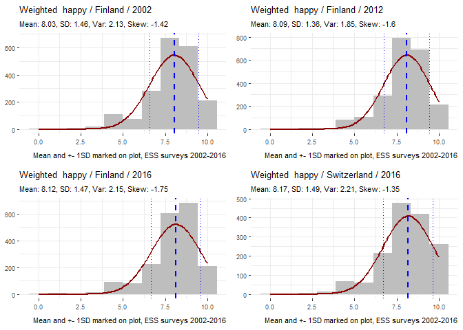

``` r
cowplot::plot_grid(
  PlotIndicatorHistogram(dataset, "Poland", 2012, "happy"),
  PlotIndicatorHistogram(dataset, "France", 2002, "happy"),
  PlotIndicatorHistogram(dataset, "France", 2012, "happy"), 
  PlotIndicatorHistogram(dataset, "France", 2014, "happy"), 
  ncol = 2)
```

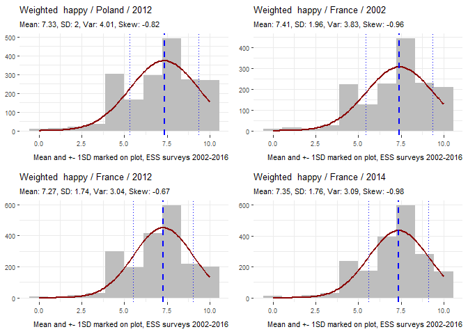

Skew can be strong, as can be seen in the histograms above..

However, the sample counts used in t-tests are quite large, as shown in Tab. 1, so the results should be fairly accurate.

### Trends on standardized scale

Previous calculation was made using the weighted absolute values reported. It is possible that there are cultural biases between countries in using the scale from zero to ten.

So, perhaps a better question is: How much has subjective happiness in a country changed when measured with respect to its own variation history.

As we have seen that the distribution of `happy` is strongly left skewed, we will make a few transformations to better handle the situation and

-   reflect the scores to get from left skewed to right skewed distributions
-   apply log transformation to dampen or remove the strong skew
-   scale scores of each country

#### Reflect and log transform

First, we check what do a few reflected and log transformed distributions look like in histograms. These are the same samples used above.

``` r
cowplot::plot_grid(
  PlotIndicatorHistogram(dataset, "Finland", 2002, "happy", 
                         use_transform = "ReflectLn"),
  PlotIndicatorHistogram(dataset, "Finland", 2012, "happy", 
                         use_transform = "ReflectLn"), 
  PlotIndicatorHistogram(dataset, "Finland", 2016, "happy", 
                         use_transform = "ReflectLn"), 
  PlotIndicatorHistogram(dataset, "Switzerland", 2016, "happy", 
                         use_transform = "ReflectLn"), 
  ncol = 2)
```


``` r
cowplot::plot_grid(
  PlotIndicatorHistogram(dataset, "Poland", 2012, "happy", 
                         use_transform = "ReflectLn"), 
  PlotIndicatorHistogram(dataset, "France", 2002, "happy", 
                         use_transform = "ReflectLn"), 
  PlotIndicatorHistogram(dataset, "France", 2012, "happy", 
                         use_transform = "ReflectLn"), 
  PlotIndicatorHistogram(dataset, "France", 2014, "happy", 
                         use_transform = "ReflectLn"), 
  ncol = 2)
```


It is clear that the distributions are more normal-like and skew reduced.

Therefore, we will transform and normalize the responses by country to be able to compare changes in a comparable scale. The assumption is that some countries may naturally wider and some smaller variations, perhaps due to cultural reasons. In essence we amplify changes in countries with narrow variation range and decrease those with wide.

``` r
# convert to "inverted ln" 
dataset$happy_invln <- NA
idx <- which(!is.na(dataset$happy))
dataset$happy_invln[idx] <- ReflectLnTransform(dataset$happy[idx])
summary(dataset[dataset$happy <=10 , c("happy_invln", "happy")])
```

    ##   happy_invln         happy       
    ##  Min.   :0.0000   Min.   : 0.000  
    ##  1st Qu.:0.6931   1st Qu.: 6.000  
    ##  Median :1.0986   Median : 8.000  
    ##  Mean   :1.1868   Mean   : 7.192  
    ##  3rd Qu.:1.6094   3rd Qu.: 9.000  
    ##  Max.   :2.3979   Max.   :10.000  
    ##  NA's   :2586     NA's   :2586

#### Scale

Next we scale the transformed scores and multiply by -1 to get back to the original meaning of the metric where smaller number means less happy and larger more.

``` r
# scale and change positive to mean increase in the original sense
dataset_scaled <- dataset %>%
  filter(!is.na(happy_invln)) %>%
  group_by(cntry_name) %>%
  mutate(happy_std = -scale(happy_invln)) %>%
  ungroup()
```

Sample of the scaled distributions

``` r
# some samples
cowplot::plot_grid(
  PlotIndicatorHistogram(dataset_scaled, "Finland", 2002, "happy_std"),
  PlotIndicatorHistogram(dataset_scaled, "Finland", 2012, "happy_std"), 
  PlotIndicatorHistogram(dataset_scaled, "Finland", 2016, "happy_std"), 
  PlotIndicatorHistogram(dataset_scaled, "Switzerland", 2016, "happy_std"), 
  ncol = 2)
```

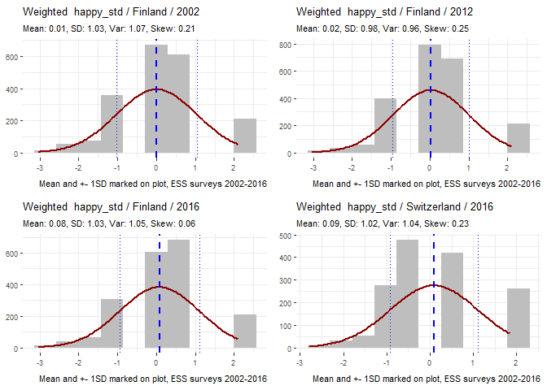

#### Trends of transformed and scaled happiness

Calculate the results from the scaled data

``` r
# filtering and weighting to get by year and by country scores
ds_happy_scaled <- dataset_scaled %>% 
  group_by(ess_year, cntry_name) %>% 
  summarise(var_ave = Hmisc::wtd.mean(happy_std, pspwght),
            n=sum(pspwght))

# plot trends
trends_happy_50_scaled  <- MakeIndicatorCountryPlot(
    ds = ds_happy_scaled %>% 
      filter(cntry_name %in% cntry_in_50pct) %>%
      mutate(explain_txt = cntry_name), 
    id_term = "var_ave",
    cntry_term = "cntry_name",
    cntry_term_long = "explain_txt",
    year_term = "ess_year",
    txt_head = "Subjective happiness",
    txt_subhead = "Scaled and normalized - Countries in 50% of surveys or more",
    txt_caption = "ESS surveys 2002-2016",
    show_summary = TRUE,
    plevel = p_val)

MyPrintInteractive(trends_happy_50_scaled$ci, plot_wo_widget, 
                   hover_css = "stroke-width:3px;") 
```

<!--html_preserve-->

<script type="application/json" data-for="htmlwidget-0a3a87ad3c291ba0ab63">{"x":{"url":"EuropeanSocialSurvey_files/figure-markdown_github//widgets/widget_unnamed-chunk-22.html","options":{"xdomain":"*","allowfullscreen":false,"lazyload":false}},"evals":[],"jsHooks":[]}</script>
<!--/html_preserve-->
Some notes

-   in the beginning and in the end the scorea are widely spread
-   there may region of smaller variation somewhere in 2008-2012
-   Portugal seems skyrocketing in the final ESS survey

Next showing changes using scaled range for the countries with significant changes according to Tab. 2

``` r
ds_happy_average_scaled <- MakeAverageSummary(
  ds = ds_happy_scaled, 
  value_term = "var_ave")

happy_res_scaled <- GetComparisonBoxPlot(
  indval_name =  "happy_std", 
  ds_avg = ds_happy_average_scaled %>% select(-n), 
  ds = dataset_scaled %>% 
    filter(!is.na(happy_invln)),
  cntry_list = cntry_in_100pct,
  skip_plot = TRUE)

p <- CreateEuroMap(dsin = happy_res_scaled$table %>%
                     filter(cntry_name %in% (happy_res$table %>%
                                               filter(p_0216 <= p_val))$cntry_name), 
                   ind_name = "d0216",
                   txt_title = "Significant change in subjective happiness",
                   txt_subtitle = "2002 vs 2016, countries in all surveys, standardized, p=0.05",
                   txt_caption = "ESS 2002-2016")
MyPrintInteractive(p, plot_wo_widget) 
```

<!--html_preserve-->

<script type="application/json" data-for="htmlwidget-e044839294723e62ea43">{"x":{"url":"EuropeanSocialSurvey_files/figure-markdown_github//widgets/widget_unnamed-chunk-23.html","options":{"xdomain":"*","allowfullscreen":false,"lazyload":false}},"evals":[],"jsHooks":[]}</script>
<!--/html_preserve-->
``` r
p <- CreateEuroMap(dsin = happy_res_scaled$table %>%
                     filter(cntry_name %in% (happy_res$table %>%
                                               filter(p_1416 <= p_val))$cntry_name), 
                   ind_name = "d1416",
                   txt_title = "Significant change in subjective happiness",
                   txt_subtitle = "2014 vs 2016, countries in all surveys, standardized, p=0.05",
                   txt_caption = "ESS 2002-2016")
MyPrintInteractive(p, plot_wo_widget) 
```

<!--html_preserve-->

<script type="application/json" data-for="htmlwidget-0bf323c66272d6ede1aa">{"x":{"url":"EuropeanSocialSurvey_files/figure-markdown_github//widgets/widget_unnamed-chunk-23.html","options":{"xdomain":"*","allowfullscreen":false,"lazyload":false}},"evals":[],"jsHooks":[]}</script>
<!--/html_preserve-->
Given that the effect size as calculated by Cohen's d has been mostly "insignificant", interpretation of the charts is a bit clouded.

Thwen again, this is not a controlled study where we try to judge if treatment A was more effective than treatment B for selecting which drug to invest in..

So, the chages are there in their level of significance as per frequentist way of work.

### Wrapup and what next

So, there are changes that are statistically significant even if their effect is small or even neglible.

We have a few hundred additional indicators in ESS dataset. Do we have anything there which has association or correlation with subjective happiness?

------------------------------------------------------------------------

Happiness and associations
--------------------------

Subjective happiness varies and has trends - sort of at least.

The next question is: are there significant associations with subjective happiness and othedr ESS variabkes

We pick a few additional indicators which - quite subjectively - seem like they could be associated with feeling of happiness. In a way or another.

Additional indicators mainly for context taken from

-   World Bank Development Indicators
-   UNHCR population data on refugees and asylum seekers
-   European Union - dates of joining

These might be used in a more formal as part of analysis way later.

Scoping to the countries which have been in 50% or more of the surveys (four or more out of the eight surveys).

And just as a reminder, it is about associations and correlations only. Not possible to go into honest discussion about causality based on the data available.

``` r
ds_subset_50 <- dataset %>% 
  filter(cntry_name %in% cntry_in_50pct)
```

### ESS indicators

Granted, whole ESS dataset contains many more and the selection made here and now has no hard scientific basis. However, they seem intuitively such which might be related to subjective happiness.

The indicators chosen

``` r
# get indicators and their descriptions from a file which is easier to maintain than
# writing the same into R-code

metadata_columns <- c("cntry_name","ess_year", "idno", "pspwght")
indicator_table <- readxl::read_excel("codemap.xlsx")
ess_indicators <- union(metadata_columns, 
                        as.character((indicator_table %>% filter(source=="ESS"))$indicator))
knitr::kable(indicator_table, caption = "ESS indicators along with their ranges")
```

| indicator | name                                                                 |  min|  max| source | lblmin                                  | lblmax                                                 |
|:----------|:---------------------------------------------------------------------|----:|----:|:-------|:----------------------------------------|:-------------------------------------------------------|
| happy     | Taking all things together, how happy would you say you are          |    0|   10| ESS    | Extremely unhappy                       | Extremely happy                                        |
| ppltrst   | Most people can be trusted or you can't be too careful               |    0|   10| ESS    | You can't be too careful                | Most people can be trusted                             |
| pplfair   | Most people try to take advantage of you, or try to be fair          |    0|   10| ESS    | Most people try to take advantage of me | Most people try to be fair                             |
| pplhlp    | Most of the time people helpful or mostly looking out for themselves |    0|   10| ESS    | People mostly look out for themselves   | People mostly try to be helpful                        |
| polintr   | How interested in politics                                           |    1|    4| ESS    | Very interested                         | Not at all interested                                  |
| trstprl   | Trust in country's parliament                                        |    0|   10| ESS    | No trust at all                         | Complete trust                                         |
| trstlgl   | Trust in the legal system                                            |    0|   10| ESS    | No trust at all                         | Complete trust                                         |
| trstplc   | Trust in the police                                                  |    0|   10| ESS    | No trust at all                         | Complete trust                                         |
| trstplt   | Trust in politicians                                                 |    0|   10| ESS    | No trust at all                         | Complete trust                                         |
| trstprt   | Trust in political parties                                           |    0|   10| ESS    | No trust at all                         | Complete trust                                         |
| trstep    | Trust in the European Parliament                                     |    0|   10| ESS    | No trust at all                         | Complete trust                                         |
| trstun    | Trust in the United Nations                                          |    0|   10| ESS    | No trust at all                         | Complete trust                                         |
| stflife   | How satisfied with life as a whole                                   |    0|   10| ESS    | Extremely dissatisfied                  | Extremely satisfied                                    |
| stfeco    | How satisfied with present state of economy in country               |    0|   10| ESS    | Extremely dissatisfied                  | Extremely satisfied                                    |
| stfgov    | How satisfied with the national government                           |    0|   10| ESS    | Extremely dissatisfied                  | Extremely satisfied                                    |
| stfdem    | How satisfied with the way democracy works in country                |    0|   10| ESS    | Extremely dissatisfied                  | Extremely satisfied                                    |
| stfedu    | State of education in country nowadays                               |    0|   10| ESS    | Extremely dissatisfied                  | Extremely satisfied                                    |
| stfhlth   | State of health services in country nowadays                         |    0|   10| ESS    | Extremely dissatisfied                  | Extremely satisfied                                    |
| eisced    | Highest level of education, ES ISCED                                 |    1|    7| ESS    | ES-ISCED I , less than lower secondary  | ES-ISCED V2, higher tertiary education, &gt;= MA level |
| health    | Subjective general health                                            |    1|    5| ESS    | Very good                               | Very bad                                               |
| euftf     | European Union: European unification go further or gone too far      |    0|   10| ESS    | Unification already gone too far        | Unification go further                                 |
| impcntr   | Allow many/few immigrants from poorer countries outside Europe       |    1|    4| ESS    | Allow many to come and live here        | Allow none                                             |
| imbgeco   | Immigration bad or good for country's economy                        |    0|   10| ESS    | Bad for the economy                     | Good for the economy                                   |
| imueclt   | Country's cultural life undermined or enriched by immigrants         |    0|   10| ESS    | Cultural life undermined                | Cultural life enriched                                 |
| imwbcnt   | Immigrants make country worse or better place to live                |    0|   10| ESS    | Worse place to live                     | Better place to live                                   |

The following might be candidates at later stage, but we will start with those above

-   `brncntr` Born in country All rounds: Were you born in \[country\]?
-   `gndr` - Gender All rounds: CODE SEX, respondent
-   `yrbrn` - Year of birth All rounds: And in what year were you born?
-   `agea` - Age of respondent, calculated All rounds: Age of respondent, calculated

``` r
ds_subset_50 <- ds_subset_50 %>%
  select(which(colnames(dataset) %in% ess_indicators))
print(dim(ds_subset_50))
```

    ## [1] 363455     29

#### Pre-processing

As with `happy` earlier, there is the need to make some adjustments to get a better usable set of data for analysis. Using min/max rules from the definition file.

``` r
# marking excluded data as NA

print("Before")
```

    ## [1] "Before"

``` r
summary(ds_subset_50[, indicator_table$indicator])
```

    ##      happy           ppltrst          pplfair           pplhlp      
    ##  Min.   : 0.000   Min.   : 0.000   Min.   : 0.000   Min.   : 0.000  
    ##  1st Qu.: 6.000   1st Qu.: 3.000   1st Qu.: 4.000   1st Qu.: 3.000  
    ##  Median : 8.000   Median : 5.000   Median : 6.000   Median : 5.000  
    ##  Mean   : 7.198   Mean   : 5.329   Mean   : 6.395   Mean   : 5.347  
    ##  3rd Qu.: 9.000   3rd Qu.: 7.000   3rd Qu.: 7.000   3rd Qu.: 7.000  
    ##  Max.   :10.000   Max.   :99.000   Max.   :99.000   Max.   :99.000  
    ##  NA's   :2437                                                       
    ##     polintr         trstprl         trstlgl          trstplc      
    ##  Min.   :1.000   Min.   : 0.00   Min.   : 0.000   Min.   : 0.000  
    ##  1st Qu.:2.000   1st Qu.: 3.00   1st Qu.: 3.000   1st Qu.: 4.000  
    ##  Median :3.000   Median : 5.00   Median : 5.000   Median : 6.000  
    ##  Mean   :2.637   Mean   : 6.68   Mean   : 7.343   Mean   : 6.977  
    ##  3rd Qu.:3.000   3rd Qu.: 6.00   3rd Qu.: 7.000   3rd Qu.: 8.000  
    ##  Max.   :9.000   Max.   :99.00   Max.   :99.000   Max.   :99.000  
    ##                                                                   
    ##     trstplt          trstprt          trstep          trstun     
    ##  Min.   : 0.000   Min.   : 0.00   Min.   : 0.00   Min.   : 0.00  
    ##  1st Qu.: 2.000   1st Qu.: 2.00   1st Qu.: 3.00   1st Qu.: 4.00  
    ##  Median : 4.000   Median : 4.00   Median : 5.00   Median : 6.00  
    ##  Mean   : 5.274   Mean   : 5.73   Mean   :14.39   Mean   :14.12  
    ##  3rd Qu.: 5.000   3rd Qu.: 5.00   3rd Qu.: 7.00   3rd Qu.: 8.00  
    ##  Max.   :99.000   Max.   :99.00   Max.   :99.00   Max.   :99.00  
    ##                   NA's   :40807                                  
    ##     stflife           stfeco           stfgov           stfdem      
    ##  Min.   : 0.000   Min.   : 0.000   Min.   : 0.000   Min.   : 0.000  
    ##  1st Qu.: 5.000   1st Qu.: 3.000   1st Qu.: 2.000   1st Qu.: 4.000  
    ##  Median : 7.000   Median : 5.000   Median : 4.000   Median : 5.000  
    ##  Mean   : 7.278   Mean   : 6.434   Mean   : 6.958   Mean   : 8.676  
    ##  3rd Qu.: 8.000   3rd Qu.: 7.000   3rd Qu.: 6.000   3rd Qu.: 7.000  
    ##  Max.   :99.000   Max.   :99.000   Max.   :99.000   Max.   :99.000  
    ##                                    NA's   :2046                     
    ##      stfedu        stfhlth          eisced           health     
    ##  Min.   : 0.0   Min.   : 0.00   Min.   : 0.000   Min.   :1.000  
    ##  1st Qu.: 4.0   1st Qu.: 3.00   1st Qu.: 1.000   1st Qu.:2.000  
    ##  Median : 6.0   Median : 5.00   Median : 3.000   Median :2.000  
    ##  Mean   : 9.8   Mean   : 6.37   Mean   : 3.391   Mean   :2.245  
    ##  3rd Qu.: 8.0   3rd Qu.: 7.00   3rd Qu.: 5.000   3rd Qu.:3.000  
    ##  Max.   :99.0   Max.   :99.00   Max.   :99.000   Max.   :9.000  
    ##                                                                 
    ##      euftf          impcntr         imbgeco          imueclt      
    ##  Min.   : 0.00   Min.   :1.000   Min.   : 0.000   Min.   : 0.000  
    ##  1st Qu.: 4.00   1st Qu.:2.000   1st Qu.: 3.000   1st Qu.: 4.000  
    ##  Median : 5.00   Median :3.000   Median : 5.000   Median : 6.000  
    ##  Mean   :13.61   Mean   :2.814   Mean   : 8.987   Mean   : 9.386  
    ##  3rd Qu.: 8.00   3rd Qu.:3.000   3rd Qu.: 7.000   3rd Qu.: 8.000  
    ##  Max.   :99.00   Max.   :9.000   Max.   :99.000   Max.   :99.000  
    ##  NA's   :91616                                                    
    ##     imwbcnt      
    ##  Min.   : 0.000  
    ##  1st Qu.: 3.000  
    ##  Median : 5.000  
    ##  Mean   : 9.054  
    ##  3rd Qu.: 7.000  
    ##  Max.   :99.000  
    ## 

``` r
for (i in 1:nrow(indicator_table)){
  an_ind <- indicator_table[i,]
  #print(an_ind$indicator)
  # print(head(ds_subset_50[,indicator_table$indicator[i]]))
  ds_subset_50[,an_ind$indicator] <- ifelse(
    ds_subset_50[,an_ind$indicator] > an_ind$max
    | ds_subset_50[,an_ind$indicator] < an_ind$min, 
    NA, 
    ds_subset_50[,an_ind$indicator])
}

print("After")
```

    ## [1] "After"

``` r
summary(ds_subset_50[, indicator_table$indicator])
```

    ##      happy           ppltrst          pplfair           pplhlp      
    ##  Min.   : 0.000   Min.   : 0.000   Min.   : 0.000   Min.   : 0.000  
    ##  1st Qu.: 6.000   1st Qu.: 3.000   1st Qu.: 4.000   1st Qu.: 3.000  
    ##  Median : 8.000   Median : 5.000   Median : 6.000   Median : 5.000  
    ##  Mean   : 7.198   Mean   : 5.012   Mean   : 5.587   Mean   : 4.875  
    ##  3rd Qu.: 9.000   3rd Qu.: 7.000   3rd Qu.: 7.000   3rd Qu.: 7.000  
    ##  Max.   :10.000   Max.   :10.000   Max.   :10.000   Max.   :10.000  
    ##  NA's   :2437     NA's   :1378     NA's   :3548     NA's   :2038    
    ##     polintr         trstprl          trstlgl          trstplc      
    ##  Min.   :1.000   Min.   : 0.000   Min.   : 0.000   Min.   : 0.000  
    ##  1st Qu.:2.000   1st Qu.: 2.000   1st Qu.: 3.000   1st Qu.: 4.000  
    ##  Median :3.000   Median : 5.000   Median : 5.000   Median : 6.000  
    ##  Mean   :2.619   Mean   : 4.349   Mean   : 5.064   Mean   : 5.884  
    ##  3rd Qu.:3.000   3rd Qu.: 6.000   3rd Qu.: 7.000   3rd Qu.: 8.000  
    ##  Max.   :4.000   Max.   :10.000   Max.   :10.000   Max.   :10.000  
    ##  NA's   :1173    NA's   :10146    NA's   :9987     NA's   :4831    
    ##     trstplt          trstprt          trstep          trstun     
    ##  Min.   : 0.000   Min.   : 0.00   Min.   : 0.00   Min.   : 0.00  
    ##  1st Qu.: 2.000   1st Qu.: 2.00   1st Qu.: 3.00   1st Qu.: 3.00  
    ##  Median : 3.000   Median : 3.00   Median : 5.00   Median : 5.00  
    ##  Mean   : 3.495   Mean   : 3.45   Mean   : 4.41   Mean   : 5.12  
    ##  3rd Qu.: 5.000   3rd Qu.: 5.00   3rd Qu.: 6.00   3rd Qu.: 7.00  
    ##  Max.   :10.000   Max.   :10.00   Max.   :10.00   Max.   :10.00  
    ##  NA's   :7641     NA's   :49501   NA's   :43400   NA's   :39475  
    ##     stflife           stfeco           stfgov           stfdem     
    ##  Min.   : 0.000   Min.   : 0.000   Min.   : 0.000   Min.   : 0.00  
    ##  1st Qu.: 5.000   1st Qu.: 3.000   1st Qu.: 2.000   1st Qu.: 3.00  
    ##  Median : 7.000   Median : 5.000   Median : 4.000   Median : 5.00  
    ##  Mean   : 6.851   Mean   : 4.432   Mean   : 4.171   Mean   : 5.17  
    ##  3rd Qu.: 8.000   3rd Qu.: 6.000   3rd Qu.: 6.000   3rd Qu.: 7.00  
    ##  Max.   :10.000   Max.   :10.000   Max.   :10.000   Max.   :10.00  
    ##  NA's   :1924     NA's   :8710     NA's   :14107    NA's   :15411  
    ##      stfedu          stfhlth           eisced          health     
    ##  Min.   : 0.000   Min.   : 0.000   Min.   :1.0     Min.   :1.000  
    ##  1st Qu.: 4.000   1st Qu.: 3.000   1st Qu.:2.0     1st Qu.:2.000  
    ##  Median : 6.000   Median : 5.000   Median :4.0     Median :2.000  
    ##  Mean   : 5.531   Mean   : 5.243   Mean   :3.8     Mean   :2.236  
    ##  3rd Qu.: 7.000   3rd Qu.: 7.000   3rd Qu.:5.0     3rd Qu.:3.000  
    ##  Max.   :10.000   Max.   :10.000   Max.   :7.0     Max.   :5.000  
    ##  NA's   :18733    NA's   :4856     NA's   :72220   NA's   :527    
    ##      euftf           impcntr         imbgeco          imueclt      
    ##  Min.   : 0.00    Min.   :1.000   Min.   : 0.000   Min.   : 0.000  
    ##  1st Qu.: 3.00    1st Qu.:2.000   1st Qu.: 3.000   1st Qu.: 4.000  
    ##  Median : 5.00    Median :3.000   Median : 5.000   Median : 5.000  
    ##  Mean   : 5.12    Mean   :2.592   Mean   : 4.844   Mean   : 5.458  
    ##  3rd Qu.: 7.00    3rd Qu.:3.000   3rd Qu.: 7.000   3rd Qu.: 7.000  
    ##  Max.   :10.00    Max.   :4.000   Max.   :10.000   Max.   :10.000  
    ##  NA's   :119493   NA's   :15057   NA's   :18111    NA's   :17292   
    ##     imwbcnt      
    ##  Min.   : 0.000  
    ##  1st Qu.: 3.000  
    ##  Median : 5.000  
    ##  Mean   : 4.812  
    ##  3rd Qu.: 6.000  
    ##  Max.   :10.000  
    ##  NA's   :18536

### Shape of distributions

Showing the shape of all indicators, excluding metadata columns to help understand the data better.

``` r
GetMinMaxLabel <- function(ind_name, indicator_table){
  this_ind <- indicator_table %>% filter(indicator==ind_name)
  if (!is.na(this_ind$lblmin)){
    minmax_label <- paste(this_ind$lblmin, this_ind$min, 
                         '<-->', 
                         this_ind$lblmax, this_ind$max)
  }else {
    minmax_label <- ""
  }
  #print(minmax_label)
  return(minmax_label)
}

ind_plots <- lapply(
  setdiff(colnames(ds_subset_50), metadata_columns), 
  function(x, ds){
    ds$tmp_filter <- ds[,x]
    PlotIndicatorHistogram(ds %>% 
                             filter(!is.na(tmp_filter)), 
                           "", 
                           NA, 
                           x, 
                           n_bins = as.integer(max(ds$tmp_filter, na.rm = TRUE)))
  }, 
  ds=ds_subset_50)

# no need to make these plots interactive - print as they are
for (i in 1:length(ind_plots))
  print(ind_plots[[i]])
```

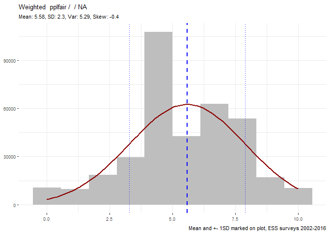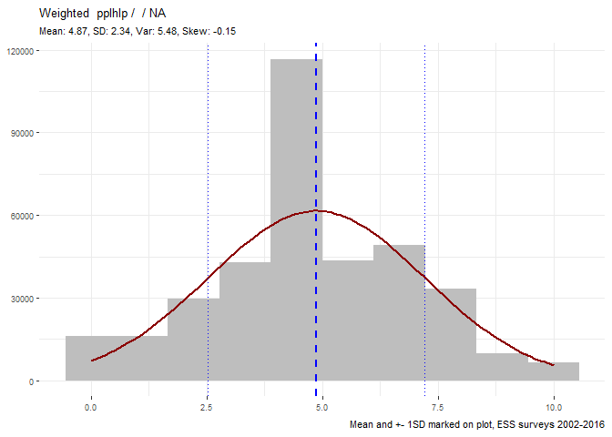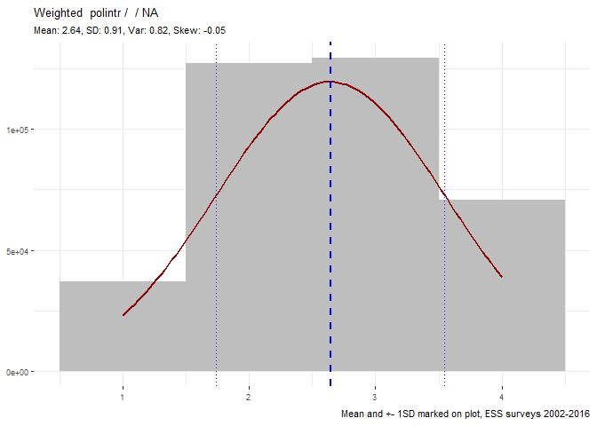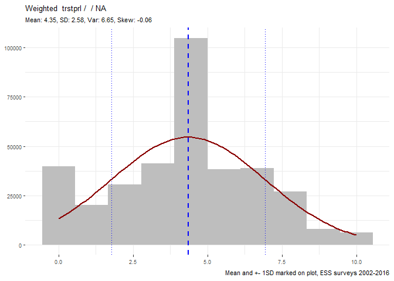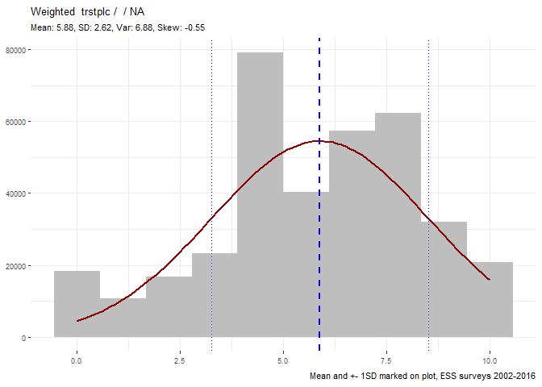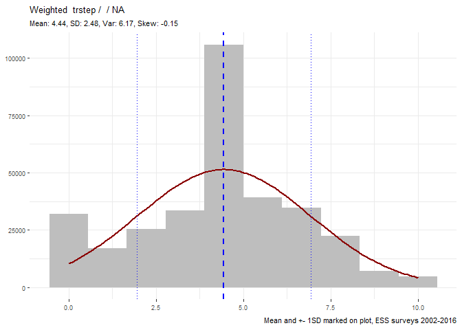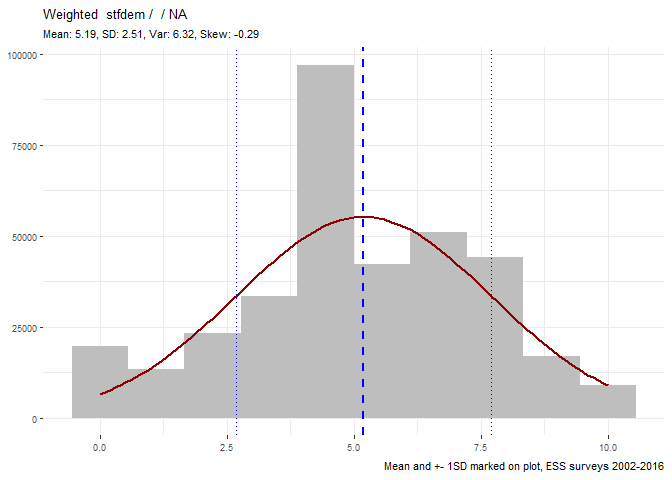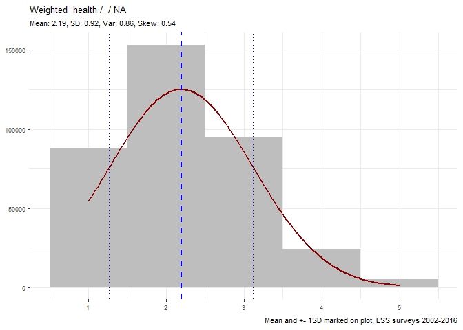

Mostly the distributions at this level do not seem significantly skewed.

Concern: This could be an effect from averaging over all data and could hide potential time-dependent or country-dependent skew impacting later analysis. However, at this stage we will assume that there are no issues that would require making elaborate transformations like what we experimented with in the first analysis of `happy` earlier. Perhaps later.

### Weights

Next we apply post stratification weights for the selected indicators to get meaningful averages.

``` r
ds_subset_50_ave <- ds_subset_50 %>%
  gather(indicator, value, indicator_table$indicator) %>%
  filter(!is.na(value)) %>%
  group_by(cntry_name, ess_year, indicator) %>% 
  summarise(ave = Hmisc::wtd.mean(value, pspwght)) %>%
  spread(indicator, ave) %>%
  ungroup()
```

### Missing values

Checking the indicators.

``` r
summary(ds_subset_50_ave %>% select(-cntry_name, -ess_year))
```

    ##      eisced          euftf           happy           health     
    ##  Min.   :2.272   Min.   :3.818   Min.   :5.405   Min.   :1.685  
    ##  1st Qu.:3.449   1st Qu.:4.716   1st Qu.:6.825   1st Qu.:1.972  
    ##  Median :3.645   Median :5.129   Median :7.396   Median :2.186  
    ##  Mean   :3.681   Mean   :5.190   Mean   :7.272   Mean   :2.193  
    ##  3rd Qu.:3.926   3rd Qu.:5.611   3rd Qu.:7.819   3rd Qu.:2.370  
    ##  Max.   :5.034   Max.   :7.332   Max.   :8.366   Max.   :2.915  
    ##  NA's   :36      NA's   :47                                     
    ##     imbgeco         impcntr         imueclt         imwbcnt     
    ##  Min.   :3.017   Min.   :1.763   Min.   :3.150   Min.   :2.814  
    ##  1st Qu.:4.443   1st Qu.:2.374   1st Qu.:5.023   1st Qu.:4.395  
    ##  Median :4.893   Median :2.550   Median :5.571   Median :4.788  
    ##  Mean   :4.842   Mean   :2.576   Mean   :5.462   Mean   :4.836  
    ##  3rd Qu.:5.328   3rd Qu.:2.759   3rd Qu.:6.007   3rd Qu.:5.395  
    ##  Max.   :6.170   Max.   :3.558   Max.   :7.322   Max.   :6.617  
    ##                                                                 
    ##     polintr         pplfair          pplhlp         ppltrst     
    ##  Min.   :2.158   Min.   :3.666   Min.   :2.998   Min.   :3.329  
    ##  1st Qu.:2.451   1st Qu.:4.941   1st Qu.:4.228   1st Qu.:4.289  
    ##  Median :2.673   Median :5.563   Median :4.760   Median :4.968  
    ##  Mean   :2.644   Mean   :5.582   Mean   :4.859   Mean   :5.015  
    ##  3rd Qu.:2.790   3rd Qu.:6.157   3rd Qu.:5.660   3rd Qu.:5.666  
    ##  Max.   :3.148   Max.   :7.285   Max.   :6.984   Max.   :6.916  
    ##                                                                 
    ##      stfdem          stfeco          stfedu          stfgov     
    ##  Min.   :2.434   Min.   :1.368   Min.   :3.126   Min.   :1.553  
    ##  1st Qu.:4.449   1st Qu.:3.476   1st Qu.:4.917   1st Qu.:3.525  
    ##  Median :5.075   Median :4.452   Median :5.520   Median :4.251  
    ##  Mean   :5.196   Mean   :4.484   Mean   :5.581   Mean   :4.212  
    ##  3rd Qu.:6.059   3rd Qu.:5.367   3rd Qu.:6.267   3rd Qu.:4.945  
    ##  Max.   :7.423   Max.   :7.937   Max.   :8.029   Max.   :6.580  
    ##                                                  NA's   :1      
    ##     stfhlth         stflife          trstep         trstlgl     
    ##  Min.   :2.482   Min.   :4.223   Min.   :2.587   Min.   :1.898  
    ##  1st Qu.:4.157   1st Qu.:6.386   1st Qu.:4.039   1st Qu.:4.189  
    ##  Median :5.397   Median :7.042   Median :4.579   Median :5.076  
    ##  Mean   :5.286   Mean   :6.916   Mean   :4.477   Mean   :5.062  
    ##  3rd Qu.:6.302   3rd Qu.:7.664   3rd Qu.:4.904   3rd Qu.:5.992  
    ##  Max.   :7.667   Max.   :8.552   Max.   :5.963   Max.   :7.595  
    ##                                                                 
    ##     trstplc         trstplt         trstprl         trstprt     
    ##  Min.   :2.035   Min.   :1.390   Min.   :1.671   Min.   :1.404  
    ##  1st Qu.:5.104   1st Qu.:2.770   1st Qu.:3.594   1st Qu.:2.712  
    ##  Median :6.062   Median :3.471   Median :4.367   Median :3.383  
    ##  Mean   :5.885   Mean   :3.517   Mean   :4.381   Mean   :3.490  
    ##  3rd Qu.:6.647   3rd Qu.:4.288   3rd Qu.:5.272   3rd Qu.:4.299  
    ##  Max.   :8.199   Max.   :5.532   Max.   :6.690   Max.   :5.597  
    ##                                                  NA's   :21     
    ##      trstun     
    ##  Min.   :2.596  
    ##  1st Qu.:4.711  
    ##  Median :5.100  
    ##  Mean   :5.159  
    ##  3rd Qu.:5.549  
    ##  Max.   :6.859  
    ## 

``` r
NA_columns <- ds_subset_50_ave %>% 
  select_if(function(x) any(is.na(x))) %>% 
  summarise_all(funs(sum(is.na(.)))) 
knitr::kable(NA_columns, caption = "Columns with NA entries")
```

|  eisced|  euftf|  stfgov|  trstprt|
|-------:|------:|-------:|--------:|
|      36|     47|       1|       21|

``` r
txt_NA <- paste(colnames(NA_columns), collapse=", ")
```

Indicators eisced, euftf, stfgov, trstprt have some missing values. We will create new indicators where we fill in missing values by interpolation and/or use the first / last real value for missing beginning / end values.

Naturally, these are not the real thing anymore but should be close enough for this analysis.

``` r
# special case for Greece which has only one entry for eisced (education level)

Greece_eisced2 <- ds_subset_50_ave %>% 
  filter(cntry_name == "Greece", !is.na(eisced)) %>% 
  select(eisced)
if (nrow(Greece_eisced2) != 1) stop("Greece eisced assumption not valid")

# using zoo package to impute missing values

ds_subset_50_ave <- ds_subset_50_ave %>% 
  group_by(cntry_name) %>% 
  mutate(
    eisced2 = ifelse(cntry_name == "Greece",
                     as.numeric(Greece_eisced2$eisced[1]),
                     zoo::na.fill(eisced, "extend")),
    trstprt2 = zoo::na.fill(trstprt, "extend"),
    stfgov2 = zoo::na.fill(stfgov, "extend"),
    euftf2 = zoo::na.fill(euftf, "extend")) %>% 
  ungroup()

# Diagnostic to show what values were before/after imputation
# but as the table is fairly long, commented out now
# 
# cntry_imputed <- (ds_subset_50_ave %>% 
#                     filter(!complete.cases(.)) %>% 
#                     select(cntry_name) %>% 
#                     filter(!duplicated(cntry_name)))$cntry_name
# knitr::kable(ds_subset_50_ave %>% 
#                filter(cntry_name %in% cntry_imputed) %>%
#                select(cntry_name, ess_year, eisced, eisced2, trstprt, trstprt2, 
#                       stfgov, stfgov2, euftf, euftf2),
#              digits = 3,
#              caption = "Table of original and imputed values")

# removing the originals from the dataframe as they are not needed in the 
# subsequent work

ds_subset_50_ave <- ds_subset_50_ave %>%
  select(-eisced, -trstprt, -stfgov, -euftf)
```

#### Get rid of collinear variables

Since we intend to come up with a model we must remove indicators that are essentially the same, i.e. indicators which have too high correlation and would really not add to the model and would be in conflict with the requirements of linear modeling we aim to do.

``` r
coll_cutoff <- 0.9
print(paste("Cutoff level for correlation", coll_cutoff))
```

    ## [1] "Cutoff level for correlation 0.9"

``` r
# exclude metadata indicators

df1 = ds_subset_50_ave %>% select(-ess_year, -cntry_name)
df2 = cor(df1)

# findCorrelation searches through a correlation matrix and returns a vector of 
# integers corresponding to columns to remove to reduce pair-wise correlations.

hc = caret::findCorrelation(
  df2, 
  cutoff=coll_cutoff, 
  verbose = TRUE,     # verbose helps to understand better what happens
  names = FALSE)
```

    ## Compare row 11  and column  23 with corr  0.905 
    ##   Means:  0.673 vs 0.535 so flagging column 11 
    ## Compare row 23  and column  19 with corr  0.987 
    ##   Means:  0.663 vs 0.523 so flagging column 23 
    ## Compare row 8  and column  10 with corr  0.933 
    ##   Means:  0.656 vs 0.51 so flagging column 8 
    ## Compare row 19  and column  20 with corr  0.951 
    ##   Means:  0.635 vs 0.497 so flagging column 19 
    ## Compare row 20  and column  17 with corr  0.914 
    ##   Means:  0.617 vs 0.484 so flagging column 20 
    ## Compare row 10  and column  9 with corr  0.909 
    ##   Means:  0.617 vs 0.47 so flagging column 10 
    ## Compare row 15  and column  1 with corr  0.967 
    ##   Means:  0.601 vs 0.453 so flagging column 15 
    ## All correlations <= 0.9

``` r
hc = sort(hc)

# summary
keep_table <- data.frame(
  rownr = 1:dim(df1)[2], 
  indicator = colnames(df1),
  keep = ifelse((1:dim(df1)[2]) %in% hc, 
                "drop", 
                "keep"),
  name = sapply(colnames(df1), function(x) GetIndicator(x, indicator_table)$name)
)

knitr::kable(keep_table, caption = "Features")
```

|          |  rownr| indicator | keep | name                                                                 |
|----------|------:|:----------|:-----|:---------------------------------------------------------------------|
| happy    |      1| happy     | keep | Taking all things together, how happy would you say you are          |
| health   |      2| health    | keep | Subjective general health                                            |
| imbgeco  |      3| imbgeco   | keep | Immigration bad or good for country's economy                        |
| impcntr  |      4| impcntr   | keep | Allow many/few immigrants from poorer countries outside Europe       |
| imueclt  |      5| imueclt   | keep | Country's cultural life undermined or enriched by immigrants         |
| imwbcnt  |      6| imwbcnt   | keep | Immigrants make country worse or better place to live                |
| polintr  |      7| polintr   | keep | How interested in politics                                           |
| pplfair  |      8| pplfair   | drop | Most people try to take advantage of you, or try to be fair          |
| pplhlp   |      9| pplhlp    | keep | Most of the time people helpful or mostly looking out for themselves |
| ppltrst  |     10| ppltrst   | drop | Most people can be trusted or you can't be too careful               |
| stfdem   |     11| stfdem    | drop | How satisfied with the way democracy works in country                |
| stfeco   |     12| stfeco    | keep | How satisfied with present state of economy in country               |
| stfedu   |     13| stfedu    | keep | State of education in country nowadays                               |
| stfhlth  |     14| stfhlth   | keep | State of health services in country nowadays                         |
| stflife  |     15| stflife   | drop | How satisfied with life as a whole                                   |
| trstep   |     16| trstep    | keep | Trust in the European Parliament                                     |
| trstlgl  |     17| trstlgl   | keep | Trust in the legal system                                            |
| trstplc  |     18| trstplc   | keep | Trust in the police                                                  |
| trstplt  |     19| trstplt   | drop | Trust in politicians                                                 |
| trstprl  |     20| trstprl   | drop | Trust in country's parliament                                        |
| trstun   |     21| trstun    | keep | Trust in the United Nations                                          |
| eisced2  |     22| eisced2   | keep | Highest level of education, ES ISCED                                 |
| trstprt2 |     23| trstprt2  | drop | Trust in political parties                                           |
| stfgov2  |     24| stfgov2   | keep | How satisfied with the national government                           |
| euftf2   |     25| euftf2    | keep | European Union: European unification go further or gone too far      |

``` r
# the reduced data
reduced_Data = df1[,-c(hc)]

colnames_keep <- union(colnames(reduced_Data),c("ess_year","cntry_name"))
ds_subset_50_ave <- ds_subset_50_ave %>% select(colnames_keep)
```

#### Reshape

Turn dataset into narrow format for flexibility

``` r
ds_ss_avg  <- ds_subset_50_ave %>% 
  gather(indicator, value, which(colnames(ds_subset_50_ave) %in% colnames(reduced_Data)))
print(dim(ds_ss_avg))
```

    ## [1] 3366    4

### World Bank

World Bank Development Indices provide a good backdrop and context for ESS.

Selecting a few which appear like they could be relevant in this context, which suggests indicators related to migration, refugees and economical situation.

Again, this is fairly subjective selection and something important may be missing.

Since the countries differ in size - and therefore the indicators as well - we use percentages and ratios when possible.

``` r
wb_data <- GetPreProcessWbData(
  read_rds = TRUE, 
  inc_countries = unique(ds_ss_avg$cntry_name), 
  min_year = min(dataset$ess_year), 
  max_year = max(dataset$ess_year))
```

    ## Joining, by = "indicator"

``` r
# merge 

ds_ss_avg <- ds_ss_avg %>%
  bind_rows(wb_data$data %>% 
              select(ess_year, cntry_name, indicator, value))

# add definitions
indicator_table <- indicator_table %>%
  bind_rows(wb_data$indicators)

knitr::kable(indicator_table %>% filter(source=="WB"), digits = 3)
```

| indicator            | name                                                                                          |            min|           max| source | lblmin | lblmax |
|:---------------------|:----------------------------------------------------------------------------------------------|--------------:|-------------:|:-------|:-------|:-------|
| BX.TRF.PWKR.DT.GD.ZS | Personal remittances, received (% of GDP)                                                     |   7.000000e-02|  8.154000e+00| WB     | NA     | NA     |
| GC.TAX.TOTL.GD.ZS    | Tax revenue (% of GDP)                                                                        |   1.230000e+00|  4.834400e+01| WB     | NA     | NA     |
| IT.NET.USER.ZS       | Individuals using the Internet (% of population)                                              |   1.874000e+00|  9.729800e+01| WB     | NA     | NA     |
| NY.GDP.MKTP.KD       | GDP (constant 2010 US$)                                                                       |   1.592704e+10|  3.781699e+12| WB     | NA     | NA     |
| NY.GDP.MKTP.KD.ZG    | GDP growth (annual %)                                                                         |  -1.481400e+01|  2.555700e+01| WB     | NA     | NA     |
| NY.GDP.PCAP.KD       | GDP per capita (constant 2010 US$)                                                            |   2.130659e+03|  9.161728e+04| WB     | NA     | NA     |
| NY.GDP.PCAP.KD.ZG    | GDP per capita growth (annual %)                                                              |  -1.456000e+01|  2.476500e+01| WB     | NA     | NA     |
| REFG.PCT             | Refugees (% of population) - calculated                                                       |   0.000000e+00|  2.319000e+00| WB     | NA     | NA     |
| SE.XPD.TOTL.GD.ZS    | Government expenditure on education, total (% of GDP)                                         |   2.326000e+00|  8.560000e+00| WB     | NA     | NA     |
| SH.XPD.GHED.GD.ZS    | Domestic general government health expenditure (% of GDP)                                     |   0.000000e+00|  9.420000e+00| WB     | NA     | NA     |
| SL.TLF.CACT.ZS       | Labor force participation rate, total (% of total population ages 15+) (modeled ILO estimate) |   4.785300e+01|  6.856500e+01| WB     | NA     | NA     |
| SM.POP.REFG          | Refugee population by country or territory of asylum                                          |   5.000000e+00|  9.800000e+05| WB     | NA     | NA     |
| SM.POP.TOTL.ZS       | International migrant stock (% of population)                                                 |   7.950000e-01|  2.938700e+01| WB     | NA     | NA     |
| SP.POP.TOTL          | Population, total                                                                             |   9.769660e+05|  1.453060e+08| WB     | NA     | NA     |
| SP.RUR.TOTL.ZS       | Rural population (% of total population)                                                      |   2.103000e+00|  5.037300e+01| WB     | NA     | NA     |
| SP.URB.TOTL.IN.ZS    | Urban population (% of total)                                                                 |   4.962700e+01|  9.789700e+01| WB     | NA     | NA     |

For clarity

-   International migrant stock above means people who have been born in another country
-   Refugees are different group of people than e.g. asylum seekers, which are not in World Bank dataset at all

For asylum seekers we need to turn to UNHCR

### UNHCR

Given that refugees and asylum seekers have been an important factor in the 2000s Europe we need to get more data, which is available at UNHCR at [UNHCR Population Statistics - time series](http://popstats.unhcr.org/en/time_series)

Since World Bank and UNHCR data are not necessarily in full synch the numbers on refugees, which is available from both sources, is expected to be not exactly the same.

Therefore we take refugees from World Bank and other "people of concern" groups from UNHCR

But first, we check what is in that UNHCR people of concern classification and how it has changed over 2000s.

``` r
# take data from beginning of ess surveys

ds_unhcr <- GetUnhcrData(
  data_folder = my_data_folder, 
  inc_countries = unique(ds_ss_avg$cntry_name), 
  min_year = min(dataset$ess_year), 
  max_year = max(dataset$ess_year), 
  read_rds = TRUE)

p <- ggplot(data= ds_unhcr, 
            aes(x=ess_year, y=value, fill=pop_type, color=pop_type)) +
  geom_bar_interactive(stat="identity", 
                       aes(tooltip=paste(ess_year, pop_type))) +
  labs(title="People of concern in Europe",
       subtitle="Countries participating in ESS",
       caption="UNHCR") +
  xlab("") + ylab("")
MyPrintInteractive(p, plot_wo_widget)
```

<!--html_preserve-->

<script type="application/json" data-for="htmlwidget-77178797a2f788123470">{"x":{"url":"EuropeanSocialSurvey_files/figure-markdown_github//widgets/widget_get_unhcr_data.html","options":{"xdomain":"*","allowfullscreen":false,"lazyload":false}},"evals":[],"jsHooks":[]}</script>
<!--/html_preserve-->
So, a downwarsd trend turned into a sharp rise 2014 as - some might say - a thing hit the fan..

Some insigt - perhaps - from two snapshots, i.e. 2013 and 2016.

``` r
p <- ggplot(data= ds_unhcr %>% filter(ess_year==2013), 
       aes(x=reorder(cntry_name, -value), y=value, fill=pop_type)) +
  geom_bar_interactive(stat="identity", 
                       aes(tooltip=paste(cntry_name,'-', pop_type))) +
  labs(title="People of concern in Europe 2013",
       subtitle="Countries participating in ESS",
       caption="UNHCR") +
  xlab("") + ylab("") + 
  theme(axis.text.x = element_text(angle = 90, hjust = 1, vjust=0.5))
MyPrintInteractive(p, plot_wo_widget)
```

<!--html_preserve-->

<script type="application/json" data-for="htmlwidget-e7569e7cef0852a9b858">{"x":{"url":"EuropeanSocialSurvey_files/figure-markdown_github//widgets/widget_unnamed-chunk-31.html","options":{"xdomain":"*","allowfullscreen":false,"lazyload":false}},"evals":[],"jsHooks":[]}</script>
<!--/html_preserve-->
``` r
p <- ggplot(data= ds_unhcr %>% filter(ess_year==2016), 
       aes(x=reorder(cntry_name, -value), y=value, fill=pop_type)) +
  geom_bar_interactive(stat="identity", 
                       aes(tooltip=paste(cntry_name, '-', pop_type))) +
  labs(title="People of concern in Europe 2016",
       subtitle="Countries participating in ESS",
       caption="UNHCR") +
  xlab("") + ylab("") + 
  theme(axis.text.x = element_text(angle = 90, hjust = 1, vjust=0.5))
MyPrintInteractive(p, plot_wo_widget)
```

<!--html_preserve-->

<script type="application/json" data-for="htmlwidget-7a8999aee1f29aa92c0e">{"x":{"url":"EuropeanSocialSurvey_files/figure-markdown_github//widgets/widget_unnamed-chunk-31.html","options":{"xdomain":"*","allowfullscreen":false,"lazyload":false}},"evals":[],"jsHooks":[]}</script>
<!--/html_preserve-->
Huge increase in "internally displaced persons" in Ukraine - yes, there was and still is that crisis regarding Crimea

Trying log10 scaler for y-axiz to get better view.

``` r
p <- ggplot(data= ds_unhcr %>% filter(ess_year==2016), 
       aes(x=reorder(cntry_name, -value), y=(value+1), fill=pop_type)) +
  geom_bar_interactive(stat="identity", 
                       aes(tooltip=paste(cntry_name, '-', pop_type))) +
  labs(title="People of concern in Europe 2016",
       subtitle="Countries participating in ESS - log10 scale",
       caption="UNHCR") +
  xlab("") + ylab("") + 
  scale_y_log10() +
  theme(axis.text.x = element_text(angle = 90, hjust = 1, vjust=0.5))
MyPrintInteractive(p, plot_wo_widget)
```

<!--html_preserve-->

<script type="application/json" data-for="htmlwidget-a32b3ecdda9f31a09006">{"x":{"url":"EuropeanSocialSurvey_files/figure-markdown_github//widgets/widget_unnamed-chunk-32.html","options":{"xdomain":"*","allowfullscreen":false,"lazyload":false}},"evals":[],"jsHooks":[]}</script>
<!--/html_preserve-->
``` r
# top 4 and all others

top_pop_types <- as.character((ds_unhcr %>% 
  group_by(pop_type) %>% 
  summarise(n = sum(value)) %>% 
  arrange(-n))$pop_type)

pop_type_major <- top_pop_types[1:4]
pop_type_other <- setdiff(top_pop_types, pop_type_major)

GetPplOfConcernSubset <- function(ds_unhr, wb_data, pop_set, new_indicator, new_name) {
  
  the_indicator <- paste0(
      "UNHCR.",
      ifelse(new_indicator=="", substr(pop_set[1], 1, 7), new_indicator),
      ".PCT")
  the_name = paste0(
      ifelse(new_name == "", pop_set[1], new_name), 
             "(% of population) - calculated")
  
  # print(pop_set)
  # print(the_indicator)
  # print(the_name)
  
  ds <- GetPreProcessUnhcrData(
    ds_unhcr = ds_unhcr %>%
      filter(pop_type %in% pop_set) %>%
      group_by(indicator, name, source, ess_year, cntry_name) %>%
      summarise(value = sum(value)) %>%
      ungroup(),
    ds_wb = wb_data$data,
    new_indicator = the_indicator,
    new_name = the_name)
  return(ds)  
}

unhcr_data <- NULL
unhcr_indicator_table <- NULL

for (pop_type in pop_type_major){
  ds_pop <- GetPplOfConcernSubset(ds_unhr, wb_data, pop_type, new_indicator="", new_name="")
  unhcr_data <- unhcr_data %>% bind_rows(ds_pop$data)
  unhcr_indicator_table <- unhcr_indicator_table %>% bind_rows(ds_pop$indicators)
}

ds_pop <- GetPplOfConcernSubset(ds_unhr, wb_data, pop_type_other, 
                                new_indicator="Other", 
                                new_name="Other population types together")
unhcr_data <- unhcr_data %>%
  bind_rows(ds_pop$data)
unhcr_indicator_table <- unhcr_indicator_table %>%
  bind_rows(ds_pop$indicators)


p <- ggplot(data=unhcr_data %>% filter(ess_year==2016), 
       aes(x=reorder(cntry_name, -value), y=value+1, fill=indicator)) +
  geom_bar_interactive(stat="identity", 
                       aes(tooltip=paste(cntry_name, '-', pop_type))) +
  labs(title="People of concern in Europe 2016",
       subtitle="% of population, log10 scale yaxis showing 1% more than real",
       caption="UNHCR") +
  xlab("") + ylab("") + 
  scale_y_log10() +
  theme(axis.text.x = element_text(angle = 90, hjust = 1, vjust=0.5))
MyPrintInteractive(p, plot_wo_widget)
```

<!--html_preserve-->

<script type="application/json" data-for="htmlwidget-55ab51d0528f0e638271">{"x":{"url":"EuropeanSocialSurvey_files/figure-markdown_github//widgets/widget_unnamed-chunk-33.html","options":{"xdomain":"*","allowfullscreen":false,"lazyload":false}},"evals":[],"jsHooks":[]}</script>
<!--/html_preserve-->
``` r
# merge data
ds_ss_avg <- ds_ss_avg %>%
  bind_rows(unhcr_data %>% 
              select(ess_year, cntry_name, indicator, value))

# merge definitions
indicator_table <- indicator_table %>%
  bind_rows(unhcr_indicator_table)

knitr::kable(indicator_table %>% filter(source=="UNHCR"), digits = 3)
```

| indicator         | name                                                                   |  min|     max| source | lblmin | lblmax |
|:------------------|:-----------------------------------------------------------------------|----:|-------:|:-------|:-------|:-------|
| UNHCR.Refugee.PCT | Refugees (incl. refugee-like situations)(% of population) - calculated |    0|   2.319| UNHCR  | NA     | NA     |
| UNHCR.Asylum-.PCT | Asylum-seekers(% of population) - calculated                           |    0|   1.603| UNHCR  | NA     | NA     |
| UNHCR.Interna.PCT | Internally displaced persons(% of population) - calculated             |    0|   4.000| UNHCR  | NA     | NA     |
| UNHCR.Statele.PCT | Stateless(% of population) - calculated                                |    0|  11.048| UNHCR  | NA     | NA     |
| UNHCR.Other.PCT   | Other population types together(% of population) - calculated          |    0|   6.276| UNHCR  | NA     | NA     |

Cross check with World Bank data

``` r
# check WB vs UNHCR data

p <- ggplot(data = ds_ss_avg %>% 
         filter(indicator %in% c("UNHCR.Refugee.PCT","REFG.PCT"),
                ess_year==2016),
       aes(x=reorder(cntry_name, -value), y=value, fill=indicator)) +
  geom_bar_interactive(stat = "identity", position = "dodge", aes(tooltip=paste(cntry_name, indicator, round(value,2)))) +
  theme(axis.text.x = element_text(angle = 90, hjust = 1, vjust=0.5)) + 
  xlab("") + ylab("")

MyPrintInteractive(p, plot_wo_widget)
```

<!--html_preserve-->

<script type="application/json" data-for="htmlwidget-07242ae959ad587c411a">{"x":{"url":"EuropeanSocialSurvey_files/figure-markdown_github//widgets/widget_unnamed-chunk-34.html","options":{"xdomain":"*","allowfullscreen":false,"lazyload":false}},"evals":[],"jsHooks":[]}</script>
<!--/html_preserve-->
Looks good and reassuring.

### Pct indicators

There are big variations in the sizes of countries included. Therefore looking into percentages is often more informative than absolute figures.

The following are indicators on percentages in World Bankand UNHCR data - or derived from them.

``` r
idx_pct <- grepl("%", indicator_table$name, fixed =TRUE)
pct_indicators <- indicator_table$indicator[idx_pct]
knitr::kable(indicator_table[idx_pct,], digits = 3)
```

| indicator            | name                                                                                          |      min|     max| source | lblmin | lblmax |
|:---------------------|:----------------------------------------------------------------------------------------------|--------:|-------:|:-------|:-------|:-------|
| BX.TRF.PWKR.DT.GD.ZS | Personal remittances, received (% of GDP)                                                     |    0.070|   8.154| WB     | NA     | NA     |
| GC.TAX.TOTL.GD.ZS    | Tax revenue (% of GDP)                                                                        |    1.230|  48.344| WB     | NA     | NA     |
| IT.NET.USER.ZS       | Individuals using the Internet (% of population)                                              |    1.874|  97.298| WB     | NA     | NA     |
| NY.GDP.MKTP.KD.ZG    | GDP growth (annual %)                                                                         |  -14.814|  25.557| WB     | NA     | NA     |
| NY.GDP.PCAP.KD.ZG    | GDP per capita growth (annual %)                                                              |  -14.560|  24.765| WB     | NA     | NA     |
| REFG.PCT             | Refugees (% of population) - calculated                                                       |    0.000|   2.319| WB     | NA     | NA     |
| SE.XPD.TOTL.GD.ZS    | Government expenditure on education, total (% of GDP)                                         |    2.326|   8.560| WB     | NA     | NA     |
| SH.XPD.GHED.GD.ZS    | Domestic general government health expenditure (% of GDP)                                     |    0.000|   9.420| WB     | NA     | NA     |
| SL.TLF.CACT.ZS       | Labor force participation rate, total (% of total population ages 15+) (modeled ILO estimate) |   47.853|  68.565| WB     | NA     | NA     |
| SM.POP.TOTL.ZS       | International migrant stock (% of population)                                                 |    0.795|  29.387| WB     | NA     | NA     |
| SP.RUR.TOTL.ZS       | Rural population (% of total population)                                                      |    2.103|  50.373| WB     | NA     | NA     |
| SP.URB.TOTL.IN.ZS    | Urban population (% of total)                                                                 |   49.627|  97.897| WB     | NA     | NA     |
| UNHCR.Refugee.PCT    | Refugees (incl. refugee-like situations)(% of population) - calculated                        |    0.000|   2.319| UNHCR  | NA     | NA     |
| UNHCR.Asylum-.PCT    | Asylum-seekers(% of population) - calculated                                                  |    0.000|   1.603| UNHCR  | NA     | NA     |
| UNHCR.Interna.PCT    | Internally displaced persons(% of population) - calculated                                    |    0.000|   4.000| UNHCR  | NA     | NA     |
| UNHCR.Statele.PCT    | Stateless(% of population) - calculated                                                       |    0.000|  11.048| UNHCR  | NA     | NA     |
| UNHCR.Other.PCT      | Other population types together(% of population) - calculated                                 |    0.000|   6.276| UNHCR  | NA     | NA     |

``` r
# save  a copies to be used by other scripts

saveRDS(indicator_table, file="indicator_table.rds")
saveRDS(ds_ss_avg, file="ds_ss_avg.rds")

ds_ss_avg_cntry_ind <- ds_ss_avg %>% 
  spread(indicator, value)

ds_ss_avg_ind_cntry <- ds_ss_avg %>% 
  spread(cntry_name, value)
```

Explore Extended Data
---------------------

Investiating and learning the extended ESS data set spiced up with World Bank and UNHCR data.

Note that an interactive version of the graphs below is available at the time of writing as a [shine application](https://juhariis.shinyapps.io/ess_shiny/) on web.

### By indicator

Checking first what we can learn from by indicator view, i.e. how different are the trajectories of countries. Are there any curious outliers?

``` r
# need to construct a temporary rmd file which does not put javascript output inside 
# a loop construct - the temporary file gets read by the next chunk of the document

GetIndicatorPlotJs <- function(indicator_short, id, prefix) {
  # preparing an additional file to allow renderin of javascript, id and prefix not necessary
  c(
    " ",
    paste0("#### ", indicator_short),
    " ",
    "```{r, echo=FALSE, warning=FALSE}", 
    paste0("this_ind <- GetIndicator('", 
           indicator_short,
           "', indicator_table)"),
    paste0("p",prefix,id,"  <- MakeIndicatorCountryPlot("),
    "ds = ds_ss_avg_cntry_ind,",
    paste0("id_term = '",indicator_short,"',"),
    "cntry_term = 'cntry_name',",
    "year_term = 'ess_year',",
    "txt_head = as.character(this_ind$name),",
    "txt_subhead = indicator_short,",
    "txt_caption = paste(as.character(this_ind$source), '2002-2016'),",
    "show_summary = TRUE,",
    "plevel = p_val)",
    "if (!is.na(this_ind$lblmin)){",
    paste0("p",prefix,id,"$ci <- p",prefix,id,"$ci +"),
    "ylab(paste(this_ind$lblmin, this_ind$min, '<-->', this_ind$lblmax, this_ind$max)) +",
    "theme(axis.title.y = element_text(size = 7))",
    "}",
    paste0("MyPrintInteractive(p",prefix,id,"$ci, plot_wo_widget, hover_css = 'stroke-width:3px;') "),
    " ",
    "```", 
    " "
  )
}

if (params$explore_indicator_graphs){
  ascript <- NULL
  for (indicator_short in unique(ds_ss_avg$indicator)){
    ascript <- c(ascript, GetIndicatorPlotJs(indicator_short, length(ascript), "ind"))
  }
} else {
  ascript <- c("", "Exploratory graphs skipped to keep the document shorter.", " ")
}

tmp_indicators_rmd <- "tmp_indicators.rmd"
if (file.exists(tmp_indicators_rmd)) file.remove(tmp_indicators_rmd)
```

    ## [1] TRUE

``` r
fileConn<-file(tmp_indicators_rmd)
writeLines(c(
  " ",
  ascript, 
  " "
  ), fileConn)
close(fileConn)
```

#### happy

<!--html_preserve-->

<script type="application/json" data-for="htmlwidget-686fb5cf5853d054c0f2">{"x":{"url":"EuropeanSocialSurvey_files/figure-markdown_github//widgets/widget_unnamed-chunk-60.html","options":{"xdomain":"*","allowfullscreen":false,"lazyload":false}},"evals":[],"jsHooks":[]}</script>
<!--/html_preserve-->
#### health

<!--html_preserve-->

<script type="application/json" data-for="htmlwidget-41b9011e889c7018eecb">{"x":{"url":"EuropeanSocialSurvey_files/figure-markdown_github//widgets/widget_unnamed-chunk-61.html","options":{"xdomain":"*","allowfullscreen":false,"lazyload":false}},"evals":[],"jsHooks":[]}</script>
<!--/html_preserve-->
#### imbgeco

<!--html_preserve-->

<script type="application/json" data-for="htmlwidget-e3c1537ba2702469e345">{"x":{"url":"EuropeanSocialSurvey_files/figure-markdown_github//widgets/widget_unnamed-chunk-62.html","options":{"xdomain":"*","allowfullscreen":false,"lazyload":false}},"evals":[],"jsHooks":[]}</script>
<!--/html_preserve-->
#### impcntr

<!--html_preserve-->

<script type="application/json" data-for="htmlwidget-01f593c2a12ce148d428">{"x":{"url":"EuropeanSocialSurvey_files/figure-markdown_github//widgets/widget_unnamed-chunk-63.html","options":{"xdomain":"*","allowfullscreen":false,"lazyload":false}},"evals":[],"jsHooks":[]}</script>
<!--/html_preserve-->
#### imueclt

<!--html_preserve-->

<script type="application/json" data-for="htmlwidget-994397be7b91b5d558f9">{"x":{"url":"EuropeanSocialSurvey_files/figure-markdown_github//widgets/widget_unnamed-chunk-64.html","options":{"xdomain":"*","allowfullscreen":false,"lazyload":false}},"evals":[],"jsHooks":[]}</script>
<!--/html_preserve-->
#### imwbcnt

<!--html_preserve-->

<script type="application/json" data-for="htmlwidget-6f6e1f76e0b76e4e5739">{"x":{"url":"EuropeanSocialSurvey_files/figure-markdown_github//widgets/widget_unnamed-chunk-65.html","options":{"xdomain":"*","allowfullscreen":false,"lazyload":false}},"evals":[],"jsHooks":[]}</script>
<!--/html_preserve-->
#### polintr

<!--html_preserve-->

<script type="application/json" data-for="htmlwidget-63733fc9588b06d4737d">{"x":{"url":"EuropeanSocialSurvey_files/figure-markdown_github//widgets/widget_unnamed-chunk-66.html","options":{"xdomain":"*","allowfullscreen":false,"lazyload":false}},"evals":[],"jsHooks":[]}</script>
<!--/html_preserve-->
#### pplhlp

<!--html_preserve-->

<script type="application/json" data-for="htmlwidget-cf6cb3f4d709c5a37445">{"x":{"url":"EuropeanSocialSurvey_files/figure-markdown_github//widgets/widget_unnamed-chunk-67.html","options":{"xdomain":"*","allowfullscreen":false,"lazyload":false}},"evals":[],"jsHooks":[]}</script>
<!--/html_preserve-->
#### stfeco

<!--html_preserve-->

<script type="application/json" data-for="htmlwidget-7813430e45f535192687">{"x":{"url":"EuropeanSocialSurvey_files/figure-markdown_github//widgets/widget_unnamed-chunk-68.html","options":{"xdomain":"*","allowfullscreen":false,"lazyload":false}},"evals":[],"jsHooks":[]}</script>
<!--/html_preserve-->
#### stfedu

<!--html_preserve-->

<script type="application/json" data-for="htmlwidget-d83a50979b2acc8121d2">{"x":{"url":"EuropeanSocialSurvey_files/figure-markdown_github//widgets/widget_unnamed-chunk-69.html","options":{"xdomain":"*","allowfullscreen":false,"lazyload":false}},"evals":[],"jsHooks":[]}</script>
<!--/html_preserve-->
#### stfhlth

<!--html_preserve-->

<script type="application/json" data-for="htmlwidget-a8463b2229ec2fc5cf22">{"x":{"url":"EuropeanSocialSurvey_files/figure-markdown_github//widgets/widget_unnamed-chunk-70.html","options":{"xdomain":"*","allowfullscreen":false,"lazyload":false}},"evals":[],"jsHooks":[]}</script>
<!--/html_preserve-->
#### trstep

<!--html_preserve-->

<script type="application/json" data-for="htmlwidget-3e7bcfd2c41ae8d2b64a">{"x":{"url":"EuropeanSocialSurvey_files/figure-markdown_github//widgets/widget_unnamed-chunk-71.html","options":{"xdomain":"*","allowfullscreen":false,"lazyload":false}},"evals":[],"jsHooks":[]}</script>
<!--/html_preserve-->
#### trstlgl

<!--html_preserve-->

<script type="application/json" data-for="htmlwidget-4fa1703a9c509abf565e">{"x":{"url":"EuropeanSocialSurvey_files/figure-markdown_github//widgets/widget_unnamed-chunk-72.html","options":{"xdomain":"*","allowfullscreen":false,"lazyload":false}},"evals":[],"jsHooks":[]}</script>
<!--/html_preserve-->
#### trstplc

<!--html_preserve-->

<script type="application/json" data-for="htmlwidget-c59aad658a983de2fdf1">{"x":{"url":"EuropeanSocialSurvey_files/figure-markdown_github//widgets/widget_unnamed-chunk-73.html","options":{"xdomain":"*","allowfullscreen":false,"lazyload":false}},"evals":[],"jsHooks":[]}</script>
<!--/html_preserve-->
#### trstun

<!--html_preserve-->

<script type="application/json" data-for="htmlwidget-322b0708326b2cd98643">{"x":{"url":"EuropeanSocialSurvey_files/figure-markdown_github//widgets/widget_unnamed-chunk-74.html","options":{"xdomain":"*","allowfullscreen":false,"lazyload":false}},"evals":[],"jsHooks":[]}</script>
<!--/html_preserve-->
#### eisced2

<!--html_preserve-->

<script type="application/json" data-for="htmlwidget-1056857d4a955e2d6a87">{"x":{"url":"EuropeanSocialSurvey_files/figure-markdown_github//widgets/widget_unnamed-chunk-75.html","options":{"xdomain":"*","allowfullscreen":false,"lazyload":false}},"evals":[],"jsHooks":[]}</script>
<!--/html_preserve-->
#### stfgov2

<!--html_preserve-->

<script type="application/json" data-for="htmlwidget-68d41398e2c3b8c1a3f3">{"x":{"url":"EuropeanSocialSurvey_files/figure-markdown_github//widgets/widget_unnamed-chunk-76.html","options":{"xdomain":"*","allowfullscreen":false,"lazyload":false}},"evals":[],"jsHooks":[]}</script>
<!--/html_preserve-->
#### euftf2

<!--html_preserve-->

<script type="application/json" data-for="htmlwidget-536e74e6286088e24a13">{"x":{"url":"EuropeanSocialSurvey_files/figure-markdown_github//widgets/widget_unnamed-chunk-77.html","options":{"xdomain":"*","allowfullscreen":false,"lazyload":false}},"evals":[],"jsHooks":[]}</script>
<!--/html_preserve-->
#### SH.XPD.GHED.GD.ZS

<!--html_preserve-->

<script type="application/json" data-for="htmlwidget-a1767b29b2868d08e399">{"x":{"url":"EuropeanSocialSurvey_files/figure-markdown_github//widgets/widget_unnamed-chunk-78.html","options":{"xdomain":"*","allowfullscreen":false,"lazyload":false}},"evals":[],"jsHooks":[]}</script>
<!--/html_preserve-->
#### NY.GDP.MKTP.KD

<!--html_preserve-->

<script type="application/json" data-for="htmlwidget-539a201147bb09f857a2">{"x":{"url":"EuropeanSocialSurvey_files/figure-markdown_github//widgets/widget_unnamed-chunk-79.html","options":{"xdomain":"*","allowfullscreen":false,"lazyload":false}},"evals":[],"jsHooks":[]}</script>
<!--/html_preserve-->
#### NY.GDP.MKTP.KD.ZG

<!--html_preserve-->

<script type="application/json" data-for="htmlwidget-eadaecd6fe1e35cc34bf">{"x":{"url":"EuropeanSocialSurvey_files/figure-markdown_github//widgets/widget_unnamed-chunk-80.html","options":{"xdomain":"*","allowfullscreen":false,"lazyload":false}},"evals":[],"jsHooks":[]}</script>
<!--/html_preserve-->
#### NY.GDP.PCAP.KD

<!--html_preserve-->

<script type="application/json" data-for="htmlwidget-0578525cecb2f115bdd1">{"x":{"url":"EuropeanSocialSurvey_files/figure-markdown_github//widgets/widget_unnamed-chunk-81.html","options":{"xdomain":"*","allowfullscreen":false,"lazyload":false}},"evals":[],"jsHooks":[]}</script>
<!--/html_preserve-->
#### NY.GDP.PCAP.KD.ZG

<!--html_preserve-->

<script type="application/json" data-for="htmlwidget-73f1a16885b3ab27fe07">{"x":{"url":"EuropeanSocialSurvey_files/figure-markdown_github//widgets/widget_unnamed-chunk-82.html","options":{"xdomain":"*","allowfullscreen":false,"lazyload":false}},"evals":[],"jsHooks":[]}</script>
<!--/html_preserve-->
#### SE.XPD.TOTL.GD.ZS

<!--html_preserve-->

<script type="application/json" data-for="htmlwidget-238216d1401aef8f416d">{"x":{"url":"EuropeanSocialSurvey_files/figure-markdown_github//widgets/widget_unnamed-chunk-83.html","options":{"xdomain":"*","allowfullscreen":false,"lazyload":false}},"evals":[],"jsHooks":[]}</script>
<!--/html_preserve-->
#### IT.NET.USER.ZS

<!--html_preserve-->

<script type="application/json" data-for="htmlwidget-13f9525526342ebc0caf">{"x":{"url":"EuropeanSocialSurvey_files/figure-markdown_github//widgets/widget_unnamed-chunk-84.html","options":{"xdomain":"*","allowfullscreen":false,"lazyload":false}},"evals":[],"jsHooks":[]}</script>
<!--/html_preserve-->
#### SM.POP.TOTL.ZS

<!--html_preserve-->

<script type="application/json" data-for="htmlwidget-ad201925069b4b2d5b89">{"x":{"url":"EuropeanSocialSurvey_files/figure-markdown_github//widgets/widget_unnamed-chunk-85.html","options":{"xdomain":"*","allowfullscreen":false,"lazyload":false}},"evals":[],"jsHooks":[]}</script>
<!--/html_preserve-->
#### SL.TLF.CACT.ZS

<!--html_preserve-->

<script type="application/json" data-for="htmlwidget-e7cdd84032e62b8cffdb">{"x":{"url":"EuropeanSocialSurvey_files/figure-markdown_github//widgets/widget_unnamed-chunk-86.html","options":{"xdomain":"*","allowfullscreen":false,"lazyload":false}},"evals":[],"jsHooks":[]}</script>
<!--/html_preserve-->
#### BX.TRF.PWKR.DT.GD.ZS

<!--html_preserve-->

<script type="application/json" data-for="htmlwidget-a486381b875d8e6ab2ee">{"x":{"url":"EuropeanSocialSurvey_files/figure-markdown_github//widgets/widget_unnamed-chunk-87.html","options":{"xdomain":"*","allowfullscreen":false,"lazyload":false}},"evals":[],"jsHooks":[]}</script>
<!--/html_preserve-->
#### SP.POP.TOTL

<!--html_preserve-->

<script type="application/json" data-for="htmlwidget-856ba3f544a4929971a6">{"x":{"url":"EuropeanSocialSurvey_files/figure-markdown_github//widgets/widget_unnamed-chunk-88.html","options":{"xdomain":"*","allowfullscreen":false,"lazyload":false}},"evals":[],"jsHooks":[]}</script>
<!--/html_preserve-->
#### SM.POP.REFG

<!--html_preserve-->

<script type="application/json" data-for="htmlwidget-24f55a4f0380bda8c1c2">{"x":{"url":"EuropeanSocialSurvey_files/figure-markdown_github//widgets/widget_unnamed-chunk-89.html","options":{"xdomain":"*","allowfullscreen":false,"lazyload":false}},"evals":[],"jsHooks":[]}</script>
<!--/html_preserve-->
#### SP.RUR.TOTL.ZS

<!--html_preserve-->

<script type="application/json" data-for="htmlwidget-1d0e98ce83d1f379f024">{"x":{"url":"EuropeanSocialSurvey_files/figure-markdown_github//widgets/widget_unnamed-chunk-90.html","options":{"xdomain":"*","allowfullscreen":false,"lazyload":false}},"evals":[],"jsHooks":[]}</script>
<!--/html_preserve-->
#### GC.TAX.TOTL.GD.ZS

<!--html_preserve-->

<script type="application/json" data-for="htmlwidget-a31c6e30e2f64ad59e35">{"x":{"url":"EuropeanSocialSurvey_files/figure-markdown_github//widgets/widget_unnamed-chunk-91.html","options":{"xdomain":"*","allowfullscreen":false,"lazyload":false}},"evals":[],"jsHooks":[]}</script>
<!--/html_preserve-->
#### SP.URB.TOTL.IN.ZS

<!--html_preserve-->

<script type="application/json" data-for="htmlwidget-4830a2627812de13666c">{"x":{"url":"EuropeanSocialSurvey_files/figure-markdown_github//widgets/widget_unnamed-chunk-92.html","options":{"xdomain":"*","allowfullscreen":false,"lazyload":false}},"evals":[],"jsHooks":[]}</script>
<!--/html_preserve-->
#### REFG.PCT

<!--html_preserve-->

<script type="application/json" data-for="htmlwidget-3c4587db220846f25303">{"x":{"url":"EuropeanSocialSurvey_files/figure-markdown_github//widgets/widget_unnamed-chunk-93.html","options":{"xdomain":"*","allowfullscreen":false,"lazyload":false}},"evals":[],"jsHooks":[]}</script>
<!--/html_preserve-->
#### UNHCR.Refugee.PCT

<!--html_preserve-->

<script type="application/json" data-for="htmlwidget-1fa216076003e780bdf8">{"x":{"url":"EuropeanSocialSurvey_files/figure-markdown_github//widgets/widget_unnamed-chunk-94.html","options":{"xdomain":"*","allowfullscreen":false,"lazyload":false}},"evals":[],"jsHooks":[]}</script>
<!--/html_preserve-->
#### UNHCR.Asylum-.PCT

<!--html_preserve-->

<script type="application/json" data-for="htmlwidget-5123af09af03a9f0778e">{"x":{"url":"EuropeanSocialSurvey_files/figure-markdown_github//widgets/widget_unnamed-chunk-95.html","options":{"xdomain":"*","allowfullscreen":false,"lazyload":false}},"evals":[],"jsHooks":[]}</script>
<!--/html_preserve-->
#### UNHCR.Interna.PCT

<!--html_preserve-->

<script type="application/json" data-for="htmlwidget-42ba27fa53964ad46dc4">{"x":{"url":"EuropeanSocialSurvey_files/figure-markdown_github//widgets/widget_unnamed-chunk-96.html","options":{"xdomain":"*","allowfullscreen":false,"lazyload":false}},"evals":[],"jsHooks":[]}</script>
<!--/html_preserve-->
#### UNHCR.Statele.PCT

<!--html_preserve-->

<script type="application/json" data-for="htmlwidget-75aee8f5711ab9f2bb89">{"x":{"url":"EuropeanSocialSurvey_files/figure-markdown_github//widgets/widget_unnamed-chunk-97.html","options":{"xdomain":"*","allowfullscreen":false,"lazyload":false}},"evals":[],"jsHooks":[]}</script>
<!--/html_preserve-->
#### UNHCR.Other.PCT

<!--html_preserve-->

<script type="application/json" data-for="htmlwidget-61aa5569d3ae1f4b0d8d">{"x":{"url":"EuropeanSocialSurvey_files/figure-markdown_github//widgets/widget_unnamed-chunk-98.html","options":{"xdomain":"*","allowfullscreen":false,"lazyload":false}},"evals":[],"jsHooks":[]}</script>
<!--/html_preserve-->
### By country

``` r
GetCountryPlotJs <- function(cntry) {
  # preparing an additional file to allow rendering of javascript
  c(
    " ",
    paste0("#### ", cntry),
    "```{r, echo=FALSE, warning=FALSE}", 
    " ",
    "p_ess  <- MakeIndicatorCountryPlot(",
    "  ds = ds_ss_avg_ind_cntry %>% ",
    "    filter(indicator %in% (indicator_table %>% ",
    "                             filter(source=='ESS'))$indicator) %>% ",
    "left_join(indicator_table %>% ",
    paste0("            mutate(long_name = gsub('",   # need to get rid of quotation mark!!
           "\\'",
           "','',name, fixed=TRUE)) %>% "),
    "            select(indicator, long_name),",
    "          by='indicator'),",
    paste0("  id_term = '",cntry,"',"),
    "  cntry_term = 'indicator',",
    "  cntry_term_long = 'long_name',",
    "  year_term = 'ess_year',",
    paste0("  txt_head = '",cntry,"',"),
    "  txt_subhead = 'ESS survey indicators',",
    "  txt_caption = 'ESS 2002-2016',",
    "  show_summary = FALSE,",
    "  label_size_coef = lbl_coef,",
    "  plevel = p_val)",
    " ",
    "p_wb_a  <- MakeIndicatorCountryPlot(",
    "  ds = ds_ss_avg_ind_cntry %>% ",
    "    filter(indicator %in% (indicator_table[idx_pct,] %>% ",
    "                             filter(max > pct_max_split))$indicator) %>%",
    "left_join(indicator_table %>% ",
    "            mutate(long_name = name) %>% ",
    "            select(indicator, long_name),",
    "          by='indicator'),",
    paste0("  id_term = '",cntry,"',"),
    "  cntry_term = 'indicator',",
    "  cntry_term_long = 'long_name',",
    "  year_term = 'ess_year',",
    paste0("  txt_head = '",cntry,"',"),
    "  txt_subhead = 'World Bank Development Indices & UNHCR',",
    "  txt_caption = 'World Bank & UNHCR 2002-16',",
    "  show_summary = FALSE,",
    "  label_size_coef = lbl_coef,",
    "  plevel = p_val)",
    " ",
    "p_wb_b  <- MakeIndicatorCountryPlot(",
    "  ds = ds_ss_avg_ind_cntry %>% ",
    "    filter(indicator %in% (indicator_table[idx_pct,] %>% ",
    "                             filter(max <= pct_max_split))$indicator) %>%",
    "left_join(indicator_table %>% ",
    "            mutate(long_name = name) %>% ",
    "            select(indicator, long_name),",
    "          by='indicator'),",
    paste0("  id_term = '",cntry,"',"),
    "  cntry_term = 'indicator',",
    "  cntry_term_long = 'long_name',",
    "  year_term = 'ess_year',",
    paste0("  txt_head = '",cntry,"',"),
    "  txt_subhead = 'World Bank Development Indices & UNHCR',",
    "  txt_caption = 'World Bank & UNHCR 2002-16',",
    "  show_summary = FALSE,",
    "  label_size_coef = lbl_coef,",
    "  plevel = p_val)",
    " ",
    "MyPrintInteractive(p_ess$ci, plot_wo_widget, hover_css = 'stroke-width:3px;') ",
    "MyPrintInteractive(p_wb_a$ci, plot_wo_widget, hover_css = 'stroke-width:3px;') ",
    "MyPrintInteractive(p_wb_b$ci, plot_wo_widget, hover_css = 'stroke-width:3px;') ",
    "```", 
    " "
  )
}

lbl_coef <- 1
pct_max_split <- 30

if (params$explore_country_graphs){
  ascript <- NULL
  for (cntry in unique(ds_ss_avg$cntry_name)){
    ascript <- c(ascript, GetCountryPlotJs(cntry))
  } 
}else {
  ascript <- c("", "Exploratory graphs skipped to keep the document shorter.", " ")
}

tmp_countries_rmd <- "tmp_countries.rmd"
if (file.exists(tmp_countries_rmd)) file.remove(tmp_countries_rmd)
```

    ## [1] TRUE

``` r
fileConn<-file(tmp_countries_rmd)
writeLines(c(
  "",
  ascript, 
  ""
  ), fileConn)
close(fileConn)
```

#### Austria

<!--html_preserve-->

<script type="application/json" data-for="htmlwidget-1e67915517f20ec7238d">{"x":{"url":"EuropeanSocialSurvey_files/figure-markdown_github//widgets/widget_unnamed-chunk-99.html","options":{"xdomain":"*","allowfullscreen":false,"lazyload":false}},"evals":[],"jsHooks":[]}</script>
<!--/html_preserve-->
<!--html_preserve-->

<script type="application/json" data-for="htmlwidget-43bac009e55b11357a66">{"x":{"url":"EuropeanSocialSurvey_files/figure-markdown_github//widgets/widget_unnamed-chunk-99.html","options":{"xdomain":"*","allowfullscreen":false,"lazyload":false}},"evals":[],"jsHooks":[]}</script>
<!--/html_preserve-->
<!--html_preserve-->

<script type="application/json" data-for="htmlwidget-763fa9c897d02f0823ba">{"x":{"url":"EuropeanSocialSurvey_files/figure-markdown_github//widgets/widget_unnamed-chunk-99.html","options":{"xdomain":"*","allowfullscreen":false,"lazyload":false}},"evals":[],"jsHooks":[]}</script>
<!--/html_preserve-->
#### Belgium

<!--html_preserve-->

<script type="application/json" data-for="htmlwidget-c1c1d026d734fe5b4541">{"x":{"url":"EuropeanSocialSurvey_files/figure-markdown_github//widgets/widget_unnamed-chunk-100.html","options":{"xdomain":"*","allowfullscreen":false,"lazyload":false}},"evals":[],"jsHooks":[]}</script>
<!--/html_preserve-->
<!--html_preserve-->

<script type="application/json" data-for="htmlwidget-2a8ff10805ddf09a6162">{"x":{"url":"EuropeanSocialSurvey_files/figure-markdown_github//widgets/widget_unnamed-chunk-100.html","options":{"xdomain":"*","allowfullscreen":false,"lazyload":false}},"evals":[],"jsHooks":[]}</script>
<!--/html_preserve-->
<!--html_preserve-->

<script type="application/json" data-for="htmlwidget-edb4c90a47d2312b116a">{"x":{"url":"EuropeanSocialSurvey_files/figure-markdown_github//widgets/widget_unnamed-chunk-100.html","options":{"xdomain":"*","allowfullscreen":false,"lazyload":false}},"evals":[],"jsHooks":[]}</script>
<!--/html_preserve-->
#### Bulgaria

<!--html_preserve-->

<script type="application/json" data-for="htmlwidget-a826a066ced66b3884a5">{"x":{"url":"EuropeanSocialSurvey_files/figure-markdown_github//widgets/widget_unnamed-chunk-101.html","options":{"xdomain":"*","allowfullscreen":false,"lazyload":false}},"evals":[],"jsHooks":[]}</script>
<!--/html_preserve-->
<!--html_preserve-->

<script type="application/json" data-for="htmlwidget-5cd96282ec23be3438de">{"x":{"url":"EuropeanSocialSurvey_files/figure-markdown_github//widgets/widget_unnamed-chunk-101.html","options":{"xdomain":"*","allowfullscreen":false,"lazyload":false}},"evals":[],"jsHooks":[]}</script>
<!--/html_preserve-->
<!--html_preserve-->

<script type="application/json" data-for="htmlwidget-7ffb3999f118cc549936">{"x":{"url":"EuropeanSocialSurvey_files/figure-markdown_github//widgets/widget_unnamed-chunk-101.html","options":{"xdomain":"*","allowfullscreen":false,"lazyload":false}},"evals":[],"jsHooks":[]}</script>
<!--/html_preserve-->
#### Cyprus

<!--html_preserve-->

<script type="application/json" data-for="htmlwidget-ad54f1d8cc4e3c2ddb94">{"x":{"url":"EuropeanSocialSurvey_files/figure-markdown_github//widgets/widget_unnamed-chunk-102.html","options":{"xdomain":"*","allowfullscreen":false,"lazyload":false}},"evals":[],"jsHooks":[]}</script>
<!--/html_preserve-->
<!--html_preserve-->

<script type="application/json" data-for="htmlwidget-5b48ec8db2eda569c8d3">{"x":{"url":"EuropeanSocialSurvey_files/figure-markdown_github//widgets/widget_unnamed-chunk-102.html","options":{"xdomain":"*","allowfullscreen":false,"lazyload":false}},"evals":[],"jsHooks":[]}</script>
<!--/html_preserve-->
<!--html_preserve-->

<script type="application/json" data-for="htmlwidget-b52403293d493b21b453">{"x":{"url":"EuropeanSocialSurvey_files/figure-markdown_github//widgets/widget_unnamed-chunk-102.html","options":{"xdomain":"*","allowfullscreen":false,"lazyload":false}},"evals":[],"jsHooks":[]}</script>
<!--/html_preserve-->
#### Czechia

<!--html_preserve-->

<script type="application/json" data-for="htmlwidget-43c0cb6cac16c994ccc1">{"x":{"url":"EuropeanSocialSurvey_files/figure-markdown_github//widgets/widget_unnamed-chunk-103.html","options":{"xdomain":"*","allowfullscreen":false,"lazyload":false}},"evals":[],"jsHooks":[]}</script>
<!--/html_preserve-->
<!--html_preserve-->

<script type="application/json" data-for="htmlwidget-392d37f796d9a6626383">{"x":{"url":"EuropeanSocialSurvey_files/figure-markdown_github//widgets/widget_unnamed-chunk-103.html","options":{"xdomain":"*","allowfullscreen":false,"lazyload":false}},"evals":[],"jsHooks":[]}</script>
<!--/html_preserve-->
<!--html_preserve-->

<script type="application/json" data-for="htmlwidget-5ee531ddd16a8d1fc142">{"x":{"url":"EuropeanSocialSurvey_files/figure-markdown_github//widgets/widget_unnamed-chunk-103.html","options":{"xdomain":"*","allowfullscreen":false,"lazyload":false}},"evals":[],"jsHooks":[]}</script>
<!--/html_preserve-->
#### Denmark

<!--html_preserve-->

<script type="application/json" data-for="htmlwidget-fd05dd0dbb403832da50">{"x":{"url":"EuropeanSocialSurvey_files/figure-markdown_github//widgets/widget_unnamed-chunk-104.html","options":{"xdomain":"*","allowfullscreen":false,"lazyload":false}},"evals":[],"jsHooks":[]}</script>
<!--/html_preserve-->
<!--html_preserve-->

<script type="application/json" data-for="htmlwidget-44bb06de5f1f7473a578">{"x":{"url":"EuropeanSocialSurvey_files/figure-markdown_github//widgets/widget_unnamed-chunk-104.html","options":{"xdomain":"*","allowfullscreen":false,"lazyload":false}},"evals":[],"jsHooks":[]}</script>
<!--/html_preserve-->
<!--html_preserve-->

<script type="application/json" data-for="htmlwidget-11117b9f8ce99a4c9ff1">{"x":{"url":"EuropeanSocialSurvey_files/figure-markdown_github//widgets/widget_unnamed-chunk-104.html","options":{"xdomain":"*","allowfullscreen":false,"lazyload":false}},"evals":[],"jsHooks":[]}</script>
<!--/html_preserve-->
#### Estonia

<!--html_preserve-->

<script type="application/json" data-for="htmlwidget-174159c8258f527f2037">{"x":{"url":"EuropeanSocialSurvey_files/figure-markdown_github//widgets/widget_unnamed-chunk-105.html","options":{"xdomain":"*","allowfullscreen":false,"lazyload":false}},"evals":[],"jsHooks":[]}</script>
<!--/html_preserve-->
<!--html_preserve-->

<script type="application/json" data-for="htmlwidget-abbdb4e12ebf6be75320">{"x":{"url":"EuropeanSocialSurvey_files/figure-markdown_github//widgets/widget_unnamed-chunk-105.html","options":{"xdomain":"*","allowfullscreen":false,"lazyload":false}},"evals":[],"jsHooks":[]}</script>
<!--/html_preserve-->
<!--html_preserve-->

<script type="application/json" data-for="htmlwidget-728fcc662e3c10a7ee88">{"x":{"url":"EuropeanSocialSurvey_files/figure-markdown_github//widgets/widget_unnamed-chunk-105.html","options":{"xdomain":"*","allowfullscreen":false,"lazyload":false}},"evals":[],"jsHooks":[]}</script>
<!--/html_preserve-->
#### Finland

<!--html_preserve-->

<script type="application/json" data-for="htmlwidget-b160140bbd70a9eef62b">{"x":{"url":"EuropeanSocialSurvey_files/figure-markdown_github//widgets/widget_unnamed-chunk-106.html","options":{"xdomain":"*","allowfullscreen":false,"lazyload":false}},"evals":[],"jsHooks":[]}</script>
<!--/html_preserve-->
<!--html_preserve-->

<script type="application/json" data-for="htmlwidget-14a9cbf8ff968526013f">{"x":{"url":"EuropeanSocialSurvey_files/figure-markdown_github//widgets/widget_unnamed-chunk-106.html","options":{"xdomain":"*","allowfullscreen":false,"lazyload":false}},"evals":[],"jsHooks":[]}</script>
<!--/html_preserve-->
<!--html_preserve-->

<script type="application/json" data-for="htmlwidget-a1bbfb7632d9351a6b43">{"x":{"url":"EuropeanSocialSurvey_files/figure-markdown_github//widgets/widget_unnamed-chunk-106.html","options":{"xdomain":"*","allowfullscreen":false,"lazyload":false}},"evals":[],"jsHooks":[]}</script>
<!--/html_preserve-->
#### France

<!--html_preserve-->

<script type="application/json" data-for="htmlwidget-1f9314bb208ad3ef522c">{"x":{"url":"EuropeanSocialSurvey_files/figure-markdown_github//widgets/widget_unnamed-chunk-107.html","options":{"xdomain":"*","allowfullscreen":false,"lazyload":false}},"evals":[],"jsHooks":[]}</script>
<!--/html_preserve-->
<!--html_preserve-->

<script type="application/json" data-for="htmlwidget-aeb24750f7953a2677a1">{"x":{"url":"EuropeanSocialSurvey_files/figure-markdown_github//widgets/widget_unnamed-chunk-107.html","options":{"xdomain":"*","allowfullscreen":false,"lazyload":false}},"evals":[],"jsHooks":[]}</script>
<!--/html_preserve-->
<!--html_preserve-->

<script type="application/json" data-for="htmlwidget-158e4f973d16e3d5b408">{"x":{"url":"EuropeanSocialSurvey_files/figure-markdown_github//widgets/widget_unnamed-chunk-107.html","options":{"xdomain":"*","allowfullscreen":false,"lazyload":false}},"evals":[],"jsHooks":[]}</script>
<!--/html_preserve-->
#### Germany

<!--html_preserve-->

<script type="application/json" data-for="htmlwidget-1820d4f8d3e1eb8da76b">{"x":{"url":"EuropeanSocialSurvey_files/figure-markdown_github//widgets/widget_unnamed-chunk-108.html","options":{"xdomain":"*","allowfullscreen":false,"lazyload":false}},"evals":[],"jsHooks":[]}</script>
<!--/html_preserve-->
<!--html_preserve-->

<script type="application/json" data-for="htmlwidget-27b4384b8070fe33fc0e">{"x":{"url":"EuropeanSocialSurvey_files/figure-markdown_github//widgets/widget_unnamed-chunk-108.html","options":{"xdomain":"*","allowfullscreen":false,"lazyload":false}},"evals":[],"jsHooks":[]}</script>
<!--/html_preserve-->
<!--html_preserve-->

<script type="application/json" data-for="htmlwidget-0164a19287295d64d34d">{"x":{"url":"EuropeanSocialSurvey_files/figure-markdown_github//widgets/widget_unnamed-chunk-108.html","options":{"xdomain":"*","allowfullscreen":false,"lazyload":false}},"evals":[],"jsHooks":[]}</script>
<!--/html_preserve-->
#### Greece

<!--html_preserve-->

<script type="application/json" data-for="htmlwidget-5af5cb38ecec53b124ef">{"x":{"url":"EuropeanSocialSurvey_files/figure-markdown_github//widgets/widget_unnamed-chunk-109.html","options":{"xdomain":"*","allowfullscreen":false,"lazyload":false}},"evals":[],"jsHooks":[]}</script>
<!--/html_preserve-->
<!--html_preserve-->

<script type="application/json" data-for="htmlwidget-2583917bbf68d8d3dad6">{"x":{"url":"EuropeanSocialSurvey_files/figure-markdown_github//widgets/widget_unnamed-chunk-109.html","options":{"xdomain":"*","allowfullscreen":false,"lazyload":false}},"evals":[],"jsHooks":[]}</script>
<!--/html_preserve-->
<!--html_preserve-->

<script type="application/json" data-for="htmlwidget-a9099bad888d65ef387f">{"x":{"url":"EuropeanSocialSurvey_files/figure-markdown_github//widgets/widget_unnamed-chunk-109.html","options":{"xdomain":"*","allowfullscreen":false,"lazyload":false}},"evals":[],"jsHooks":[]}</script>
<!--/html_preserve-->
#### Hungary

<!--html_preserve-->

<script type="application/json" data-for="htmlwidget-e1896af69eed0cab8c3b">{"x":{"url":"EuropeanSocialSurvey_files/figure-markdown_github//widgets/widget_unnamed-chunk-110.html","options":{"xdomain":"*","allowfullscreen":false,"lazyload":false}},"evals":[],"jsHooks":[]}</script>
<!--/html_preserve-->
<!--html_preserve-->

<script type="application/json" data-for="htmlwidget-cc4f3cef2ed2e8031ff9">{"x":{"url":"EuropeanSocialSurvey_files/figure-markdown_github//widgets/widget_unnamed-chunk-110.html","options":{"xdomain":"*","allowfullscreen":false,"lazyload":false}},"evals":[],"jsHooks":[]}</script>
<!--/html_preserve-->
<!--html_preserve-->

<script type="application/json" data-for="htmlwidget-4be2554710cef3051314">{"x":{"url":"EuropeanSocialSurvey_files/figure-markdown_github//widgets/widget_unnamed-chunk-110.html","options":{"xdomain":"*","allowfullscreen":false,"lazyload":false}},"evals":[],"jsHooks":[]}</script>
<!--/html_preserve-->
#### Ireland

<!--html_preserve-->

<script type="application/json" data-for="htmlwidget-262f9621e8906ad92127">{"x":{"url":"EuropeanSocialSurvey_files/figure-markdown_github//widgets/widget_unnamed-chunk-111.html","options":{"xdomain":"*","allowfullscreen":false,"lazyload":false}},"evals":[],"jsHooks":[]}</script>
<!--/html_preserve-->
<!--html_preserve-->

<script type="application/json" data-for="htmlwidget-eb8fc0990c4e26a5bfce">{"x":{"url":"EuropeanSocialSurvey_files/figure-markdown_github//widgets/widget_unnamed-chunk-111.html","options":{"xdomain":"*","allowfullscreen":false,"lazyload":false}},"evals":[],"jsHooks":[]}</script>
<!--/html_preserve-->
<!--html_preserve-->

<script type="application/json" data-for="htmlwidget-566614b6166255025024">{"x":{"url":"EuropeanSocialSurvey_files/figure-markdown_github//widgets/widget_unnamed-chunk-111.html","options":{"xdomain":"*","allowfullscreen":false,"lazyload":false}},"evals":[],"jsHooks":[]}</script>
<!--/html_preserve-->
#### Israel

<!--html_preserve-->

<script type="application/json" data-for="htmlwidget-e4efdab374755cdf493c">{"x":{"url":"EuropeanSocialSurvey_files/figure-markdown_github//widgets/widget_unnamed-chunk-112.html","options":{"xdomain":"*","allowfullscreen":false,"lazyload":false}},"evals":[],"jsHooks":[]}</script>
<!--/html_preserve-->
<!--html_preserve-->

<script type="application/json" data-for="htmlwidget-e4ed428f65474ac30b70">{"x":{"url":"EuropeanSocialSurvey_files/figure-markdown_github//widgets/widget_unnamed-chunk-112.html","options":{"xdomain":"*","allowfullscreen":false,"lazyload":false}},"evals":[],"jsHooks":[]}</script>
<!--/html_preserve-->
<!--html_preserve-->

<script type="application/json" data-for="htmlwidget-de39e6a11c10efc5154a">{"x":{"url":"EuropeanSocialSurvey_files/figure-markdown_github//widgets/widget_unnamed-chunk-112.html","options":{"xdomain":"*","allowfullscreen":false,"lazyload":false}},"evals":[],"jsHooks":[]}</script>
<!--/html_preserve-->
#### Italy

<!--html_preserve-->

<script type="application/json" data-for="htmlwidget-6a0149bb2f9e6dbf3894">{"x":{"url":"EuropeanSocialSurvey_files/figure-markdown_github//widgets/widget_unnamed-chunk-113.html","options":{"xdomain":"*","allowfullscreen":false,"lazyload":false}},"evals":[],"jsHooks":[]}</script>
<!--/html_preserve-->
<!--html_preserve-->

<script type="application/json" data-for="htmlwidget-996b1336ce2e1c9aef38">{"x":{"url":"EuropeanSocialSurvey_files/figure-markdown_github//widgets/widget_unnamed-chunk-113.html","options":{"xdomain":"*","allowfullscreen":false,"lazyload":false}},"evals":[],"jsHooks":[]}</script>
<!--/html_preserve-->
<!--html_preserve-->

<script type="application/json" data-for="htmlwidget-48a27d07abebab8e0f21">{"x":{"url":"EuropeanSocialSurvey_files/figure-markdown_github//widgets/widget_unnamed-chunk-113.html","options":{"xdomain":"*","allowfullscreen":false,"lazyload":false}},"evals":[],"jsHooks":[]}</script>
<!--/html_preserve-->
#### Lithuania

<!--html_preserve-->

<script type="application/json" data-for="htmlwidget-1e4f6a72dc662dba1a71">{"x":{"url":"EuropeanSocialSurvey_files/figure-markdown_github//widgets/widget_unnamed-chunk-114.html","options":{"xdomain":"*","allowfullscreen":false,"lazyload":false}},"evals":[],"jsHooks":[]}</script>
<!--/html_preserve-->
<!--html_preserve-->

<script type="application/json" data-for="htmlwidget-ba6a293ee92c402cdbc0">{"x":{"url":"EuropeanSocialSurvey_files/figure-markdown_github//widgets/widget_unnamed-chunk-114.html","options":{"xdomain":"*","allowfullscreen":false,"lazyload":false}},"evals":[],"jsHooks":[]}</script>
<!--/html_preserve-->
<!--html_preserve-->

<script type="application/json" data-for="htmlwidget-94d0fd9224b24417ee25">{"x":{"url":"EuropeanSocialSurvey_files/figure-markdown_github//widgets/widget_unnamed-chunk-114.html","options":{"xdomain":"*","allowfullscreen":false,"lazyload":false}},"evals":[],"jsHooks":[]}</script>
<!--/html_preserve-->
#### Netherlands

<!--html_preserve-->

<script type="application/json" data-for="htmlwidget-3689ca6647f7d7237b5b">{"x":{"url":"EuropeanSocialSurvey_files/figure-markdown_github//widgets/widget_unnamed-chunk-115.html","options":{"xdomain":"*","allowfullscreen":false,"lazyload":false}},"evals":[],"jsHooks":[]}</script>
<!--/html_preserve-->
<!--html_preserve-->

<script type="application/json" data-for="htmlwidget-5dd756766a93f9eed9ff">{"x":{"url":"EuropeanSocialSurvey_files/figure-markdown_github//widgets/widget_unnamed-chunk-115.html","options":{"xdomain":"*","allowfullscreen":false,"lazyload":false}},"evals":[],"jsHooks":[]}</script>
<!--/html_preserve-->
<!--html_preserve-->

<script type="application/json" data-for="htmlwidget-7f28b80a6e18979b65d3">{"x":{"url":"EuropeanSocialSurvey_files/figure-markdown_github//widgets/widget_unnamed-chunk-115.html","options":{"xdomain":"*","allowfullscreen":false,"lazyload":false}},"evals":[],"jsHooks":[]}</script>
<!--/html_preserve-->
#### Norway

<!--html_preserve-->

<script type="application/json" data-for="htmlwidget-514504745881a055d635">{"x":{"url":"EuropeanSocialSurvey_files/figure-markdown_github//widgets/widget_unnamed-chunk-116.html","options":{"xdomain":"*","allowfullscreen":false,"lazyload":false}},"evals":[],"jsHooks":[]}</script>
<!--/html_preserve-->
<!--html_preserve-->

<script type="application/json" data-for="htmlwidget-ae653d10e4e481a1aa18">{"x":{"url":"EuropeanSocialSurvey_files/figure-markdown_github//widgets/widget_unnamed-chunk-116.html","options":{"xdomain":"*","allowfullscreen":false,"lazyload":false}},"evals":[],"jsHooks":[]}</script>
<!--/html_preserve-->
<!--html_preserve-->

<script type="application/json" data-for="htmlwidget-0012e9d405c6ee7d613a">{"x":{"url":"EuropeanSocialSurvey_files/figure-markdown_github//widgets/widget_unnamed-chunk-116.html","options":{"xdomain":"*","allowfullscreen":false,"lazyload":false}},"evals":[],"jsHooks":[]}</script>
<!--/html_preserve-->
#### Poland

<!--html_preserve-->

<script type="application/json" data-for="htmlwidget-e7d75afd515a752395b6">{"x":{"url":"EuropeanSocialSurvey_files/figure-markdown_github//widgets/widget_unnamed-chunk-117.html","options":{"xdomain":"*","allowfullscreen":false,"lazyload":false}},"evals":[],"jsHooks":[]}</script>
<!--/html_preserve-->
<!--html_preserve-->

<script type="application/json" data-for="htmlwidget-b84be94632af5a9880d1">{"x":{"url":"EuropeanSocialSurvey_files/figure-markdown_github//widgets/widget_unnamed-chunk-117.html","options":{"xdomain":"*","allowfullscreen":false,"lazyload":false}},"evals":[],"jsHooks":[]}</script>
<!--/html_preserve-->
<!--html_preserve-->

<script type="application/json" data-for="htmlwidget-02996a092c14c1a40925">{"x":{"url":"EuropeanSocialSurvey_files/figure-markdown_github//widgets/widget_unnamed-chunk-117.html","options":{"xdomain":"*","allowfullscreen":false,"lazyload":false}},"evals":[],"jsHooks":[]}</script>
<!--/html_preserve-->
#### Portugal

<!--html_preserve-->

<script type="application/json" data-for="htmlwidget-32de99c9cbbf65f9cc7e">{"x":{"url":"EuropeanSocialSurvey_files/figure-markdown_github//widgets/widget_unnamed-chunk-118.html","options":{"xdomain":"*","allowfullscreen":false,"lazyload":false}},"evals":[],"jsHooks":[]}</script>
<!--/html_preserve-->
<!--html_preserve-->

<script type="application/json" data-for="htmlwidget-ca30adf9245eb440ca5f">{"x":{"url":"EuropeanSocialSurvey_files/figure-markdown_github//widgets/widget_unnamed-chunk-118.html","options":{"xdomain":"*","allowfullscreen":false,"lazyload":false}},"evals":[],"jsHooks":[]}</script>
<!--/html_preserve-->
<!--html_preserve-->

<script type="application/json" data-for="htmlwidget-997f91d6bd4b3f830aef">{"x":{"url":"EuropeanSocialSurvey_files/figure-markdown_github//widgets/widget_unnamed-chunk-118.html","options":{"xdomain":"*","allowfullscreen":false,"lazyload":false}},"evals":[],"jsHooks":[]}</script>
<!--/html_preserve-->
#### Russia

<!--html_preserve-->

<script type="application/json" data-for="htmlwidget-8111321c5ee03e3ec2b5">{"x":{"url":"EuropeanSocialSurvey_files/figure-markdown_github//widgets/widget_unnamed-chunk-119.html","options":{"xdomain":"*","allowfullscreen":false,"lazyload":false}},"evals":[],"jsHooks":[]}</script>
<!--/html_preserve-->
<!--html_preserve-->

<script type="application/json" data-for="htmlwidget-868ceefb933b11acb4f3">{"x":{"url":"EuropeanSocialSurvey_files/figure-markdown_github//widgets/widget_unnamed-chunk-119.html","options":{"xdomain":"*","allowfullscreen":false,"lazyload":false}},"evals":[],"jsHooks":[]}</script>
<!--/html_preserve-->
<!--html_preserve-->

<script type="application/json" data-for="htmlwidget-5cc81d40b0531ae672e3">{"x":{"url":"EuropeanSocialSurvey_files/figure-markdown_github//widgets/widget_unnamed-chunk-119.html","options":{"xdomain":"*","allowfullscreen":false,"lazyload":false}},"evals":[],"jsHooks":[]}</script>
<!--/html_preserve-->
#### Slovakia

<!--html_preserve-->

<script type="application/json" data-for="htmlwidget-75312c1b34abaefe9918">{"x":{"url":"EuropeanSocialSurvey_files/figure-markdown_github//widgets/widget_unnamed-chunk-120.html","options":{"xdomain":"*","allowfullscreen":false,"lazyload":false}},"evals":[],"jsHooks":[]}</script>
<!--/html_preserve-->
<!--html_preserve-->

<script type="application/json" data-for="htmlwidget-e7afb299c0ccea4f6d9e">{"x":{"url":"EuropeanSocialSurvey_files/figure-markdown_github//widgets/widget_unnamed-chunk-120.html","options":{"xdomain":"*","allowfullscreen":false,"lazyload":false}},"evals":[],"jsHooks":[]}</script>
<!--/html_preserve-->
<!--html_preserve-->

<script type="application/json" data-for="htmlwidget-005a70fc7d175d36d072">{"x":{"url":"EuropeanSocialSurvey_files/figure-markdown_github//widgets/widget_unnamed-chunk-120.html","options":{"xdomain":"*","allowfullscreen":false,"lazyload":false}},"evals":[],"jsHooks":[]}</script>
<!--/html_preserve-->
#### Slovenia

<!--html_preserve-->

<script type="application/json" data-for="htmlwidget-3fe456196077de929373">{"x":{"url":"EuropeanSocialSurvey_files/figure-markdown_github//widgets/widget_unnamed-chunk-121.html","options":{"xdomain":"*","allowfullscreen":false,"lazyload":false}},"evals":[],"jsHooks":[]}</script>
<!--/html_preserve-->
<!--html_preserve-->

<script type="application/json" data-for="htmlwidget-690002b72d447507089b">{"x":{"url":"EuropeanSocialSurvey_files/figure-markdown_github//widgets/widget_unnamed-chunk-121.html","options":{"xdomain":"*","allowfullscreen":false,"lazyload":false}},"evals":[],"jsHooks":[]}</script>
<!--/html_preserve-->
<!--html_preserve-->

<script type="application/json" data-for="htmlwidget-666081633fa63efb54e9">{"x":{"url":"EuropeanSocialSurvey_files/figure-markdown_github//widgets/widget_unnamed-chunk-121.html","options":{"xdomain":"*","allowfullscreen":false,"lazyload":false}},"evals":[],"jsHooks":[]}</script>
<!--/html_preserve-->
#### Spain

<!--html_preserve-->

<script type="application/json" data-for="htmlwidget-5f9374b63d9cd75b84ad">{"x":{"url":"EuropeanSocialSurvey_files/figure-markdown_github//widgets/widget_unnamed-chunk-122.html","options":{"xdomain":"*","allowfullscreen":false,"lazyload":false}},"evals":[],"jsHooks":[]}</script>
<!--/html_preserve-->
<!--html_preserve-->

<script type="application/json" data-for="htmlwidget-9b0377e68d8492056a30">{"x":{"url":"EuropeanSocialSurvey_files/figure-markdown_github//widgets/widget_unnamed-chunk-122.html","options":{"xdomain":"*","allowfullscreen":false,"lazyload":false}},"evals":[],"jsHooks":[]}</script>
<!--/html_preserve-->
<!--html_preserve-->

<script type="application/json" data-for="htmlwidget-c3d3414954b5c604402d">{"x":{"url":"EuropeanSocialSurvey_files/figure-markdown_github//widgets/widget_unnamed-chunk-122.html","options":{"xdomain":"*","allowfullscreen":false,"lazyload":false}},"evals":[],"jsHooks":[]}</script>
<!--/html_preserve-->
#### Sweden

<!--html_preserve-->

<script type="application/json" data-for="htmlwidget-3359522dc84763ad53f3">{"x":{"url":"EuropeanSocialSurvey_files/figure-markdown_github//widgets/widget_unnamed-chunk-123.html","options":{"xdomain":"*","allowfullscreen":false,"lazyload":false}},"evals":[],"jsHooks":[]}</script>
<!--/html_preserve-->
<!--html_preserve-->

<script type="application/json" data-for="htmlwidget-6f12839a61720836f074">{"x":{"url":"EuropeanSocialSurvey_files/figure-markdown_github//widgets/widget_unnamed-chunk-123.html","options":{"xdomain":"*","allowfullscreen":false,"lazyload":false}},"evals":[],"jsHooks":[]}</script>
<!--/html_preserve-->
<!--html_preserve-->

<script type="application/json" data-for="htmlwidget-9863e762323f4ddcce3a">{"x":{"url":"EuropeanSocialSurvey_files/figure-markdown_github//widgets/widget_unnamed-chunk-123.html","options":{"xdomain":"*","allowfullscreen":false,"lazyload":false}},"evals":[],"jsHooks":[]}</script>
<!--/html_preserve-->
#### Switzerland

<!--html_preserve-->

<script type="application/json" data-for="htmlwidget-9ff157200a2e67bb1827">{"x":{"url":"EuropeanSocialSurvey_files/figure-markdown_github//widgets/widget_unnamed-chunk-124.html","options":{"xdomain":"*","allowfullscreen":false,"lazyload":false}},"evals":[],"jsHooks":[]}</script>
<!--/html_preserve-->
<!--html_preserve-->

<script type="application/json" data-for="htmlwidget-dc30e13f0253b7087355">{"x":{"url":"EuropeanSocialSurvey_files/figure-markdown_github//widgets/widget_unnamed-chunk-124.html","options":{"xdomain":"*","allowfullscreen":false,"lazyload":false}},"evals":[],"jsHooks":[]}</script>
<!--/html_preserve-->
<!--html_preserve-->

<script type="application/json" data-for="htmlwidget-fa94b1ccaaf3c61dd723">{"x":{"url":"EuropeanSocialSurvey_files/figure-markdown_github//widgets/widget_unnamed-chunk-124.html","options":{"xdomain":"*","allowfullscreen":false,"lazyload":false}},"evals":[],"jsHooks":[]}</script>
<!--/html_preserve-->
#### Ukraine

<!--html_preserve-->

<script type="application/json" data-for="htmlwidget-b7aaaedb772e60a07a03">{"x":{"url":"EuropeanSocialSurvey_files/figure-markdown_github//widgets/widget_unnamed-chunk-125.html","options":{"xdomain":"*","allowfullscreen":false,"lazyload":false}},"evals":[],"jsHooks":[]}</script>
<!--/html_preserve-->
<!--html_preserve-->

<script type="application/json" data-for="htmlwidget-8f7b5d572d35f435a9f4">{"x":{"url":"EuropeanSocialSurvey_files/figure-markdown_github//widgets/widget_unnamed-chunk-125.html","options":{"xdomain":"*","allowfullscreen":false,"lazyload":false}},"evals":[],"jsHooks":[]}</script>
<!--/html_preserve-->
<!--html_preserve-->

<script type="application/json" data-for="htmlwidget-14be6621707ea3bb7609">{"x":{"url":"EuropeanSocialSurvey_files/figure-markdown_github//widgets/widget_unnamed-chunk-125.html","options":{"xdomain":"*","allowfullscreen":false,"lazyload":false}},"evals":[],"jsHooks":[]}</script>
<!--/html_preserve-->
#### United Kingdom

<!--html_preserve-->

<script type="application/json" data-for="htmlwidget-c893aad47bd73ba7c1c6">{"x":{"url":"EuropeanSocialSurvey_files/figure-markdown_github//widgets/widget_unnamed-chunk-126.html","options":{"xdomain":"*","allowfullscreen":false,"lazyload":false}},"evals":[],"jsHooks":[]}</script>
<!--/html_preserve-->
<!--html_preserve-->

<script type="application/json" data-for="htmlwidget-7115426993f388d52879">{"x":{"url":"EuropeanSocialSurvey_files/figure-markdown_github//widgets/widget_unnamed-chunk-126.html","options":{"xdomain":"*","allowfullscreen":false,"lazyload":false}},"evals":[],"jsHooks":[]}</script>
<!--/html_preserve-->
<!--html_preserve-->

<script type="application/json" data-for="htmlwidget-e98884c509e201422fae">{"x":{"url":"EuropeanSocialSurvey_files/figure-markdown_github//widgets/widget_unnamed-chunk-126.html","options":{"xdomain":"*","allowfullscreen":false,"lazyload":false}},"evals":[],"jsHooks":[]}</script>
<!--/html_preserve-->
Linear Modeling
---------------

We create a multiple linear regression model to get insight into associations between dependent and independent variables in our data.

As data we use the average scores of the indicators by country and by ESS survey. We check the performance of the model with the results of the 2016 survey.

In creating the model we will not use the year of a survey as an element. In other words, we assume that the relationship is independent of time.

At least for the time being.

### Assumptions

Using multivariate linear model which assumes <http://www.statisticssolutions.com/assumptions-of-multiple-linear-regression/>

-   linearity - linear relationship between dependent and independent variables
-   multivariate normality - residuals are normally distributed
-   no multicollinearity - independent variables are not highly correlated with each other
-   homoskedasticity - variance of error terms similar across the values of independent variables

The following pairwise correlation graph gives a view into some of the above. And the diagnostic graphs produced in the model give more.

Multicollinearity was handled already earlier when we chose only one variable out of a set which was highly correlated with each other.

``` r
p_pairs <- ggpairs(
  ds_subset_50_ave %>% 
    select(-cntry_name, -ess_year),
  lower = list(
    continuous = wrap("points", alpha = 0.3,    size=0.1)
    ),
  upper = list(
    continuous = wrap("cor", size = 1.5, alignPercent = 1)
  )) +
  theme(strip.text.x = element_text(size = 5),
        strip.text.y = element_text(size = 4),
        panel.grid.major = element_blank(), 
        axis.text = element_text(size = 2.5))

print(p_pairs)
```


``` r
the_correlations <- rcorr(as.matrix(ds_subset_50_ave %>% 
    select(-cntry_name, -ess_year)))

diag(the_correlations$r) <- NA
print(paste("Highest correlation coefficient", round(max(abs(the_correlations$r), na.rm = TRUE),3)))
```

    ## [1] "Highest correlation coefficient 0.878"

``` r
# save space and compress correlation and p into the same matrix
CreateCorrPvalMatrix <- function(the_correlations) {
  the_correlations$r * lower.tri(the_correlations$r) +
    the_correlations$P * upper.tri(the_correlations$P)
}

knitr::kable(CreateCorrPvalMatrix(the_correlations),
             digits = 3, 
             caption = "Lower triangle: Correlation coefficients, upper triangle: p-values")
```

|         |   happy|  health|  imbgeco|  impcntr|  imueclt|  imwbcnt|  polintr|  pplhlp|  stfeco|  stfedu|  stfhlth|  trstep|  trstlgl|  trstplc|  trstun|  eisced2|  stfgov2|  euftf2|
|---------|-------:|-------:|--------:|--------:|--------:|--------:|--------:|-------:|-------:|-------:|--------:|-------:|--------:|--------:|-------:|--------:|--------:|-------:|
| happy   |      NA|   0.000|    0.000|    0.000|    0.000|    0.000|    0.000|   0.000|   0.000|   0.000|    0.000|   0.003|    0.000|    0.000|   0.000|    0.467|    0.000|   0.000|
| health  |  -0.676|      NA|    0.000|    0.017|    0.009|    0.000|    0.000|   0.000|   0.000|   0.000|    0.000|   0.056|    0.000|    0.000|   0.000|    0.370|    0.000|   0.000|
| imbgeco |   0.529|  -0.288|       NA|    0.000|    0.000|    0.000|    0.000|   0.000|   0.000|   0.000|    0.000|   0.000|    0.000|    0.000|   0.000|    0.241|    0.000|   0.944|
| impcntr |  -0.398|   0.175|   -0.732|       NA|    0.000|    0.000|    0.000|   0.000|   0.000|   0.005|    0.003|   0.066|    0.024|    0.000|   0.000|    0.341|    0.001|   0.155|
| imueclt |   0.556|  -0.190|    0.775|   -0.707|       NA|    0.000|    0.000|   0.000|   0.000|   0.000|    0.000|   0.000|    0.000|    0.000|   0.000|    0.888|    0.000|   0.634|
| imwbcnt |   0.561|  -0.362|    0.813|   -0.747|    0.863|       NA|    0.000|   0.000|   0.000|   0.000|    0.000|   0.000|    0.000|    0.000|   0.000|    0.018|    0.000|   0.291|
| polintr |  -0.564|   0.295|   -0.517|    0.482|   -0.531|   -0.547|       NA|   0.000|   0.000|   0.000|    0.000|   0.255|    0.000|    0.000|   0.000|    0.000|    0.000|   0.041|
| pplhlp  |   0.765|  -0.531|    0.504|   -0.360|    0.497|    0.545|   -0.624|      NA|   0.000|   0.000|    0.000|   0.082|    0.000|    0.000|   0.000|    0.000|    0.000|   0.000|
| stfeco  |   0.754|  -0.467|    0.551|   -0.350|    0.447|    0.493|   -0.542|   0.718|      NA|   0.000|    0.000|   0.000|    0.000|    0.000|   0.000|    0.007|    0.000|   0.000|
| stfedu  |   0.734|  -0.494|    0.366|   -0.207|    0.432|    0.448|   -0.385|   0.689|   0.737|      NA|    0.000|   0.000|    0.000|    0.000|   0.000|    0.006|    0.000|   0.000|
| stfhlth |   0.790|  -0.539|    0.367|   -0.217|    0.367|    0.314|   -0.432|   0.598|   0.627|   0.676|       NA|   0.015|    0.000|    0.000|   0.000|    0.945|    0.000|   0.000|
| trstep  |   0.214|  -0.140|    0.254|   -0.134|    0.280|    0.274|   -0.084|   0.128|   0.403|   0.430|    0.178|      NA|    0.000|    0.000|   0.000|    0.899|    0.000|   0.000|
| trstlgl |   0.785|  -0.611|    0.418|   -0.165|    0.397|    0.401|   -0.620|   0.780|   0.783|   0.704|    0.701|   0.365|       NA|    0.000|   0.000|    0.266|    0.000|   0.000|
| trstplc |   0.809|  -0.563|    0.499|   -0.312|    0.552|    0.484|   -0.506|   0.747|   0.688|   0.717|    0.687|   0.330|    0.878|       NA|   0.000|    0.144|    0.000|   0.000|
| trstun  |   0.529|  -0.254|    0.499|   -0.476|    0.645|    0.600|   -0.396|   0.626|   0.629|   0.658|    0.360|   0.609|    0.618|    0.687|      NA|    0.671|    0.000|   0.004|
| eisced2 |  -0.054|   0.066|    0.086|   -0.070|   -0.010|    0.173|   -0.281|   0.273|   0.197|   0.200|   -0.005|  -0.009|    0.082|   -0.107|   0.031|       NA|    0.027|   0.128|
| stfgov2 |   0.666|  -0.441|    0.450|   -0.238|    0.357|    0.398|   -0.482|   0.619|   0.871|   0.693|    0.600|   0.486|    0.761|    0.617|   0.554|    0.162|       NA|   0.000|
| euftf2  |  -0.356|   0.276|   -0.005|   -0.104|   -0.035|    0.078|    0.149|  -0.576|  -0.316|  -0.357|   -0.426|   0.262|   -0.474|   -0.448|  -0.210|   -0.112|   -0.290|      NA|

### The model

Basically, we start with a linear model with all variables and let 2-way stepAIC in MASS library to make the selection of the final variables.

``` r
library(ggfortify)

MakeModel <- function(indata, response_var) {
  # create the model
  ds <- na.omit(indata)
  n_filtered <- nrow(indata) - nrow(ds)
  print(paste0("Linear modeling with 2-way stepAIC: Using ", nrow(ds), 
               ", removed ", n_filtered, " rows with NA"))
  # country name and year used as rownames to get informative model diagnostics text
  rownames(ds) <- paste(ds$cntry_name, ds$ess_year)
  ds <- ds %>% select(-cntry_name, -ess_year)
  # use 'response_var' as the name of the predicted / dependent variable internally
  # in the model
  colnames(ds)[colnames(ds)==response_var] <- "response_var"
  # initial model and refinement with stepAIC
  mymodel <- lm(formula = response_var~., data=ds)
  mymodel_final <- MASS::stepAIC(mymodel, direction = "both", trace = 0)
  return(mymodel_final)
}

PredictWithModel <- function(ds, mod, response_var, pred_level=0.95){
  # make prediction
  colnames(ds)[colnames(ds)==response_var] <- "response_var"
  y_pred <- predict(mod, newdata=ds, interval="predict",level = pred_level)
  return(list("y_pred"=y_pred[,1], "pred_int"=y_pred[,c(2,3)]))
}

CheckModel <- function(labels, ds, pred_val, response_var, k, txt_head=""){
  # show performance of the model
  colnames(ds)[colnames(ds)==response_var] <- "response_var"
  rsq <- r_squared(ds$response_var, pred_val$y_pred)
  rsqa <- r_squared_a(ds$response_var, pred_val$y_pred, k)
  
  # https://stackoverflow.com/questions/39811656/r-calculate-test-mse-given-a-trained-model-from-a-training-set-and-a-test-set
  MSPE <- mean((ds$response_var - pred_val$y_pred) ^ 2)
  
  print(paste0("For ", response_var))
  print(paste0("Mean squared prediction error: ", round(MSPE, 3)))
  print(paste0("                    R-squared: ", round(rsq, 3)))
  print(paste0("           Adjusted R-squared: ", round(rsqa, 3)))

  ds_result <- data.frame(country = labels,
                          true = ds$response_var,
                          predict = pred_val$y_pred,
                          lower = pred_val$pred_int[,1],
                          upper = pred_val$pred_int[,2])
  
  knitr::kable(ds_result,
               caption = paste("True and predicted", response_var, 
                               "with 95% prediction intervals"),
               digits = 3)

  # visualize the same  
  p <- ggplot(data=ds_result, aes(x=reorder(country,predict))) +
    geom_point(aes(y=predict), color="blue") +
    geom_errorbar(aes(ymin=lower, ymax=upper), color="blue", width=0.5) + 
    geom_point(aes(y=true), color="red", shape=4, size=3) +
    labs(title=paste(response_var, txt_head),
         subtitle="True scores (red), predicted with 95% prediction interval (blue) ") +
    xlab("") + ylab("") +
    theme(axis.text.x = element_text(angle = 90, hjust = 1),
          plot.title = element_text(hjust = 0),
          plot.subtitle = element_text(hjust = 0))
  print(p)
}

GetModelCoeffs <- function(the_mod, pred_name){
  txt_title <- paste(pred_name, "linear model coefficients")
  txt_subtitle  <- "Coefficients shown in descending order of absolute value"
  the_set <- summary(the_mod)$coefficients[-1,]
  df_set <- data.frame(variable = rownames(the_set),
                       coefficient = the_set[,1],
                       std_err = the_set[,2],
                       t_val = the_set[,3],
                       p_val = the_set[,4])
  p <- ggplot(data = df_set, 
              aes(x=reorder(variable, -abs(coefficient)), 
                  y=coefficient, fill=p_val)) +
    geom_bar(stat = "identity") +
    xlab("") + ylab("") +
    labs(title=txt_title,
         subtitle=txt_title) +
    theme(axis.text.x = element_text(angle = 90, hjust = 1, vjust=0.5))
  return(list("plot"=p, "df"=df_set, "title"= txt_title, "subtitle"=txt_subtitle))
}


# 
GetModelCrossCorr <- function(ds, predict_this, factor_names) {
  p_pairs <- ggpairs(
    ds %>% 
      select(c(predict_this, as.character(factor_names))),
    lower = list(
      continuous = wrap("points", alpha = 0.3,    size=0.1)
    ),
    upper = list(
      continuous = wrap("cor", size = 1.5, alignPercent = 1)
    )) +
    theme(strip.text.x = element_text(size = 5),
          strip.text.y = element_text(size = 4),
          panel.grid.major = element_blank(), 
          axis.text = element_text(size = 2.5))
  return(p_pairs)
}

PredAndCheck <- function(predict_this, ds_train, ds_test, txt_head){
  # wrap the whole creating, predicting and illustrating into one function 
  print(paste("Predicted indicator =", predict_this))
  mod <- MakeModel(ds_train, predict_this)
  print(summary(mod))
  p <- autoplot(mod, label.size=3) + 
    labs(subtitle = predict_this)
  print(p)
  pred <- PredictWithModel(ds_test, mod, predict_this)
  CheckModel(ds_test$cntry_name, ds_test, pred, predict_this, mod$rank, txt_head)
  mod_coeffs <- GetModelCoeffs(mod, predict_this)
  pair_cc <- GetModelCrossCorr(
    ds = ds_train,
    predict_this = predict_this,
    factor_names = mod_coeffs$df$variable)
  
  return(list("model"=mod, "coeffs"=mod_coeffs, "paircc"=pair_cc))
}

ShowCoeffSummary <- function(coeffs, indicator_table) {
  print(coeffs$plot)
  knitr::kable(coeffs$df %>% 
                 arrange(desc(abs(coefficient))) %>% 
                 mutate(name = lapply(variable, 
                                      function(x) GetIndicator(as.character(x),
                                                               indicator_table)$name)), 
               row.names = FALSE, 
               caption = paste0(coeffs$title, "\n", coeffs$subtitle),
               digits = 3)
}
```

### Scale the data

This makes interpreting the results easier since the variables have different numeric ranges, e.g. impcntrl is from 1 to 4 and trstep between zero and 10.

In all fairness this is not a big deal as the scale used by ESS is somewhat arbitrary to begin with.

We use the countries which were in 50% or more of the surveys.

``` r
ds_subset_50_ave_s <- ds_subset_50_ave %>%
  gather(indicator, value, setdiff(colnames(ds_subset_50_ave), metadata_columns)) %>%
  filter(!is.na(value)) %>%
  group_by(indicator) %>% 
  mutate(scaled_ave = scale(value)) %>%
  select(-value) %>%
  spread(indicator, scaled_ave) %>%
  ungroup()

summary(ds_subset_50_ave_s)
```

    ##     ess_year     cntry_name           eisced2             euftf2        
    ##  Min.   :2002   Length:187         Min.   :-2.99412   Min.   :-2.17922  
    ##  1st Qu.:2006   Class :character   1st Qu.:-0.45482   1st Qu.:-0.70849  
    ##  Median :2010   Mode  :character   Median : 0.04543   Median :-0.09494  
    ##  Mean   :2009                      Mean   : 0.00000   Mean   : 0.00000  
    ##  3rd Qu.:2012                      3rd Qu.: 0.49712   3rd Qu.: 0.63075  
    ##  Max.   :2016                      Max.   : 3.01198   Max.   : 3.31707  
    ##      happy             health            imbgeco        
    ##  Min.   :-2.7587   Min.   :-1.88898   Min.   :-2.78500  
    ##  1st Qu.:-0.6616   1st Qu.:-0.82145   1st Qu.:-0.60922  
    ##  Median : 0.1827   Median :-0.02471   Median : 0.07823  
    ##  Mean   : 0.0000   Mean   : 0.00000   Mean   : 0.00000  
    ##  3rd Qu.: 0.8078   3rd Qu.: 0.66210   3rd Qu.: 0.74118  
    ##  Max.   : 1.6158   Max.   : 2.68904   Max.   : 2.02665  
    ##     impcntr            imueclt           imwbcnt            polintr       
    ##  Min.   :-2.45929   Min.   :-2.6543   Min.   :-2.80817   Min.   :-2.0150  
    ##  1st Qu.:-0.60876   1st Qu.:-0.5037   1st Qu.:-0.61221   1st Qu.:-0.8028  
    ##  Median :-0.07669   Median : 0.1249   Median :-0.06608   Median : 0.1184  
    ##  Mean   : 0.00000   Mean   : 0.0000   Mean   : 0.00000   Mean   : 0.0000  
    ##  3rd Qu.: 0.55514   3rd Qu.: 0.6258   3rd Qu.: 0.77684   3rd Qu.: 0.6015  
    ##  Max.   : 2.97203   Max.   : 2.1361   Max.   : 2.47328   Max.   : 2.0882  
    ##      pplhlp            stfeco             stfedu        
    ##  Min.   :-2.1816   Min.   :-2.20550   Min.   :-2.40000  
    ##  1st Qu.:-0.7399   1st Qu.:-0.71337   1st Qu.:-0.64911  
    ##  Median :-0.1158   Median :-0.02312   Median :-0.05915  
    ##  Mean   : 0.0000   Mean   : 0.00000   Mean   : 0.00000  
    ##  3rd Qu.: 0.9393   3rd Qu.: 0.62509   3rd Qu.: 0.67089  
    ##  Max.   : 2.4904   Max.   : 2.44404   Max.   : 2.39419  
    ##     stfgov2            stfhlth             trstep       
    ##  Min.   :-2.51979   Min.   :-2.20712   Min.   :-3.1953  
    ##  1st Qu.:-0.65153   1st Qu.:-0.88885   1st Qu.:-0.7404  
    ##  Median : 0.03174   Median : 0.08731   Median : 0.1725  
    ##  Mean   : 0.00000   Mean   : 0.00000   Mean   : 0.0000  
    ##  3rd Qu.: 0.69899   3rd Qu.: 0.79932   3rd Qu.: 0.7218  
    ##  Max.   : 2.23489   Max.   : 1.87377   Max.   : 2.5117  
    ##     trstlgl            trstplc            trstun        
    ##  Min.   :-2.57154   Min.   :-3.2652   Min.   :-3.09399  
    ##  1st Qu.:-0.70928   1st Qu.:-0.6623   1st Qu.:-0.54098  
    ##  Median : 0.01146   Median : 0.1501   Median :-0.07194  
    ##  Mean   : 0.00000   Mean   : 0.0000   Mean   : 0.00000  
    ##  3rd Qu.: 0.75589   3rd Qu.: 0.6462   3rd Qu.: 0.47075  
    ##  Max.   : 2.05895   Max.   : 1.9620   Max.   : 2.05203

``` r
test_year <- 2016
```

### Training and testing data

We reserve the scores from 2016 for testing the model. All other data used for training.

And for testing only the countries with non imputed data for that year are used.

``` r
ds_train <- ds_subset_50_ave_s  %>% filter(ess_year < test_year)
dim(ds_train)
```

    ## [1] 165  20

``` r
# Test data - only use data we really have, not imputed stuff
test_countries <- ds_participations %>% 
  filter(last_year==test_year) %>% 
  select(cntry_name)
ds_test  <- ds_subset_50_ave_s %>% 
  filter(ess_year == test_year, 
         cntry_name %in% test_countries$cntry_name)
print(paste("Countries used as test data in",
            test_year,
            ":",
            paste0(unique(ds_test$cntry_name), collapse=", ")))
```

    ## [1] "Countries used as test data in 2016 : Austria, Belgium, Czechia, Estonia, Finland, France, Germany, Hungary, Ireland, Israel, Italy, Lithuania, Netherlands, Norway, Poland, Portugal, Russia, Slovenia, Spain, Sweden, Switzerland, United Kingdom"

Models and observations
-----------------------

### Subjective Happiness

Investigating how the selected ESS variables are correlating with subjective happiness.

``` r
the_mod <- PredAndCheck("happy", ds_train, ds_test, "- train 2002-2014, test 2016")
```

    ## [1] "Predicted indicator = happy"
    ## [1] "Linear modeling with 2-way stepAIC: Using 165, removed 0 rows with NA"
    ## 
    ## Call:
    ## lm(formula = response_var ~ eisced2 + euftf2 + health + imbgeco + 
    ##     impcntr + imueclt + pplhlp + stfeco + stfedu + stfhlth + 
    ##     trstlgl + trstun, data = ds)
    ## 
    ## Residuals:
    ##      Min       1Q   Median       3Q      Max 
    ## -0.91964 -0.17910  0.00755  0.16397  0.87223 
    ## 
    ## Coefficients:
    ##              Estimate Std. Error t value Pr(>|t|)    
    ## (Intercept) -0.004687   0.026422  -0.177 0.859444    
    ## eisced2     -0.206142   0.031288  -6.589 6.85e-10 ***
    ## euftf2       0.091158   0.038312   2.379 0.018583 *  
    ## health      -0.129472   0.039452  -3.282 0.001280 ** 
    ## imbgeco     -0.130302   0.052480  -2.483 0.014118 *  
    ## impcntr     -0.153648   0.049034  -3.134 0.002073 ** 
    ## imueclt      0.193826   0.053345   3.633 0.000382 ***
    ## pplhlp       0.374918   0.060544   6.193 5.28e-09 ***
    ## stfeco       0.200033   0.053456   3.742 0.000258 ***
    ## stfedu       0.207086   0.054984   3.766 0.000236 ***
    ## stfhlth      0.212544   0.047699   4.456 1.61e-05 ***
    ## trstlgl      0.174122   0.063429   2.745 0.006778 ** 
    ## trstun      -0.295670   0.057682  -5.126 8.88e-07 ***
    ## ---
    ## Signif. codes:  0 '***' 0.001 '**' 0.01 '*' 0.05 '.' 0.1 ' ' 1
    ## 
    ## Residual standard error: 0.3365 on 152 degrees of freedom
    ## Multiple R-squared:  0.8993, Adjusted R-squared:  0.8914 
    ## F-statistic: 113.2 on 12 and 152 DF,  p-value: < 2.2e-16

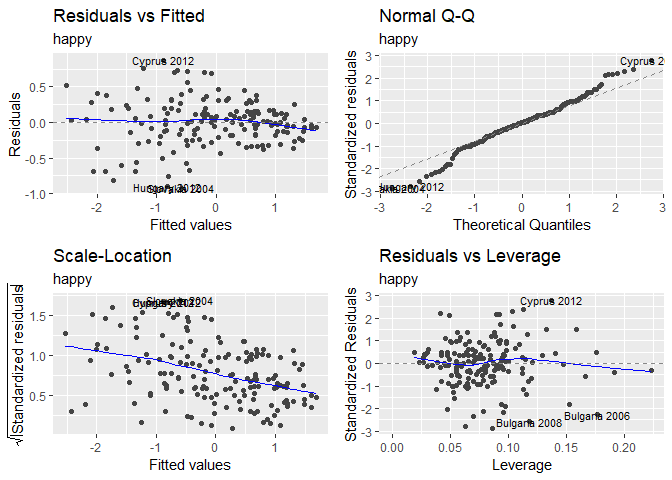

    ## [1] "For happy"
    ## [1] "Mean squared prediction error: 0.138"
    ## [1] "                    R-squared: 0.757"
    ## [1] "           Adjusted R-squared: 0.361"


``` r
ShowCoeffSummary(the_mod$coeffs, indicator_table)
```

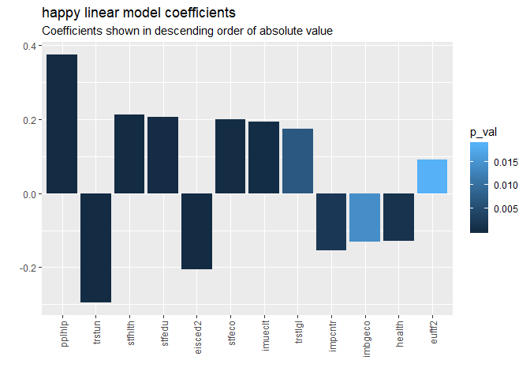

| variable |  coefficient|  std\_err|  t\_val|  p\_val| name                                                                 |
|:---------|------------:|---------:|-------:|-------:|:---------------------------------------------------------------------|
| pplhlp   |        0.375|     0.061|   6.193|   0.000| Most of the time people helpful or mostly looking out for themselves |
| trstun   |       -0.296|     0.058|  -5.126|   0.000| Trust in the United Nations                                          |
| stfhlth  |        0.213|     0.048|   4.456|   0.000| State of health services in country nowadays                         |
| stfedu   |        0.207|     0.055|   3.766|   0.000| State of education in country nowadays                               |
| eisced2  |       -0.206|     0.031|  -6.589|   0.000| Highest level of education, ES ISCED                                 |
| stfeco   |        0.200|     0.053|   3.742|   0.000| How satisfied with present state of economy in country               |
| imueclt  |        0.194|     0.053|   3.633|   0.000| Country's cultural life undermined or enriched by immigrants         |
| trstlgl  |        0.174|     0.063|   2.745|   0.007| Trust in the legal system                                            |
| impcntr  |       -0.154|     0.049|  -3.134|   0.002| Allow many/few immigrants from poorer countries outside Europe       |
| imbgeco  |       -0.130|     0.052|  -2.483|   0.014| Immigration bad or good for country's economy                        |
| health   |       -0.129|     0.039|  -3.282|   0.001| Subjective general health                                            |
| euftf2   |        0.091|     0.038|   2.379|   0.019| European Union: European unification go further or gone too far      |

``` r
print(the_mod$paircc)
```


``` r
the_mod_sum <- summary(the_mod$model)
```

The model explains 89.1% of variation.

Note that for `impcntr` *Allow many/few immigrants from poorer countries outside Europe* lower values of this indicator mean allowing more more immigration and higher values less. Favoring more immigration is associated with higher happiness and "closing the borders" associated with lower level of happiness

### Helpful People

#### ESS results

``` r
ess_set <- GetObservationsSet(
  ds = ds_ss_avg,
  ds_obs = ds_subset_50,
  the_indicator = "pplhlp",
  indicator_table = indicator_table,
  cntry_list = cntry_in_100pct)
```

    ## Joining, by = "cntry_name"

``` r
print(ess_set$summary)
```

    ##     ess_year    cntry_name         indicator             value    
    ##  Min.   : NA   Length:0           Length:0           Min.   : NA  
    ##  1st Qu.: NA   Class :character   Class :character   1st Qu.: NA  
    ##  Median : NA   Mode  :character   Mode  :character   Median : NA  
    ##  Mean   :NaN                                         Mean   :NaN  
    ##  3rd Qu.: NA                                         3rd Qu.: NA  
    ##  Max.   : NA                                         Max.   : NA

``` r
MyPrintInteractive(ess_set$map, plot_wo_widget) 
```

<!--html_preserve-->

<script type="application/json" data-for="htmlwidget-659ff77a09bb5a8048a5">{"x":{"url":"EuropeanSocialSurvey_files/figure-markdown_github//widgets/widget_unnamed-chunk-44.html","options":{"xdomain":"*","allowfullscreen":false,"lazyload":false}},"evals":[],"jsHooks":[]}</script>
<!--/html_preserve-->
``` r
MyPrintInteractive(ess_set$heat, plot_wo_widget) 
```

<!--html_preserve-->

<script type="application/json" data-for="htmlwidget-783d5002bcd768d246e5">{"x":{"url":"EuropeanSocialSurvey_files/figure-markdown_github//widgets/widget_unnamed-chunk-44.html","options":{"xdomain":"*","allowfullscreen":false,"lazyload":false}},"evals":[],"jsHooks":[]}</script>
<!--/html_preserve-->
``` r
MyPrintInteractive(ess_set$sig$plot, plot_wo_widget) 
```

<!--html_preserve-->

<script type="application/json" data-for="htmlwidget-e51677dcd7e93357e533">{"x":{"url":"EuropeanSocialSurvey_files/figure-markdown_github//widgets/widget_unnamed-chunk-44.html","options":{"xdomain":"*","allowfullscreen":false,"lazyload":false}},"evals":[],"jsHooks":[]}</script>
<!--/html_preserve-->
``` r
tab.3_cap <- table_nums(name="tab_3",
                        caption = paste0(ess_set$indicator$name, "2002-2016, significance and effect size of the change"))
```

Tab. 3: Most of the time people helpful or mostly looking out for themselves2002-2016, significance and effect size of the change

``` r
knitr::kable(ess_set$sig$table, digits = 3, 
             col.names = gsub("_", " ", colnames(ess_set$sig$table)))
```

| cntry name     |   2002|   2014|   2016|   d0216|  eff cil 0216|  eff ciu 0216| eff m 0216 |  p 0216| sig 0216 |   d1416|  eff cil 1416|  eff ciu 1416| eff m 1416 |  p 1416| sig 1416 |
|:---------------|------:|------:|------:|-------:|-------------:|-------------:|:-----------|-------:|:---------|-------:|-------------:|-------------:|:-----------|-------:|:---------|
| Spain          |  4.406|  4.376|  4.381|  -0.025|         0.008|         0.012| negligible |   0.752|          |   0.005|         0.008|         0.012| negligible |   0.898|          |
| Sweden         |  6.012|  6.042|  6.025|   0.012|         0.061|         0.065| negligible |   0.928|          |  -0.017|         0.061|         0.065| negligible |   0.784|          |
| Ireland        |  5.879|  5.861|  6.046|   0.167|        -0.047|        -0.043| negligible |   0.010| \*\*     |   0.185|        -0.047|        -0.043| negligible |   0.000| \*\*\*   |
| Portugal       |  3.937|  4.011|  4.192|   0.255|        -0.057|        -0.053| negligible |   0.000| \*\*\*   |   0.181|        -0.057|        -0.053| negligible |   0.056| +        |
| Belgium        |  4.392|  4.637|  4.683|   0.291|        -0.107|        -0.103| negligible |   0.000| \*\*\*   |   0.046|        -0.107|        -0.103| negligible |   0.506|          |
| United Kingdom |  5.408|  5.849|  5.754|   0.346|         0.242|         0.246| small      |   0.000| \*\*\*   |  -0.094|         0.242|         0.246| small      |   0.122|          |
| Finland        |  5.676|  5.933|  6.110|   0.434|        -0.191|        -0.187| negligible |   0.000| \*\*\*   |   0.178|        -0.191|        -0.187| negligible |   0.004| \*\*     |
| France         |  4.345|  4.667|  4.807|   0.462|        -0.106|        -0.102| negligible |   0.000| \*\*\*   |   0.140|        -0.106|        -0.102| negligible |   0.042| \*       |
| Switzerland    |  5.293|  5.684|  5.759|   0.466|        -0.167|        -0.163| negligible |   0.000| \*\*\*   |   0.075|        -0.167|        -0.163| negligible |   0.276|          |
| Hungary        |  4.147|  4.368|  4.616|   0.469|        -0.085|        -0.081| negligible |   0.000| \*\*\*   |   0.248|        -0.085|        -0.081| negligible |   0.000| \*\*\*   |
| Netherlands    |  5.236|  5.593|  5.706|   0.470|        -0.132|        -0.128| negligible |   0.000| \*\*\*   |   0.114|        -0.132|        -0.128| negligible |   0.040| \*       |
| Germany        |  4.801|  5.240|  5.424|   0.623|        -0.130|        -0.127| negligible |   0.000| \*\*\*   |   0.184|        -0.130|        -0.127| negligible |   0.002| \*\*     |
| Poland         |  3.163|  3.664|  3.830|   0.666|        -0.277|        -0.273| small      |   0.000| \*\*\*   |   0.165|        -0.277|        -0.273| small      |   0.052| +        |
| Slovenia       |  4.233|  4.967|  5.167|   0.934|        -0.362|        -0.357| small      |   0.000| \*\*\*   |   0.200|        -0.362|        -0.357| small      |   0.026| \*       |
| Norway         |  6.013|  6.048|  6.984|   0.971|        -0.307|        -0.303| small      |   0.000| \*\*\*   |   0.936|        -0.307|        -0.303| small      |   0.000| \*\*\*   |

#### Modeling

Investigating the highest factor in happy model - and excluding `happy` from the model as I do not think it can be an independent variable at all.

``` r
the_mod <- PredAndCheck("pplhlp", 
                        ds_train %>% select(-happy), 
                        ds_test%>% select(-happy), 
                        "- train 2002-2014, test 2016")
```

    ## [1] "Predicted indicator = pplhlp"
    ## [1] "Linear modeling with 2-way stepAIC: Using 165, removed 0 rows with NA"
    ## 
    ## Call:
    ## lm(formula = response_var ~ eisced2 + euftf2 + health + impcntr + 
    ##     imueclt + imwbcnt + polintr + stfeco + trstep + trstplc + 
    ##     trstun, data = ds)
    ## 
    ## Residuals:
    ##      Min       1Q   Median       3Q      Max 
    ## -1.02574 -0.23929 -0.01781  0.22439  1.12532 
    ## 
    ## Coefficients:
    ##              Estimate Std. Error t value Pr(>|t|)    
    ## (Intercept)  0.000608   0.031304   0.019 0.984529    
    ## eisced2      0.106774   0.041411   2.578 0.010868 *  
    ## euftf2      -0.319470   0.054215  -5.893 2.34e-08 ***
    ## health      -0.090918   0.049221  -1.847 0.066658 .  
    ## impcntr      0.076419   0.051308   1.489 0.138438    
    ## imueclt     -0.173397   0.084618  -2.049 0.042153 *  
    ## imwbcnt      0.316904   0.092203   3.437 0.000758 ***
    ## polintr     -0.191909   0.045364  -4.230 4.00e-05 ***
    ## stfeco       0.146637   0.051003   2.875 0.004615 ** 
    ## trstep      -0.150051   0.053838  -2.787 0.005992 ** 
    ## trstplc      0.173614   0.070795   2.452 0.015318 *  
    ## trstun       0.298725   0.067928   4.398 2.04e-05 ***
    ## ---
    ## Signif. codes:  0 '***' 0.001 '**' 0.01 '*' 0.05 '.' 0.1 ' ' 1
    ## 
    ## Residual standard error: 0.3949 on 153 degrees of freedom
    ## Multiple R-squared:  0.8554, Adjusted R-squared:  0.845 
    ## F-statistic: 82.25 on 11 and 153 DF,  p-value: < 2.2e-16


    ## [1] "For pplhlp"
    ## [1] "Mean squared prediction error: 0.249"
    ## [1] "                    R-squared: 0.681"
    ## [1] "           Adjusted R-squared: 0.255"


``` r
ShowCoeffSummary(the_mod$coeffs, indicator_table)
```

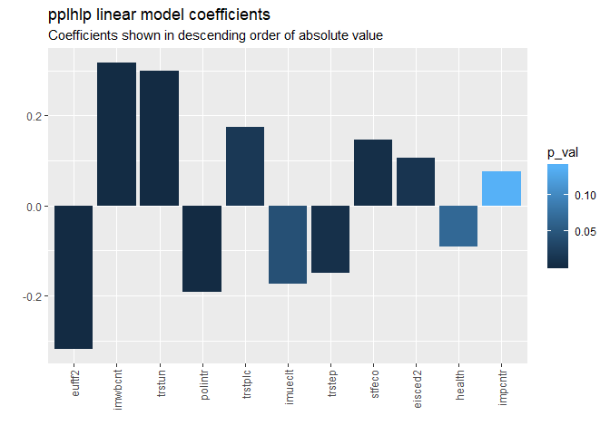

| variable |  coefficient|  std\_err|  t\_val|  p\_val| name                                                            |
|:---------|------------:|---------:|-------:|-------:|:----------------------------------------------------------------|
| euftf2   |       -0.319|     0.054|  -5.893|   0.000| European Union: European unification go further or gone too far |
| imwbcnt  |        0.317|     0.092|   3.437|   0.001| Immigrants make country worse or better place to live           |
| trstun   |        0.299|     0.068|   4.398|   0.000| Trust in the United Nations                                     |
| polintr  |       -0.192|     0.045|  -4.230|   0.000| How interested in politics                                      |
| trstplc  |        0.174|     0.071|   2.452|   0.015| Trust in the police                                             |
| imueclt  |       -0.173|     0.085|  -2.049|   0.042| Country's cultural life undermined or enriched by immigrants    |
| trstep   |       -0.150|     0.054|  -2.787|   0.006| Trust in the European Parliament                                |
| stfeco   |        0.147|     0.051|   2.875|   0.005| How satisfied with present state of economy in country          |
| eisced2  |        0.107|     0.041|   2.578|   0.011| Highest level of education, ES ISCED                            |
| health   |       -0.091|     0.049|  -1.847|   0.067| Subjective general health                                       |
| impcntr  |        0.076|     0.051|   1.489|   0.138| Allow many/few immigrants from poorer countries outside Europe  |

``` r
print(the_mod$paircc)
```


``` r
the_mod_sum <- summary(the_mod$model)
```

The model explains 84.5% of variation.

Looks like here `happy` and `trstun` are major positive factors. `trstun` was seen as a major factor in `happy` as well. The third biggest positive factor is `imwbcnt` *Immigrants make country worse or better place to live*.

Interestingly, this is negatively correlated with the `euftf` *European Union: European unification go further or gone too far*. And there is a negative correlation with `imueclt` *Country's cultural life undermined or enriched by immigrants*.

### Trust in United Nations

Trust in the UN seems to be an important factor, so let's drill deeper.

#### ESS results

``` r
ess_set <- GetObservationsSet(
  ds = ds_ss_avg,
  ds_obs = ds_subset_50,
  the_indicator = "trstun",
  indicator_table = indicator_table,
  cntry_list = cntry_in_100pct)
```

    ## Joining, by = "cntry_name"

``` r
print(ess_set$summary)
```

    ##     ess_year    cntry_name         indicator             value    
    ##  Min.   : NA   Length:0           Length:0           Min.   : NA  
    ##  1st Qu.: NA   Class :character   Class :character   1st Qu.: NA  
    ##  Median : NA   Mode  :character   Mode  :character   Median : NA  
    ##  Mean   :NaN                                         Mean   :NaN  
    ##  3rd Qu.: NA                                         3rd Qu.: NA  
    ##  Max.   : NA                                         Max.   : NA

``` r
MyPrintInteractive(ess_set$map, plot_wo_widget) 
```

<!--html_preserve-->

<script type="application/json" data-for="htmlwidget-493d47e1b55b07c0b2af">{"x":{"url":"EuropeanSocialSurvey_files/figure-markdown_github//widgets/widget_unnamed-chunk-46.html","options":{"xdomain":"*","allowfullscreen":false,"lazyload":false}},"evals":[],"jsHooks":[]}</script>
<!--/html_preserve-->
``` r
MyPrintInteractive(ess_set$heat, plot_wo_widget) 
```

<!--html_preserve-->

<script type="application/json" data-for="htmlwidget-740e19546a9965409af8">{"x":{"url":"EuropeanSocialSurvey_files/figure-markdown_github//widgets/widget_unnamed-chunk-46.html","options":{"xdomain":"*","allowfullscreen":false,"lazyload":false}},"evals":[],"jsHooks":[]}</script>
<!--/html_preserve-->
``` r
MyPrintInteractive(ess_set$sig$plot, plot_wo_widget) 
```

<!--html_preserve-->

<script type="application/json" data-for="htmlwidget-7e1a9db23bfcbdc1290e">{"x":{"url":"EuropeanSocialSurvey_files/figure-markdown_github//widgets/widget_unnamed-chunk-46.html","options":{"xdomain":"*","allowfullscreen":false,"lazyload":false}},"evals":[],"jsHooks":[]}</script>
<!--/html_preserve-->
``` r
tab.4_cap <- table_nums(name="tab_4",
                        caption = paste0(ess_set$indicator$name, "2002-2016, significance and effect size of the change"))
```

Tab. 4: Trust in the United Nations2002-2016, significance and effect size of the change

``` r
knitr::kable(ess_set$sig$table, digits = 3, 
             col.names = gsub("_", " ", colnames(ess_set$sig$table)))
```

| cntry name     |   2002|   2014|   2016|   d0216|  eff cil 0216|  eff ciu 0216| eff m 0216 |  p 0216| sig 0216 |   d1416|  eff cil 1416|  eff ciu 1416| eff m 1416 |  p 1416| sig 1416 |
|:---------------|------:|------:|------:|-------:|-------------:|-------------:|:-----------|-------:|:---------|-------:|-------------:|-------------:|:-----------|-------:|:---------|
| Hungary        |  5.972|  5.369|  4.934|  -1.038|         0.422|         0.426| small      |   0.000| \*\*\*   |  -0.435|         0.422|         0.426| small      |   0.000| \*\*\*   |
| Poland         |  5.634|  4.604|  4.909|  -0.725|         0.247|         0.252| small      |   0.000| \*\*\*   |   0.305|         0.247|         0.252| small      |   0.000| \*\*\*   |
| Slovenia       |  4.876|  4.137|  4.337|  -0.539|         0.186|         0.191| negligible |   0.000| \*\*\*   |   0.200|         0.186|         0.191| negligible |   0.062| +        |
| Sweden         |  6.603|  6.411|  6.242|  -0.361|         0.159|         0.164| negligible |   0.000| \*\*\*   |  -0.169|         0.159|         0.164| negligible |   0.012| \*       |
| Germany        |  5.170|  4.680|  4.812|  -0.358|         0.125|         0.128| negligible |   0.000| \*\*\*   |   0.132|         0.125|         0.128| negligible |   0.046| \*       |
| Switzerland    |  5.440|  5.363|  5.267|  -0.173|         0.042|         0.046| negligible |   0.036| \*       |  -0.096|         0.042|         0.046| negligible |   0.274|          |
| Finland        |  6.462|  6.148|  6.353|  -0.109|         0.047|         0.051| negligible |   0.134|          |   0.205|         0.047|         0.051| negligible |   0.000| \*\*\*   |
| Portugal       |  5.356|  4.815|  5.356|   0.000|         0.013|         0.018| negligible |   0.968|          |   0.541|         0.013|         0.018| negligible |   0.000| \*\*\*   |
| Ireland        |  5.713|  5.445|  5.716|   0.003|        -0.017|        -0.013| negligible |   0.970|          |   0.271|        -0.017|        -0.013| negligible |   0.000| \*\*\*   |
| United Kingdom |  5.317|  4.909|  5.360|   0.044|         0.282|         0.287| small      |   0.564|          |   0.452|         0.282|         0.287| small      |   0.000| \*\*\*   |
| Norway         |  6.756|  6.723|  6.848|   0.092|        -0.032|        -0.028| negligible |   0.172|          |   0.125|        -0.032|        -0.028| negligible |   0.074| +        |
| Spain          |  4.661|  4.817|  4.771|   0.109|        -0.014|        -0.010| negligible |   0.248|          |  -0.047|        -0.014|        -0.010| negligible |   0.626|          |
| Belgium        |  4.997|  5.199|  5.230|   0.233|        -0.099|        -0.095| negligible |   0.006| \*\*     |   0.031|        -0.099|        -0.095| negligible |   0.700|          |
| Netherlands    |  5.470|  5.534|  5.732|   0.262|        -0.064|        -0.059| negligible |   0.000| \*\*\*   |   0.198|        -0.064|        -0.059| negligible |   0.010| \*\*     |
| France         |  4.569|  5.100|  4.921|   0.352|        -0.074|        -0.070| negligible |   0.000| \*\*\*   |  -0.179|        -0.074|        -0.070| negligible |   0.024| \*       |

#### Modeling

``` r
the_mod <- PredAndCheck("trstun", 
                        ds_train %>% select(-happy), 
                        ds_test%>% select(-happy), 
                        "- train 2002-2014, test 2016")
```

    ## [1] "Predicted indicator = trstun"
    ## [1] "Linear modeling with 2-way stepAIC: Using 165, removed 0 rows with NA"

    ## Warning: Setting row names on a tibble is deprecated.

    ## 
    ## Call:
    ## lm(formula = response_var ~ eisced2 + euftf2 + health + imbgeco + 
    ##     impcntr + imueclt + imwbcnt + polintr + pplhlp + stfeco + 
    ##     stfedu + stfgov2 + stfhlth + trstep + trstlgl, data = ds)
    ## 
    ## Residuals:
    ##     Min      1Q  Median      3Q     Max 
    ## -0.6998 -0.2541 -0.0195  0.2020  1.0600 
    ## 
    ## Coefficients:
    ##             Estimate Std. Error t value Pr(>|t|)    
    ## (Intercept)  0.02489    0.02874   0.866 0.387877    
    ## eisced2     -0.12943    0.03747  -3.454 0.000719 ***
    ## euftf2      -0.17519    0.05724  -3.061 0.002619 ** 
    ## health       0.23682    0.04601   5.147 8.21e-07 ***
    ## imbgeco     -0.24459    0.05818  -4.204 4.50e-05 ***
    ## impcntr     -0.33549    0.05301  -6.329 2.74e-09 ***
    ## imueclt      0.11603    0.08009   1.449 0.149503    
    ## imwbcnt      0.18293    0.09200   1.988 0.048597 *  
    ## polintr      0.11506    0.05341   2.154 0.032823 *  
    ## pplhlp       0.28953    0.07106   4.075 7.47e-05 ***
    ## stfeco       0.17257    0.07225   2.389 0.018169 *  
    ## stfedu       0.24172    0.05710   4.234 4.00e-05 ***
    ## stfgov2     -0.21773    0.06650  -3.274 0.001319 ** 
    ## stfhlth     -0.25712    0.04810  -5.346 3.32e-07 ***
    ## trstep       0.41812    0.04881   8.566 1.24e-14 ***
    ## trstlgl      0.36318    0.08104   4.482 1.47e-05 ***
    ## ---
    ## Signif. codes:  0 '***' 0.001 '**' 0.01 '*' 0.05 '.' 0.1 ' ' 1
    ## 
    ## Residual standard error: 0.366 on 149 degrees of freedom
    ## Multiple R-squared:  0.8745, Adjusted R-squared:  0.8619 
    ## F-statistic: 69.23 on 15 and 149 DF,  p-value: < 2.2e-16

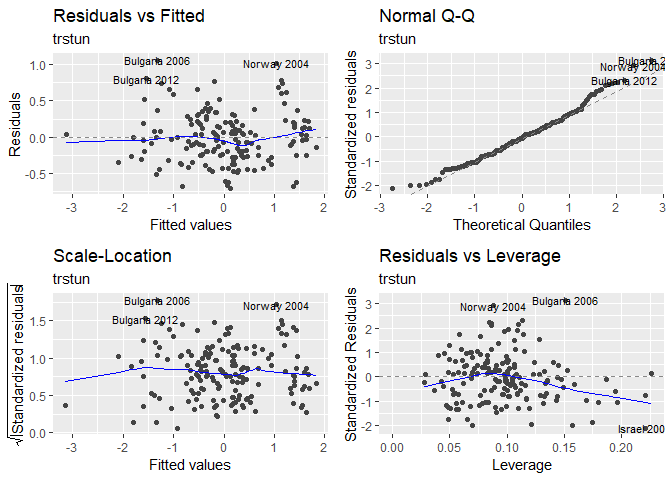

    ## [1] "For trstun"
    ## [1] "Mean squared prediction error: 0.239"
    ## [1] "                    R-squared: 0.809"
    ## [1] "           Adjusted R-squared: 0.2"


``` r
ShowCoeffSummary(the_mod$coeffs, indicator_table)
```


| variable |  coefficient|  std\_err|  t\_val|  p\_val| name                                                                 |
|:---------|------------:|---------:|-------:|-------:|:---------------------------------------------------------------------|
| trstep   |        0.418|     0.049|   8.566|   0.000| Trust in the European Parliament                                     |
| trstlgl  |        0.363|     0.081|   4.482|   0.000| Trust in the legal system                                            |
| impcntr  |       -0.335|     0.053|  -6.329|   0.000| Allow many/few immigrants from poorer countries outside Europe       |
| pplhlp   |        0.290|     0.071|   4.075|   0.000| Most of the time people helpful or mostly looking out for themselves |
| stfhlth  |       -0.257|     0.048|  -5.346|   0.000| State of health services in country nowadays                         |
| imbgeco  |       -0.245|     0.058|  -4.204|   0.000| Immigration bad or good for country's economy                        |
| stfedu   |        0.242|     0.057|   4.234|   0.000| State of education in country nowadays                               |
| health   |        0.237|     0.046|   5.147|   0.000| Subjective general health                                            |
| stfgov2  |       -0.218|     0.067|  -3.274|   0.001| How satisfied with the national government                           |
| imwbcnt  |        0.183|     0.092|   1.988|   0.049| Immigrants make country worse or better place to live                |
| euftf2   |       -0.175|     0.057|  -3.061|   0.003| European Union: European unification go further or gone too far      |
| stfeco   |        0.173|     0.072|   2.389|   0.018| How satisfied with present state of economy in country               |
| eisced2  |       -0.129|     0.037|  -3.454|   0.001| Highest level of education, ES ISCED                                 |
| imueclt  |        0.116|     0.080|   1.449|   0.150| Country's cultural life undermined or enriched by immigrants         |
| polintr  |        0.115|     0.053|   2.154|   0.033| How interested in politics                                           |

``` r
print(the_mod$paircc)
```


``` r
the_mod_sum <- summary(the_mod$model)
```

The model explains 86.2% of variation.

### Trust in European Parliament

#### EES Results

``` r
ess_set <- GetObservationsSet(
  ds = ds_ss_avg,
  ds_obs = ds_subset_50,
  the_indicator = "trstep",
  indicator_table = indicator_table,
  cntry_list = cntry_in_100pct)
```

    ## Joining, by = "cntry_name"

``` r
print(ess_set$summary)
```

    ##     ess_year    cntry_name         indicator             value    
    ##  Min.   : NA   Length:0           Length:0           Min.   : NA  
    ##  1st Qu.: NA   Class :character   Class :character   1st Qu.: NA  
    ##  Median : NA   Mode  :character   Mode  :character   Median : NA  
    ##  Mean   :NaN                                         Mean   :NaN  
    ##  3rd Qu.: NA                                         3rd Qu.: NA  
    ##  Max.   : NA                                         Max.   : NA

``` r
MyPrintInteractive(ess_set$map, plot_wo_widget) 
```

<!--html_preserve-->

<script type="application/json" data-for="htmlwidget-99a335714b6f4eb3b4f3">{"x":{"url":"EuropeanSocialSurvey_files/figure-markdown_github//widgets/widget_unnamed-chunk-48.html","options":{"xdomain":"*","allowfullscreen":false,"lazyload":false}},"evals":[],"jsHooks":[]}</script>
<!--/html_preserve-->
``` r
MyPrintInteractive(ess_set$heat, plot_wo_widget) 
```

<!--html_preserve-->

<script type="application/json" data-for="htmlwidget-f7f3ee51cbc26557bc2b">{"x":{"url":"EuropeanSocialSurvey_files/figure-markdown_github//widgets/widget_unnamed-chunk-48.html","options":{"xdomain":"*","allowfullscreen":false,"lazyload":false}},"evals":[],"jsHooks":[]}</script>
<!--/html_preserve-->
``` r
MyPrintInteractive(ess_set$sig$plot, plot_wo_widget) 
```

<!--html_preserve-->

<script type="application/json" data-for="htmlwidget-8648f27b0d092c0a7a64">{"x":{"url":"EuropeanSocialSurvey_files/figure-markdown_github//widgets/widget_unnamed-chunk-48.html","options":{"xdomain":"*","allowfullscreen":false,"lazyload":false}},"evals":[],"jsHooks":[]}</script>
<!--/html_preserve-->
``` r
tab.5_cap <- table_nums(name="tab_5",
                        caption = paste0(ess_set$indicator$name, "2002-2016, significance and effect size of the change"))
```

Tab. 5: Trust in the European Parliament2002-2016, significance and effect size of the change

``` r
knitr::kable(ess_set$sig$table, digits = 3, 
             col.names = gsub("_", " ", colnames(ess_set$sig$table)))
```

| cntry name     |   2002|   2014|   2016|   d0216|  eff cil 0216|  eff ciu 0216| eff m 0216 |  p 0216| sig 0216 |   d1416|  eff cil 1416|  eff ciu 1416| eff m 1416 |  p 1416| sig 1416 |
|:---------------|------:|------:|------:|-------:|-------------:|-------------:|:-----------|-------:|:---------|-------:|-------------:|-------------:|:-----------|-------:|:---------|
| Hungary        |  5.625|  4.867|  4.367|  -1.258|         0.523|         0.528| medium     |   0.000| \*\*\*   |  -0.501|         0.523|         0.528| medium     |   0.000| \*\*\*   |
| Poland         |  4.741|  3.665|  3.927|  -0.815|         0.308|         0.312| small      |   0.000| \*\*\*   |   0.262|         0.308|         0.312| small      |   0.006| \*\*     |
| Portugal       |  4.835|  3.501|  4.103|  -0.733|         0.145|         0.150| negligible |   0.000| \*\*\*   |   0.601|         0.145|         0.150| negligible |   0.000| \*\*\*   |
| Slovenia       |  4.620|  3.389|  3.944|  -0.676|         0.248|         0.253| small      |   0.000| \*\*\*   |   0.555|         0.248|         0.253| small      |   0.000| \*\*\*   |
| France         |  4.345|  3.948|  3.809|  -0.536|         0.130|         0.134| negligible |   0.000| \*\*\*   |  -0.140|         0.130|         0.134| negligible |   0.066| +        |
| Spain          |  4.767|  3.886|  4.245|  -0.522|         0.177|         0.182| negligible |   0.000| \*\*\*   |   0.359|         0.177|         0.182| negligible |   0.000| \*\*\*   |
| Switzerland    |  4.812|  4.525|  4.501|  -0.311|         0.084|         0.088| negligible |   0.000| \*\*\*   |  -0.024|         0.084|         0.088| negligible |   0.776|          |
| Belgium        |  4.802|  4.808|  4.587|  -0.215|         0.043|         0.047| negligible |   0.006| \*\*     |  -0.221|         0.043|         0.047| negligible |   0.008| \*\*     |
| Ireland        |  5.132|  4.626|  5.004|  -0.128|         0.022|         0.026| negligible |   0.096| +        |   0.378|         0.022|         0.026| negligible |   0.000| \*\*\*   |
| Germany        |  4.526|  4.079|  4.400|  -0.126|         0.060|         0.064| negligible |   0.038| \*       |   0.321|         0.060|         0.064| negligible |   0.000| \*\*\*   |
| Netherlands    |  4.777|  4.487|  4.675|  -0.101|         0.033|         0.038| negligible |   0.150|          |   0.188|         0.033|         0.038| negligible |   0.018| \*       |
| United Kingdom |  3.692|  3.270|  3.776|   0.084|         0.201|         0.205| small      |   0.320|          |   0.507|         0.201|         0.205| small      |   0.000| \*\*\*   |
| Finland        |  4.878|  4.673|  5.173|   0.295|        -0.115|        -0.111| negligible |   0.000| \*\*\*   |   0.501|        -0.115|        -0.111| negligible |   0.000| \*\*\*   |
| Norway         |  4.706|  5.002|  5.151|   0.444|        -0.143|        -0.138| negligible |   0.000| \*\*\*   |   0.148|        -0.143|        -0.138| negligible |   0.094| +        |
| Sweden         |  4.084|  4.765|  4.841|   0.757|        -0.126|        -0.121| negligible |   0.000| \*\*\*   |   0.076|        -0.126|        -0.121| negligible |   0.390|          |

As can be seen above, the big positive changes in UK and Portugal as well as Finland and Slovenia from 2014 to 2016 were significant as per weighted t-test.

And the same applies to quite large drops in Belgium, France and Hungary.

With more investigation one might find some interesting correlations between those changes and other indicators in ESS data and elsewhere. But that adventure is beyond the scope of this post.

#### Modeling

``` r
the_mod <- PredAndCheck("trstep", 
                        ds_train %>% select(-happy), 
                        ds_test%>% select(-happy), 
                        "- train 2002-2014, test 2016")
```

    ## [1] "Predicted indicator = trstep"
    ## [1] "Linear modeling with 2-way stepAIC: Using 165, removed 0 rows with NA"

    ## Warning: Setting row names on a tibble is deprecated.

    ## 
    ## Call:
    ## lm(formula = response_var ~ eisced2 + euftf2 + health + imbgeco + 
    ##     impcntr + imwbcnt + polintr + pplhlp + stfeco + stfgov2 + 
    ##     stfhlth + trstun, data = ds)
    ## 
    ## Residuals:
    ##      Min       1Q   Median       3Q      Max 
    ## -1.27108 -0.36267  0.08103  0.28691  1.20172 
    ## 
    ## Coefficients:
    ##              Estimate Std. Error t value Pr(>|t|)    
    ## (Intercept) -0.003374   0.039423  -0.086 0.931916    
    ## eisced2      0.115316   0.046252   2.493 0.013731 *  
    ## euftf2       0.494093   0.063408   7.792 9.61e-13 ***
    ## health      -0.132712   0.053542  -2.479 0.014280 *  
    ## imbgeco      0.240707   0.079032   3.046 0.002737 ** 
    ## impcntr      0.242026   0.066604   3.634 0.000381 ***
    ## imwbcnt     -0.281397   0.091003  -3.092 0.002365 ** 
    ## polintr      0.106323   0.057925   1.836 0.068383 .  
    ## pplhlp      -0.298004   0.097896  -3.044 0.002751 ** 
    ## stfeco      -0.250087   0.096764  -2.585 0.010693 *  
    ## stfgov2      0.510377   0.082850   6.160 6.21e-09 ***
    ## stfhlth      0.123759   0.059742   2.072 0.039996 *  
    ## trstun       0.872817   0.070352  12.406  < 2e-16 ***
    ## ---
    ## Signif. codes:  0 '***' 0.001 '**' 0.01 '*' 0.05 '.' 0.1 ' ' 1
    ## 
    ## Residual standard error: 0.5025 on 152 degrees of freedom
    ## Multiple R-squared:  0.7582, Adjusted R-squared:  0.7391 
    ## F-statistic: 39.71 on 12 and 152 DF,  p-value: < 2.2e-16


    ## [1] "For trstep"
    ## [1] "Mean squared prediction error: 0.354"
    ## [1] "                    R-squared: 0.69"
    ## [1] "           Adjusted R-squared: 0.187"

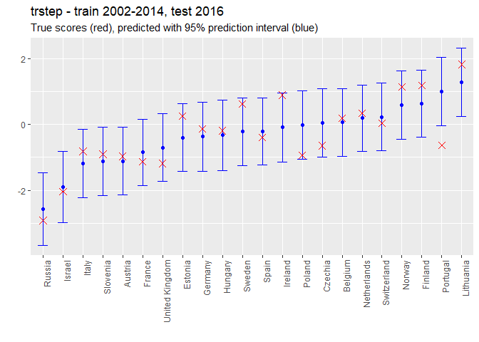

``` r
ShowCoeffSummary(the_mod$coeffs, indicator_table)
```


| variable |  coefficient|  std\_err|  t\_val|  p\_val| name                                                                 |
|:---------|------------:|---------:|-------:|-------:|:---------------------------------------------------------------------|
| trstun   |        0.873|     0.070|  12.406|   0.000| Trust in the United Nations                                          |
| stfgov2  |        0.510|     0.083|   6.160|   0.000| How satisfied with the national government                           |
| euftf2   |        0.494|     0.063|   7.792|   0.000| European Union: European unification go further or gone too far      |
| pplhlp   |       -0.298|     0.098|  -3.044|   0.003| Most of the time people helpful or mostly looking out for themselves |
| imwbcnt  |       -0.281|     0.091|  -3.092|   0.002| Immigrants make country worse or better place to live                |
| stfeco   |       -0.250|     0.097|  -2.585|   0.011| How satisfied with present state of economy in country               |
| impcntr  |        0.242|     0.067|   3.634|   0.000| Allow many/few immigrants from poorer countries outside Europe       |
| imbgeco  |        0.241|     0.079|   3.046|   0.003| Immigration bad or good for country's economy                        |
| health   |       -0.133|     0.054|  -2.479|   0.014| Subjective general health                                            |
| stfhlth  |        0.124|     0.060|   2.072|   0.040| State of health services in country nowadays                         |
| eisced2  |        0.115|     0.046|   2.493|   0.014| Highest level of education, ES ISCED                                 |
| polintr  |        0.106|     0.058|   1.836|   0.068| How interested in politics                                           |

``` r
print(the_mod$paircc)
```


``` r
the_mod_sum <- summary(the_mod$model)
```

The model explains 73.9% of variation.

### Immigrants from poorer countries outside Europe

#### EES Results

``` r
ess_set <- GetObservationsSet(
  ds = ds_ss_avg,
  ds_obs = ds_subset_50,
  the_indicator = "impcntr",
  indicator_table = indicator_table,
  cntry_list = cntry_in_100pct)
```

    ## Joining, by = "cntry_name"

``` r
print(ess_set$summary)
```

    ##     ess_year    cntry_name         indicator             value    
    ##  Min.   : NA   Length:0           Length:0           Min.   : NA  
    ##  1st Qu.: NA   Class :character   Class :character   1st Qu.: NA  
    ##  Median : NA   Mode  :character   Mode  :character   Median : NA  
    ##  Mean   :NaN                                         Mean   :NaN  
    ##  3rd Qu.: NA                                         3rd Qu.: NA  
    ##  Max.   : NA                                         Max.   : NA

``` r
MyPrintInteractive(ess_set$map, plot_wo_widget) 
```

<!--html_preserve-->

<script type="application/json" data-for="htmlwidget-d5e02d59ee7877099885">{"x":{"url":"EuropeanSocialSurvey_files/figure-markdown_github//widgets/widget_unnamed-chunk-50.html","options":{"xdomain":"*","allowfullscreen":false,"lazyload":false}},"evals":[],"jsHooks":[]}</script>
<!--/html_preserve-->
``` r
MyPrintInteractive(ess_set$heat, plot_wo_widget) 
```

<!--html_preserve-->

<script type="application/json" data-for="htmlwidget-3b0502a7216e0a8f1214">{"x":{"url":"EuropeanSocialSurvey_files/figure-markdown_github//widgets/widget_unnamed-chunk-50.html","options":{"xdomain":"*","allowfullscreen":false,"lazyload":false}},"evals":[],"jsHooks":[]}</script>
<!--/html_preserve-->
``` r
MyPrintInteractive(ess_set$sig$plot, plot_wo_widget) 
```

<!--html_preserve-->

<script type="application/json" data-for="htmlwidget-5a3fad1cab4faa2f1b56">{"x":{"url":"EuropeanSocialSurvey_files/figure-markdown_github//widgets/widget_unnamed-chunk-50.html","options":{"xdomain":"*","allowfullscreen":false,"lazyload":false}},"evals":[],"jsHooks":[]}</script>
<!--/html_preserve-->
``` r
tab.6_cap <- table_nums(name="tab_6",
                        caption = paste0(ess_set$indicator$name, "2002-2016, significance and effect size of the change"))
```

Tab. 6: Allow many/few immigrants from poorer countries outside Europe2002-2016, significance and effect size of the change

``` r
knitr::kable(ess_set$sig$table, digits = 3, 
             col.names = gsub("_", " ", colnames(ess_set$sig$table)))
```

| cntry name     |   2002|   2014|   2016|   d0216|  eff cil 0216|  eff ciu 0216| eff m 0216 |  p 0216| sig 0216 |   d1416|  eff cil 1416|  eff ciu 1416| eff m 1416 |  p 1416| sig 1416 |
|:---------------|------:|------:|------:|-------:|-------------:|-------------:|:-----------|-------:|:---------|-------:|-------------:|-------------:|:-----------|-------:|:---------|
| Portugal       |  2.791|  2.607|  2.220|  -0.571|         0.231|         0.236| small      |   0.000| \*\*\*   |  -0.387|         0.231|         0.236| small      |   0.000| \*\*\*   |
| Spain          |  2.402|  2.379|  2.112|  -0.291|         0.212|         0.217| small      |   0.000| \*\*\*   |  -0.268|         0.212|         0.217| small      |   0.000| \*\*\*   |
| United Kingdom |  2.575|  2.685|  2.304|  -0.271|         0.525|         0.529| medium     |   0.000| \*\*\*   |  -0.381|         0.525|         0.529| medium     |   0.000| \*\*\*   |
| Norway         |  2.304|  2.181|  2.036|  -0.268|         0.233|         0.237| small      |   0.000| \*\*\*   |  -0.144|         0.233|         0.237| small      |   0.000| \*\*\*   |
| Germany        |  2.390|  2.233|  2.162|  -0.228|         0.171|         0.174| negligible |   0.000| \*\*\*   |  -0.071|         0.171|         0.174| negligible |   0.002| \*\*     |
| France         |  2.559|  2.594|  2.357|  -0.202|         0.121|         0.125| negligible |   0.000| \*\*\*   |  -0.236|         0.121|         0.125| negligible |   0.000| \*\*\*   |
| Belgium        |  2.482|  2.580|  2.293|  -0.189|         0.136|         0.140| negligible |   0.000| \*\*\*   |  -0.286|         0.136|         0.140| negligible |   0.000| \*\*\*   |
| Netherlands    |  2.467|  2.505|  2.323|  -0.144|         0.095|         0.099| negligible |   0.000| \*\*\*   |  -0.182|         0.095|         0.099| negligible |   0.000| \*\*\*   |
| Finland        |  2.603|  2.697|  2.511|  -0.092|         0.093|         0.097| negligible |   0.000| \*\*\*   |  -0.186|         0.093|         0.097| negligible |   0.000| \*\*\*   |
| Sweden         |  1.879|  1.763|  1.802|  -0.077|         0.120|         0.124| negligible |   0.000| \*\*\*   |   0.039|         0.120|         0.124| negligible |   0.132|          |
| Slovenia       |  2.468|  2.531|  2.490|   0.022|        -0.025|        -0.020| negligible |   0.452|          |  -0.041|        -0.025|        -0.020| negligible |   0.250|          |
| Ireland        |  2.297|  2.657|  2.332|   0.035|        -0.027|        -0.023| negligible |   0.138|          |  -0.325|        -0.027|        -0.023| negligible |   0.000| \*\*\*   |
| Switzerland    |  2.218|  2.400|  2.283|   0.065|        -0.060|        -0.055| negligible |   0.014| \*       |  -0.117|        -0.060|        -0.055| negligible |   0.002| \*\*     |
| Poland         |  2.409|  2.455|  2.591|   0.182|        -0.218|        -0.213| small      |   0.000| \*\*\*   |   0.135|        -0.218|        -0.213| small      |   0.000| \*\*\*   |
| Hungary        |  3.101|  3.318|  3.558|   0.457|        -0.210|        -0.205| small      |   0.000| \*\*\*   |   0.240|        -0.210|        -0.205| small      |   0.000| \*\*\*   |

#### Modeling

``` r
the_mod <- PredAndCheck("impcntr", 
                        ds_train %>% select(-happy), 
                        ds_test%>% select(-happy), 
                        "- train 2002-2014, test 2016")
```

    ## [1] "Predicted indicator = impcntr"
    ## [1] "Linear modeling with 2-way stepAIC: Using 165, removed 0 rows with NA"
    ## 
    ## Call:
    ## lm(formula = response_var ~ eisced2 + health + imbgeco + imwbcnt + 
    ##     polintr + pplhlp + stfedu + stfgov2 + stfhlth + trstep + 
    ##     trstlgl + trstplc + trstun, data = ds)
    ## 
    ## Residuals:
    ##      Min       1Q   Median       3Q      Max 
    ## -1.12877 -0.33126 -0.06624  0.31672  1.76845 
    ## 
    ## Coefficients:
    ##             Estimate Std. Error t value Pr(>|t|)    
    ## (Intercept)  0.01938    0.03862   0.502 0.616504    
    ## eisced2     -0.07870    0.05335  -1.475 0.142246    
    ## health       0.23705    0.05823   4.071 7.53e-05 ***
    ## imbgeco     -0.33030    0.07333  -4.504 1.33e-05 ***
    ## imwbcnt     -0.19156    0.08198  -2.337 0.020768 *  
    ## polintr      0.35827    0.06210   5.770 4.35e-08 ***
    ## pplhlp       0.17963    0.09140   1.965 0.051217 .  
    ## stfedu       0.31052    0.08033   3.866 0.000164 ***
    ## stfgov2     -0.22599    0.07630  -2.962 0.003552 ** 
    ## stfhlth     -0.18458    0.06570  -2.809 0.005621 ** 
    ## trstep       0.15721    0.06518   2.412 0.017065 *  
    ## trstlgl      0.97850    0.13509   7.243 2.09e-11 ***
    ## trstplc     -0.33134    0.12547  -2.641 0.009141 ** 
    ## trstun      -0.58533    0.09133  -6.409 1.77e-09 ***
    ## ---
    ## Signif. codes:  0 '***' 0.001 '**' 0.01 '*' 0.05 '.' 0.1 ' ' 1
    ## 
    ## Residual standard error: 0.489 on 151 degrees of freedom
    ## Multiple R-squared:  0.7648, Adjusted R-squared:  0.7445 
    ## F-statistic: 37.76 on 13 and 151 DF,  p-value: < 2.2e-16

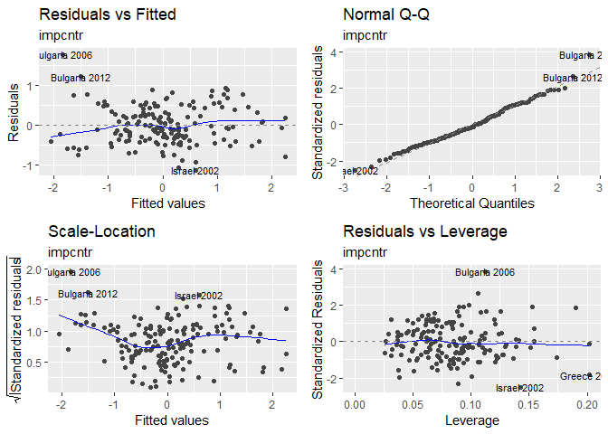

    ## [1] "For impcntr"
    ## [1] "Mean squared prediction error: 0.327"
    ## [1] "                    R-squared: 0.778"
    ## [1] "           Adjusted R-squared: 0.333"


``` r
ShowCoeffSummary(the_mod$coeffs, indicator_table)
```


| variable |  coefficient|  std\_err|  t\_val|  p\_val| name                                                                 |
|:---------|------------:|---------:|-------:|-------:|:---------------------------------------------------------------------|
| trstlgl  |        0.979|     0.135|   7.243|   0.000| Trust in the legal system                                            |
| trstun   |       -0.585|     0.091|  -6.409|   0.000| Trust in the United Nations                                          |
| polintr  |        0.358|     0.062|   5.770|   0.000| How interested in politics                                           |
| trstplc  |       -0.331|     0.125|  -2.641|   0.009| Trust in the police                                                  |
| imbgeco  |       -0.330|     0.073|  -4.504|   0.000| Immigration bad or good for country's economy                        |
| stfedu   |        0.311|     0.080|   3.866|   0.000| State of education in country nowadays                               |
| health   |        0.237|     0.058|   4.071|   0.000| Subjective general health                                            |
| stfgov2  |       -0.226|     0.076|  -2.962|   0.004| How satisfied with the national government                           |
| imwbcnt  |       -0.192|     0.082|  -2.337|   0.021| Immigrants make country worse or better place to live                |
| stfhlth  |       -0.185|     0.066|  -2.809|   0.006| State of health services in country nowadays                         |
| pplhlp   |        0.180|     0.091|   1.965|   0.051| Most of the time people helpful or mostly looking out for themselves |
| trstep   |        0.157|     0.065|   2.412|   0.017| Trust in the European Parliament                                     |
| eisced2  |       -0.079|     0.053|  -1.475|   0.142| Highest level of education, ES ISCED                                 |

``` r
print(the_mod$paircc)
```

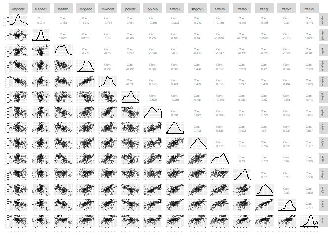

``` r
the_mod_sum <- summary(the_mod$model)
```

The model explains 74.5% of variation.

Clustering the countries
------------------------

We investigate if there are any clusters of countries in the data using as clusterig elements observations identified by country name and year of ess survey where all selected ess indicators

### Preprocess

``` r
# create subset with ESS indicators only
drop_cols <- which(colnames(ds_ss_avg_cntry_ind) %in% c((indicator_table %>% 
  filter(source %in% c("WB", "UNHCR")))$indicator))
mydata <- ds_ss_avg_cntry_ind[,-drop_cols]
dim(mydata)
```

    ## [1] 420  20

``` r
summary(mydata)
```

    ##     ess_year     cntry_name           eisced2          euftf2     
    ##  Min.   :2002   Length:420         Min.   :2.272   Min.   :3.818  
    ##  1st Qu.:2005   Class :character   1st Qu.:3.440   1st Qu.:4.758  
    ##  Median :2009   Mode  :character   Median :3.670   Median :5.151  
    ##  Mean   :2009                      Mean   :3.649   Mean   :5.211  
    ##  3rd Qu.:2013                      3rd Qu.:3.878   3rd Qu.:5.615  
    ##  Max.   :2016                      Max.   :5.034   Max.   :7.332  
    ##                                    NA's   :233     NA's   :233    
    ##      happy           health         imbgeco         impcntr     
    ##  Min.   :5.405   Min.   :1.685   Min.   :3.017   Min.   :1.763  
    ##  1st Qu.:6.825   1st Qu.:1.972   1st Qu.:4.443   1st Qu.:2.374  
    ##  Median :7.396   Median :2.186   Median :4.893   Median :2.550  
    ##  Mean   :7.272   Mean   :2.193   Mean   :4.842   Mean   :2.576  
    ##  3rd Qu.:7.819   3rd Qu.:2.370   3rd Qu.:5.328   3rd Qu.:2.759  
    ##  Max.   :8.366   Max.   :2.915   Max.   :6.170   Max.   :3.558  
    ##  NA's   :233     NA's   :233     NA's   :233     NA's   :233    
    ##     imueclt         imwbcnt         polintr          pplhlp     
    ##  Min.   :3.150   Min.   :2.814   Min.   :2.158   Min.   :2.998  
    ##  1st Qu.:5.023   1st Qu.:4.395   1st Qu.:2.451   1st Qu.:4.228  
    ##  Median :5.571   Median :4.788   Median :2.673   Median :4.760  
    ##  Mean   :5.462   Mean   :4.836   Mean   :2.644   Mean   :4.859  
    ##  3rd Qu.:6.007   3rd Qu.:5.395   3rd Qu.:2.790   3rd Qu.:5.660  
    ##  Max.   :7.322   Max.   :6.617   Max.   :3.148   Max.   :6.984  
    ##  NA's   :233     NA's   :233     NA's   :233     NA's   :233    
    ##      stfeco          stfedu         stfgov2         stfhlth     
    ##  Min.   :1.368   Min.   :3.126   Min.   :1.553   Min.   :2.482  
    ##  1st Qu.:3.476   1st Qu.:4.917   1st Qu.:3.528   1st Qu.:4.157  
    ##  Median :4.452   Median :5.520   Median :4.251   Median :5.397  
    ##  Mean   :4.484   Mean   :5.581   Mean   :4.217   Mean   :5.286  
    ##  3rd Qu.:5.367   3rd Qu.:6.267   3rd Qu.:4.956   3rd Qu.:6.302  
    ##  Max.   :7.937   Max.   :8.029   Max.   :6.580   Max.   :7.667  
    ##  NA's   :233     NA's   :233     NA's   :233     NA's   :233    
    ##      trstep         trstlgl         trstplc          trstun     
    ##  Min.   :2.587   Min.   :1.898   Min.   :2.035   Min.   :2.596  
    ##  1st Qu.:4.039   1st Qu.:4.189   1st Qu.:5.104   1st Qu.:4.711  
    ##  Median :4.579   Median :5.076   Median :6.062   Median :5.100  
    ##  Mean   :4.477   Mean   :5.062   Mean   :5.885   Mean   :5.159  
    ##  3rd Qu.:4.904   3rd Qu.:5.992   3rd Qu.:6.647   3rd Qu.:5.549  
    ##  Max.   :5.963   Max.   :7.596   Max.   :8.199   Max.   :6.859  
    ##  NA's   :233     NA's   :233     NA's   :233     NA's   :233

``` r
# remove records with NAs
myDataClean = na.omit(mydata)
dim(myDataClean)
```

    ## [1] 187  20

``` r
summary(myDataClean)
```

    ##     ess_year     cntry_name           eisced2          euftf2     
    ##  Min.   :2002   Length:187         Min.   :2.272   Min.   :3.818  
    ##  1st Qu.:2006   Class :character   1st Qu.:3.440   1st Qu.:4.758  
    ##  Median :2010   Mode  :character   Median :3.670   Median :5.151  
    ##  Mean   :2009                      Mean   :3.649   Mean   :5.211  
    ##  3rd Qu.:2012                      3rd Qu.:3.878   3rd Qu.:5.615  
    ##  Max.   :2016                      Max.   :5.034   Max.   :7.332  
    ##      happy           health         imbgeco         impcntr     
    ##  Min.   :5.405   Min.   :1.685   Min.   :3.017   Min.   :1.763  
    ##  1st Qu.:6.825   1st Qu.:1.972   1st Qu.:4.443   1st Qu.:2.374  
    ##  Median :7.396   Median :2.186   Median :4.893   Median :2.550  
    ##  Mean   :7.272   Mean   :2.193   Mean   :4.842   Mean   :2.576  
    ##  3rd Qu.:7.819   3rd Qu.:2.370   3rd Qu.:5.328   3rd Qu.:2.759  
    ##  Max.   :8.366   Max.   :2.915   Max.   :6.170   Max.   :3.558  
    ##     imueclt         imwbcnt         polintr          pplhlp     
    ##  Min.   :3.150   Min.   :2.814   Min.   :2.158   Min.   :2.998  
    ##  1st Qu.:5.023   1st Qu.:4.395   1st Qu.:2.451   1st Qu.:4.228  
    ##  Median :5.571   Median :4.788   Median :2.673   Median :4.760  
    ##  Mean   :5.462   Mean   :4.836   Mean   :2.644   Mean   :4.859  
    ##  3rd Qu.:6.007   3rd Qu.:5.395   3rd Qu.:2.790   3rd Qu.:5.660  
    ##  Max.   :7.322   Max.   :6.617   Max.   :3.148   Max.   :6.984  
    ##      stfeco          stfedu         stfgov2         stfhlth     
    ##  Min.   :1.368   Min.   :3.126   Min.   :1.553   Min.   :2.482  
    ##  1st Qu.:3.476   1st Qu.:4.917   1st Qu.:3.528   1st Qu.:4.157  
    ##  Median :4.452   Median :5.520   Median :4.251   Median :5.397  
    ##  Mean   :4.484   Mean   :5.581   Mean   :4.217   Mean   :5.286  
    ##  3rd Qu.:5.367   3rd Qu.:6.267   3rd Qu.:4.956   3rd Qu.:6.302  
    ##  Max.   :7.937   Max.   :8.029   Max.   :6.580   Max.   :7.667  
    ##      trstep         trstlgl         trstplc          trstun     
    ##  Min.   :2.587   Min.   :1.898   Min.   :2.035   Min.   :2.596  
    ##  1st Qu.:4.039   1st Qu.:4.189   1st Qu.:5.104   1st Qu.:4.711  
    ##  Median :4.579   Median :5.076   Median :6.062   Median :5.100  
    ##  Mean   :4.477   Mean   :5.062   Mean   :5.885   Mean   :5.159  
    ##  3rd Qu.:4.904   3rd Qu.:5.992   3rd Qu.:6.647   3rd Qu.:5.549  
    ##  Max.   :5.963   Max.   :7.595   Max.   :8.199   Max.   :6.859

``` r
#remove metadata fields and scale the rest
scaled_data = as.matrix(scale(myDataClean[,-which(colnames(myDataClean) %in% metadata_columns)]))
rownames(scaled_data) <- paste(myDataClean$cntry_name, myDataClean$ess_year)
```

### PCA

Experiment reducing dimensionality with Primary Component Analysis

``` r
# PCA
pc <- prcomp(scaled_data)
PoV <- pc$sdev^2/sum(pc$sdev^2) # proportion of variance
CumPoV <- cumsum(PoV)
n_CumPoV_085 <- length(which(CumPoV <=0.85))
print(paste(n_CumPoV_085, "principal components explain 85% of variance"))
```

    ## [1] "5 principal components explain 85% of variance"

``` r
p_var <- ggplot(data=data.frame(PoV=PoV, CumPoV=CumPoV, n=1:length(CumPoV)), aes(x=n)) +
  geom_bar(aes(y=PoV), fill="red", stat="identity") +
  geom_line(aes(y=CumPoV), color="black") +
  geom_hline(yintercept = 0.85, linetype="dashed") +
  geom_vline(xintercept = n_CumPoV_085, linetype="dashed") +
  labs(title="Principal Componen Analysis - Proportion of Variance",
       subtitle="Individual and cumulative variance explained (using 'prcomp')") + 
  xlab("Principal Component")

MyPrintInteractive(p_var, plot_wo_widget) 
```

<!--html_preserve-->

<script type="application/json" data-for="htmlwidget-68e76b7385d8efc00846">{"x":{"url":"EuropeanSocialSurvey_files/figure-markdown_github//widgets/widget_unnamed-chunk-53.html","options":{"xdomain":"*","allowfullscreen":false,"lazyload":false}},"evals":[],"jsHooks":[]}</script>
<!--/html_preserve-->
``` r
knitr::kable(pc$rotation, digits = 2, caption = "Primary componets vs indicators")
```

|         |    PC1|    PC2|    PC3|    PC4|    PC5|    PC6|    PC7|    PC8|    PC9|   PC10|   PC11|   PC12|   PC13|   PC14|   PC15|   PC16|   PC17|   PC18|
|---------|------:|------:|------:|------:|------:|------:|------:|------:|------:|------:|------:|------:|------:|------:|------:|------:|------:|------:|
| eisced2 |  -0.04|  -0.02|   0.28|  -0.78|   0.14|  -0.30|   0.01|  -0.15|   0.08|  -0.21|   0.10|   0.03|  -0.26|  -0.07|   0.10|  -0.05|   0.19|   0.07|
| euftf2  |   0.12|  -0.40|  -0.34|  -0.01|   0.52|   0.09|   0.12|  -0.24|  -0.04|   0.26|   0.34|  -0.14|  -0.12|   0.06|  -0.24|   0.15|   0.25|  -0.08|
| happy   |  -0.29|   0.10|   0.06|   0.22|   0.17|  -0.01|  -0.09|  -0.15|  -0.10|   0.25|   0.08|  -0.32|  -0.11|  -0.37|   0.39|  -0.54|   0.14|   0.08|
| health  |   0.20|  -0.19|  -0.03|  -0.28|  -0.48|   0.51|  -0.35|  -0.23|   0.05|   0.13|   0.21|  -0.14|  -0.05|  -0.15|  -0.09|  -0.15|  -0.19|  -0.08|
| imbgeco |  -0.23|  -0.34|   0.11|   0.07|   0.06|   0.01|  -0.24|   0.30|   0.46|  -0.24|   0.34|   0.05|   0.45|   0.08|   0.00|  -0.19|   0.19|   0.04|
| impcntr |   0.17|   0.44|  -0.18|  -0.10|   0.00|   0.05|   0.15|  -0.16|   0.66|   0.28|  -0.10|  -0.16|   0.10|   0.22|   0.01|  -0.07|   0.10|   0.23|
| imueclt |  -0.23|  -0.36|   0.06|   0.14|  -0.23|   0.01|  -0.07|  -0.23|   0.29|   0.11|  -0.41|   0.04|  -0.18|  -0.07|   0.28|   0.38|   0.34|  -0.18|
| imwbcnt |  -0.24|  -0.38|   0.10|   0.02|   0.06|  -0.26|   0.07|  -0.04|   0.23|   0.20|  -0.21|  -0.06|  -0.21|   0.12|  -0.28|  -0.23|  -0.61|   0.12|
| polintr |   0.22|   0.10|  -0.29|   0.15|  -0.19|  -0.57|  -0.42|   0.20|   0.14|   0.00|   0.19|  -0.15|  -0.32|  -0.08|  -0.10|   0.03|   0.07|  -0.21|
| pplhlp  |  -0.28|   0.12|   0.23|  -0.10|  -0.16|  -0.11|   0.19|   0.08|  -0.05|   0.13|   0.13|  -0.63|   0.27|  -0.18|  -0.27|   0.38|  -0.01|  -0.10|
| stfeco  |  -0.29|   0.08|  -0.09|  -0.18|   0.11|   0.15|  -0.26|   0.33|  -0.09|   0.28|   0.19|  -0.05|  -0.17|   0.43|   0.44|   0.29|  -0.22|   0.05|
| stfedu  |  -0.27|   0.15|  -0.16|  -0.13|  -0.05|  -0.30|  -0.19|  -0.38|  -0.11|   0.35|   0.10|   0.45|   0.44|  -0.06|  -0.05|   0.02|  -0.09|  -0.20|
| stfgov2 |  -0.26|   0.13|  -0.19|  -0.21|   0.17|   0.23|  -0.27|   0.38|   0.00|   0.14|  -0.38|   0.13|  -0.10|  -0.30|  -0.43|  -0.03|   0.21|   0.12|
| stfhlth |  -0.24|   0.22|   0.04|   0.17|   0.18|   0.09|  -0.45|  -0.47|  -0.05|  -0.43|  -0.08|  -0.21|  -0.06|   0.32|  -0.23|   0.07|  -0.01|   0.07|
| trstep  |  -0.13|  -0.11|  -0.68|  -0.19|   0.02|  -0.04|   0.12|  -0.04|   0.04|  -0.41|  -0.14|  -0.20|   0.18|  -0.24|   0.26|   0.06|  -0.26|   0.04|
| trstlgl |  -0.29|   0.22|  -0.05|  -0.02|   0.02|   0.21|   0.29|   0.05|   0.20|  -0.14|   0.12|   0.08|  -0.25|   0.08|  -0.08|  -0.20|  -0.05|  -0.73|
| trstplc |  -0.29|   0.13|  -0.06|   0.20|  -0.19|   0.07|   0.19|  -0.09|   0.15|  -0.10|   0.45|   0.30|  -0.32|  -0.28|  -0.10|   0.24|  -0.05|   0.44|
| trstun  |  -0.25|  -0.12|  -0.27|  -0.08|  -0.47|  -0.10|   0.21|   0.02|  -0.29|   0.02|   0.00|  -0.06|  -0.05|   0.45|  -0.14|  -0.30|   0.37|   0.17|

``` r
# plot two first PCs
library(ggfortify)
# autoplot(pc)

# Take the principal components needed for 85%
comp <- data.frame(pc$x[,1:n_CumPoV_085])

# Plot cross correlations
ggpairs(data=comp) +
  labs(title="Correlations between Primary Components",
       subtitle="Zero correlations - as expected")
```


### K-means clustering

Identifying potential clusters in country / ess year indicator rows using the PCA analysis results.

``` r
# Use the data in PCA space for k-means clustering

kmeans_data <- comp

# fix randomization
set.seed(123)

# find clusters, set max value to be count of countries in the dataset
k.max <- length(unique(myDataClean$cntry_name))
print(paste("Set upper bound to clusters the count of countries in the dataset", k.max))
```

    ## [1] "Set upper bound to clusters the count of countries in the dataset 28"

``` r
# Elbow Method for visually finding the optimal number of clusters
wss <- sapply(1:k.max, 
              function(k){
                kmeans(kmeans_data, k, nstart=50,iter.max = 15)$tot.withinss
              })
ggplot(data = data.frame(n=1:k.max, wss=wss), aes(x=n, y=wss)) +
  geom_line() +
  geom_point() +
  labs(title="Elbow method",
       substitle="Visually identify an 'elbow' in the plot") +
  xlab("Number of clusters K") +
  ylab("Total within-clusters sum of squares")
```

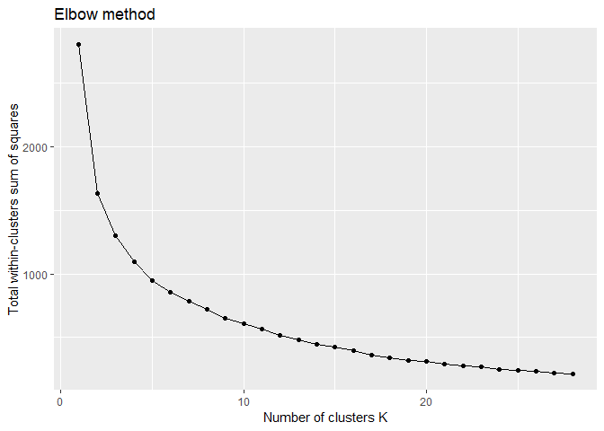

``` r
# NbClust - vote on kmeans ==> use this as the outcome
library(NbClust)
nb <- NbClust(kmeans_data, 
              diss=NULL, 
              distance = "euclidean", 
              min.nc=2, 
              max.nc=k.max, 
              method = "kmeans", 
              index = "all", 
              alphaBeale = 0.1)
```


    ## *** : The Hubert index is a graphical method of determining the number of clusters.
    ##                 In the plot of Hubert index, we seek a significant knee that corresponds to a 
    ##                 significant increase of the value of the measure i.e the significant peak in Hubert
    ##                 index second differences plot. 
    ## 


    ## *** : The D index is a graphical method of determining the number of clusters. 
    ##                 In the plot of D index, we seek a significant knee (the significant peak in Dindex
    ##                 second differences plot) that corresponds to a significant increase of the value of
    ##                 the measure. 
    ##  
    ## ******************************************************************* 
    ## * Among all indices:                                                
    ## * 6 proposed 2 as the best number of clusters 
    ## * 5 proposed 3 as the best number of clusters 
    ## * 3 proposed 7 as the best number of clusters 
    ## * 1 proposed 8 as the best number of clusters 
    ## * 3 proposed 22 as the best number of clusters 
    ## * 1 proposed 25 as the best number of clusters 
    ## * 3 proposed 26 as the best number of clusters 
    ## * 1 proposed 28 as the best number of clusters 
    ## 
    ##                    ***** Conclusion *****                            
    ##  
    ## * According to the majority rule, the best number of clusters is  2 
    ##  
    ##  
    ## *******************************************************************

``` r
print(sort((nb$Best.nc[1,])))
```

    ##     Hubert     Dindex       Frey         CH Silhouette       Duda 
    ##          0          0          1          2          2          2 
    ##   PseudoT2      Beale    McClain      Scott    Marriot     TrCovW 
    ##          2          2          2          3          3          3 
    ##     TraceW       Ball   Hartigan  Ratkowsky PtBiserial    SDindex 
    ##          3          3          7          7          7          8 
    ##         KL   Friedman       Dunn         DB        CCC      Rubin 
    ##         22         22         22         25         26         26 
    ##       SDbw     Cindex 
    ##         26         28

``` r
ggplot(data=data.frame(n=nb$Best.nc[1,]), aes(n)) +
  geom_histogram(binwidth = 1) +
  labs(title="cluster count using several methods",
       subtitle="As majority vote determined by 'NbClust' function")
```


``` r
n_clusters <- length(unique(nb$Best.partition))
print(paste("Majority vote decision:", n_clusters, "clusters"))
```

    ## [1] "Majority vote decision: 2 clusters"

Visual identification is always somewhat vague. Fortunately there is an algorithm that can do it independently - even if one can always havwe a debate on whether the selection the algorithm made was right. This looks good enough for this purpose - at least for now.

### Visualize groups in PCA space

Annoyingly, the two plots do not use the same colours for clusters.

``` r
# wrap results into a dataset
ds_clusters <- data.frame(cluster = as.factor(nb$Best.partition),
                          cntry_name = myDataClean$cntry_name,
                          ess_year = myDataClean$ess_year) 

# show in PCA space

library(cluster)
pam_obj <- pam(scaled_data, n_clusters)
autoplot(pam_obj, frame.type = 'norm', label=TRUE, label.size=2.5, label.alpha=0.6) +
  labs(title="Countries classified by ESS survey",
       subtitle="Each classification identified")
```


``` r
autoplot(prcomp(scaled_data), data=ds_clusters, colour='cluster', 
         loadings = TRUE, loadings.colour = 'blue',
         loadings.label = TRUE, 
         loadings.label.size = 3) +
  labs(title="Countries classified by ESS survey",
       subtitle="Eigenvectors of original indicators shown")
```

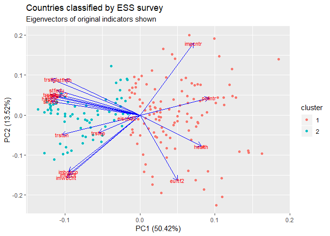

### Countries split to classes

The Nordic countries are in the same cluster, which is not that surprising given their relatively common values and ways in their respective societies. Other participants in that cluster are perhaps not as clear or obvious - at least to me.

And then there is the rest of Europe in the other cluster.

(I did at some point of time the same clustering excercise using scaled indicators and came up with the same clusters as with PCA)

``` r
# classify countries based on the clusters they have most often been based on survey scores

cntry_clusters <- ds_clusters %>% 
  group_by(cntry_name, cluster) %>% 
  summarise(n=n()) %>% 
  arrange(desc(n)) %>%
  filter(!duplicated(cntry_name)) %>%
  arrange(cluster)

p <- CreateEuroMap(dsin = cntry_clusters %>% ungroup(), 
                   ind_name = "cluster",
                   txt_title = "Countries clustered by indicators",
                   txt_subtitle = "Based on the cluster a country most often has been in",
                   txt_caption = "ESS surveys 2002-2016")
MyPrintInteractive(p, plot_wo_widget) 
```

<!--html_preserve-->

<script type="application/json" data-for="htmlwidget-a980bc505f809df7021e">{"x":{"url":"EuropeanSocialSurvey_files/figure-markdown_github//widgets/widget_unnamed-chunk-56.html","options":{"xdomain":"*","allowfullscreen":false,"lazyload":false}},"evals":[],"jsHooks":[]}</script>
<!--/html_preserve-->
``` r
# how does clustering changed annually

clustered_years <- ds_clusters %>% 
  group_by(ess_year, cluster) %>% 
  summarise(n=n())

p <- ggplot(data = clustered_years, aes(x=ess_year, y=n, fill=cluster)) +
  geom_bar_interactive(stat = "identity", 
                       position = "fill",
                       aes(tooltip=paste0(ess_year, ' - cluster ', cluster, '\nn=', n))) +
  geom_hline(yintercept = c(0.25, 0.5, 0.75), linetype="dashed") + 
  labs(title="Relative size of groups",
       subtitle = "As classified by country/survey granularity",
       txt_caption = "ESS surveys 2002-2016") +
  xlab("") + ylab("")
MyPrintInteractive(p, plot_wo_widget) 
```

<!--html_preserve-->

<script type="application/json" data-for="htmlwidget-1d0d3183c964065c798f">{"x":{"url":"EuropeanSocialSurvey_files/figure-markdown_github//widgets/widget_unnamed-chunk-56.html","options":{"xdomain":"*","allowfullscreen":false,"lazyload":false}},"evals":[],"jsHooks":[]}</script>
<!--/html_preserve-->
Looking into details of how do the two grups differ we can see that in most of the indicators countries in cluster 2 give higher scores which roughly translate to “more” or “better” — with a couple of noteworthy exceptions

-   health – low value is good and high value is poor health
-   impcntrl – low value means more immigration and high less immigration from poor countriesThere seems

``` r
# compare the indicators between classes

p <- ggplot(data=ds_ss_avg %>% 
              filter(indicator %in% (indicator_table %>% filter(source=="ESS"))$indicator) %>%
              group_by(indicator) %>%
              mutate(value_s = scale(value)) %>%
              ungroup() %>%
              left_join(cntry_clusters %>%  
                          select(cntry_name, cluster), 
                        by="cntry_name"),
            aes(x=indicator, y=value_s, fill=cluster)) +
  geom_boxplot_interactive(aes(tooltip = paste(indicator,'\nclust ', cluster))) + 
  theme(axis.text.x = element_text(angle = 90, hjust = 1, vjust=0.5)) +
  xlab("") + ylab("") +
  labs(title="Differences between groups of countries",
       subtitle="Variables scaled to same range")
MyPrintInteractive(p, plot_wo_widget) 
```

<!--html_preserve-->

<script type="application/json" data-for="htmlwidget-ba4cdd219a9c12504249">{"x":{"url":"EuropeanSocialSurvey_files/figure-markdown_github//widgets/widget_unnamed-chunk-57.html","options":{"xdomain":"*","allowfullscreen":false,"lazyload":false}},"evals":[],"jsHooks":[]}</script>
<!--/html_preserve-->
Using the same classification on selected World Bank and UNHCR seems to be supportive of the grouping even though no formal clustering based on these values has been conducted - at least not yet.

``` r
# World Bank
p <- ggplot(data=ds_ss_avg %>% 
         filter(indicator %in% (indicator_table %>%
                                  filter(indicator %in% pct_indicators,
                                         source=="WB"))$indicator) %>%
         left_join(cntry_clusters %>%  
                     select(cntry_name, cluster), 
                   by="cntry_name"),
       aes(x=indicator, y=value, fill=cluster)) +
  geom_boxplot_interactive(aes(tooltip = paste(indicator,'\nclust ', cluster))) + 
  # geom_boxplot_interactive() + 
  xlab("") + ylab("") +
  labs(title="Differences between groups of countries",
       subtitle="WB Variables", 
       caption = "World Bank") +
  coord_flip()
MyPrintInteractive(p, plot_wo_widget) 
```

<!--html_preserve-->

<script type="application/json" data-for="htmlwidget-6661de3365bcad112fc0">{"x":{"url":"EuropeanSocialSurvey_files/figure-markdown_github//widgets/widget_unnamed-chunk-58.html","options":{"xdomain":"*","allowfullscreen":false,"lazyload":false}},"evals":[],"jsHooks":[]}</script>
<!--/html_preserve-->
``` r
# UNHCR
p <- ggplot(data=ds_ss_avg %>% 
         filter(indicator %in% (indicator_table %>% 
                                  filter(indicator %in% pct_indicators,
                                         source=="UNHCR"))$indicator,
                !is.na(value)) %>%
         left_join(cntry_clusters %>%  
                     select(cntry_name, cluster), 
                   by="cntry_name"),
       aes(x=indicator, y=value+1, fill=cluster)) +
  geom_boxplot_interactive(aes(tooltip = paste(indicator,'\nclust ', cluster))) + 
#  geom_boxplot_interactive() + 
  scale_y_log10() +
  xlab("") + ylab("") +
  labs(title="Differences between groups of countries",
       subtitle="UNHCR Variables on logarithmic scale (offset +1%)",
       caption="UNHCR") +
  coord_flip()
MyPrintInteractive(p, plot_wo_widget) 
```

<!--html_preserve-->

<script type="application/json" data-for="htmlwidget-438777f2ccb7f91a040e">{"x":{"url":"EuropeanSocialSurvey_files/figure-markdown_github//widgets/widget_unnamed-chunk-58.html","options":{"xdomain":"*","allowfullscreen":false,"lazyload":false}},"evals":[],"jsHooks":[]}</script>
<!--/html_preserve-->
Visual box plot comparisons of selected UNHCR and WB indicators seem to support the clustering clustering based on ESS data.

-   Cluster 2 countries appear more urbanized than cluster 1
-   Proportion of population born in another country is higher in cluster 2 even though there is quite some overlap in distributions
-   There is higher percentage of people active in workforce in cluster 2
-   Government health and education expenditures vs. GDP are higher in cluster 2
-   GDP growth (and per capita growth) is higher in cluster 1 countries but there is significant overlap with cluster 2 distribution
-   Significantly higher share of population is using Internet in cluster 2 compared to cluster 1
-   Tax revenues as % of GDP are higher in cluster 2
-   Personal remittances received (% of GDP) is higher in cluster 1

Summary
-------

ESS data is an interesting source for getting insights into the recent history and ongoing present of Europe from data.

In this post perhaps the most interesting – but perhaps not surprising – findings were

-   Europe can be split into two groups of countries, apparently with different views on life in general and on immigration and refugees
-   major explaining factors for subjective happiness were willingness of people to help other (positive, not surprising) and trust in United Nations (negative, somewhat strange, indirectly linked to trust in European Parliament as it is the main positive factor in trust in United Nations)
-   major explaining factors for trust in European Parliament were trust in United Nations (positive), satisfaction in government (positive), further integration of European Union (positive), which all were perhaps not surprising
-   views on immigration and refugees are polarized and it appears that those countries where immigration is seen positively impacting economy tend to be those which are more open to immigration from poor countries outside of Europe

Linking between ESS and other data may give further insights and I will probably return to this topic later.

------------------------------------------------------------------------

References
----------

A real serious study on the topic (I've yet to read myself):

-   Europeans’ Personal and Social Wellbeing, Topline Results from Round 6 of the European Social Survey
-   link: <http://www.europeansocialsurvey.org/docs/findings/ESS6_toplines_issue_5_personal_and_social_wellbeing.pdf>

### ESS

Citation of data:

-   European Social Survey Cumulative File, ESS 1-7 (2016). Data file edition 1.0. NSD - Norwegian Centre for Research Data, Norway - Data Archive and distributor of ESS data for ESS REIC.
-   European Social Survey Round 8 Data (2016). Data file edition 2.0. NSD - Norwegian Centre for Research Data, Norway - Data Archive and distributor of ESS data for ESS ERIC

Citation of documentation:

-   European Social Survey (2016). ESS 1-7, European Social Survey Cumulative File, Study Description. Bergen: NSD - Norwegian Centre for Research Data for ESS ERIC.
-   European Social Survey (2016): ESS8- 2016 Documentation Report. Edition 2.0. Bergen, European Social Survey Data Archive, NSD - Norwegian Centre for Research Data for ESS ERIC

Distributor of Data

NSD - Norwegian Centre for Research Data,
Harald Hårfagresgt. 29 N-5007 Bergen, Norway.
Phone: +47 55 58 21 17
Fax: +47 44 58 96 50
e-mail: <nsd@nsd.no>
Web: <http://www.nsd.no/english>

ESS: <essdata@nsd.no>
ESS: www.europeansocialsurvey.org

### World Bank

World Development Indicators <https://data.worldbank.org/products/wdi>

The primary World Bank collection of development indicators, compiled from officially-recognized international sources. It presents the most current and accurate global development data available, and includes national, regional and global estimates.

Excel file was downloaded and used

### UNHCR

Population Statistics / Time Series <http://popstats.unhcr.org/en/time_series>

On this page, each row of data represents the information about UNHCR’s populations of concern for a given year and country of residence and/or origin. Data is presented as a yearly time series across the page. In the 2017 data, figures between 1 and 4 have been replaced with an asterisk (\*). These represent situations where the figures are being kept confidential to protect the anonymity of individuals. Such figures are not included in any totals”

Csv extract of all data was used.

Technical notes
---------------

Caption and figure numbering is produced as described by Norbert Köhler in his blog post ["R Markdown: How to number and reference tables"](https://datascienceplus.com/r-markdown-how-to-number-and-reference-tables/)

Top matter definitions

-   Azure - handles javascript, no problem with document size
    -   output:
        -   html\_document:
            -   toc: yes
            -   toc\_depth: 4
    -   params:
        -   html\_wo\_widget: TRUE
        -   explore\_indicator\_graphs: TRUE
        -   explore\_country\_graphs: TRUE
-   RPubs - handles javascript, document size limitation
    -   output:
        -   html\_document:
            -   toc: yes
            -   toc\_depth: 4
    -   params:
        -   html\_wo\_widget: TRUE
        -   explore\_indicator\_graphs: FALSE
        -   explore\_country\_graphs: FALSE
-   Github - does not handle javascript, no size limit
    -   output:
        -   github\_document:
            -   toc: yes
            -   toc\_depth: 4
    -   params:
        -   html\_wo\_widget: FALSE
        -   explore\_indicator\_graphs: TRUE
        -   explore\_country\_graphs: TRUE
